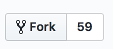

# CiviCRM user guide

Note: This repository contains _source files_ for the CiviCRM user guide. These files should be used for contributing to the documentation. **[You can read the doc here.  
](https://docs.civicrm.org/user/en/stable/)**

## Contributing to a single changes

To edit this manual:

1. [Sign up for a github account](https://github.com/join) (if you don't already have one) and [login](https://github.com/login).
2. Visit the [CiviCRM user guide repository](https://github.com/civicrm/civicrm-user-guide) and find the page you want to edit, e.g. [Is CiviCRM for You?](https://github.com/civicrm/civicrm-user-guide/blob/master/docs/getting-prepared/is-civicrm-for-you.md).
3. Click on the edit button to create a fork of the manual and make your changes.
4. Submit your changes for review and include a message to let us know what you changed.

Your edits will be published as soon as they are reviewed by someone on our documentation team.

##Contributing multiple changes 

1. [Sign up for a github account](https://github.com/join) (if you don't already have one) and [login](https://github.com/login).
2. Create a *Fork* with the fork button on the top right of the page.  

3. In your [git client](https://git-scm.com/download/gui/linux) clone the CiviCRM user guide repository to your computer.  
4. Locate the Markdown file (.md) in your file system that you want to edit by matching it to the file that that you want to change. For example, if you want to edit [Is CiviCRM for You?](https://github.com/civicrm/civicrm-user-guide/blob/master/docs/getting-prepared/is-civicrm-for-you.md) you would find [your file system]/docs/getting-prepared/is-civicrm-for-you.md. 
5. Make one ore more related changes and commit them in your git client.  
4. Push your changes from your git client to your fork.
5. 

Your edits will be published as soon as they are reviewed by someone on our documentation team.

## Versioning (which version should I edit?)

If you're improving current documentation, please edits the master branch (available at http://docs.civicrm.org/user/en/latest).

Master is periodically merged into 4.7 and made available at http://docs.civicrm.org/user/en/stable.

If you want to make an update in the 4.6 documentation, please edit the 4.6 branch.

More information on contributing to CiviCRM documentation is available at [https://github.com/civicrm/civicrm-docs/#contributing-to-documentation](https://github.com/civicrm/civicrm-docs/#contributing-to-documentation).
