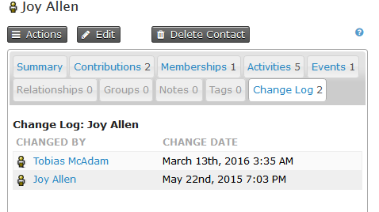
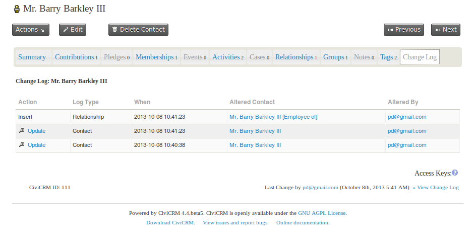
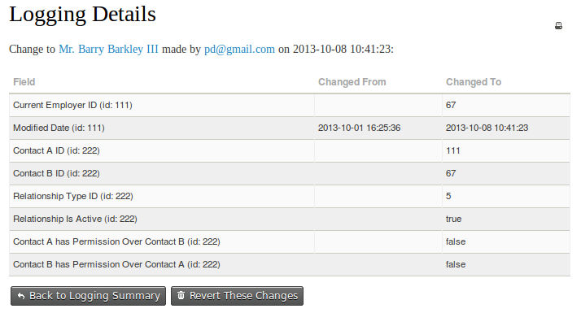

# Logging

CiviCRM keeps an eye on the various changes that you make to contacts,
memberships and so on. Each contact has a change log tab which is
populated each time a contact is added or edited. The change log shows
who changed the record and when the change was made. This light-weight
logging is turned on by default and many users find it detailed enough.

One key missing piece, however, is information about *what* was
changed. Detailed logging adds information on what has changed and
provides many other features.

## Detailed logging

When enabled, detailed logging tracks all changes made to data in
CiviCRM. Each time something is updated, CiviCRM keeps a note of:

-   what the value was before
-   what the value is after
-   when the change was made
-   who made the change

When you turn on detailed logging, the screen will look something like
the below. Clicking on update on the left hand side will show details
of the change.

This logging extends to almost all data that exists in CiviCRM,
including your contact, membership, event, etc., and also all of
the 'meta data' in your install, such as Activity Types, Case types,
Contribution Types, etc.

With detailed logging turned on, any changes made to your data can be
reverted, which means you can worry less about unwanted changes to the
data, and whether they are done by administrative staff or by contacts
interacting via your website - either maliciously or accidentally.

As you can imagine, logging all changes to the database can result in
the collection of quite a lot of data and will have a small performance
impact on your database. For this reason, we turn of logging by default
in CiviCRM and let people turn it on if they require it. Before you
decide whether you want to turn on logging, you might want to have a
look at other ways in which time based logging happens in CiviCRM.

## Activities vs. logging

The use of activities to record data in CiviCRM is often useful as an
alternative to logging. Since each activity happens at a specific point
in time, you can view the activity tab on a contact record as a log of
changes to that contact over time. This isn't to suggest that each time
you make a change to a contact in CiviCRM you should record an
activity. Rather that, in some use cases, the data collected in the
activity log provides a good enough log of changes to contacts over
time, and supplementing that with a couple of manually recorded
activities may cater adequately enough for your logging needs.

## Membership logs

In a similar way to activities, over time a membership will grow into a
historical record of the membership, with a record of any contributions
that went toward that membership and any renewals, up-sells, etc. It
might be that this out-of-the-box logging meets your needs and means
that you don't need to turn on detailed logging.

## Reverting changes

One of the great benefits of turning on detailed logging is the ability
to revert any changes that you make to you data. For a lot of contact
fields we make this easy by creating a revert button at the bottom of
the screen that shows details of the change.

This screen isn't available for all contact changes, however, data is
still being recorded behind the scenes. If you do need to revert data
that cannot be reverted via the user interface, you should contact your
system administrator or get help from someone that is familiar with
CiviCRM's detailed logging functionality.
