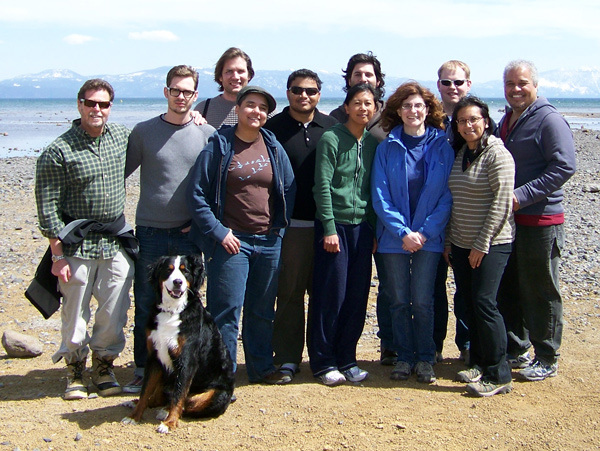
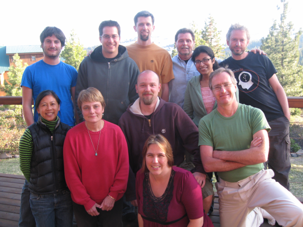
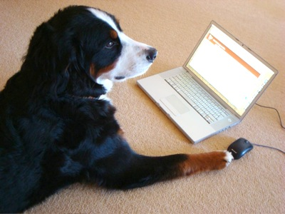
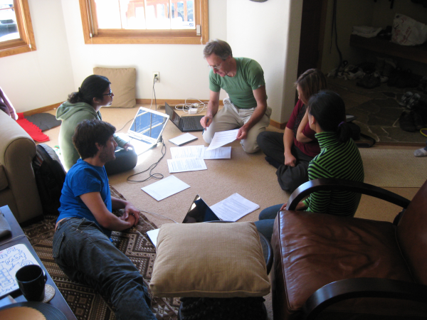
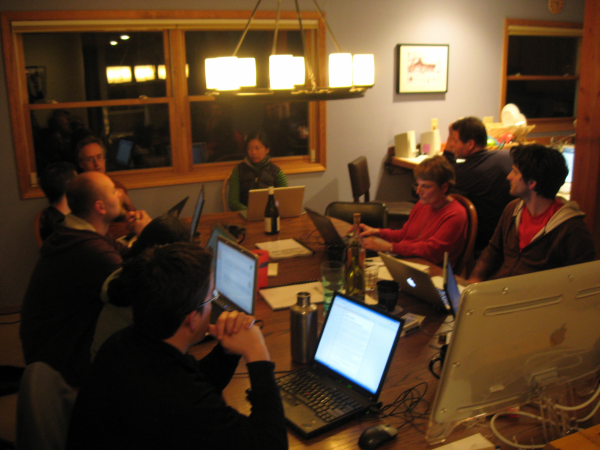
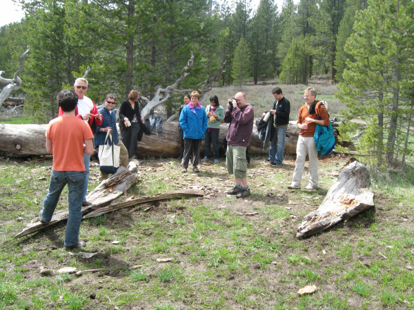

History of this book
====================

This book is the result of the collaborative effort of many people. A
lot of the content was written during two book sprints held in 2009 and
2010 in Tahoe, USA. Many contributions have also been made by
individuals in the times between and following these sprints.

Fifth edition
-------------

The fifth edition was written at the Woolman Sierra Friends Centre
(woolman.org) in April 2012. Woolman use and contribute to CiviCRM. We
are grateful for their hospitality.

Fourth edition
---------------

The forth edition was written in Bourne, Lincolnshire, UK in September
2011. We were too busy writing this edition to say much about how it was
put together.

Third edition
-------------

This edition includes minor updates to reflect changes in CiviCRM 3.3
which was released in December 2010. It is being published on the eve of
the second annual CiviCon conference. Thanks to the generous
contributions of our CiviCon Sponsors (listed in the front of the book)
- a copy has been provided to each conference participant.

Second edition
--------------

The second edition of the CiviCRM manual was published after a four-day
Book Sprint organised by CiviCRM and led by Adam Hyde (FLOSS Manuals).
The sprint was sponsored by the Information Program initiative of the
Open Society Institute
([http://www.soros.org/initiatives/information](http://www.soros.org/initiatives/information)).
We are especially grateful to Janet Haven for pushing this forward.

The second edition includes new sections on CiviReports, CiviCase,
CiviEngage and Extending CiviCRM. This edition also included an
extensive rewrite of nearly every section of the text, including a
reorganization of all sections to break up information into
Introduction, Planning, Configuration and Everyday Tasks sections, the
latter to serve as an easy-to-follow user manual for individuals working
with CiviCRM on a daily basis.

We also added an entire new section to assist developers in getting into
the code. Finally, we updated the book to match CiviCRM 3.2 (which was a
few weeks away from release at the time of writing).

We think that the reorganisation adds a lot to the book and increases
it's readability because it helps people who work with CiviCRM in a
specific capacity get directly to the chapter relevant to them.

The following photo shows the people who worked on this second edition
of the book.

In the back row, starting from the left, you are looking at Dave
Greenberg (San Francisco, USA), Kyle Jaster (NY, USA), Xavier Dutoit
(Geneva, Switzerland and Brussels, Belgium), Kurund Jalmi (Mumbai,
India), Michael McAndrew (London, UK), Wes Morgan (Washington DC, USA),
Josue Guillen (DC, USA). The front row from the left is Jack Aponte (NY,
USA), Mari Tilos (San Francisco, USA), Sarah Gladstone (Chicago, USA),
and Alice Aguilar (NY, USA).

First edition
-------------

The first edition of this manual was written during a five-day book
sprint organised by CiviCRM and led by FLOSS Manuals. The sprint was
sponsored by the Information Program initiative of the Open Society
Institute****([http://www.soros.org/initiatives/information](http://www.soros.org/initiatives/information).)),
and again, we are especially grateful to Janet Haven for pushing this
forward.

Having secured sponsorship, the CiviCRM Core team invited a group of
people from around the globe to gather for a week at Lake Tahoe in
California. The *modest* goal was to transform our diverse experience of
CiviCRM into a manual that we hope will help people to use this great
piece of software. This turned out to be an interesting, and at times
difficult, challenge.

The following photo shows the people who wrote this book. 
 

In the back row you are looking at Michael McAndrew (London, UK), Tony
Guzman (Salt Lake City, USA), Brian Shaughnessy (Albany, NY, USA), Dave
Greenberg (San Francisco, USA), Yashodha Chaku (Mumbai, India) and Adam
Hyde (Berlin, Germany). In the front row are Mari Tilos (San Francisco,
USA), Cynthia Tarascio (Philadelphia, USA), Michal Mach (Warsaw, Poland)
and Peter Davis (Wellington, New Zealand). In the very front is Eileen
McNaughton (Wellington, New Zealand).

We came from different backgrounds, used CiviCRM in different ways, and
worked with very different organisations. It was often a challenge to
meld these perspectives into a cohesive whole, but we hammered away at
it and we think this made for a better book. We had some lively
discussions about important issues, such as whether there is a "z" or an
"s" in organis/zation or a "q" in check/que, and finally agreed to use
both spellings in the spirit of internationalism. We also struggled with
the word "constituent", which is core to the non-profit sector in
America but was unfamiliar to those of us from outside America.

It was a pretty intense five days. Adam (our friendly Floss manuals
taskmaster) kept us realistic, on track, and hard at work - even hauling
us back to work after dinner each evening. Overall it was both fun and
productive and we really appreciate the way Adam helped us actually
produce a book within a week. Thank you.

For most of us, however, the highlight of the week has been the
breathtaking cuisine cooked by Jill Klein
([http://www.partiesthatcook.com/about-us/](http://www.partiesthatcook.com/about-us/)).
We love you, Jill, and wish we could take you home with us. We are also
grateful to Dave Greenberg, Bob Concannon and Mari Tilos for their
hospitality, and to Scout (aka "CiviDog") just for being there.

We had help from around the world during the preparation process, and
over the course of the Sprint. Andy Oram helped us both in the planning
process and then with editing and feedback during the Sprint. We also
had a number of people log in to write and edit the manual during the
Sprint. They include Robert Santiago, Xavier Dutoit, Joe Murray,
Sarmeesha Reddy, Jay Maechtlen, Dream Gomez, Leila Johnson, Duncan
Hutty, and Kurund Jalmi.

Our office for the week was Dave and Bob's house.

We mitigated the hardship of late-night work with some tasty beverages.

And occasionally they let us out for a bit....
