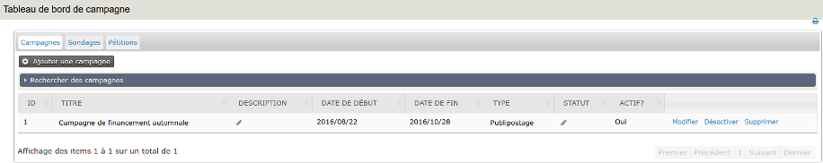

Taches quotidiennes
===================

Ce chapitre décrit les taches quotidiennes liées à la gestion de campagnes, dans CiviCampaign.

Gestion des campagnes
---------------------

Le tableau de bord de campagnes vous permet de créer, configurer, gérer et voir les campagnes que vous avez créées. Vous pouvez, de même, y gérer vos enquêtes (sondages) et pétitions. Se référer aux chapitres suivants relatifs à : *Sondages* et *Pétitions*, pour toute information spécifique à ces fonctionnalités.

Pour afficher le tableau de bord de campagnes, ouvrir le menu : **Campagens > Tableau de bord > Campagnes.**

A partir de ce tableau de bord vous pouvez modifier, désactiver et supprimer les campagnes déjà créées. Vous pouvez aussi créer de nouvelles campagnes.
Le plus souvent, le nombre de campagnes existantes sera trop grand pour être visualisable sur une seule page. Leur exploitation peut se révéler peu aisée. Ouvez alors l'accordéon : "Rechercher des campagnes". Le formulaire intégré vous propose un jeu de filtres permettant de limiter l'affichage du nombre de campagnes.

Create a New Campaign
---------------------

To create a Campaign:

1.   Go to **Campaign > New Campaign**

2.  Enter information about your campaign:
    -   **Title** (required): enter a unique name that describes your
    campaign. It's helpful to establish a naming convention for new
   campaigns so they alphabetize in drop-down lists automatically and
   are easy to sort through when associating an activity with the
   campaign.
    -   **Campaign Type** (required): select the type of campaign, e.g.
    Constituent Engagement. To add more options to the Campaign Type
    drop-down list, see the previous chapter on setting up
    CiviCampaign.
    -   **Description**: enter text that describes your campaign.
    -   **Include group(s)**: if appropriate, select the group that
    contains the individuals you are targeting for this campaign. To
    find out more about creating groups, see the chapter on Tags and
    Groups.
    -   **Start Date & Time** (required): enter the start date and time of
    the campaign
    -   **End Date & Time**: enter the end date and time of the campaign.
    If these fields are empty, then the campaign will be considered
    ongoing.
    -   **Campaign Status**: select the status of the campaign, e.g. In
    Progress, Planned, etc. To add more options to the Campaign
    Status drop-down list, see the previous chapter on setting up
   CiviCampaign.
    -   **Campaign Goals**: enter text the describes the goals and/or
    objectives of your campaign. You may also want to describe the
    activities you plan on conducting to meet those goals.
    -   **Revenue Goals**: if applicable, enter a number that indicates the
    amount you plan to raise during your campaign.
    -   **External ID**: if you want to track the campaign ID of the
    campaign when it existed in another database, you can enter the ID
    number of your legacy campaign.
    -   **Is Active?**: check the box if the campaign is an active
    campaign. If the campaign is inactive, then uncheck the box.

Click **Save**, to save the campaign.

Targeting constituents: create a group
--------------------------------------

You may want to target a specific group of individuals for all campaign
activities. This is done by creating a group to target these
individuals. See the chapter Tags and Groups for more information about
how to create a group.

Send a mass mailing
-------------------

A mass mailing to your target audience can generate interest and
participation, and also be used to call for donations.

1.  Create the email using CiviMail. See the *Email* section of this book
    to learn more about configuring and using CiviMail.
2.  Select the appropriate campaign from the drop-down list when setting
    up the mailing.

A campaign event
----------------

Events created using CiviEvent can be associated with a campaign. To
find out more about configuring and using CiviEvent, see the *Events*
section of this book.

1.  Create and configure the event.
2.  Select the appropriate campaign from the drop-down list when setting
    up a mailing for the event.
3.  Send a mass email using CiviMail to your target audience using a
    group or groups, and ask people to register for the event.
4.  Again, select the name of the campaign on the mailing set-up.
5.  Search for individuals who have indicated they want to register for
    the event.

Record campaign contributions
-----------------------------

As contributions come in, either online or offline, they can be
associated with a campaign; simply select the appropriate campaign from
the drop-down menu when recording the contribution.

To find out more about configuring and using CiviContribute, see the
*Contributions* section.

Record event participation
--------------------------

During and after an event, organizers can record who participated by
either collecting sign-in sheets and entering the participants manually,
or recording who participated directly online.

Have participants write their contact information on sign-in sheets when
they arrive, or if you have an internet connection at the event venue
you may be able to enter participants directly into the database.

Find out more about how to record participant information for an
event, see the *Events* section.
