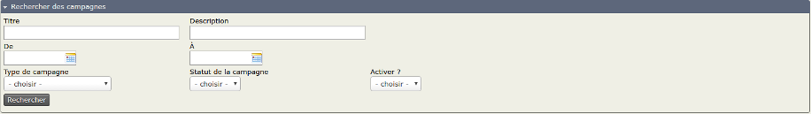

Tâches quotidiennes
===================

Ce chapitre décrit les taches quotidiennes liées à la gestion de campagnes, dans CiviCampaign.

Gestion des campagnes
---------------------

Le tableau de bord de campagnes vous permet de créer, configurer, gérer et voir les campagnes que vous avez créées. Vous pouvez, de même, y gérer vos enquêtes (sondages) et pétitions. Se référer aux chapitres suivants relatifs à : *Sondages* et *Pétitions*, pour toute information spécifique à ces fonctionnalités.

Pour afficher le tableau de bord de campagnes, ouvrir le menu : **Campagnes > Tableau de bord > Campagnes.**

À partir de ce tableau de bord vous pouvez modifier, désactiver et supprimer les campagnes déjà créées. Vous pouvez aussi créer de nouvelles campagnes.

Le plus souvent, le nombre de campagnes existantes sera trop grand pour être visualisable sur une seule page. Leur exploitation peut se révéler peu aisée. Ouvez alors l'accordéon : "Rechercher des campagnes". Le formulaire intégré vous propose un jeu de filtres permettant de limiter l'affichage du nombre de campagnes.

Création d'une campagne
-----------------------

Pour créer une campagne, il suffit de suivre les étapes suivantes :

1.   Ouvrir le menu **Campagne > Nouvelle campagne**. Le formulaire suivant apparait :

2.  Saisir les informations qui vont caractériser votre campagne :
    -   **Libellé** (obligatoire) : indiquez le nom (qui sera unique) décrivant votre campagne. Il est judicieux d'établir (une fois pour toutes) une convention de nomage vous permettant de retrouver rapidement une campagne spécifique, particulièrement lorsqu'il y en a beaucoup. Pour rappel, les listes déroulantes présentent ces informations de façon alphabétique.
    -   **Type de campagne** (obligatoire) : sélectionnez le type de votre campagne. S'il n'existe pas dans la liste, vous pouvez en ajouter d'autre(s). Voir le précédent chapitre relatif au paramétrage de CiviCampaign. **Astuce** il existe une icone "clé à molette" à coté de cette liste déroulante. En la cliquant vous afficherez la liste des types de campagnes, permettant ainsi de créer un nouveau type à la volée. 
    -   **Description** : zone de texte libre et non obligatoire. Néanmoins très utile pour décrire votre campagne : stratégie, actions, etc...
    -   **Inclure le(s) groupe(s)** : Il est possible de sélectionner un groupe de contacts particulier qui sera particulièrement ciblé par votre camapgne (segmentation par exemple). La création de groupes (statiques et dynamiques) est expliquée dans le chapitre relatif aux "Etiquettes et Groupes".
    -   **Date de début** (obligatoire) : vous permet d'indiquer la date de lancement de cette campagne
    -   **Date de fin** : vous permet d'indiquer la date de fin de cette campagne. Si cette information est laissée vide, alors la campagne sera considérée comme étant en cours.
    -   **Statut de campagne** : Sélectionnez le statut de la campagne : en cours, terminée, etc... S'il n'existe pas dans la liste, vous pouvez en ajouter d'autre(s). Voir le précédent chapitre relatif au paramétrage de CiviCampaign. **Astuce** il existe une icone "clé à molette" à coté de cette liste déroulante. En la cliquant vous afficherez la liste des statuts de campagnes, permettant ainsi de créer un nouveau statut à la volée.
    -   **Buts de la campagne** : zone de texte libre et non obligatoire. Néanmoins très utile pour indiquer les buts de votre campagne et la façon de les atteindre.
    -   **Objectif de collecte de fonds** : si un des buts de votre campagne est d'atteindre un objectif de levée de fonds, indiquez le dans cette zone.
    -   **Identifiant externe** : Ce champs est très utile lorsque vous gérez votre campagne via un logiciel externe dédié. Cela vous permet d'indiquer l'identifiant que cet outil a affecté à votre campagne. Cela va vous permettre de faciliter les échanges de données/fichiers ultérieurs entre CiviCampaign et votre logiciel.
    -   **Actif ?** : permet d'indiquer si cette campagne est active ou non.

Une fois ces informations saisies, cliquez le bouton **Enregistrer**.

Viser une population particulière : création d'un groupe
--------------------------------------------------------

Pour être efficace et moins onéreuse, une campagne doit pouvoir viser une population particulière. CiviCRM vous permet de créer des groupes comportant des individus en fonction de critères que vous aurez indiqués. La création de groupes (statiques et dynamiques) est expliquée dans le chapitre relatif aux « Étiquettes et groupes ».
Ces groupes peuvent être des segments.

Créer un envoi massif
---------------------

Un envoi massif (publipostage courriel) est un moyen permettant d'informer une audience plus ou moins large et/ou de susciter son intérêt.
CiviCRM met à disposition un composant vous donnant une telle possibilité.

1.  Créez votre courriel type en utilisant CiviMail. Pour en connaitre plus sur son utilisation et sa configuration, vous reporter à la section *Courriel* de ce manuel.
2.  Sélectionnez votre campagne dans la liste déroulante.

Créer un événement spécifique à la campagne
-------------------------------------------

Le composant CiviEvent vous permet de créer des événements : conférences, sessions de formations, etc... pouvant être associés à une campagne. Le fonctionnement de ce module (mise en oeuvre et configuration) est expliqué au chapitre *Evénements* de ce manuel.

1.  Créez et configurez l'événement.
2.  Sélectionnez votre campagne dans la liste déroulante pour l'envoi du mailing associé.
3.  Envoyez votre mailing de masse au segment/groupe ciblé et demandez à ces personnes de s'enregistrer.
4.  Une fois fait, vous pouvez rechercher les personnes ayant indiqqué leur présence à cet événement.

Affecter des contributions à une campagne
-----------------------------------------

Toute contribution liée à une campagne peut être enregistrée en tant que telle, qu'elle soit en-ligne ou "classique" (chèque, prélèvement, etc...). Dans le premier cas, lors de sa création, vous devez indiquer sur votre page de contribution en ligne que tout don doit être affecté à cette campagne. Dans le deuxième cas, sélectionnez votre campagne dans la liste déroulante lors de la saisie manuelle du don.

Le fonctionnement du module CiviContribute (mise en oeuvre et configuration) est expliqué au chapitre *Contributions* de ce manuel.

Saisie des participants à un événement
--------------------------

Pendant et à l'issue d'un événement, les organisateurs peuvent inscrire les personnes qui y ont participé, soit en récupérant les feuilles d'émargement et en l'indiquant manuellement à CiviCRM, soit en le saisissant en ligne.

Le fonctionnement du module CiviEvent (mise en oeuvre et configuration) est expliqué au chapitre *Evénements* de ce manuel. 
