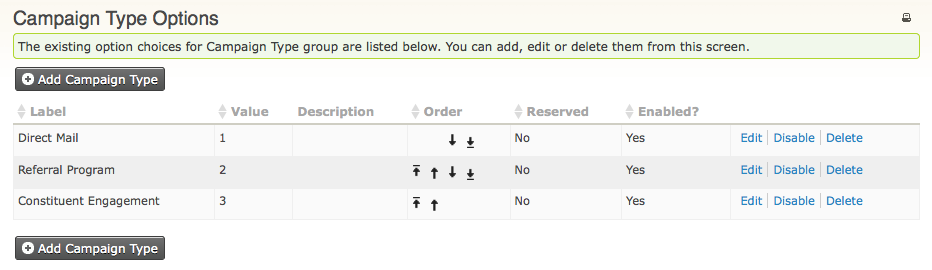
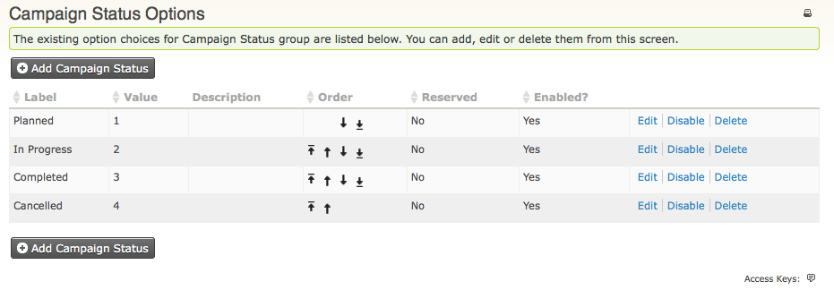
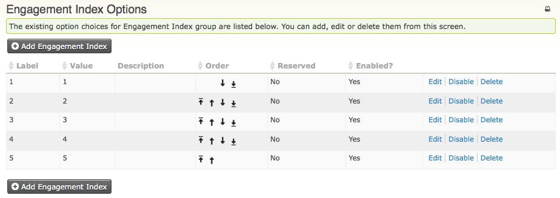

Paramétrage
===========

Le but de ce chapitre est de vous aider à paramétrer le composant CiviCampaign.
Une fois fait, vous pourrez suivre et analyser correctement l'ensemble des activités liées à une campagne, que ce soit des contibutions, des sondages ou enquêtes, des mailings, ou tout autre composant.

Activation de CiviCampaign 
--------------------------

La première étape est l'activation du composant CiviCampaign. Pour cela :

1.  Ouvrir le menu **Administrer > Paramètres système > Composants**.
2.  Sélectionner **CiviCampaign**, cliquer le bouton **Activer** puis, le bouton **Enregistrer** 

À partir du moment où CiviCampaign est activé, le nouveau menu **Campagnes** apparait dans votre interface CiviCRM.

Ajouter un nouveau type de campagne
-----------------------------------

Par défaut, CiviCampaign fournit trois types de campagnes :

-   Campagne de publipostage
-   Campagne de recommendation
-   Campagne d'implication

Vous pouvez créer tout nouveau type de campagne qui sera approprié à la façon dont vous travaillez... comme vous pouvez, à tout moment, désactiver ceux qui ne le sont plus.

La méthode à suivre est la suivante :

1.  Ouvrir le menu **Administrer > CiviCampaign > Types de Campagne**. 
2.  La liste des types de campagnes existants est alors affichée : 
     
    
3.  Cliquer le bouton **Ajouter type de campagne**. Le formulaire s'affiche. Entrez le libellé de ce nouveau type ainsi qu'une description (optionnel).
4.  Éventuellement, vous pouvez changer le numéro d'ordre par défaut. Cela affectera uniquement son ordre d'affichage dans les listes déroulantes. A savoir que l'indice le plus faible (1) indique que l'information est affichée en première ligne.
5.  Cliquer le bouton **Enregistrer**.

Une fois fait, il vous est possible de créer une campagne de ce type.

Statut de campagne
------------------

L'affectation d'un statut particulier vous donne la possibilité de mettre à jour, en permanence, les activités d'une campagne ainsi que son déroulement. Par exemple, "Démarré", "En cours", etc...

1.  Ouvrir le menu **Administrer > CiviCampaign > Statuts de Campagne**. 
    Par défaut, CiviCampaign vous propose les statuts suivant : Planifié, En cours, Terminé, Annulé.
    
2.  Cliquer le bouton **Ajouter statut de campagne**. Le formulaire s'affiche. Entrez le libellé de ce nouveau statut ainsi qu'une description (optionnel). 
3.  Éventuellement, vous pouvez changer le numéro d'ordre par défaut. Cela affectera uniquement son ordre d'affichage dans les listes déroulantes. À savoir que l'indice le plus faible (1) indique que l'information est affichée en première ligne.
4.  Cliquer le bouton **Enregistrer**. Une fois fait, ce nouveau statut est bien pris en compte.

Indice d'implication (ou d'engagement)
--------------------

CiviCampaign vous permet de suivre le niveau d'implication d'un individu particulier, pour une activité spécifique. 
Cet indice d'implication peut être indiqué pour des activités ou des actions de portée générale. Par exemple, Envoyer un email, Réunion, Appel téléphonique, etc... Il peut, de même, être appliqué à toute activité/action personnalisée que vous aurez (au préalable) créé. 
Pour savoir comment affecter une activité à un individu, merci de vous référer à : "Contacts", dans la section : "Comment organiser vos données".

Pour configurer l'Indice d'implication (ou d'engagement) :

1.  Ouvrir le menu **Administrer > CiviCampaign > Indice d'engagement**.
2.  Configurer cet indice d'implication. Attention il s'agit d'un nombre et non d'un libellé. En règle générale, "1" correspond à l'implication la plus forte et "5" (par exemple) l'implication la moins forte. Par défaut CiviCampaign propose 5 niveaux. Vous pouvez bien évidemment, par exemple, n'en mettre que 3, ou alors 8,

Cette information peut, aussi, compléter l'évaluation par vos employés/organisateurs, relative à l'implication sur les contacts/membres interagissant avec votre association.

