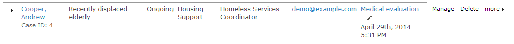
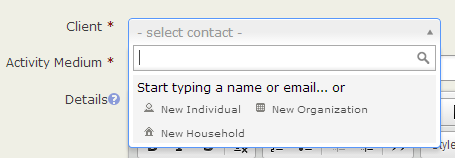
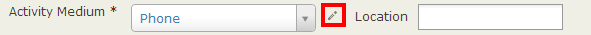
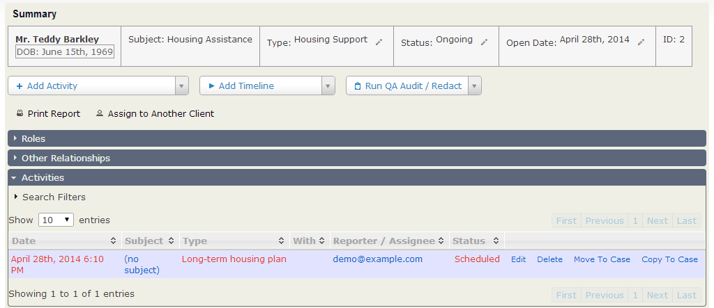
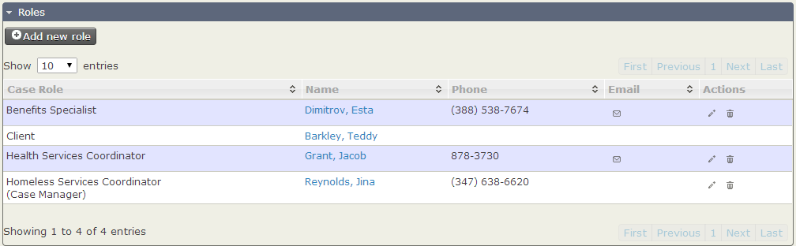
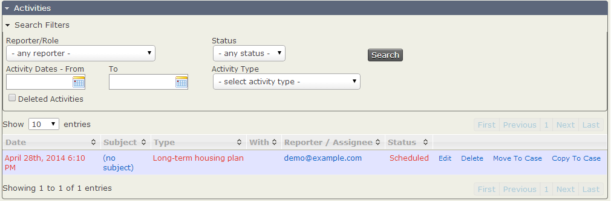

Everyday Tasks
==============

This chapter describes a list of everyday tasks that you might perform
using CiviCase, and how to go about them.

Viewing the Case Dashboard
--------------------------

The Case Dashboard gives you an easy way to keep track of case-related
tasks. It provides:

-   a summary of cases in the system (Summary of Case Involvement)
-   a list of your cases with upcoming activities (scheduled in the next
    14 days) 
-   a list of your cases with recently performed activities (completed
    in the last 14 days).

If you have permission to view cases other than ones that you are
working on, you also have the option to see:

-   a list of all cases with upcoming activities
-   a list of all cases with recently performed activities.

You can switch between viewing Your Cases and All Cases by clicking on
the link at the top right of the content area.

Click the **Edit** icon next to the Next Sched. activity name to work on
that task. In the case shown in the following screenshot, the Next
Sched. activity is Medical evalution. You can view this activity in a
pop-up window by clicking directly on the title. If you're ready to work
on that activity, click the edit pencil to the right of the activity
title. 

Click on the triangular expand icon (►) to the left of the client name
to see the complete list of activities for that case. From this list you
can view or edit any activity in that case. Click **Manage Case** when
you want to work on a number of tasks within a case or to change the
status of the case, print a case report, or view case roles.

To add a new case from the Case Dashboard, click the **Add Case** button
at the top left of the content area.

Finding cases
-------------

If you know the Case ID, you can quickly find the case by using
full-text search, either from **Search > Custom Search > Fulltext
Search** or from the fulltext search block if you have enabled it.

You can search for cases by going to **Search > Find Cases** or under
**Cases** in the menu bar at the top of the CiviCRM screen. The Cases
search form gives you a number of options. You can search by each option
individually, or combine them for further filtering.

You can search by:

-   client's name or email address: type characters from the name or
    email address into the Client name or email input field
-   type or types of cases: checking the case types that you would like
    to filter by
-   case status: selecting a status from the dropdown menu 
-   all cases or your cases (if unselected, the default is to filter by
    your cases) 
-   deleted cases: click the **Deleted cases** checkbox. 

If you make selections in multiple criteria (e.g. adding a client name,
checking off a case type, and selecting "all cases") the search criteria
will be combined so that the results must fulfill at least one
requirement in each set of criteria (the cases found will contain the
client name AND case type). In contrast, making multiple selections
within one set of criteria (e.g., checking two case types) will ensure
that the returned results fulfill *at least one* of the selections in
the criteria set (in this example, cases must match at least one of the
case types). 

Opening a new case
------------------

You can open a new case with either an existing contact or a new contact
not yet in your system.

Creating a case from an existing contact's summary screen or actions
menu automatically links the case to that contact. To open a case on an
existing contact, follow these steps:

1.  Go to the contact's summary screen. 
2.  Select **Add Case** from the **Actions** dropdown menu, or
    alternatively click on the **Cases** tab. 
3.  Fill in the required fields in the **Add Case** form.
4.  Click **Save**. 

If you open a new case for a new contact, the contact's record in
CiviCRM is created at the same time as you create the case. Follow these
steps:

1.  Go to **Cases > New Case** or select the **Create
    New > Case** dropdown button. This button is provided as a
    block in Drupal or on the left hand side in Joomla!.
2.  If you've opted to create a new case without navigating to an
    existing contact first, you may want to check whether the contact
    already exists in the database. Type the name or email of the
    contact you are looking for in the **Select Contact** field, and you
    will see a list of potential matches (as illustrated by the
    following screenshot).

     

3.  If you don't find the contact, you can create it immediately by
    selecting the type of contact from the **create new contact** list.
    This opens a pop-up window (shown in the following screenshot) that
    allows you to fill out the new contact's name and other information
    while opening the case. The fields in this pop-up window are
    controlled by the fields in the **Add Individual** profile. This
    means you can easily add or modify the fields provided. You can read
    more about profiles in the Profiles chapter.

    Use the **Medium** and **Location** fields to record information
    about where and how this case came to your attention. For example,
    you might select **In Person** for Medium and **At the Annual
    Gala** for Location. You can manage Encounter Mediums by selecting
    the edit icon.

    

    Use the **Details** text area to add information pertaining to the
    overall case, but not to a specific *activity* of the case. An
    example might be "Jane is concerned about some illegal land use that
    she has witnessed in her neighbourhood, and would like us to see
    what can be done about it. I told her that the best person to look
    into this was Tom, and she asked whether her husband could be
    included on any correspondence."

    The **Subject** field is displayed in search results and in other
    listings of cases, next to the name of the case client. Keep this in
    mind when entering the subject text: a brief and unique description
    of the case will be more helpful than using the client's name as the
    subject.

    The **Case Type** selector allows you to choose the type of case
    that you are creating. Many case types have specific activities and
    timelines, so it is important to choose the appropriate case type at
    this point. You can change to a different case type at a later point
    by clicking **Manage Case** next to the case when it's displayed in
    the **CiviCase Dashboard**, or from the contact's record **Case**
    tab. Then select **Change Case Type** from the **New Activity**
    dropdown menu. Changing an ongoing case may require you to then
    update or re-enter some data.

    The **Case Status** selector allows you to indicate the current
    status of the case. Generally you will use a status such as Ongoing
    or Urgent, but if you are adding a case that has already been
    completed (for tracking purposes) select Resolved.

    The **Case Start Date** field defaults to the current day. If you
    are creating a case that has already been completed or entering data
    for upcoming cases (not yet started), adjust the case start date
    accordingly.

    The **Duration** field records the time spent collecting the data
    needed to fill out the create case form, not the amount of time it
    took to fill the form out. Fill out the number in minutes. For
    example, you might use this field to record the number of minutes
    spent on the phone with a constituent as they described the case.

4.  After you complete the fields in the pop-up window, clicking the
    **Save** button saves the case and loads the Manage Case page, where
    you can then modify activities, add attachments and assign case
    roles. Alternatively, clicking **Save and New** saves the case and
    resets the form so that you can add further new cases uninterrupted
    (this is particularly useful if you are doing data entry). Clicking
    **Cancel** discards the case data you have entered and sends you
    back to the CiviCRM dashboard.

Manage Case Page
----------------

The manage case page gives users the ability to manage all aspects of a
particular case on a single screen, including:

-   View summary case information
-   Change case status or reassign
-   Create/manage activities
-   Create/manage timelines
-   Create/assign case roles
-   Identify/manage client relationships
-   Run case audits (reports)

Assigning case roles
--------------------

You can assign case roles to contacts who are working on the case or
need to stay informed about case activities. Users who have access to
CiviCase and are assigned a role in the case will then see that case in
their My Cases view. The phone number and email address of each person
with a case role will be displayed on the case, making it easy to
communicate with them (see screenshot).

Within a case, you can assign a case role to a contact:

1.  Click the **Case Roles** area to open it. 
2.  Case roles that have not been assigned display **(not assigned)** in
    the **Name** column. Click the edit icon to assign someone to that
    role. 
3.  The **Assign Case Role** pop-up window will appear. Begin typing the
    *last name* of the contact until you see the name in the dropdown
    list.
4.  Select the contact you want to assign to the role and click **OK**.

Where you need to have more than one contact assigned to a given case
role you can do this using the **Add New Role** button. Clicking this
brings up a pop-window where you can select any of the roles defined in
your case configuration, and select a contact from within your database
to whom the role will be applied. The new role relationship will then be
listed in the Roles pane of the case management screen.

Generally, anyone who might be assigned to a case should already be in
the database, but if you can't find the person you're looking for, you
must add her/him as a contact first (navigate to **Contacts > New
Individual**).

Each assigned case role has mail, edit and delete icons under the
**Email** and **Actions** columns. You can email contacts with roles in
the case, or modify their relationships to the case. Change the case
role by clicking the edit icon, or delete a case role by clicking the
delete icon. Emails that you send from here are automatically added to
the list of case activities in the proper sequence. This provides an
audit trail of case-related communications, and ensures that the case
story is complete. 

Finding activities within a case
--------------------------------

You may need to find a specific activity within a case, for reference or
modification. To view the activities in the case, scroll down to the
**Case Activities** section and click it to open it. In the default
view, scheduled activities are listed first, sorted by date, followed by
completed activities. Click on the column headers to sort by a specific
column (for example, by activity type).

If there are many activities, you can filter them to see a smaller
subset. You may want to view activities of a certain type (for example,
to see all of the **Follow up** activities that have been performed for
this case). Click the **Search Filters** button, which opens a form that
allows you to filter by:

-   Reporter/Role
-   Activity Status
-   Activity Dates (enter a range by filling in both date fields, or
    search for activities performed on a specific date by filling out
    the first date only)
-   Activity Type (for instance, to find all follow-up activities,
    select **Follow up** from the list)
-   Deleted Activities (available to people with permission to view
    deleted activities). 

Once you have selected your search criteria, click the **Search** button
to the right and the table will automatically filter out all of the
activities not matching your criteria.

 

Adding and managing activities
------------------------------

Several tasks are commonly performed on activities. After performing the
necessary work, click the **Save** button to save the activity and be
sent back to the case page, or **Cancel** to discard your work.

### To add a single new activity to a case

1.  Navigate to the case (either using **Find Cases** or via the **Cases
    Dashboard**).
2.  Choose an activity type from the select list labeled **New
    Activity** in the **Case Summary**.
3.  Click **Go**. 
4.  Fill out the activity form. The Client field will be pre-populated
    with the case's client data.

Note: the drop-down list of activities is configurable. Refer to the
instructions for Activity Lists in the set-up chapter

### Adding a set of activities

When the case is created, the Standard Timeline is added. You may add
additional set of activities when appropriate.

1.  Navigate to the case (either using **Find Cases** or via the **Cases
    Dashboard**).
2.  Choose a Timeline or Sequence from the select list labeled **New
    Timeline**in the **Case Summary**.
3.  A dialog box will pop-up. Confirm that you wish to add the
    activities by clicking "OK"

The set of activities will be added to case. 

### To send a copy of the activity to anyone with a case role for the case

1.  Open the **Send a Copy** area.
2.  Check the contacts or case roles whom you would like to be alerted
    about this activity.

### To schedule a follow up activity

1.  Open the **Schedule Follow-up** area.
2.  Select the follow-up activity type, the number of days until the
    follow-up should occur, and subject of the follow-up (e.g. "confirm
    that Jane's problem is fixed").
3.  Click **Go**.
4.  Complete the form and click **Save**.

### To add an attachment to the activity

1.  Open the **Attachments** area.
2.  Click a **Choose file** button. 
3.  Up to five files can be attached to an activity. Select an
    attachment from your file browser.
4.  Click **Choose**. The name of the attachment will appear to the
    right of the **Choose file** button. 

The attachment will not be saved into CiviCRM until you have saved the
activity.

Editing an activity in a case
-----------------------------

To edit an activity in a case:

1.  Navigate to the case from the **Case Dashboard**, the **Find Cases**
    search form, or the contact's **Cases** tab.
2.  Click **Edit** at the far right side of the activities table at the
    bottom of the case form. 
3.  This brings you to the activity form, which you can edit in the same
    way as when creating an activity for a case. The only difference is
    that many of the fields will already be filled in.

To assign a scheduled task to a staff member while adding or editing a
case:

1.  Start typing the staff member's name into the **Assigned to** field;
    a list of possible contacts will appear. 
2.  Select from the list of suggestions and make sure the staff member's
    full name shows up in the **Assigned to** field. 

You can assign multiple contacts to an activity. If you accidentally
select the wrong contact, click the X by the contact's name to remove
him from the list. 

Updating the status of case activities
--------------------------------------

You can quickly update the status of an activity from the Activities
table (without opening the activity edit form):

1.  Navigate to the case from the **Case Dashboard**, the **Find Cases**
    search form, or the contact's **Cases** tab.
2.  Click on the **status** text (i.e. "Scheduled") in the activity
    table row.

3.  This brings up a pop-up form where you can select a new status.
    Click Ok to save your update. 

Changing the status of a case
-----------------------------

The case status lets you quickly determine how a case is progressing.
Sample status values include Ongoing, Resolved, Not Assigned, and
Urgent.

To change the status of a case:

1.  Navigate to the case from the **Case Dashboard**, the **Find Cases**
    search form, or the contact's **Cases** tab.
2.  Click **Manage Case**. 
3.  Click the **Edit** icon next to the current status column in the
    Case Summary table. 
4.  This will open the **Change Case Status** form (an activity with an
    additional field called Case Status).
5.  Set the case status to the new status.
6.  Modify the other the fields as you would when editing an activity in
    a case. Make sure to set the **Status** field. It is required, but
    not set by default. 
7.  Click **Save** to return to the case page, with a message stating
    that the Change Case Status Activity has been created.

An activity is recorded because when a case status changes, it changed
because something happened. It is usually equally as important to record
the *who* and the *why* as well as the *what*. This behaviour is
consistent throughout CiviCase.
