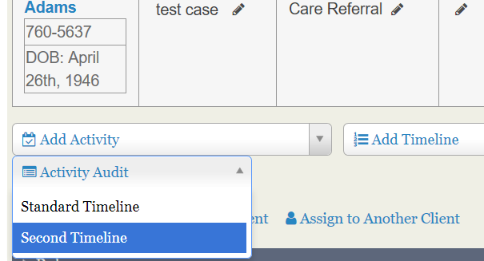
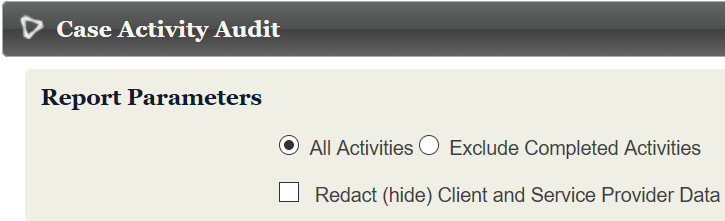
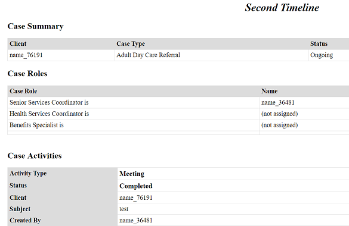
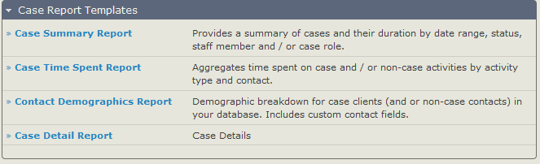
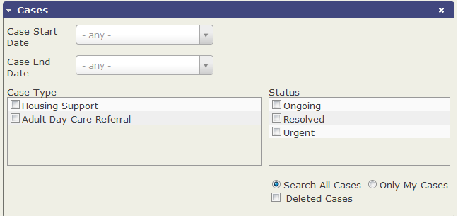

# Reports and analysis

There are a number of techniques for reporting on and analysing your
casework. You can run an audit of the activities for each case from
within that case. The case dashboard gives a very useful quick overview
of your current cases, with rows for each case type and columns that
show current totals for each status. Clicking through any number (0 will
not be linked) will take you a list of all the cases of that type in
that status.

That's a good start and can provide a good overview for an administrator
but there are a couple of ways that you can create more detailed and
customised views of the data for case workers and administrators using
CiviCRM's search features and CiviReport.

## QA Audit / Redact

This report is run from the contact's case management screen. It
is similar to the Print Report link on that screen, but will only include activities that are defined in a selected timeline. You can chose to include activities with any status or to exclude those with 'Completed' status.

If you select **Redact (hide) Client and Service Provider Data** then randomly assigned numbers rather than names will be used in the report as shown here. The same contact will have the same number throughout the report.

## CiviCase Reports

There are four report templates specifically for cases:

1.  Case Summary Report
2.  Case Time Spent Report
3.  Contact Demographics Report
4.  Case Detail Report

 

In addition as cases are made up of activities, the Activity report
template is particularly useful for providing a dashlet for each user
involved in casework so they can track all activities assigned to them.
Given that these case activities will be displayed alongside other
non-case based activities, you may want to implement a protocol for
activity names which include some kind of case reference.

### Printing Case Reports

To print a report that lists all case and case activity data:

1.  Navigate to the case from the Case Dashboard, the Find Cases search
    form, or the contact's Cases tab.
2.  Click Print Case Report in the Case Summary section.

Your installation may define additional reports for audit or quality
assurance purposes. If so, you will see them listed in the "Run QA
Audit/Redact" dropdown menu.

## Searching based on cases

There is a Find Cases search which allows you to search on Case Type and
Status as well as by client name or email. This is a useful quick search
to identify a few cases that may need specific input if the case
dashboard is quite large and cluttered in your instance.

 

The Advanced search provides these options combined with all the other
normal search criteria so you can find case types filtered by location
or custom fields applied to the contact.

 

Also useful can be the Activity Search which is located under **Search > Custom Searches > Activity Search**.  Unlike Advanced
search, this is just based on activities and not contacts.

## Print/merge document

A user can create a letter or document using case [tokens](../common-workflows/tokens-and-mail-merge.md) on the case management screen, or on multiple cases through a Find Cases search. On the case management screen, beside "Print Report," there's an option to "Export Document" as a PDF, DOCx, ODT, or HTML page. Alternately, you can select multiple cases through a search and "Print/merge Document," which will create a document for each case, compiled in a single PDF.  

When working with DOCx turn off spelling and grammar check for best results. 

## Further analysis

If the combination of Case Dashboard, CiviReport and the contact and activity searches aren't giving you want you want, consider commissioning a new report or custom search. 

Read the section on [reporting](../reporting/what-is-civireport.md) and the page on [searching](../the-user-interface/searching.md) for more information.
