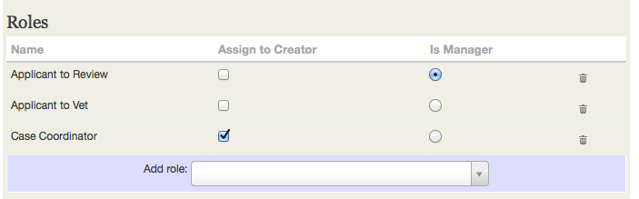
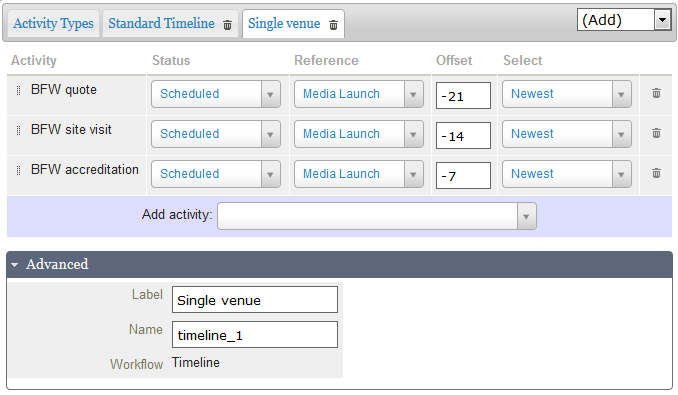
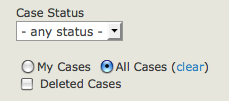
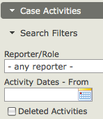

Set-up
======

Now that you've gone through the planning process and determined the
types of cases, activities and case roles that you need, you're ready to
configure your CiviCase installation.

Enable the CiviCase component
-----------------------------

The CiviCase component is included in CiviCRM downloads, but it is NOT
enabled by default. To enable the component:

1.  Go to **Administer > System Settings > Enable Components**.
2.  Select **CiviCase** in the left-hand box and click Enable (this
    should move it to the right side).
3.  Click **Save**.

You will now see **Cases** in the navigation menu.

Define Case Types
-----------------

You can create one or more new case types.

To add a case type:

1. Go to **Administer > CiviCase > Case Types**.
2. Click **New Case Type**. Enter a "Title" and an optional
"Description" of the case type.

    The case type has both a "Title" and a "Name". The title will be
    displayed to users, and the name is used internally by CiviCRM. CiviCRM
    will autofill the name field. (The default name is usually fine, but
    advanced user may unlock and change the name. Once the case type is
    created, the name should not be changed.)

3. Include **Case Roles**.
This section lists the types of people who are involved in the case in
some way. Roles listed here will be automatically included in each case
when a new case is opened.

    Select the roles that you wish to be included in the case type from the
    "Add role" drop-down shown below the listing of roles.

    If you need to create a new custom role for your case type, click the
    drop-down, and type the name of the new role into the field. As well as
    displaying any matches from the existing list of roles, you will also
    see a blue bar containing your keyed entry, underlined. Simply click on
    this to define the new role. The new role will be created when you save
    your new case type. Using this method you can quickly create as many new
    roles as you need for your case type.

    As each role is selected or created, it appears in the listing of Roles,
    where you can further set "Assign to Creator" and "Is Manager" options:

    -   Any role marked with "Assign to Creator" is then automatically
        assigned to the person who creates the case.
    -   You may also mark one of the roles as the manager. The case
        manager's name will be displayed prominently in case listings and
        reports.

    Specific people may be assigned to case-roles -- after a case has been
    opened.

    New roles/relationship types created through the Case Type interface are
    individual-to-individual relationships. If you want roles that are
    individual-to-organisation relationships then, once you have finished
    creating your case type, you can change the relationship definition at
    **Administer > Customize Data and Screens > Relationship Types**.
    There you will also be able to review and edit other details of the
    roles/relationships if you need to.

4. Include **Activities**
When working on a case, the user has access to a drop-down menu in the
case summary enabling them to quickly record a new activity as part of
the case. For example, if the case manager looks at a case and decides
they need to check a point of detail with a colleague, they could make a
phone call, and quickly log that call to the case by selecting **Phone
Call** from the **Add Activity** menu, recording the details of the call
in the activity. The **Phone Call** activity automatically gets filed on
to the case.

    When defining the Case Type you can choose which Activity Types are made
    available within this drop-down menu.

    If you are including most or all of your custom Activity Types in the
    **Standard Timeline**, or another timeline or sequence within your Case
    Type, you may not want to include these custom Activity Types in your
    '**Add Activity**' menu, particularly if you want tight control over the
    workflow pattern in your case type. In a different scenario you might
    want to give your users more flexibility, and give them access to some
    or all of the custom Activity Types in the menu, allowing them to have
    much more control over the pattern and flow of activities in the case.

    The first step is to create a list of all of the Activity Types that you
    would like to have readily available from within the case. This is the
    listing under the 'Activity Types' tab. You should focus on selecting
    just the activity types that your users will find useful. These might
    include **Phone Call**, **Email**, **Meeting**, and **Follow Up** along
    with any custom activity types. (CiviCRM also includes some special
    activity types -- such as **Open Case,** **Change Case Status**, and
    **Change Case Type**. There is no need to manually add these activity
    types.)

    Note - the Activity Types listing needs only those activities that a
    user **might** **choose** to add to the case. Activities that you
    include in a Timeline or Sequence do not need to be in this list.

    

    Select the activity types that you wish to be included in the case type
    from the "Add activity type" drop-down shown below the listing of
    activity types.

    If you need to create a new custom activity type for your case type,
    click the drop-down, and key the name of the new activity type into the
    search field. As well as displaying any matches from the existing list
    of activity types, you will also see a blue bar containing your keyed
    entry, underlined. Simply click on this to define the new activity type.
    The new activity type will be created when you save your new case type.
    Using this method you can quickly create as many new activity types as
    you need.

    As each activity type is selected or created, it appears in the listing
    of Activity Types. You can optionally specify the maximum number of
    times a given activity type can be used in a case using the '**Max
    Instances**' element.

    Once you have created your case type you can review and amend the
    details for any new activity types you may have created by editing them
    at **Administer > Customize Data and Screens > Activity Types**. New
    activity types created through the Case Type interface have default
    settings that should be fine in the majority of situations, but you may
    wish to amend the label, add a more useful description, or if you want
    to make the activity type available to be used more generally outside of
    CiviCase you can change the 'Component' setting from 'Cases only' to
    Contacts AND Cases'.

5. Having defined all of the Case Roles and the Activity Types that
will be available for user selection in your new Case Type, you next
need to define the **Standard Timeline**, any
additional **Timelines** and/or a **Sequence** that you want to use
within the case type.

    These are simply groups of activity types which define a series of
    interactions, giving you the ability to pre-define one or more
    standardised workflows for any given case type.

    In a **Timeline** you control the scheduling of each activity in
    your timeline relative to the date the case is opened, or relative to
    another activity in the case, using the 'Reference' and 'Offset' fields.
    When you use a timeline, all of the activities defined in the timeline
    are created when the timeline is added to the case and are visible in
    the case summary. You can create multiple timelines for use in any given
    case type.

    The **Standard Timeline** is the default timeline for each new case type
    that you create, and provides the essential elements that will make your
    case types work correctly, so each case type must have a standard
    timeline. The activities in the standard time line are added
    automatically when the case is opened.

    The Standard Timeline starts with one predefined activity, Open Case,
    whereas additional timelines are empty to start with. As you control
    when an additional timeline is added to the case you will choose the
    first activity, which may also be a key reference activity for this
    timeline.

    A **Sequence** defines the order in which a set of defined activities
    should occur, but unlike the timeline it includes no information about
    time intervals between activities. A sequence also differs from a
    timeline in that the next activity in any sequence is created only when
    the preceding activity is marked as completed. You must make sure that
    any activity type included in your timeline(s) is not also included in
    your sequence and vice-versa.

    You may add additional timelines or a sequence by selecting the option
    from the (Add) menu. Currently you can only add one sequence to any
    given case type.

To add activities to a timeline, select the tab for the timeline you want
to work with:

1.  Select or create an activity using the drop-down list.
2.  Select a status for the activity (the default is Scheduled).
3.  Enter a Reference Activity. The default reference activity is Open
    Case and this is often appropriate. For the Standard Timeline any
    activity in the timeline can be selected as the reference for any
    other activity. For other timelines you can select any activity in
    the case type as a reference, bearing in mind that at the point in
    alive case where the additional timeline is activated, the reference
    activity must already exist in the case.
4.  Enter an Offset (in days). Offset values can be positive, negative
    or zero.
5.  The 'Select' option is helpful if there are multiple instances of
    the reference activity type, as it allows you to select whether the
    oldest or most recent instance of the reference activity should be
    used.

You can choose to use the "end date" of a case (i.e the final defined
activity) as your reference and use negative offset values to schedule
activities as the example below shows.

You can rename additional timelines or a sequence using the fields
available in the 'Advanced' section below the main Activities section of
the page as shown above.

To add activity types to a sequence simply select or create them using
the Add Activity drop-down menu.

Once you have all the activity types you need for your timeline(s) or
sequence you can re-order them if necessary using the drag and drop
handles to left of each activity type in your listing.

A set of sample case types are installed when you enable the CiviCase
component. These can be useful either as a point of reference to see
what a complete case type looks like, or even as a start point for your
own case types.

Custom fields
-------------

It is likely that you will want to collect structured data in the case.
You can collect data in custom fields connected to a specific activity
type, or connected to the case type. For example, in Employment
Counselling cases, you may want an activity type Skills Assessment, in
which an employment counsellor records client job skills. This activity
type will require one or more custom fields, perhaps a set of
checkboxes. Alternately a generalized application case might need a
custom field to indicate the type of application that is being tracked.

The main difference between using custom data at the case versus
activity level is that custom fields attached to the case are visible
inside the case management screen, while custom fields attached to
activities are only visible if the user views details on that particular
activity.

If you are transitioning from a paper-based system, it is helpful to
refer to existing forms and then determine what information from the
forms is relevant to include.  

Please review the section on configuring custom data fields prior to
beginning these steps.

1.  Go to **Administer > Customize Data and Screens > Custom Fields**.
2.  Click **Add a Set of Custom Fields**.
3.  Under **Used For**, select **Activities** or **Cases**.
4.  Select one or more specific activity type(s) or case type(s) for
    which this set of fields will be used.
5.  Enter any help information you want to be displayed to your users.
6.  Click **Save**.
7.  Enter one or more custom fields for this set.
8.  Repeat these steps for each activity type or case type which
    requires custom data to be recorded.

If you need to define a large number of fields for a given activity
type, consider breaking them up into sets of related fields. Group the
fields into logically related sets that will make sense to the users,
and avoid the form looking like an endless tunnel of fields.

Filing Emails on Cases
----------------------

Some organizations find it useful to record case-related emails in
CiviCase. For example, the case coordinator for a work disability case
might send an inquiry to a state agency representative and would like
both the sent email and the reply to become part of the case story.

You can choose to send outbound emails directly from the Manage Case
screen, but you can also set up CiviCRM to integrate with your usual
email client so you can send and receive emails as usual and also have
them filed in CiviCRM.

In the CiviMail chapter the Email Processor was described as a way to
get inbound and outbound emails into CiviCRM as non-case activities.
When you enable CiviCase, a new action will be available that allows you
to file any non-case activity onto a case.

Additionally, when email activities are sent from the Manage Case
screen, if the Email Processor has been set up then replies will
automatically be filed directly onto the case.

CiviCase permissions
--------------------

You will need to create a contact record for each staff member or
service provider who will be using CiviCase to enter or view case
information. These individuals will also need to have a Drupal, Joomla!
or WordPress user account.

For Joomla! and WordPress installations, staff members must have
back-end (administrator) access. All CiviCase functions are done within
the Joomla! and WordPress Administrator interfaces.

You should also add contact records for service providers who will be
assigned case roles but will not be accessing the CiviCase system. This
will allow your staff to easily send emails with pertinent case and
client information to these providers via CiviCase, as well as record
case-related interactions reported by providers.

In order for users to add and manage cases, you will need to configure
CiviCase-related permissions for users in your CMS. You may want to
create case management-specific user roles for staff, based on their
responsibilities within your organisation. You can assign permissions to
users in order to control whether or not they have access to the
CiviCase component, as well as what case data they can see.

The following is a list of the CiviCase-related permissions:

-   Access my cases and activities: allows a user to create new cases,
    add activities to the cases they've created and edit those
    activities. Users with this permission can NOT see cases or
    activities created by others.

     If you need to restrict certain users to ONLY see case data (i.e. hide
     all other contact information from them), assign "access my cases and
     activities" permission WITHOUT "edit and view contacts" permission.
     This permissioning model is useful for users who are external to your
     organisation and who should not be allowed to see contact details.

-  Access
    all cases and activities: allows a user to create new cases, as well
    as view and add activities to any case (regardless of who initially
    created the case).

    

-   Delete in CiviCase: allows a user to mark cases or case activities
    as deleted. Cases and activities are never physically deleted from
    your database, but only hidden when you mark them as deleted.

    Users with this permission can also find and undelete these cases and activities by checking the Deleted Cases option in Find Cases and the Deleted Activities option in the Case Activities Search Filter.

-   Administer CiviCase: gives access to Administer > CiviCase options
    including:

-   create and edit case types and case statuses
-   set rules for redacting case data. These rules are used to disguise
    data which could be used to identify the case client in case reports
    which are shared with external reviewers.
