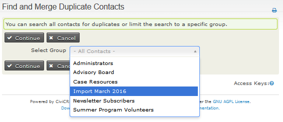
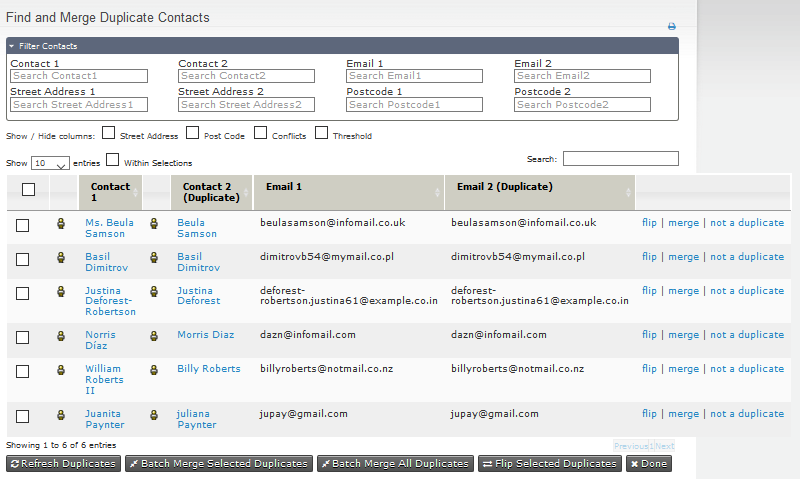
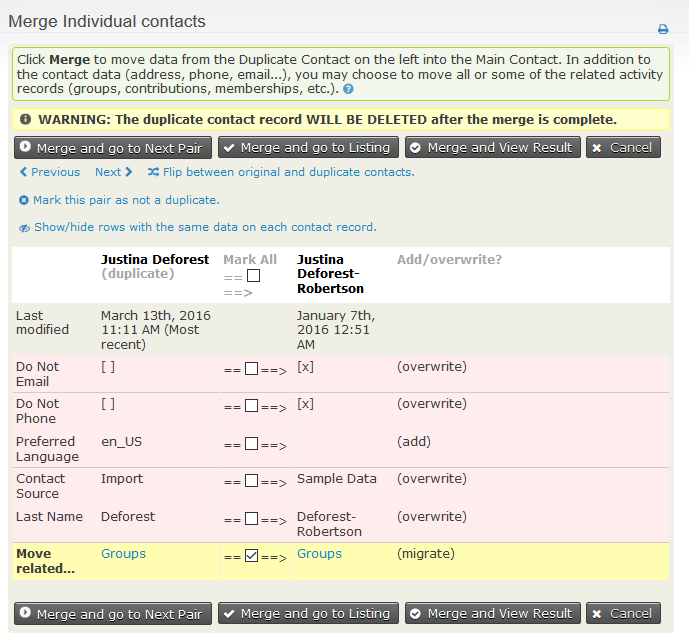
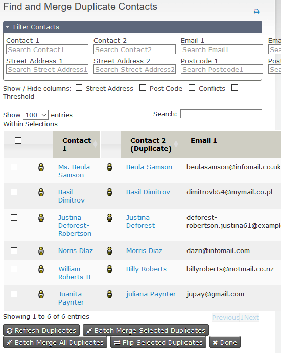
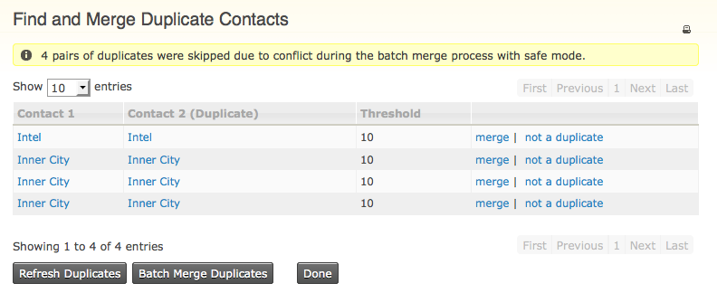

Deduping and Merging
====================

What is deduping?
-----------------

Duplicate contacts can turn up in your data for many reasons, such as
mistakes by users who don't realise they're creating a contact for
someone who is already in CiviCRM, duplicates that aren't caught in the
import process, and duplicate records created when people fill in forms
about themselves on your site without realising they're already in your
list of contacts (maybe with their names spelled differently or with a
different email address).

Some examples of scenarios where duplicate contacts can enter your
database:

-   When an administrator or user creates a new contact through the
    admin interface and this contact already exists.
-   When a contact is created by self serving or signing up online and
    the user has done this with another email address or name.
-   When contacts are imported to the database.

CiviCRM Features for deduplicating contacts
-------------------------------------------

CiviCRM is equipped with several features for dealing with duplicate
contacts. Some attempt to avoid the duplicate contact from being
created, others help you to search, identify and "merge" duplicate
contacts found in your database.

These features are split between those that act "automatically" (known
as "unsupervised"), and those that act manually (known as
"supervised").

These features include:

-   Scanning your database for duplicates using a selected dedupe rule
    (see below) and merge duplicate contact data as needed.
-   Manually selecting two contacts using the search and then choosing
    to merge these contacts.
-   Automatically scanning your database and suggesting duplicates when
    contacts are added or edited via the user interface.
-   Automatically merging a person's details to an existing contact when
    a person signs up online for items such as Events, Membership,
    Contributions and Profile pages.
-   Automatically merging a person's details when importing contacts.

Dedupe rules
------------

Dedupe rules are a way of specifying to these features whether CiviCRM
should consider contacts to be duplicated. For example a rule could
state that when the email address and first name between two contacts
match CiviCRM should consider these contacts to be duplicates.

Using the default rules to find and merge duplicate contacts

If you do not want to configure the dedupe rules at this stage you can
simply use the default rules to find duplicates from your database.

Firstly view the dedupe rules. Go to **Contacts > Find and Merge
Duplicate Contacts** in the navigation menu. This displays the following
screen:

Different rules are configured for each contact type (individuals,
organizations, and households.) A default supervised rule and a default
unsupervised rule is set for each contact type. The default rules are
used when CiviCRM invokes automatic checking, in ways we'll explain in
detail shortly.

Understanding dedupe rules: Supervised, Unsupervised and General
----------------------------------------------------------------

CiviCRM now includes three categories of dedupe rules:

**Unsupervised:** The 'Unsupervised' rule for each contact type is
automatically used when new contacts are created through online
registrations including Events, Membership, Contributions and Profile
pages. They are also selected by default when you Import contacts. They
are generally configured with a narrow definition of what constitutes a
duplicate so as to avoid a false match being merged accidentally.

**Supervised:** The 'Supervised' rule for each contact type is
automatically used to check for possible duplicates when contacts are
added or edited via the user interface. The UI will alert the user if a
contact they are creating matches another contact using the rule. The
user can then decide whether to edit the existing contact or to continue
to create a new contact. Supervised Rules should be configured with a
broader definition of what constitutes a duplicate as the user can
decide whether to act on the rule or not.

**General:** You can only configure one 'Unsupervised' and one
'Supervised' rule for each contact type, but you can configure any
number of additional 'General' rules to provide other criteria to scan
for possible duplicates.

Configuring rules
-----------------

To determine whether two contacts are duplicates, CiviCRM checks up to
five fields that you can specify. You can also set a length value which
determines how many characters in the field should be compared. For
example, if you set a length of 2 on the **First Name** field, a first
name of "Mike" would match "Michael" and they would be recognized as
duplicates, because the first 2 characters are the same. However, if you
set the length to 3 instead, "Mike" would no longer match "Michael" and
they would be accepted as different contacts. If the length value is
left blank, the comparison is done on the entire field value.

Each field is also configured with a numeric weight that determines the
relative importance of a match on that field. When a match is discovered
on a field, that field's weight is added to the total weight for the
rule. After each field is checked, if the total weight is equal to or
greater than the numerical threshold set for the rule, the contacts
being compared are flagged as suspected duplicates.

Using rules and merging duplicate contacts manually
------------------------------------------

1.  Go to **Contacts > Find and Merge Duplicate Contacts**.
2.  Click the **Use Rule** link to scan for duplicate contacts using the
    selected rule.

3.  You can then select to search all contacts for duplicates or to
    limit the search to a particular group. If you choose to limit the
    search to a specific group, CiviCRM looks for duplicates where at
    least one of the contacts in any identified duplicate pair is in
    your selected group.  

      

    Contacts of the type to which the rule is
    assigned will be scanned and compared. If the match between two
    contacts meets or exceeds the rule's threshold score, the contacts
    will be displayed on the following screen of possible duplicates.
    You will be presented with a list of possible duplicates with a few
    show/hide tickboxes; Street Address, Post Code, Conflicts and Threshold.  

    

4.  Clicking **Merge** for any pair of contacts brings up a table
    showing details for each contact. CiviCRM designates one record as
    the duplicate record and displays its information in the left
    column. The record in the right column is considered the original
    record into which selected data from the duplicate record will be
    merged.
5.  If you want to move the information in the opposite direction, you
    can swap the duplicate and original contacts by choosing **Flip
    between original and duplicate contacts** at the top of the page.  
  

6.  The rows on the merge screen are colour-coded.
    -  Green indicates the information is the same
 for each contact. These can be hidden by clicking on **Show/hide rows with the same data on each contact record**.
    -  Red indicates the information is different for the two contacts. For each field, you can choose whether to keep the original data
    shown on the right (don't tick the check-box in the middle column),
    or use the value from the duplicate contact instead (tick the box).
    For the email addresses or phone numbers, you can decide to keep
    both the value of the duplicate and of the original (tick both the
    checkbox in the middle column and the "add new" on the right column)
    to copy the duplicate data.
    -  Yellow indicates a row where the default option is a tick in the  
    check-box which means the data from the duplicate will be **added** to the data already
    in the original record. This applies to tags, groups and activity data
    (including event attendance, contributions, etc.).  If you untick
    the check-box the data belonging to the duplicate will be lost.
7.  Click **Merge...** to complete the merge, or **Mark this pair as not
    a duplicate** if you believe the two contacts are not the same.
8.  When marked as 'not a duplicate', those contacts will be excluded from
    all dedupe results listings.

Merging multiple contacts simultaneously
----------------------------------------
Sometime it is appropriate to merge multiple pairs of duplicates at the same time.
This can be done from the possible duplicates screen where you can display up to 100 rows.

   

You can **Batch Merge All Duplicates** (This will merge **all** duplicates found,
not just those displayed on your screen) or **Batch Merge Selected Duplicates**
ie those you have selected by ticking the box on the left of the row.  These
 batch merging options are displayed beneath the list of duplicates discovered.
In the same area you will find **Flip Selected Duplicates**. When duplicates
 are merged Contact 1 is kept and contact 2 is merged then deleted, so sometimes
 you may want to switch the order of the records before merging.

The batch merging feature will merge all contacts under the given rule
together or all selected contacts, provided
there are no data conflicts. For instance, two individuals named
"Michael Blake" may have been matched based on identical first and last
name, with neither having an email address on record. If the data held
on both contacts is either exactly the same, or one contact contains
information the other does not (e.g. a work phone number, where the
other has a mobile), the two will be merged. However, if both contacts
have different home telephone numbers, the records will be skipped; the
two contacts will not be merged.

Once a batch merge has been completed, you will be returned to the
original list. If any of the records were skipped due to a data conflict
like the example above, the message shown below will be displayed. To
view an updated list of duplicate contacts (those that were not merged
by the duplicate process) you must click **Refresh Duplicates**; the
page will not refresh automatically, just in case your database is very
large, and searching for duplicates would cause a significant delay. You
may then continue to assess and merge the remaining duplicates manually.

**WARNING:** before you begin to consider using batch dedupe, please
take note of the following:

1.  This feature is intended for use with large data sets that have
    strictly managed field structures. If you have a small database with
    only a few duplicates, we recommend you merge them manually using
    your own judgement.
2.  Once merged, the links between the duplicate contact and records
    elsewhere in the system will be transferred to the original contact
    (e.g. event participant records, groups, tags, contributions,
    activities, cases and memberships). You will NOT be able to reverse
    this change.
3.  Duplicate records, once merged, will be deleted and are not
    recoverable. We strongly recommend backing up your data before
    running a batch merge.

## A multi-stage deduping process

Often just using one deduping rule will mean some duplicate remain in your system.
One process way to apply multiple systematically is given below. If you individual unsupervised rule is strict enough then you may be able to batch de-dupe during the first stage then dedupe manually for the second stage.
1.  Start by looking for dupes using the "Individual unsupervised" rule:
    click the **Use Rule** link (contact type "Individual" at the usage
    "unsupervised").
2.  Select **All Contacts** or a particular group.
3.  Click **Continue**.
4.  If duplicates are found, merge or delete the duplicate contacts.
5.  Now look for duplicates using a "supervised" or "general" rule to
    find those that were missed with the stricter rule: click the **Use
    Rule** link for "Individual supervised" (contact type "Individual"
    at the usage "supervised").
6.  Select **All Contacts** or a particular group.
7.  Click **Continue**.
8.  If duplicates are found, merge or mark them as 'not a duplicate'.

##  Merging contacts from search results

If you notice duplicate contacts within a set of search results you can
quickly merge them directly from the search results instead of using the
separate **Find and Merge Duplicate Contacts** process. This is a great
way to clean up your database during your everyday workflow with minimal
disruption.

1.  Select the duplicate contacts from your search results by clicking
    the check box at the left side of each record.
2.  Select **Merge Contacts** from the ** Actions** menu.
3.  Follow the normal steps for merging duplicate contacts.
