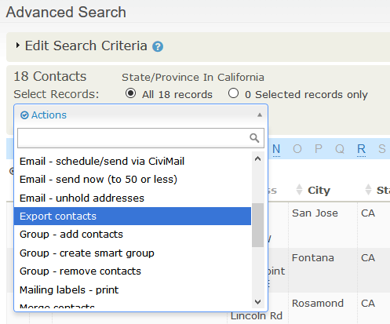

# Exporting Your Contacts

Exporting lets you share data with external applications by providing a
copy of data from CiviCRM in a standard comma separated value (CSV)
format. This format can be viewed and edited in spreadsheet
applications, imported into other database applications, or merged with
word processing documents.

You can either export a predefined set of fields or create your own
custom export mapping which can be saved for reuse.

CiviCRM's export functionality is available:

-   in any of the search tools
-   when viewing contacts in a group
-   in component-based search results, where the resulting records
    reflect the component specific data rather than simply core contact
    data. For example, from the **Contributions > Find Contributions**
    search, you could export your donors and their contact information
    for use in a thank-you letter in which the total amount donated is
    included.

Here's how you can export contact information:

1.  Search for contacts. Carry out a search based on your desired
    criteria using one of the available search tools, e.g. Quick search,
    Find Contacts, Advanced search, Search Builder, or a custom search
    (You can find out more about performing searches in [Searching](../the-user-interface/searching.md).

2.  Select contacts you wish to export. Select all records, or choose
    individual records for export using the check-boxes to the left of
    each record.
3.  From the **- actions -** dropdown menu, choose **Export Contacts**
    as shown in the following figure. This takes you to the export wizard.

    

4.  **Export all or selected fields**.  

    -  Choose between
    exporting the primary fields or selecting your own set of fields for
    export. 

    

    There are 80 fields in a primary fields export (core contact fields with primary email, phone, and address data). Often it is best to specifically select which fields to export as this lets you include non-primary email, phone and address data, custom contact fields and data from related contacts. You can also choose to use a previously saved export mapping (if you have any).  

    -  If the export is to be used for mailing labels you can choose to export one record per household or one per address. If you choose to export one per address then you can specify the format for Addressee and for the postal greeting.

    -  You can choose to exclude contacts with "do not mail" privacy, no street address, or who are deceased.

    -  You can add contacts from a(n additional) group to the export.

5.  When you click **Continue**, if you elected to export the primary fields the export happens immediately, so skip to step 7. If you want to select your own fields or are using an saved field mapping click **Continue** and then go to step 6.

6.  **Select Fields to Export**

      

    -  If you have chosen to use a saved export mapping, the fields in that mapping will be displayed.  You can use the mapping as is or modify it.  If you modify it you can update the existing field mapping or save the changes as a new field mapping.

    -  If this is new mapping choose the fields you want, then decide if you want to **Save this field mapping** to use again later.

    -  When the export fields and other options are correct, click on **Export**.

7.  The file is exported in .CSV format. By default a comma is
    used as the field separator for import and export functions. If required, you can
    change the separator value by going to **Administer > Localization > Languages, Currency, Locations** and selecting the appropriate **Import/Export Field Separator**.
