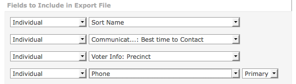
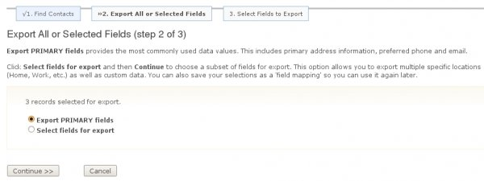

Exporting Your Contacts
=======================

Exporting lets you share data with external applications by providing a
copy of data from CiviCRM in a standard comma separated value (CSV)
format. This format can be viewed and edited in spreadsheet
applications, imported into other database applications, or merged with
word processing documents.

You can either export a predefined set of fields or create your own
custom export mapping which can be saved for reuse.

CiviCRM's export functionality is available:

-   in any of the search tools
-   when viewing contacts in a group
-   in component-based search results, where the resulting records
    reflect the component specific data rather than simply core contact
    data. For example, from the **Contributions > Find Contributions**
    search, you could export your donors and their contact information
    for use in a thank-you letter in which the total amount donated is
    included.

Here's how you can export contact information:

1.  Search for contacts. Carry out a search based on your desired
    criteria using one of the available search tools, e.g. Quick search,
    Find Contacts, Advanced search, Search Builder, or a custom search
    (you can find out more about performing searches in the Searching
    chapter earlier in this section).
2.  Select contacts you wish to export. Select all records, or choose
    individual records for export using the check-boxes to the left of
    each record.
3.  From the **- actions -** dropdown menu, choose **Export Contacts**
    as shown in the following figure.
4.  Click **Go**. This takes you to the export wizard. 
     
    
    
5.  **Export primary (default) or selected fields**. Choose between
    exporting the primary fields or selecting your own set of fields for
    export. The primary fields include all core contact fields with
    email, phone, and address data.
6.  If this is satisfactory, click **Continue** and skip step 7 of this
    list. If you want to add or remove fields to be exported, choose
    **Select fields for export** and continue with step 7. The default
    export uses primary location data, so if you wish to export
    non-primary addresses you need to select fields for export and
    explicitly specify the address type
7.  **Select Fields to Export Choose the fields you want to export.**
    CiviCRM allows you to save this export mapping, which enables you to
    reuse the export field mapping at a later time. To save your
    selection of fields, click **Save this field mapping** at the bottom
    of the form and enter a descriptive name for this type of export. 
     
    
    
    ****
8.  **Click Export to create your CSV file**. By default, a comma is
    used as the field separator for import and export functions. In some
    locales, other characters are used (e.g. a semi-colon). You can
    change the separator value by going to **Administer > Configure >
    Global Settings > Localization** and modifying the Import/Export
    Field Separator. 
     
     

