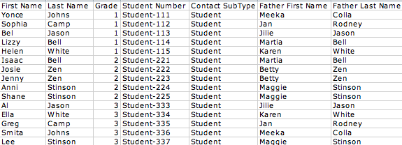
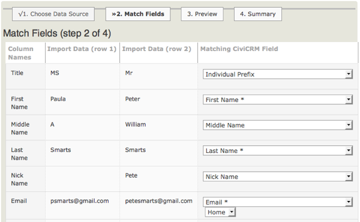
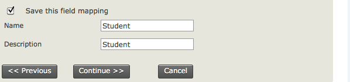
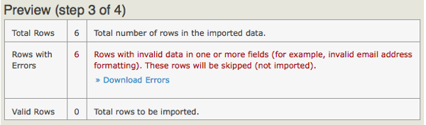
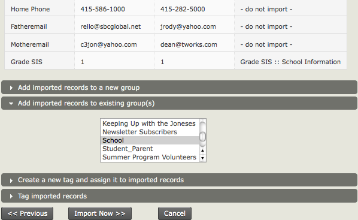
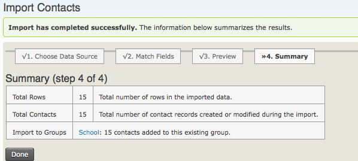
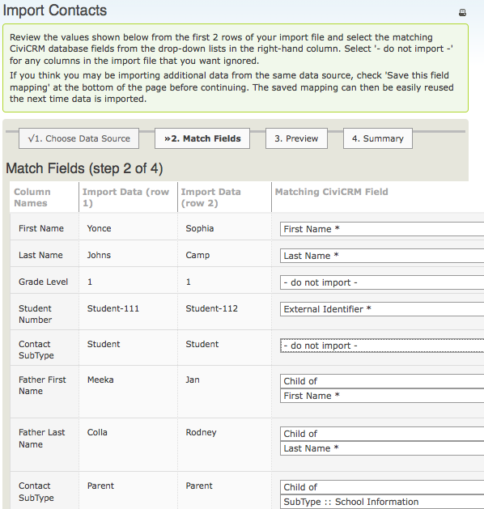
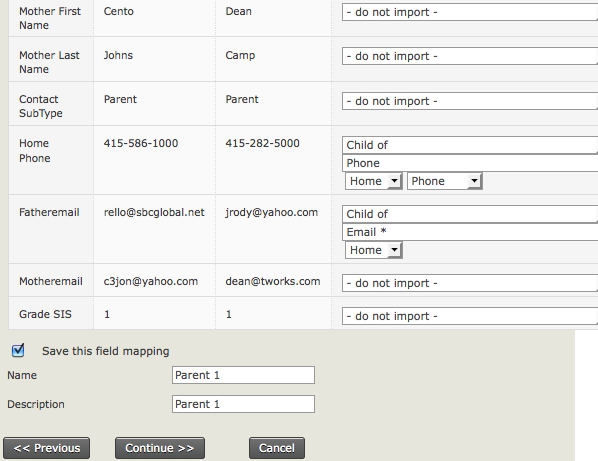

# Importing Data into CiviCRM

Most organisations have data in sources outside CiviCRM, such as
previously used database platforms, spreadsheets created on the fly for
specific events or other purposes, and email address books. Because
manually entering large amounts of data can be tedious, CiviCRM provides
a way do import data en masse if the source can export it into some
common format such as a Comma Separated Version (CSV) file.

Imports can also be used to update existing data. This will be covered
in the final section of this chapter.

## Considerations before importing

For more details on how to think about your data before importing into
CiviCRM, please read the section on "Organizing your data", especially
"Mapping your data into CiviCRM".

## Preparing to import data

Importing data requires considerable attention and care, so we'll
present some concepts here that you should know before you start your
first import. You can import both core and custom data for contacts, as
well as data for event attendance, activities, memberships and
contributions. This chapter will focus on the import process for
contacts. The processes for other data are similar.

There are two ways to import data:

-   from CSV files. Most database and spreadsheet applications (e.g.
    OpenOffice.org Calc, Google Spreadsheets, Microsoft Excel) can
    create and manipulate files in this format. It is often easier to
    view and clean your data when it's in a CSV file than while it's
    still inside your old database.

    Each column in your CSV file will map to a field in CiviCRM, so make
    sure you use a different column for every distinct bit of
    information.

    Depending on your country or region, fields in your CSV files might
    be separated by semicolons (;) instead of commas. If so, you'll need
    to change the Import/Export Field Separator value in the CiviCRM
    Localization settings by going to the navigation menu and choosing
    Administer > Configure > Global Settings > Localization.

-   from another SQL or MySQL database stored on the same server, using
    an SQL query. (This option is only for advanced users who have a
    clear understanding of server and database administration.)

If you do not have a clear understanding of your existing data and how
it will map to CiviCRM fields, you will experience frustrations and
problems when you try to import the data. Please read about each type of
data in other sections of this CiviCRM Manual and visit the CiviCRM
online documentation for more information:
[http://wiki.civicrm.org/confluence/display/CRMDOC/Importing+Data](http://wiki.civicrm.org/confluence/display/CRMDOC/Importing+Data)

The following rules and recommendations will help you to import data
with minimal problems:

-   Always test your data import with a small subset of your records.
    After importing the test set, visit the records within CiviCRM and
    ensure that the data was imported and functions as you expected.
-   It can be helpful to create a test contact that has every attribute
    you've defined in your existing data set. Then import the contact
    and check results to ensure that CiviCRM correctly represents all
    the data.
-   When you map the columns or fields from your source data to CiviCRM
    fields during the import, CiviCRM can save this field mapping as an
    *import map* for future use. This is helpful if you will be
    importing multiple files with the same structure. To save an import
    map for future use, click the "Save this field mapping" check-box at
    the bottom of the Match Fields screen of the import wizard and enter
    an appropriate name and description. To reuse a saved import map,
    select it from the Load Saved Field Mapping dropdown menu on the
    Choose Data Source screen (step 1) of the import wizard.
-   If your imports are timing out or taking too long, try splitting up
    the imports into smaller batches. If you have the appropriate
    permissions on your web server, you can also increase the
    memory_limit and max_execution_time values in the file php.ini.
-   You can add all of the contacts imported in an import to new or
    existing groups or tags. All of the contacts in a single import will
    be given the same groups and tags. This limitation has a couple
    effects on your import:
    -   Make sure that you assign groups and tags that are applicable to
        every contact in the imported set. If you need to assign groups
        or tags on a contact-by-contact basis, import contacts in small,
        discrete batches in which all contacts share the same tags and
        groups. Alternatively, you can create searchable custom data
        fields in CiviCRM that contain the groups and tags that you want
        to assign to imported contacts. After the import you can run
        searches on those fields and use the "Add Contacts to Group" or
        "Tag Contacts" batch actions on the search results.
    -   You can use this feature to manage the import. Consider adding
        contacts to a new group or tag that indicates what batch of
        imports the contacts were a part of, thereby allowing you to
        easily identify when a contact was imported and undo an entire
        import if necessary.
-   CiviCRM stores first names and last names in separate fields, so
    these should appear as separate columns in your CSV file. The same
    goes for city and postal code/zip code. Most spreadsheet programs
    contain tools that automate the process of splitting text across
    fields.
-   Ensure that your country names are expressed in the same way as they
    are in CiviCRM, i.e., 'United States', not 'United States of
    America', and 'United Kingdom', not 'Britain'.
-   If you are importing multiple locations, the first location will be
    set as the primary location address. You may want to move your
    columns around to ensure that the desired location becomes the
    Primary Location. You may also need to split your import so that
    some records have one type of record as their Primary Location,
    while others have a different one.
-   If you choose the location type 'Primary' for an address field then
    it will update the existing primary address, if there is one, for an
    existing contact. If it is a new contact or they do not have an
    existing address the location type will be your site's default.
-   If you are importing data into multi-choice (e.g. check-box or radio
    button) custom fields, your data source can use either the label
    (what's visible to the user in the CiviCRM front end) or the value
    (what's actually stored in the database for that choice). CiviCRM
    will recognise it and import it appropriately. When importing into
    multi-choice core data fields, you can specify only the value(s) in
    your data source, not the label.
-   If you are updating multiple choice options, new values will replace
    the entire field. For example, if you update the value of the Colors
    field to be "orange" for a contact that currently has Colors set to
    "blue", the result will be that Colors is set to orange, not orange
    and blue.
-   To import multiple values into a multiple choice field use the "|" (pipe) 
    character as a separator.
-   Make sure your data source uses an accepted date format and that you
    select the same date format on the Choose Data Source screen of the
    import wizard.
-   Make sure any name prefixes and suffixes you use have been set up in
    the administration interface (go to: Administer > Option
    Lists****in the navigation menu).
-   If you plan to do additional imports of related data that's
    associated with your contact data, e.g. contribution data, event
    participation data, membership data, you can make things easier by
    ensuring that your contact records have unique IDs that are also
    associated with the related data. When you do the initial import of
    your contact data, import these unique IDs and map them to CiviCRM's
    External ID field, so that you can then use your original (or legacy
    data) IDs to match to the contact records records for later imports
    of the related data.
-   Master Address Belongs To is a special import field that only works
    with the CiviCRM_Address.id. The information needed to use this
    field for imports is only available directly from the MySQL database
    tables directly. They are not shown anywhere in CiviCRM including
    on data screens, link urls, profiles, or exports. [Information on
    how to use this special field is available in the
    Wiki](http://wiki.civicrm.org/confluence/display/CRMDOC/Importing+Data+-+Notes "CiviCRM Wiki - Importing Data").

## Required Fields for Contact Imports

When preparing your data import it is helpful to know what fields are
required for Import. You'll want to be sure that these fields are
included in your CSV import file. Below is a list of the required
fields. They are marked red and starred in the interface. In case you
have less data, **selecting one field is enough**. The External
Identifier field is only useful if you want to update existing contacts.
Please note that the field with the identifier **(Match to Contact)**is
required for deduplication purposes.

-   **Email (Match to Contact)**
-   **External Identifier**
-   **First Name**
-   **Last Name**

## Setting up a CSV file for importing

Example of spreadsheet .csv format

When thinking about setting up your spreadsheet, think about the data
that you are collecting and plan out your column headings. Keep in mind
that you may need to create more than one .csv file and perform multiple
imports before you are finished.

If you plan to import related data that pertains to a specific contact,
e.g. event participant information, contribution data, etc., you will
need to make sure that each contact record has a unique identifier or
the contact record should have First Name, Last Name and Email, so that
you can link their related data during later imports. If you have
unique ID, you would map the ID to CiviCRM's External Identifier on
import.

## Running an import

The import process has four steps.

### Step 1: Setup

Setup lets you specify the basic details of your import, including the
source of the data. Data can come from either a CSV file, or an SQL
query of a database on your server. A check-box lets you indicate
whether the first row of your file contains column headers.

Note that imports use the default **unsupervised** rule to decide
whether a contact record is a duplicate (refer to the *Deduping and
Merging* chapter in this section for information on duplicate matching
rules in CiviCRM). You can specify what action to take when an import
encounters a duplicate:

-   **Skip**: skip the duplicate contact, i.e. leave the original record
    as it is.
-   **Update**: update the original record with the database fields from
    the import data. Fields that are not included in the import data
    will be left as they are.
-   **Fill**: fill in the additional contact data, if it contains fields
    that are missing or blank in the original records, and leave fields
    which currently have values as they are.
-   **No Duplicate Checking**: this inserts all valid records without
    comparing them to existing contact records for possible duplicates.

**Import mappings** tell CiviCRM how the fields of data in your import
file correspond to the fields in CiviCRM. The first time you import from
a particular data source, it's a good idea to check the box to "Save
this field mapping" at the bottom of the page before continuing. The
saved mapping can then be easily reused the next time similar data is
imported, by requesting that it be loaded at this step.

### Step 2: Match the fields

If you had column headings in your file, these headings will appear in
the first column on the left-hand side of the Field Map, while the next
two columns show two rows of data in your file to be imported, and the
fourth column is the Matching CiviCRM Field. If you loaded an import
mapping in Step 1, your choices will be reflected here. You can change
them if they are inappropriate for this import.

The matching CiviCRM fields include standard CiviCRM data such as First
Name and Last Name as well as any custom data fields that have been
configured for use with contact records on your site. Match the fields
by clicking the dropdown list and selecting the appropriate data. For
example, if the heading of the second column in your input is Surname,
you should choose Last Name as your Matching CiviCRM Field.

Select "- do not import -" for any columns in the import file that you
don't want to import into CiviCRM.

If you have a saved mapping for a specific set of spreadsheet columns,
and your spreadsheet layout has changed (for instance, you need to
import additional fields, so you add the appropriate columns of data in
the spreadsheet), you can modify and save the field mapping. One tip to
ease the mapping process when you need to import additional fields is to
place the additional columns of data in your import spreadsheet to the
right of the columns you've previously mapped in CiviCRM. This allows
you to use the existing saved field mapping to map the initial import
fields, and then continue mapping the new data fields.

Note that if you add new data columns in your spreadsheet and do not
position the columns AFTER the columns you previously mapped, you then
can't use the saved mapping and will have to map all your import fields
again.

Once you've mapped your fields, you can decide if you want to keep the
original saved mapping unchanged, or check the box to "Update this field
mapping" to include the new field mappings.

### Step 3: Preview

This screen previews the results of importing your data, reports the
number of rows to be imported, and allows you to double check your field
matches.

If some of the rows in your spreadsheet contain data that doesn't match
CiviCRM's requirements for one or more fields, you'll see an error
message with a count of the invalid rows (see the screenshot below).
Click the Download Errors link and review the errors reported in the
downloaded file, so you can fix them before doing the import.

At the bottom of the form, you can choose to add the contacts to an
existing group, import to a new group, create a new tag, or tag imported
records. Adding imported records to a separate group is strongly
recommended in order to be able to quickly find the imports and, if
necessary, delete and reimport them.

### Step 4: Summary

The final screen reports the successful imports along with Duplicate
Contacts and Errors. If you have set the import to add all contacts to a
Group or Tag, you can click through to see your imported contact
records.

At this point it makes sense to check to make sure that your import has
worked as expected. Search for the contacts that you just imported and
examine their fields and custom data to make sure all is as expected.

## Importing relational data

We have just described the process of importing one data file. But what
about if you want to import related data, like organizational addresses
with employees, parent child relationships, activities, contributions,
etc.? For each type of data you want to import, you will need to import
a separate CSV file.

CiviCRM has specific tools for importing related contact data and a set
of specific import tools for contributions, memberships, event
participation etc. (and you should see specific chapters for details of
how to use these tools). To import relationships, you should run
multiple contact imports.

For example if we want to import data for children and then for both
parents, we run three imports, one for the child, one for the father and
one for the mother.

We first import the child remembering to include an external identifier
that we can use to match the child to their parents. We then import the
father, and then the mother, as related contacts, linking them to the
child using the child's external identifier.

In the example below we have one CSV file which contains father and
mother information. We use this CSV file twice as part of the import.
Have a look at the fields below to understand what is happening.

We are linking the father to the original child using the external
identifier and are then importing the related father name using the
'Child of' relationship type.

When the import is done, go back and verify the data by searching for
the parent and examining the relationship tab. They should have a
relationship linking them to the child.

You can then repeat this process for the mother, and also for other
relationships as necessary.

## Address standardisation

For many organisations, an important element of cleaning your data is
standardising addresses. In the US, this means conform to conventions
defined by the United States Postal Service's Standards for Addresses.
Standardising how addresses are entered into CiviCRM will allow for more
accurate search results when searching by address, as CiviCRM can parse
addresses based on the USPS standards if you choose to do so. To find
out more about how Address Parsing is handled and used in CiviCRM, refer
to the Installation chapter of the Configuration section of this manual.
When adding or editing contacts, you will enter and edit such address
elements as street number, street name, and Apt/Unit/Suite number
according to these standards.

## Import Activities

When preparing your data import it is helpful to know what fields are
required for Import. You'll want to be sure that these fields are
included in your CSV import file. Below is a list of the required
fields. The Contact ID field is used to cross reference and attach the
activity to the contact so it must match the contact ID of the contact
in the system exactly.

-   Activity Date
-   Activity Type IDs
-   Activity Type Label
-   Contact ID (Match to Contact)
-  Subject

The import tool for Activities is similar to that of contacts, but there
are some pre-requisites which must be met before running the import.
Firstly, Activities cannot be imported unless the contacts and Activity
Types already exist in the database. If you need to import Activities
for contacts that are not yet available, run a contact import first,
preferably including a unique external identifier (most often an ID
assigned by the database or application you are importing records from).

Remember, CSV files must be less than 2MB in size. If the file size
exceeds this, create multiple CSV files and distribute the data between
them.

## Import Contributions

You can insert new contributions or update existing ones.

If you **insert new contributions,** your CSV file must include at least
the following fields:

-   Contact Id or External Identifier or all the fields used in your
    Unsupervised Duplicate Matching rule (to match to an existing
    contact)
-   Financial Type
-   Total Amount

If you want to **update existing contributions,** your CSV file must
include at least the following fields:

-   Transaction ID or Invoice ID or Payment ID (to match to an existing
    contribution)
-   Financial Type
-   Total Amount

You can use also use **update existing contributions** to import new or
change existing data in other core or custom contribution fields. When
doing this you will still need to include an ID to match to an existing
contribution and the Financial Type and Total Amount fields in you CSV
file, even if the values you import for those fields are no different
from the values already in your database.

## Import Memberships

You can insert new memberships or update existing memberships.

If you **insert new memberships** your CSV file must include at
least the following fields:

-   Contact Id or External Identifier or all the fields used in your
    Unsupervised Duplicate Matching rule (to match to an existing
    contact)
-   Membership Type
-   Membership Start Date

If you want to **update existing memberships** your CSV file must
include at least the following fields:

-   Membership Id (to match to an existing membership)
-   Membership Type
-   Membership Start Date

You can use also use **update existing memberships** to import new or
change existing data in other core or custom membership fields. When
doing this you will still need to include Membership ID to match to an
existing membership, and the Membership Type and Membership Start Date
fields in you CSV file, even if the values you import for those fields
are no different from the values already in your database.

## Import Participants

In each import session you can either insert new registrations or update
existing participant records.

If you **insert new registrations**you need to decide whether to
restrict registrations for each event to just one per person (set **On
duplicate entries** to **Skip)** or to allow duplicate registrations for
the same event from a given contact (set **On duplicate entries** to
**No Duplicate Checking)**. In either case your CSV file must include
at least the following fields:

-   Contact Id or External Identifier or all the fields used in your
    Unsupervised Duplicate Matching rule (to match to an existing
    contact)
-   Event ID
-   Participant Status

If you want to **update existing registrations,** you should set **On
duplicate entries** to **Update**. Your CSV file must include at least
the following fields:

-   Participant ID (to match to an existing registration)
-   Event ID or Event Title
-   Participant Status

You can use also use **update existing registrations** to import new or
change existing data in custom participant fields. When doing this you
will still need to include Participant ID to match to an existing
registration, and the Event ID or Event Title and Participant Status
fields in you CSV file, even if the values you import for those fields
are no different from the values already in your database.

## Import Tags

There is currently no inbuilt way of importing tags or tag sets. You can
use [this advanced
extension](https://civicrm.org/extensions/api-csv-import-gui "API csv Import GUI")
though.

If you want to assign individual tags during your contacts import, you
will have to either:

-   split your CSV file by individual tags and import each subset
    separately as described above,
-   create temporary custom fields and import tags into them as standard
    data, then after the import use advanced searches to isolate
    contacts with particular values and mass tag them. Once you're done,
    you can remove the custom fields.
