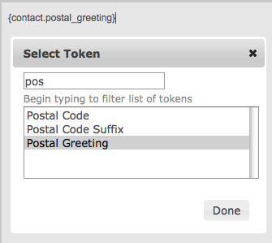

# Postal mail communications

This chapter discusses the different ways that CiviCRM helps with postal
mail and postal mail campaigns. It will help if you already have a
strong understanding of CiviCRM's search features as well as custom
fields, activities, profiles, and how to perform mail merges using word
processing software.

## Planning Your Mailing

Before beginning any communication activity, take the time to identify
your goals and plan the steps. For our purposes, there are a few key
questions to ask before sending out postal mailings.

-   What types of mailing do you send out to your constituents?
-   Are mailings always sent to everyone in the database or are they
    frequently targeted to a select group of contacts?
-   How do you want to greet recipients (e.g. "Dear Jane" or "Dear Jane
    Doe")?

There are three ways you can use CiviCRM in postal mailings:

1.  Generate labels: print out standard address labels when you don't
    need to personalise the content, for instance to send a printed
    brochure.
2.  Export contacts and do a mail merge to an external tool (such as OpenOffice or Microsoft Word). Refer to the chapter on [Exporting](exporting-your-contacts.md) earlier in this section for detailed exporting instructions. 
3.  Use CiviCRM's [Print/merge document](#print-merge-document) function to do the merge directly in
    CiviCRM (see below for details).

Many nonprofit organisations in the USA need to sort recipients of a
mailing based on zip code for bulk mailing purposes. If this is true for
your organisation, it is recommended that you create your mailing labels
using a word processor where you can control the sort order, rather than
in CiviCRM. You can reuse the same spreadsheet for your mail merge.

## Greetings and salutations

You can set a specific postal greeting format for each contact. There
are several options from the friendly "Dear John", to more formal "Dear
Mr. John Doe". You can also enter a *customized greeting* ("Your royal
highness"). Postal greetings can be edited in the Communications
Preferences section of the contact edit form. If you need to set or
reset postal greetings en mass, refer to the chapter on [Scheduled Jobs../initial-set-up/scheduled-jobs.md) and to the documentation on the wiki at:

[http://wiki.civicrm.org/confluence/display/CRMDOC/Update+Greetings+and+Address+Data+for+Contacts](http://wiki.civicrm.org/confluence/display/CRMDOC/Update+Greetings+and+Address+Data+for+Contacts)

## Print/merge document {:#print-merge-document}

CiviCRM provides tools to create merge letters directly from the interface. You can insert tokens representing fields in the database into your letter, optionally save as a template, and output to PDF, HTML, Word (.docx), or Open Document (.odt) format. 

To create the letter:

1.  Conduct a search (for example **Search > Find Contacts, Find Contacts > Advanced
    Search, or a Custom Search**. If you want to print letters for members of a Group, go
    to **Contacts > Manage Groups** and click "Contacts" next to the
    Group you want.
2.  Enter your search criteria and click **Search** (not applicable if using
    a Group).
3.  Select the contacts who will receive the letter.
4.  From the Actions dropdown menu, choose **Print/merge document.**
5.  Optionally select a template to use as the basis for your letter. You may also optionally associate the letter with a Campaign.
6.  Review the selections under Page Format and make any desired
    adjustments. This is where you set your paper size, margins, and
    page orientation. 
7.  Enter your text and make formatting adjustments in the WYSIWYG
    editor. You can also insert image files such as your organisation's
    logo or a signature. Click in the body of the letter where you want
    the image to appear and click the Image icon. 
8.  You can personalise the letter by using [tokens](tokens-and-mail-merge.md). Tokens are placeholders that will be replaced with the field value for each of the contacts selected. For example, Postal
    Greeting is a commonly used token in this situation. Click in the
    body of the letter where you want to enter the token. Then click on
    **Insert Tokens** dropdown located above the letter at the top right and select
    the desired token.

    

9.  Decide if this letter will be re-used in the future and should be saved as a new template. If the letter was based on a template you will have the option to update the existing template. The ability to save the letter as a template is a powerful way to streamline future workflows.
10. Select your desired output format. CiviCRM currently supports four format options: PDF, HTML, MS Word (`.docx`), and Open Document (`.odt`). Depending on how complex your letter content is, you may find that some formats handle the layout and design better than others.
11. Click **Download Document** to generate the letter(s). Depending on your browser configuration, a pop-up may open asking where you would like to save the file, or you may be prompted to open the file immediately. After the file download completes, review it to make sure it is formatted as desired. The window will remain open, allowing you to make follow-up adjustments to the letter content and regenerate it.

Tips:

* You can use the Print/merge document feature for other documents besides letters. For
example, you could use it to print attendance certificates for a
workshop.

* Generating a large number of letters can be resource intensive, particularly when using the PDF option. If you find this happening, consider implementing the wkhtmltopdf alternate PDF generation tool, which scales to higher volumes better than the default tool. Visit **Administer > Misc > Path to wkhtmltopdf executable** for details on how to implement that tool.

* The Print/merge document action is also available from the Actions dropdown in a contact record, and can be used for contributions by selecting the **Thank you letters** search result action after using **Find Contributions**.

## Generate mailing labels

Generating mailing labels is a very easy and useful function.

1.  Perform the search to select the contacts you want to target.
2.  Choose **Mailing Labels** from the **Actions** dropdown menu and
    click Go.
3.  Select the mailing label style
4.  Determine if you want to exclude people with "do not mail" checked
    in their privacy options (checked by default and recommended), and
    whether you want to merge any records with the same mailing address
    into one label.

This last option is very useful when sending a mailing to a households
or organisations where you don't want them to receive duplicate
mailings. When the records are merged, each name at that address is
listed on a separate line on the label.

Your system administrator can configure the fields included in mailing
labels. Read the information on configuring address settings in the
Contacts chapter to learn more about the options.
