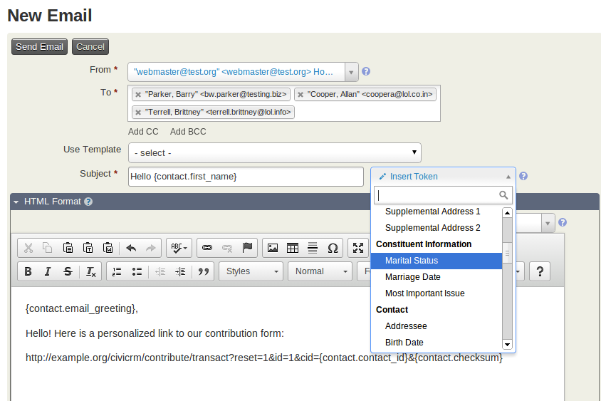

# Tokens and mail merge

## Overview

You can use data in your CiviCRM database to set up mail merged communications both for emails and printed materials such as letters and mailing labels. The mail merging functionality relies on "tokens", which represent fields in your database. For example, use the Postal Greeting token to include a customized greeting for each recipient in your PDF letters. Most contact fields, including custom fields you've created, are available as mail merge tokens.

## Basic contact data tokens {:#contact-data}

If you want each email to address the person by first name after "Dear,"
you would type a space and then click on **Insert Tokens** at the top
right of the HTML Format field.



The popup that appears enables you to
find the appropriate token by typing "First name" in the box and choose
the token that corresponds. Click Close and you will see that your
message now reads "Dear {firstname}." When the email is sent, the
appropriate first name will be inserted into each message. Browse the
Inset Tokens pop-up for a complete list of contact data tokens,
including any of the custom fields that have been created for your site.

## Organizational tokens {:#organization}

In addition to basic contact data, 
you can also insert standard organization information, such as "Domain
(organizational) address," which displays the address of your
organization as defined at **Administer > Communications >
Organization Address and Contact Info**.

## Special tokens available for emails {:#email}

Some additional tokens are available for use in emails.

!!! note
    In the HTML format editing area, tokens that generate URLs (links) need to be placed in the URL field of the Link creation screen. Otherwise, they will display as text and not a clickable link in the email client of the recipient.

### Action tokens {:#actions}

You can also insert action tokens, such as opt-out, unsubscribe and
forwarding tokens. These tokens insert links to take the specified
action; in order to display the links properly in HTML messages, you'll
need to add the proper link tags using the Source icon in the editor.

### Required opt-out tokens for mass emails {:#opt-out}

You are required to include a token for either opt-out OR
unsubscribe, as well as the organizational (domain) address token in
every CiviMail mailing. These can be placed directly in the body of your
mailing body, or you can put them in the mailing header or footer. If
your organization has developed a standard mailing footer, just include
these tokens in the footer so that folks don't have to think about them
each time they create a new mailing.

In general, including click-able unsubscribe and opt-out links are a bit
friendlier for recipients (as opposed to the reply-to via email method).
You can also provide both options.

Additionally, some tokens are only available for mass mailings, such as the
token to provide a link to a message stored online.

### Checksum tokens {:#checksum}

A particularly useful token is the checksum. The checksum allows you to
give people links to contribution forms, profiles, petitions, and event
registration forms that are pre-filled with information that is already
in their contact record. This saves your constituents the hassle of filling out forms and
increases the chances they will take action (e.g., donate, sign up for
an event, sign the petition). It can also be a simple way to keep your
data current by asking people to review and update their contact
information.

!!! caution
    For security purposes, checksum links only last for seven days, starting from the time the email is sent. To change this duration, go to **Administer > System Settings > Misc (Undelete, PDFs, Limits, Logging, Captcha, etc.)**.

!!! note
    Checksum URLs will not be tracked within CiviMail URL tracking as they are personalised to the recipient.

Create a link in the CiviMail message that includes the checksum token `{contact.checksum}`. When people click on the special link, CiviCRM looks them up in the database and prefills any information on the contribution form or profile with any data that exists in their record.

**Checksum for Contribution Pages**: To send people to a contribution page use this path where `IDNUMBER` is the ID of your contribution page:

-   Drupal: `http://example.org/civicrm/contribute/transact?reset=1&id=IDNUMBER&{contact.checksum}&cid={contact.contact_id}`
-   Joomla!: `http://example.org/index.php?option=com_civicrm&task=civicrm/contribute/transact&reset=1&id=IDNUMBER&{contact.checksum}&cid={contact.contact_id}`
-   WordPress: `http://example.org/?page=CiviCRM&q=civicrm/contribute/transact&reset=1&id=IDNUMBER&{contact.checksum}&cid={contact.contact_id}`

**Checksum for Contribution Pages for Membership Renewals**: To send people to a contribution page for membership renewals use this path where `IDNUMBER` is the ID of your contribution page. This is typically used in Scheduled Reminders for membership renewals, where  the `membership.id` will be evaluated to the membership to be renewed:

-   Drupal: `http://example.org/civicrm/contribute/transact?reset=1&id=IDNUMBER&{contact.checksum}&cid={contact.contact_id}&mid={membership.id}`
-   Joomla!: `http://example.org/index.php?option=com_civicrm&task=civicrm/contribute/transact&reset=1&id=IDNUMBER&{contact.checksum}&cid={contact.contact_id}&mid={membership.id}`
-   WordPress: `http://example.org/?page=CiviCRM&q=civicrm/contribute/transact&reset=1&id=IDNUMBER&{contact.checksum}&cid={contact.contact_id}&mid={membership.id}`

**Checksum for standard Profiles** (edit mode): To send people to a profile use this path where `IDNUMBER` is the ID of the Profile you want to send them to:

-   Drupal: `http://example.org/civicrm/profile/edit?reset=1&gid=IDNUMBER&{contact.checksum}&id={contact.contact_id}`
-   Joomla!: `http://example.org/index.php?option=com_civicrm&task=civicrm/profile/edit&reset=1&gid=IDNUMBER&{contact.checksum}&id={contact.contact_id}`
-   WordPress:`http://example.org/?page=CiviCRM&q=civicrm/profile/edit&reset=1&gid=IDNUMBER&{contact.checksum}&id={contact.contact_id}`

**Checksum for Event Registration Pages**: To send people to an event registration page use this path where `IDNUMBER` is the ID of your event:

-   Drupal: `http://example.org/civicrm/event/register?reset=1&id=IDNUMBER&{contact.checksum}&cid={contact.contact_id}`
-   Joomla!: `http://example.org/index.php?option=com_civicrm&task=civicrm/event/register&reset=1&id=IDNUMBER&{contact.checksum}&cid={contact.contact_id}`
-   WordPress: `http://example.org/?page=CiviCRM&q=civicrm/event/register&reset=1&id=IDNUMBER&{contact.checksum}&cid={contact.contact_id}`

**Checksum for Petition Signature Pages**: To send people to sign a Petition, use this path where `IDNUMBER` is the ID of your petition:

-   Drupal: `http://example.org/civicrm/petition/sign?reset=1&sid=IDNUMBER&{contact.checksum}&cid={contact.contact_id}`
-   Joomla!: `http://example.org/index.php?option=com_civicrm&task=civicrm/petition/sign&reset=1&sid=IDNUMBER&{contact.checksum}&cid={contact.contact_id}`
-   WordPress: `http://example.org/?page=CiviCRM&q=civicrm/petition/sign&sid=IDNUMBER&reset=1&{contact.checksum}&cid={contact.contact_id}`

**Checksum for mail 'view in browser' links**: In CiviMail you can use a special link to allow contacts to view the email content in their browser, including the content personalised with tokens.

-   Drupal: `http://example.org/civicrm/mailing/view?reset=1&id={mailing.key}&cid={contact.contact_id}&{contact.checksum}`
-   Joomla!: `http://example.org/index.php?option=com_civicrm&task=civicrm/mailing/view&id={mailing.key}&{contact.checksum}&cid={contact.contact_id}`
-   WordPress: `http://example.org/?page=CiviCRM&q=civicrm/mailing/view&id={mailing.key}&{contact.checksum}&cid={contact.contact_id}`

## Custom tokens {:#custom}

Developers can create custom tokens which can, for example, display the total amount of contributions from a contact. See the Developer Guide for more info about [custom tokens](https://docs.civicrm.org/dev/en/latest/framework/civimail/#tokens). 

## Smarty in mail templates {:#smarty}

Mail templates use Smarty to include variables, tokens & functions. A more thorough tutorial can be found at [http://www.smarty.net/manual](http://www.smarty.net/manual).

!!! warning "System administrator required"
    For Smarty to work you must add (or modify) the following line to your `civicrm.settings.php` file located under `sites/default/` for Drupal and `administrator/components/com_civicrm` for Joomla.

    ```php
    define('CIVICRM_MAIL_SMARTY', 1);
    ```

Tips

* To make CiviCRM tokens available to Smarty functions, you'll need to use the `{capture}` function as follows:

    ```smarty
    {capture assign=first_name}{contact.first_name}{/capture}
    Dear {$first_name|default:Friend},
    {if $first_name}
      Hello, {$first_name}, how are you?
    {/if}
    ```

* You also need to use `{capture}` for custom fields. For example, if `{contact.custom_16}` is a Yes/No field designating a membership as a gift, and `{contact.custom_17}` is a text field with the name of the gift giver, then the following will print a line to that effect in a PDF letter:

    ```smarty
    {capture assign=gift}{contact.custom_16}{/capture}
    
    {if $gift == Yes}
      This membership is a gift from {contact.custom_17}.
    {/if}
    ```

* Another possibility is to create if/then logic for your mail
merge. This is done using the smarty template language as described here
[http://www.smarty.net/docs/en/language.function.if.tpl](http://www.smarty.net/docs/en/language.function.if.tpl).


## Available tokens

This section documents the available action tokens, their purpose and the place(s) they can be used.

### `{action.forward}`
* Purpose: Provides a link for each recipient to forward the mailing to others.
* Used in: Mailing Body, Header, Footer
* Example:

    > To forward this mailing to friends or colleagues, click `<a href="{action.forward}" >here</a>`.

### `{action.optOutUrl}`
* Purpose: Provides an opt-out link for each recipient.
* Used in: Mailing Body, Header, Footer,unsubscribe,resubscribe
* Example:

    > You can also `<a href="{action.optOutUrl}" >opt-out of all future mailings from us</a>`.

### `{action.optOut}`
* Purpose: Provides an opt-out email address for each recipient.
* Used in: Mailing Body, Header, Footer,unsubscribe,resubscribe
* Example:

    > To opt-out of all mailings from us, send mail to {action.optOut}

### `{action.reply}`
* Purpose: Provides a reply-to email address for each recipient
* Used in: Mailing Body, Header, Footer,unsubscribe,resubscribe
* Example:

    > To reply to this mailing, send mail to {action.reply}

### `{action.resubscribeUrl}`
* Purpose: Provides a re-subscribe link for each recipient
* Used in: Mailing Body, Header, Footer,unsubscribe,resubscribe
* Example:

    > You may `<a href="{action.resubscribeUrl}" >resubscribe to this mailing</a>` at any time.

### `{action.resubscribe}`
* Purpose: Provides a re-subscribe email address for each recipient.
* Used in: Mailing Body, Header, Footer,unsubscribe,resubscribe
* Example:

    > To resubscribe to this mailing, send mail to {action.resubscribe}

### `{action.subscribe.gid}`
* Purpose: Provides an email address to subscribe to a specific group.
* Used in: Mailing Body, Header, Footer
* Example:

    > To subscribe to our Monthly Newsletter, send mail to {action.subscribe}.

### `{action.subscribeUrl.gid}`
* Purpose: Provides a link to subscribe to a specific group (gid = CiviCRM ID of that group).
* Used in: Mailing Body, Header, Footer
* Example:

    > You can `<a href="{action.subscribeUrl.2}" >subscribe to our Monthly Newsletter</a>`.

### `{action.subscribeUrl}`
* Purpose: Provides a link to view and subscribe to any public mailing lists.
* Used in: Mailing Body, Header, Footer
* Example:

    > If you're interested, `<a href="{action.subscribeUrl}" >view all our mailing lists and sign up!</a>`.

### `{action.unsubscribeUrl}`
* Purpose: Provides an unsubscribe link for each recipient.
* Used in: Mailing Body, Header, Footer,unsubscribe,resubscribe
* Example:

    > You can `<a href="{action.unsubscribeUrl}" >unsubscribe from this mailing</a>` at any time.

### `{action.unsubscribe}`
* Purpose: Provides an unsubscribe email address for each recipient
* Used in: Mailing Body, Header, Footer,unsubscribe,resubscribe
* Example:

    > To unsubscribe from this mailing, send mail to {action.unsubscribe}

### `{contact.custom_nn}`
* Purpose: Displays content of custom contact field nn
* Used in: Mailing Body, Subject, not sure about elsewhere
* Example:

    > Thanks for indicating your interest in {contact.`custom_1`}. We will keep you updated on that topic.

### `{contribution.custom_nn}`
* Purpose: Displays content of custom field nn for the contribution
* Used in: Mailing Body, Subject, not sure about elsewhere
* Example:

    > Thanks for indicating that if your first choice for where we should use your contribution is {contribution.`custom_42`}.|

### `{domain.address}`
* Purpose: Displays postal address for your domain.
* Used in: Mailing Body or any message templates
* Example:

    > Mailing Address:  {domain.address}

### `{domain.email}`
* Purpose: Displays email address of domain.
* Used in: Mailing Body or any message templates
* Example:

     > Or send a mail to {domain.email}.

### `{domain.name}`
* Purpose: Displays your domain name.
* Used in: Mailing Body or any message templates
* Example:

    > This mailing is from {domain.name}.

### `{domain.phone}`
* Purpose: Displays phone number of domain.
* Used in: Mailing Body or any message templates
* Example:

    > To contact us call {domain.phone}.

### `{mailing.group}`
* Purpose: Displays a listing of the names of the groups to which a mailing has been sent.
* Used in: Mailing Body, Header, Footer,resubscribe,unsubscribe or optout
* Example:

    > This mailing has been sent to the members of {mailing.group}.

### `{mailing.name}`
* Purpose: Displays name of mailing.
* Used in: Mailing Body, Header, Footer,resubscribe,unsubscribe or optout
* Example:

    > Name of this mailing is {mailing.name}.

### `{mailing.viewUrl}`
* Purpose: Will create a 'View in Browser' url
* Used in: Mailing Body 
* Example:

    > Can't see this email? `<a href="{mailing.viewUrl}"><strong>View in Browser</strong></a>`

### `{resubscribe.group}`
* Purpose: Displays group name in re-subscribe messages.
* Used in: Resubscribe Message
* Example:

    > As requested, you have been resubscribed to {resubscribe.group}.

### `{subscribe.group}`
* Purpose: Displays group name in subscription confirmation requests.
* Used in: Subscription confirmation request
* Example:

    > You requested to be subscribed to the {subscribe.group}.

### `{unsubscribe.group}`
* Purpose: Displays group name in unsubscribe confirmation messages.
* Used in: Unsubscribe Message
* Example:

    > You have been unsubscribed from {unsubscribe.group}.

### `{welcome.group}`
* Purpose: Displays the newly joined group name in a welcome messages.
* Used in: Welcome message
* Example:

    > Welcome to {welcome.group}.
