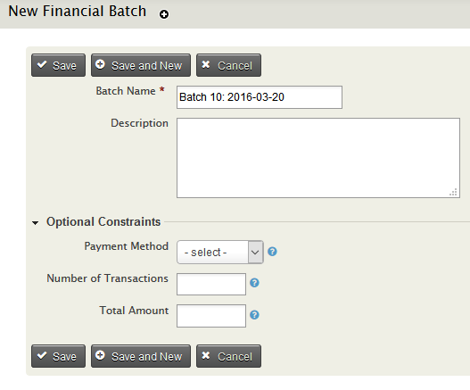
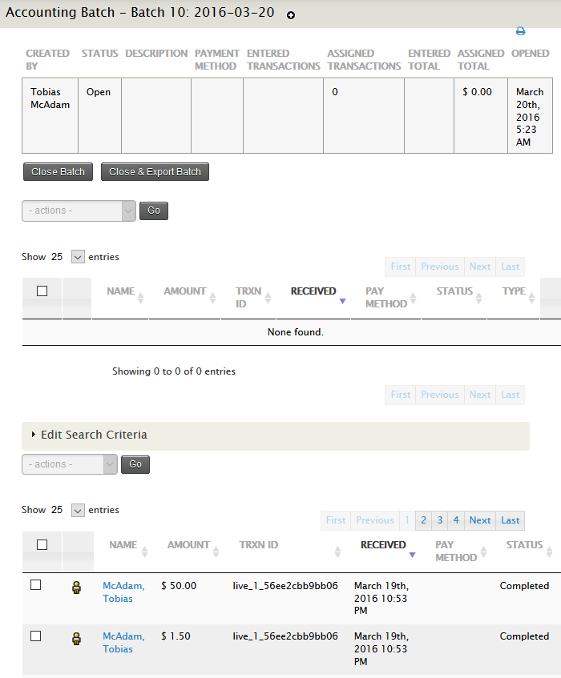

# Accounting Integration

The accounting integration feature allows you to export all the double-entry
financial transactions for a batch of contributions so that you can import
them into your accounting software. You can create a new accounting batch then
assign existing contributions to it, or re-use a batch created during
batch data entry as an accounting batch.

## Use a batch created through Batch Data Entry

Batch entry of transactions is covered in [Manual Entry of Contributions](../contributions/manual-entry-of-contributions)

After you validate and close a batch, it will appear in the accounting batch
listing with a status of Closed.

## Create a New Batch from Existing Transactions

### Create the batch

Go to **Contributions > Accounting Batches** and select **New Batch.**
This opens the batch creation screen where you define the batch parameters

-  Enter the batch name (required). CiviCRM will create a default batch
name ("Batch N" + open date), which you can edit.
-  You may optionally enter a description of the batch.
-  If you want this batch to contain only transactions paid by a specific
Payment Instrument, select it from the drop down: Credit Card, Debit
Card, Check, Cash, or EFT, or any custom Payment Instruments you may
have set up.
-  If you know in advance the number of transactions that will be in the
batch, enter it in Number of Transactions. When you close the batch,
CiviCRM will verify that you have entered the correct number. (You will
have the opportunity to override the warning if they do not match.)
-  If you know in advance the total amount of the transactions that will be
in the batch, enter it in Total Amount. When you close your batch,
CiviCRM will verify the totals entered match this number. (You will have
the opportunity to override the warning if they do not match.)
- **Save**

You can later return to edit these parameters as long as the batch
remains open.

### Assign Transactions to a Batch

After creating a new accounting batch or opening an one you will be on the transaction assignment screen.

At the top of the screen the defined parameters of the batch are displayed:

-   created by
-   status (open, closed, or exported)
-   the description entered when the batch was created
-   the specified payment instrument
-   the number of entered transactions
-   the number of assigned transactions
-   the entered total amount of the transactions
-   the assigned total amount (which will update as you assign
    transactions to the batch)
-   the date the batch was opened.

Below that is a list of transactions assigned to the batch. This will be
empty until you assign transactions to the batch. There is also an
action dropdown selection that will not be available until transactions
are assigned to the batch.

Next comes the **Edit Search Criteria** accordion. Click to open the search pane.
If a Payment Instrument was selected when the batch was created, this option
will be selected by default. Specify the criteria for the contributions
you want to add to the batch.

At the bottom of the page is the search results list. You may assign a single
transaction to the batch by clicking "Assign" at the end of the result row. Or
you may select multiple transactions and use the action menu above the results
to select "Assign to Batch." The transactions will be added to the
assigned transaction list, and will be removed from the search results
list.

### View and Remove Assigned Transactions

Once you have assigned transactions to the batch, they will appear in
the assigned transactions list in the middle of the page. If you need to
remove transactions from the batch, select "Remove" at the end of a row
of an individual transaction, or select multiple transactions and use
the action menu above the list to select "Remove from Batch."

You will also see changes to the parameters table at the top of the
page, reflecting the new number and total amount of assigned
transactions.

If you want to return and edit the batch later, simply return to the
Accounting Batch main page. The batch status will remain "Open."

## Close and Export a Completed Batch

Once you have completed assigning the transactions, you may close the
batch, or close and export it.

If you attempt to close the batch and your assigned number of
transactions does not match the entered number of transactions, or if
the assigned total transaction amount does not match the entered total
amount, a "Mismatch" error message will appear. You may close the error
message and return to the batch to correct the mismatch, or you may
click "OK" to override the error; the entered transaction number and
total amount will update to match the assigned transaction number and
total amount, and the batch will be closed.

If you close the batch without exporting it, the batch status will
change to Closed. You may re-open the batch later, before exporting it,
or you may export the transactions later.

If you close and export the batch, you may choose your export format.
CSV will produce a spreadsheet of comma-separated values. IIF will
produce a file in Intuit Interchange Format, which is used by Intuit
products such as Quickbooks to import transactions. Once the
transactions are exported, the batch status changes to Exported. An
exported batch cannot be re-opened.

## Searching and Acting on Batches

Go to **Contributions > Accounting Batches** and select **Open Batches** to go
to the Accounting Batch main page. Here you may filter the list of
displayed batches by status (Open, Closed, or Exported); batch name; the
user who created it; the Payment Instrument; the entered number of
transactions; and the entered total amount.

If a batch has the status Open, select "Transactions" to assign or
remove transactions, or select "Edit" to edit the batch parameters.
Under "more" you can choose to close, export, or delete the batch.

If a batch has the status Closed, select "Transactions" to view the
assigned transactions, or select "Export" to export the assigned
transactions to a CSV or IFF export file. Under "more" you can choose to
re-open or delete the batch.

If a batch has the status Exported, select "Transactions" to view the
transactions assigned to the batch; select "Download" to export the CSV
or IIF file of assigned transactions; or select "Delete" to delete the
batch. Once a batch is exported it cannot be re-opened.

From the search results page, you may also take action on more than one
batch. Select all the batches to be updated, and choose an option from
the action dropdown menu: Re-open, Close, Export, or Delete.

## Finding Transactions by Batch

From the Advanced Search Contribution pane, or from Find Contributions,
you can search by Batch Name. Select a batch and the results will return
all transactions stored in the batch.
