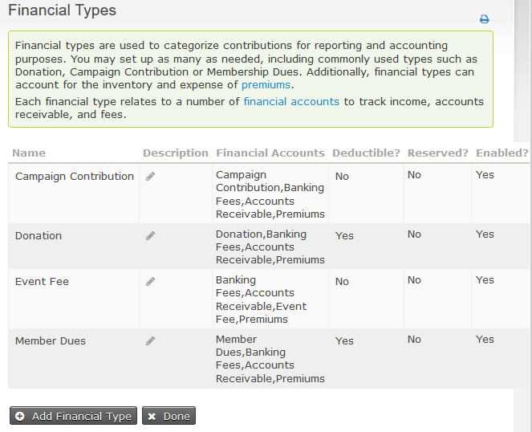

# Key concepts and configurations

This section explains the key concepts underpinning CiviContribute and outlines the high-level configuration needed for its use.

Before you begin it is helpful to list out the types of contributions your organisation receives (or wants to receive), and identify which of those you want to track using CiviCRM.

## Data needs and fields

CiviContribute has a set of predefined fields to track contribution
information. If you need to track more information about contributions,
you can do this by defining new custom data fields. Custom data might be
useful to further categorize your contributions or track additional
information.

Write down all the information you want to track about your
contributions, including reports (described later in this chapter), then
compare your data needs to CiviCRM's predefined fields. An easy way to
do this is to look at the screen for adding a new contribution. A lot
of useful functionality is built in to the core contribution fields so
there's no point in duplicating them with custom fields, but your
organisation may have specific needs that require custom fields.

If you do need to create custom fields to meet your needs, read [Creating Custom Fields](../organising-your-data/creating-custom-fields).

## Financial types, financial accounts and accounting codes

Financial types are used to categorize contributions for reporting and
accounting purposes. The standard financial types included with CiviCRM are
event fee, member dues, donation and campaign contribution but you can set up
as many financial types as you need. (In versions of CiviCRM prior to 4.3
financial types were known as contribution types.)

Each financial type is linked to a number of financial accounts that can track
income, accounts receivable, fees, cost of sales and liabilities as required.
As with financial types, the list of preconfigured financial
accounts will suit the needs of many organizations but it can also be customized
if your organization requires changes or additions.

To aid integration with your accounting software, you can assign an
accounting code to each financial account. This code is included when you
export contributions for import into your accounting package.

Setting up financial types and financial accounts is best done in consultation
with your organization's bookkeeper or accountant. Be careful when editing core
financial types because CiviCRM has useful built-in functionality that depends
on the core financial types and associated accounts.

### Financial Types

The need for a new financial type is usually driven by the need to break
contributions received down into more than just the standard CiviCRM financial
accounts of Campaign Contribution, Donation, Event Fee and Member Dues.
However, although the need for the new financial type is driven by the need
for the new financial account, you create the financial type first giving it
the name of the relevant account in your organisation's Chart of Accounts.

When you create a Financial Type of a specific name, CiviCRM automatically
creates a similarly named Revenue (Income) Financial Account and assigns it and
the default accounts for Accounts Receivable and a few other account types to
the new financial type. You can edit the financial accounts allocated to your
financial type as needed.  The aim behind this two step process is to simplify
the common use case, but provide flexibility for more sophisticated
setups.

Navigate to **Administer > CiviContribute > Financial Types**, where you can
create a new financial type by clicking **Add Financial Type**. Alternatively
you can edit an existing one.

### Financial Accounts

At **Administer > CiviContribute > Financial Accounts**, you can edit your
financial accounts.

The only required fields for a financial account are Name and Financial Account
Type.  You can edit the account name to, say, append the account code to it if
that would be useful for printed reports.

How many of the other fields you fill in will be determined by the needs of
your accounting software package and your workflow. Many accounting software
options require the accounting code to match exactly, so be careful to avoid
extra spaces.

## **Payment processors**

CiviCRM provides you with the ability to take payments online on your
website. You can take payments for a variety of reasons including
fundraising campaigns, membership dues and event attendance.

To start taking payments online you need to [configure a payment processor](../contributions/payment-processors)
which will connect your website to the credit card and banking
infrastructure that actually processes the payment.

## **Payment Methods**

Navigate to **Administer > CiviContribute > Payment Methods** to
edit existing options that can be used for contributions or to add a new
option through **Add Payment Methods**. The common options - credit
card, cash, check, debit card, and EFT - are installed by default.

## **Accepted Credit Cards**

Navigate to **Administer > CiviContribute > Accepted Credit Cards** to
edit existing acceptable credit cards or define a new option through
**Add Accepted Credit Card**.

Note: If billing information is collected on the payment processor's website
then you will need to configure accepted credit cards/payment methods on that
site.
