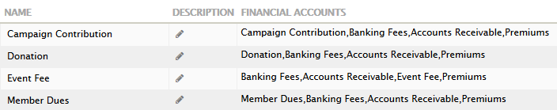
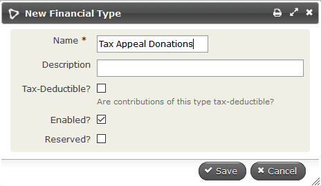
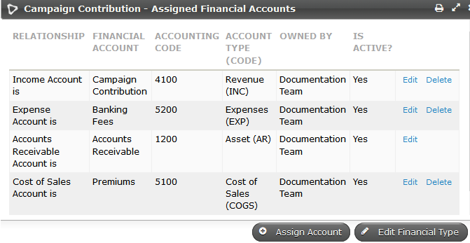
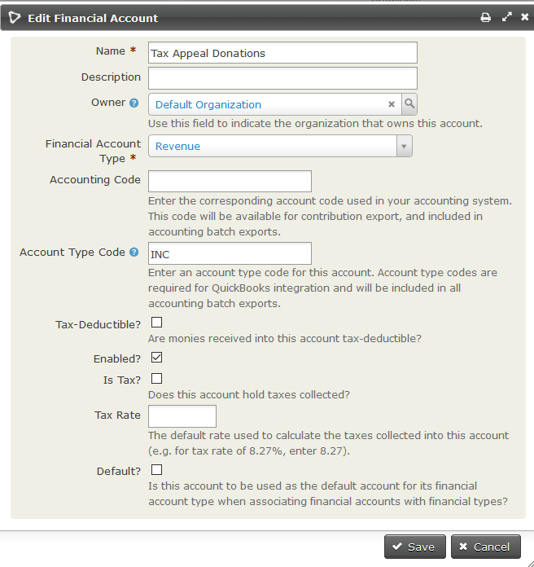

# Key concepts and configurations

This section explains the key concepts underpinning CiviContribute and outlines
the high-level configuration needed for its use.

Before you begin it is helpful to list out the types of contributions your
organisation receives (or wants to receive), and identify which of those you
want to track using CiviCRM.

## Financial types, financial accounts and accounting codes

Organisations that use CiviCRM have differing needs in terms of financial
reporting.  Some just want to know the total donation or membership income
recorded in CiviCRM whereas others want to be able to export a full set of
double-entry financial transactions to import into their accounting software.

CiviCRM caters for both those groups by using **Financial types** to hide the
complexity of double-entry bookkeeping from everyone who doesn't need to know
about it, whilst still recording those transactions for organisations that do
need them.

Each **financial type** is linked to a number of **financial accounts** that
can track income, assets, fees and premiums (if applicable) as
required as shown for the four default financial types in the following image.

The **financial accounts** should be based on your organisation's
Chart of Accounts. In CiviCRM each contribution must be assigned a financial type.
When the contribution is saved the appropriate debits and credits are
automatically recorded for the financial accounts linked to that financial type.
(If you are using
price sets, each option in the price set could be linked to a different
financial type and CiviCRM will still record the appropriate debits and
credits for all linked financial accounts.)  

You should consult with your organization's bookkeeper or accountant before
setting up new or modifying the existing the financial types and financial
accounts.

### Financial Types

The standard financial types included with CiviCRM are event fee, member dues,
donation and campaign contribution  as shown in the image above, but you can
modify these existing accounts or set up new financial types to suit your needs.

Generally you will need one financial type for each type of income (revenue)
you receive in CiviCRM and track in your accounts. So if you report on tax
appeal donations, festive appeal donations and recurring donations separately
then having only one "Donation" financial type in CiviCRM will not work, you
will need one financial type called "Tax Appeal", another called "Festive
Appeal" and yet another called "Recurring donations".

To create a new financial type navigate to **Administer > CiviContribute >
Financial Types**,  and click on **Add Financial Type**

When you create a Financial Type of a specific name, CiviCRM automatically
creates a similarly named revenue (income) account and assigns it and
the default accounts for asset, expenses and cost of sales to the new financial
type. If you need to edit the accounts allocated to a financial type,
you can do so by clicking on **Accounts** to the right of the appropriate
financial type on **Administer > CiviContribute > Financial Types**.
The aim behind this two step process is to
simplify the common use case where an organisation has only one each of
Deposit Bank Account, Accounts Receivable and Accounts Payable, but provide
flexibility for more sophisticated setups.

### Financial Accounts

As with financial types, the list of preconfigured financial accounts will
suit the needs of many organisations but it can also be customized if your
organisation requires changes or additions. (Remember, each new financial type
will add a new revenue account with the same name.)

You edit financial accounts at **Administer > CiviContribute > Financial Accounts**.

The only required fields are Name and Financial Account Type. For revenue
accounts these are set when you create the financial type.

How many of the other fields you fill in will be determined by your workflow.
If you plan to export financial transactions from CiviCRM to import into your
accounting software package you will need the accounting code (without
extra or missing spaces).  If you are using Quickbooks you will also need the
account type code.

NOTE: Changing the financial account name will also change the financial type name.

## **Payment processors**

CiviCRM provides you with the ability to take payments online on your
website. You can take payments for a variety of reasons including
fundraising campaigns, membership dues and event attendance.

To start taking payments online you need to [configure a payment processor](../contributions/payment-processors)
which will connect your website to the credit card and banking
infrastructure that actually processes the payment.

## **Payment Methods**

Navigate to **Administer > CiviContribute > Payment Methods** to
edit existing options that can be used for contributions or to add a new
option through **Add Payment Methods**. The common options - credit
card, cash, check, debit card, and EFT - are installed by default. You should
get your accountant or bookkeeper to confirm that each payment method is linked
to the correct Asset account.

## **Accepted Credit Cards**

Navigate to **Administer > CiviContribute > Accepted Credit Cards** to
edit existing acceptable credit cards or define a new option through
**Add Accepted Credit Card**.

Note: If billing information is collected on the payment processor's website
then you will need to configure accepted credit cards/payment methods on that
site.

## Data needs and fields

CiviContribute has a set of predefined fields to track contribution
information. If you need to track more information about contributions,
you can do this by defining new custom data fields. Custom data might be
useful to further categorize your contributions or track additional
information.

Write down all the information you want to track about your
contributions, including reports (described later in this chapter), then
compare your data needs to CiviCRM's predefined fields. An easy way to
do this is to look at the screen for adding a new contribution. A lot
of useful functionality is built in to the core contribution fields so
there's no point in duplicating them with custom fields, but your
organisation may have specific needs that require custom fields.

If you do need to create custom fields to meet your needs, read [Creating Custom Fields](../organising-your-data/creating-custom-fields).
