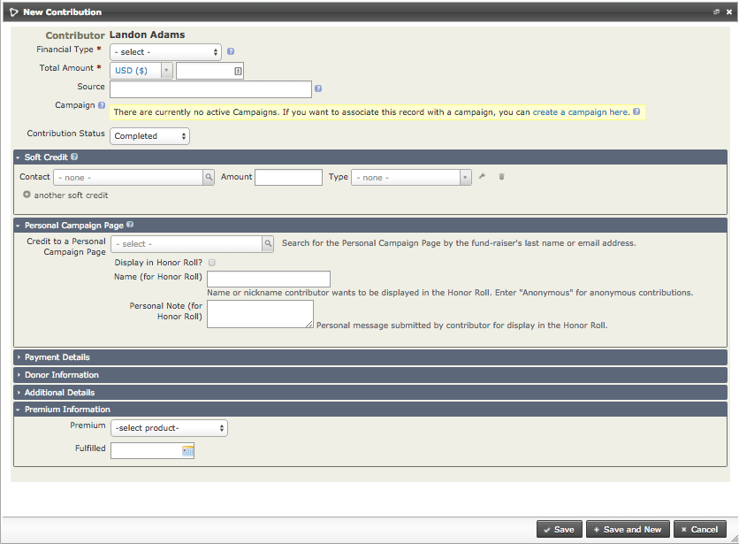
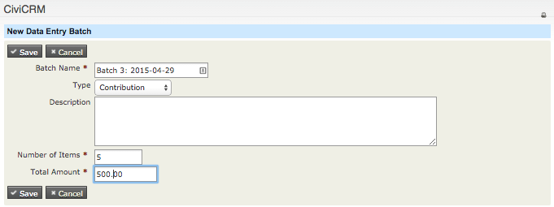
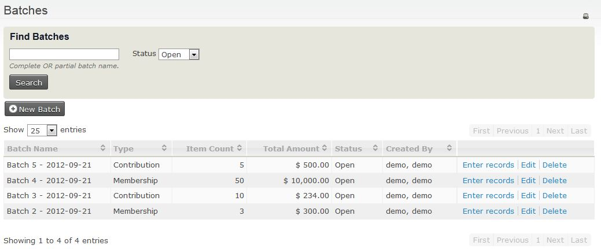
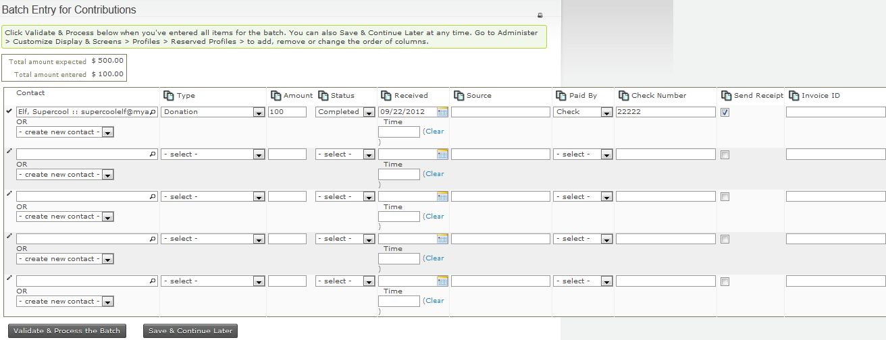
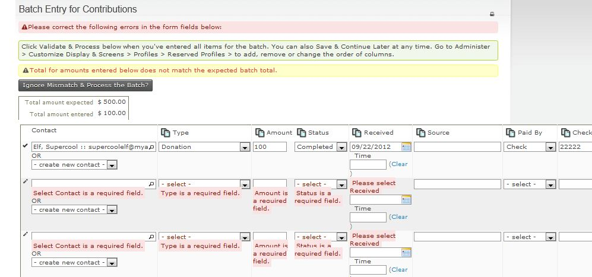
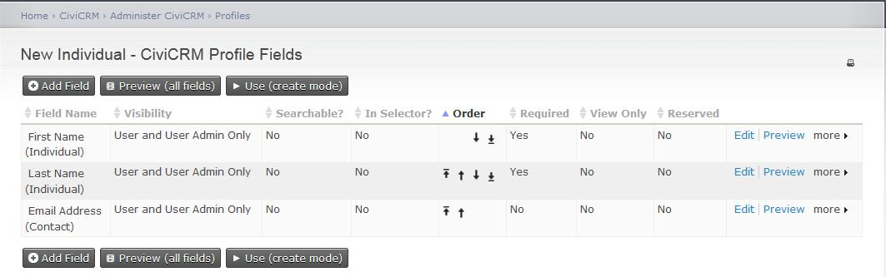
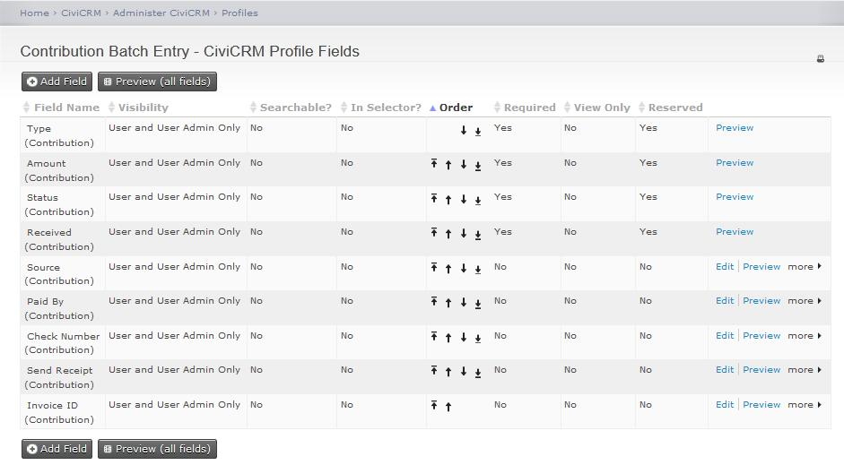
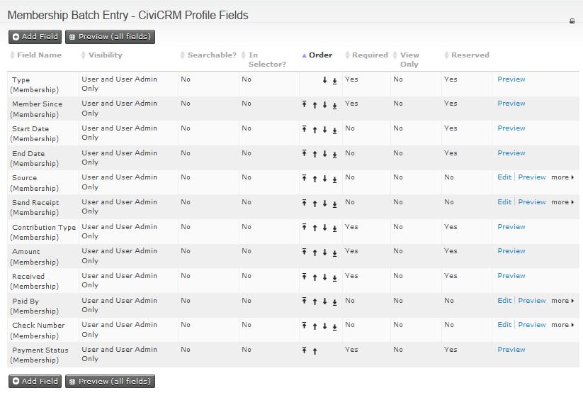

# Manual entry of contributions

When your organisation receives a contribution from a contact, you can
add it to their record. This will be done automatically if the payment
is made through CiviCRM (for example, a membership or event fee made
with an online registration) but offline payments (cash, cheques etc) will need
to be manually recorded to ensure that reports generated from CiviCRM are
accurate.

## Adding contributions manually one by one

If the donor does not already exist in the database, you need to first
create a new contact record for them; see [Contacts](../organising-your-data/contacts.md)
for information on how to do this. Once the record is created, you can then
enter the contribution.

To manually enter a contribution for a contact in your database:

1. Find the contact's record using one of the contact search tools, for
  example **Search > Find Contacts**.
2. Select the contact's **Contributions** tab.
3. Click **Record Contribution (Check, Cash, EFT...)**. Alternatively,
  if you have set up a payment processor that allows credit card
  transactions directly on your site, you may select the **Submit
  Credit Card Contribution** option and process the payment
  immediately.
4. Complete the new contribution form. The following screenshot shows
  the offline contribution (i.e. contributions via check, cash, EFT,
  etc.) form. If you selected to record a credit card contribution,
  the credit card form is almost identical except for the
  payment-related
  fields.

5. Record the Financial Type, amount, received date (the default is the
  current day), receipt date (shown on the receipt generated by the
  system), and status (the default is Completed). Any custom fields
  for contributions will also appear on this form.
6. The **Soft Credit To** field works with personal campaign pages
  (PCPs) that harness your contacts' help for campaigns. When you
  enter a donation manually on the contribution form for the
  contributor, you can assign a soft credit to the owner of the PCP.
  There is more information about PCPs and campaign fundraising pages
  in the Set-up chapter of the CiviContribute section.
7. The **Additional Details** section near the bottom of the screen
  offers other options including adding a note about the contribution
  and entering the date when a thank-you letter was sent.
8. The last two sections allow you to enter whether the contribution
  was in honor of someone else (**Honoree Information**) and whether
  there is a premium associated with the contribution (**Premium
  Information**).
9. Click **Save**, or **Save and New** if you are entering further
  contributions.

If you find that you are entering more than a few contributions at the
same time, consider using the **Batch Data Entry** method.

## Batch entry of contribution, membership or pledge payments

The **Batch Data Entry** feature allows you to enter off-line contribution,
membership or pledge payments you have received using a batch entry grid input
screen where you can use the ‘autocopy’ icons at the top of each column to
quickly fill in field values. It eases data entry when you have a lot of
payments to record at one time. It also lets you verify the total
amount and count of items in the batch against the payments recorded on
your deposit slip(s).

Each batch contains either contribution payments or membership payments or
pledge payments. During the batch data entry you can create new contacts
on the fly. You can save the batch and return later to continue
entering payments. If you have the appropriate permissions, you can
also edit the total amount and count of items in the definition of the
batch if needed.

Here’s a simple workflow for bulk data entry:

1. Create a new batch for data entry.
2. Enter Contribution, Membership or Pledge Payments (check, cash, EFT, etc.).
3. Validate and Process the Batch Totals or Save the Batch.

The details for each step are listed below.

### 1. Create a new batch for data entry

Create a new batch to hold the multiple payments you want to record:

From the menu, click on **Contributions > Batch Data Entry** or
**Membership > Batch Data Entry**.

Enter the following information:

-   **Batch Name**: CiviCRM will create a default batch name ("Batch N" + open date), which you can edit (required field)
-   **Type**: select the type of payment, e.g. Contribution, Membership
    or Pledge Payment. This selects the appropriate reserved profile to
    view in the batch entry grid screen (Contribution Batch Entry
    profile, Membership Batch Entry profile or Pledge Payment Batch
    Entry profile)
-   **Status**: the default will be “Open”
-   **Number of items**: total of payment items in the batch (required
    field)
-   **Total amount**: total amount of all the payment items in the batch
    (required field)

!!! note
    Once a batch has a “closed status”, the batch will no longer be editable

You can edit or delete Batch information later on by going back to the
**Bulk Data Entry** screen, then clicking on **Edit** or **Delete** next to
the batch you want.

### 2. Enter Contribution, Membership or Pledge Payments (check, cash, EFT, etc.)

Once you enter information about the batch, you can begin entering
payments on each
line.

There are eight fields that appear for all batches:

-  **Contact**. In this column you can:
    -   Start entering the name of an existing contact and CiviCRM will
    return a list of potential contact names for you to select, OR
    -   Create a new contact by clicking the drop-down box for “-create new
    contact-“ and selecting the type of contact you want to create: **New
    Individual**, **New Organization**, or **New Household** and enter the
    information about the contact here.
    
    !!! note
        If contact information such as phone number or email address
        are included in the grid profile, those values will be populated for
        an existing contact and can be updated as needed.

-   **Financial Type**
-   **Amount**
-   **(Payment) Status**
-   **Received – Date and Time**
-   **Send Receipt:** check the box if you want to send a receipt via email
-   **Soft Credit**
-   **Soft Credit Type**

When batch entering contribution payments the additional fields in the
standard profile are:

-   **Source** : enter text that describes the source of the payment
-   **Paid by**: enter the type of payment vehicle, e.g. cash, check,
    EFT, etc.
-   **Check Number**: if paid by check
-   **Invoice ID**

When batch entering membership payments you can choose to add a new
membership or renew an existing membership. The extra fields in the
standard profile are:

-   **Type**: For a new membership you will select the organisation and
    type of membership. For the renewal you can change the membership
    type.
-   **Member Since:** When you open the batch entry form, this is
    populated with the current date If you choose to renew a membership
    it will change to display the start date for that membership. It can
    be edited as needed.
-   **Start Date**(reserved): This is blank. You only need to fill in
    this field if you want the start date to be other than the default.
-   **End Date(reserved)**: If this is left empty, CiviCRM will use the
    membership rules to set it to the correct date.
-   **Source**: Enter text that describes the source of the payment.
-   **Paid by**: Enter the type of payment vehicle, e.g. cash, check,
    EFT, etc.
-   **Check Number**: Enter if paid by check.
-   **Invoice ID**

When batch entering pledge payments you can assign the payment to any of
the pending pledges for that contact. If you have the appropriate
permissions, you can also alter the amount or schedule for the pledge
payment. (Click on **adjust payment amount** next to the **Amount**
field.)The extra fields in the standard profile are:

-   **Source**: enter text that describes the source of the payment
-   **Paid by**: enter the type of payment vehicle, e.g. cash, check,
    EFT, etc.
-   **Check Number**: if paid by check
-   **Invoice ID**

### 3. Validate and Process the Batch Totals or Save the Batch

You can enter all transactions for the batch in one session, or simply
save the batch and complete the data entry at a later time.

If you want to continue entering information into this batch at a later
time, click **Save & Continue Later**.

To find and add/edit more transactions into the batch later:

-   From the menu, click on **Contributions > Batch Data Entry** or
    click on **Membership > Batch Data Entry**, then click on**Enter
    Records** next to the batch you want

Then continue entering more transactions in the batch

Once you are finished entering payments into a batch, click **Validate &
Process the Batch**. The status of the batch will be set to
“**Closed**” and will available for searches and reporting later.

If the total amount or count of items do not match the values you
entered when you created the Batch, you will be alerted when closing if
the count or total don't match. In this case, you either:

-   You can override the entered count and total by clicking **Ignore
    Mismatch & Process the Batch?** button, in which case the batch
    values are updated to match the transactions in the batch, and then
    the status of the batch will be set to “**Closed**”, OR
-   You can continue entering or editing the payments for the batch,
    then **Validate & Process the Batch** again.

### Search for contribution, membership or pledge payments in verified and processed batches

You can search for contribution or membership payments in verified and
processed batches in a several ways:

-   From the menu, click on **Searches > Find Contributions** , enter
    criteria for the contributions, and under **Batch Name**, select the
    batch you want;
-   From the menu, click on **Searches > Advanced Search**, enter
    criteria about the contact, then open the Contributions area and
    enter any contribution criteria, and under **Batch Name**, select
    the batch you want;
-   From the menu, click on **Contributions > Batches** , then select
    **Closed** in the **Status**field;
-   From the menu, click on **Memberships > Batches** , then select
    **Closed** in the **Status** field;
-   From the menu, click on **Pledge Payments > Batches**, then
    select **Closed** in the **Status** field;
-   From the menu, click **Reports > Create Reports from Templates**,
    then click **Contribution Report Detail**, enter your report
    criteria and under Set Filters area, next to **Batch Name**, select
    “**is one of**” or “**is not one of**” and select the name(s) of the
    batch(es) you want.

### Configuring Profiles for Batch Entry of Contribution, Membership and Pledge Payments

To alter the profile used when you want to create a new contact for an
Individual, Household, or Organization while recording the contribution,  update the reserved
profiles called **New Individual**, **New Household**,
or **New Organization** accordingly. To change the fields of
information you want to collect for these contacts:

-   Go to the menu and click **Administer > Customize Data and Screens > Profiles**, then click on **Reserved Profiles** tab. Click on
    **Fields** next to called **New Individual, New Household**, or
    **New Organization**.
-   You can then add, edit or rearrange the fields as you want to see
  them in the batch entry input grid. See [Profiles](../organising-your-data/profiles.md) to learn more about profiles, generally.

!!! tip
    Reserved profiles for **New Individual, New Organization**,
    and **New Household**, are used in other areas of CiviCRM. Be aware
    that if you alter these profiles for use with **Batches**, these same
    changes you’ve made will also appear on other screens where you have the
    option to create a new contact inline.

  

The screenshot above is CiviCRM’s default configuration of the New Individual profile,
which is used when you select to create a new contact for an individual
during batch entry of contributions or membership payments.

To alter the profile of fields of information you want to collect for
contributions or membership payments, you will need to update the
reserved profiles called **Contribution Batch Entry** or **Membership
Batch Entry**:

-   Go to the menu and click **Administer > Customize Data and Screens >
Profiles**, then click on **Reserved Profiles** tab. Click on
    **Fields** next to **Contribution Batch Entry** profile or the
    **Membership Batch Entry** profile.
-   You can then add, edit , or rearrange the fields in this profile,
    e.g. you may have other custom contribution fields you would like to
    display and collect information, and display in the batch entry
    input grid. To find out more read [Profiles](../organising-your-data/profiles.md).

  

  Above is CiviCRM’s default configuration for the Contribution Batch
  Entry profile, which is used when you record information about a
  contact’s contribution or pledge payment.

  

  Above is CiviCRM’s default configuration for the Membership Batch Entry
  profile, which is used when you record information about a contact’s
  membership payment.

## Importing contributions

If you have not imported data before, please read [Importing data into civicrm](../common-workflows/importing-data-into-civicrm.md).

### Required fields

When preparing your data import it is helpful to know what fields are
required for Import. You'll want to be sure that these fields are
included in your CSV import file. The required fields are:

- Financial Type
- Total Amount
- One of the following:
    - Contact ID (Match to Contact) OR
    - Email (Match to Contact) OR
    - External Identifier (Match to Contact)
Note: Financial Type is the full text of the Financial Type Name, not the Financial Type ID.

### Matching contributions to contacts

The import tool for contributions is similar to that of contacts, but
contributions cannot be imported unless the
contributors already exist in the database as contacts. If you need to
import contributions for contacts that are not yet available, run a
contact import first, preferably including a unique external identifier
(most often an ID assigned by the database or application you are
importing records from). There are two ways to match a contribution to a
contact:

-   Use the external ID of the contact by including the ID in a column
    of the CSV file (if this ID was not imported with contacts, but you
    have them on record, a second contact import could be run to update
    this field, after which you may import contributions).
-   Alternatively, you can match contributions to contacts based on your
    contact de-dupe rules, e.g. through including the first name, last
    name and email address of the donor against each contribution in the
    file. If a contact matches these three fields, the contribution will
    be assigned to it.

### Things to remember

CSV files must be less than 2MB in size. If the file size
exceeds this, create multiple CSV files and distribute the data between them.
