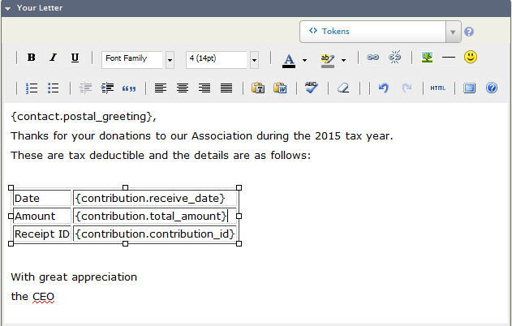

# Sending receipts and thank you letters

## Receipts

Donors making contributions through an online form will automatically
receive an email receipt for their payment, provided the option to send
them was selected during the configuration of the contribution page. If
you wish to manually send or re-send a receipt at a later date, you can
do so by editing the contribution record against a contact and
ticking the option **Send Receipt?**. The off-line contribution receipt will be
sent when you click **Save**.

You can send off-line contribution receipts to multiple contacts at the same
time through the [Find Contributions](finding-and-viewing-contributions.md)
search. After selecting the contacts you wish to send a receipt to, choose
**Receipts - print or email** from the actions drop-down menu.


You will be given the option to email the receipts or make PDF receipts
to post out to contributors.


By default emailing or creating PDF receipts will update the receipt
date for each contribution, but you can keep the existing receipt dates
if you need to. You can also choose to disregard the **Do not email/Do
not mail** settings so that all selected contributors are sent a receipt.

The standard off-line contribution receipt displays limited information. It can
be customized but that requires a knowledge of Smarty. You may find it easier
to set up "send later" receipts using the thank-you letters workflow.

## Thank-you letters

Some organisations may wish to send thank-you letters to people who
donated to a particular campaign, advising them of the total amount
raised. Other organisations like to send one receipt to each contact at
the end of the fiscal year covering all tax-deductible donations made
during that year. Both of these scenarios and more can be accomplished
using the "Thank-you letters for Contributions" functionality. This
action is available from a search results screen displaying
contributions (rather than contacts). The steps involved are:

1.  Use **Find Contributions** or use **Advanced Search** with **Display
    Results As** set to **Contributions** for your search.
2.  Select the contributions for which you want thank-you letters or
    combined receipts.
3.  Choose the action **Thank-you letters - print or email**. The
    following will be displayed:
    
4.  Choose to **Update thank-you dates for these contributions** or
    **Update receipt dates for these contributions** as required. The
    current date will be entered into the appropriate field.
    
5.  There are three self-explanatory **Print and Email Options**:
    -   Generate PDFs for printing (only)
    -   Send emails where possible. Generate printable PDFs for contacts
        who cannot receive emails
    -   Send emails where possible. Generate printable PDFs for all
        contacts.

6.  Some people may have made more than one contribution. If you want
    to send one letter for each contribution then set **Group
    contributions by** to **"-no grouping-"**. Alternatively, you can
    choose to show contribution data for multiple contributions from the
    same contact in one location in the body of your letter. There are
    five "group by" " options.
7.  **Separator (grouped contributions)** only applies if you have
    chosen something other than **- no grouping -** for the
    contributions. These options will be discussed below in *Grouped contribution thank-you letters*.
8.  Make sure to check the **Page Format** settings.
9.  You can use an existing template, create a new letter for one-off
    use, or create a new letter and save it as a new template.
    [Tokens and mail merge](../common-workflows/tokens-and-mail-merge.md) and
    [Postal mail communications](../common-workflows/postal-mail-communications.md)
    provide more information on creating letter templates.
10. When you click on **Make Thank-you Letters** the letters will be
    generated and a "Print/Merge Document" activity will be created for each
    letter with the **Activity Subject** you have specified.

### Grouped contribution thank-you letters

You can send end-of-fiscal-year giving statements/tax receipts to your contacts
 if you choose an option other than **-no grouping-** for the field
 **Group contributions by**.

In a standard CiviCRM installation, the letters that can be produced
when you group contributions are fairly rudimentary.

If you choose **Comma** as the **Separator** then the contribution
amounts and/or dates will follow one after the other separated by
commas. For example "Thank you for your generous donations of
{contribution.total_amount} received on {contribution.receive_date}
respectively." will become "Thank you for your generous donations of
$100.00, $150.00, $325.00 received on 1 January 2015, 5 March 2015,
16 May 2015 respectively."

If you choose **Table Cell** as the **Separator** then each contribution
instance will be placed in its own table column. For example:



will result in:


This format works well if only a few contributions have been received
during the year, but the table will be wider than the page for monthly,
fortnightly or weekly donations.

In neither case can the total yearly contribution amount be included in
the letter.

To include the total yearly contribution amount in the letter and to
produce a letter more suited to several contributions from the one
person, you (or your implementer/developer) will need to enable Smarty
functionality for you emails
([http://wiki.civicrm.org/confluence/display/CRMDOC/Smarty+in+mail+templates](http://wiki.civicrm.org/confluence/display/CRMDOC/Smarty+in+mail+templates)).

Once that has been done the total yearly contribution amount can be
included in the letter using the token `{$contribution_aggregate}`.

For example, if the HTML source for your letter is:

```html
<p>Dear {contact.first_name}</p>
<p>Thank you for donating ${$contribution_aggregate} to help the arts during the 2014 financial year</p>
<p>Your donation is tax deductible and the details are given below.</p>
<p>with appreciation for your generosity,</p>
<p>the CEO</p>
  <table class="table" style="width: 500px;" border="1" cellspacing="0" cellpadding="2" align="left">
    <tbody>
      <tr>
        <th>Date</th>
        <th>Amount</th>
        <th>Receipt Number</th></tr>
    <!--
    {foreach from=$contributions item=contribution} {assign
    var="date" value=$contribution.receive_date|date_format:"%d %B
    %Y"}
  -->
      <tr>
        <td>{$date}</td>
        <td>{$contribution.total_amount}</td>
        <td>{$contribution.id}</td>
      </tr>
   <!--
    {/foreach}

 --></tbody>
  </table>
```
then your letters will look like:


