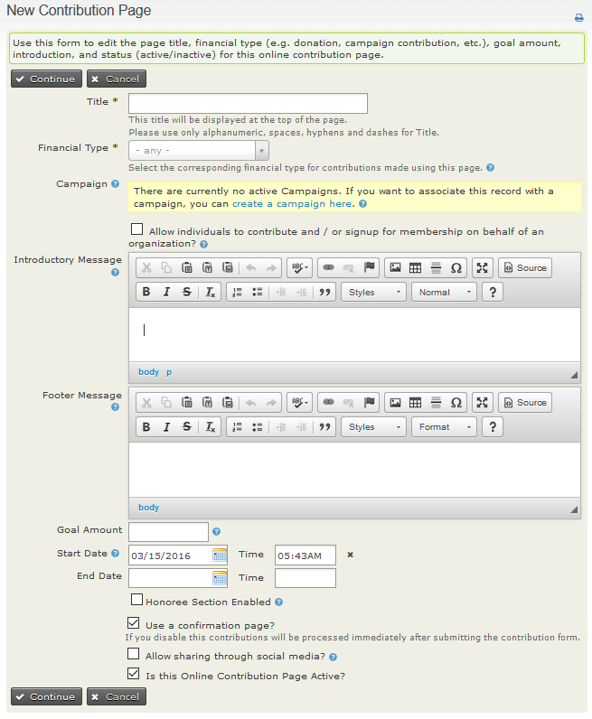
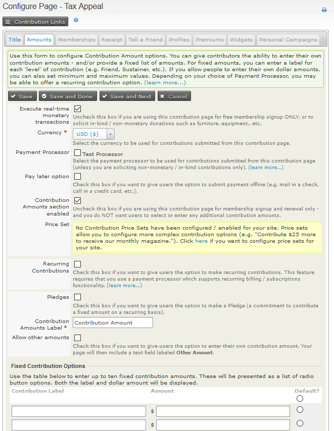
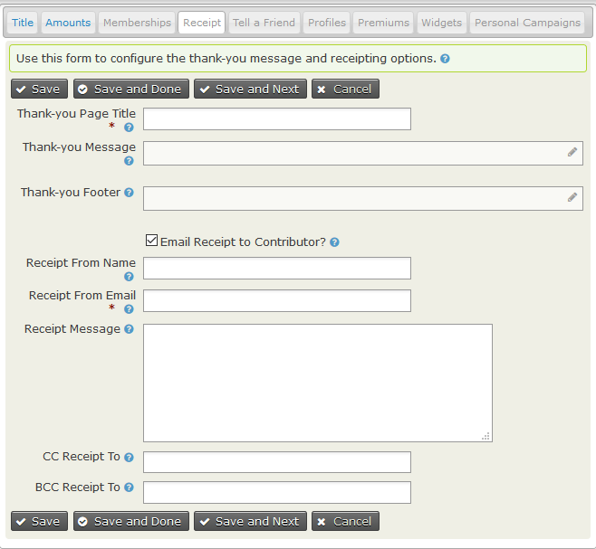
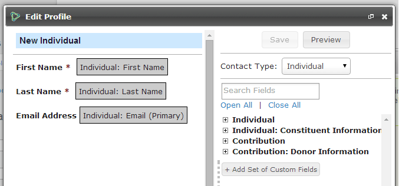

Creating Contribution Pages
-----------------------------
This section describes setting up online contribution pages where
visitors to your website can make contributions to your organisation.
CiviContribute is very flexible and includes many optional fields and features
such as recurring contributions, pledges and personal campaign pages. These can
make setting up contribution pages seem like a daunting task.  It can be
quite simple though as shown by the first two procedures.  

## The simplest contribution page (Receipt sent only from payment processor.)
1. Make sure you have a [payment processor configured](../contributions/payment-processors).
2. Go to to **Contributions > New Contribution Page**.
3. Enter the **title** for your website page.
4. Select the appropriate **financial type**.
5. Click on **Continue**.
6. On the next page leave everything as is except for ticking the **Allow Other
Amounts** checkbox and setting **minimum** and/or **maximum** amounts if you want to.
7. Click on **Save and Done**.
8. Follow the steps for your CMS to [display this page on your website](#publicizing-your-contribution-page).  

## A very simple contribution page including receipt from your organisation
1. Make sure you have a [payment processor configured](../contributions/payment-processors).
2. Go to to **Contributions > New Contribution Page**.
3. Enter the **title** for your website page.
4. Select the appropriate **financial type**.
5. Click on **Continue**.
6. On the next page leave everything as is except for ticking the
**Allow Other Amounts** checkbox and setting **minimum** and/or
**maximum** amounts if you want to.
7. Click on **Save**.
8. Select the **Receipt** tab.
9. Enter the **title** for your Thank-you page.
10. Tick **Email Receipt to Contributor**.
11. Enter the FROM email address in **Receipt From Email**.
12. Click on **Save and Done**.
7. Follow the steps for your CMS to [display this page on your website](#publicizing-your-contribution-page).

One other thing you might want to do with these simple pages is to collect more information about your contributors.  That is done via the [Profile tab](#profile-tab)

## Setting up a contribution page - full details.

Navigate to **Contribution > New Contribution Page**.
(**Contribution > Manage Contribution Pages > Add Contribution Page** takes
  you to the same screen.)  

-  The page title and financial type are the only compulsory fields. CiviCRM
comes with four standard financial types, but you can
[create more](../contributions/key-concepts-and-configurations) to meet your
organisation's accounting needs.
-  Link this contribution page to a [campaign](../campaign/what-is-civicampaign). (optional)
-  Compose your introductory message. (optional)
-  Compose your footer message. (optional)
-  Set a goal amount. (optional)
-  This contribution page has to be manually enabled or disabled, but you can
   set a **start date** and **end date** that will apply for a Contribution
   Widget and
   [Personal Campaign Pages](../contributions/personal-campaign-pages). (optional)
-  Choose whether or not to accept [Honoree soft crediting.](../contributions/soft-credits)
-  Choose to use a confirmation page where users can check all details are
   correct or to process the payment as soon as the contribution form is submitted.
-  Choose whether or not to display social media links on online pages and in
the automatically emailed receipt (if being sent).
-  Decide whether or not to make the Contribution Page active now.
-  Click **Continue**. (This is when you new contribution page is first
  saved.) You will be able to go back and modify all aspects of this page at
  any time by visiting the **Title** (and Settings) tab.

You will now be on the (Contribution) **Amounts** tab.  All the other
feature tabs for contribution pages will now be visible at the top
of the page.  We will deal with them one by one.

### Amounts tab

-  The **Execute real-time monetary transactions** box is checked by default.
You would uncheck this box if you are using this contribution page for free
membership signup or to solicit in-kind (non-monetary) donations, or when you
want **all** users to submit their payments offline.
-  Select the **Currency**.
-  Select one or more previously configured [Payment Processors](../contributions/payment-processors)
for this page. Some organizations find it is a good idea to offer a choice of
processors. You can do this by setting up multiple processors, and checking the
    corresponding boxes on this form.
-  Check the **Pay Later** box if you want to give users the option to
    submit payment offline (e.g. mail in a cheque, call in a credit card, deposit directly into your bank account etc.). If you allow pay later contributions you will need to decide on a checkbox label to display to your users and the instructions for submitting these delayed payments.
-  If you uncheck the **Contribution Amounts Section Enabled** the remaining fields on this page will vanish. You will only be able accept fixed-amount membership fees, or, if you configure a membership price set, fixed-amount memberships fees and other contributions as specified in the price set all charged in a **single** transaction.
-  Select a pre-defined **Price Set** (for more complex payment
    options), OR enter up to 10 fixed contribution amounts in the table at the bottom of the page.)
-  You can check **Recurring contributions** if you payment processor and its integration with CiviCRM support recurring billing and you want to allow this feature. (There are restrictions on recurring payments when [membership fees](../membership/defining-memberships) are being paid.) If you check **Recurring contributions** further settings become visible.
-  Check the **Pledges** box to give users the opportunity to [pledge
    future payments](../pledges/what-is-civipledge).
-  Decide on the label for the Contribution amount area on your page.
-  Check **Allow other amounts** to give users the option to pay any
    amount they choose. You can set a minimum and a maximum amount for "Other Amount" contributions if you want to.
-  Click **Save and Done**.

### Memberships tab

This is covered in detail in  [Memberships](../memberships/online-membership-sign-up).

### Receipt Tab

Here you can:
 -  Customise the Thank-you page that will be displayed to your
contributors. Contributors are sure to appreciate a title such as "Thanks
for your contribution" with a re-statement of how their contribution will be
used. (If you don't visit this tab the "Thank-you" page will just have the
same title as the contribution page.)
 -  Decide whether or not to have a receipt automatically emailed at the time
of the contribution. If you do decide to send a receipt then the fields
under "Email Receipt to Contributor" will appear. The receipt message is
specifically for the contribution page you are creating and will be added to
 the standard **Contributions-Receipt (on-line)** (found at
**Mailings > Message Templates> System Workflow Messages**).

### Tell-A-Friend tab

CiviCRM allows you to add a tell-a-friend feature to the thank-you page.
The page lets your members share details about your organisation with
their friends by emailing them a link and information. Those friends
will be added as contacts if they aren't already in CiviCRM and their source
field will show that they were added via tell-a-friend.

### Profile tab

If you want to collect information from contributors beyond the essential fields
required to make a contribution, such as age, interests and skills,
you can include existing CiviCRM Profiles at the beginning or end of a
contribution page. You can also create new profiles.

Profiles used in a contribution page can ONLY contain fields which
belong to:

-   contact records
-   contribution records

Profiles which include fields associated with any other record types
will not be available for this purpose.

Contribution pages will always include a required email address field,
regardless of whether you include any other fields in your profile(s).

1.  Navigate to Manage Contribution Pages then for the page you wish to
    configure, click on **Configure > Include Profiles**.
2.  Select a CiviCRM profile from the dropdown menu to be included at
    the top of the contribution page and/or at the bottom of the page.
    You can then preview your selection(s), edit an existing profile,
    copy an existing profile or create a new profile.
    When you edit or create a new profile you will use the profile drag
    and drop interface pictured here.

    

    WARNING: If you modify an existing profile whilst configuring your
    Contribution page, the changes you make will apply everywhere that
    profile is being used. So unless an existing profile **exactly**
    matches your requirements you should copy the profile, then rename
    and edit the copy as required.
3.  Click **Save** or **Save and Done** or **Save and Next**.

For more information read [Profiles](../organising-your-data/profiles).

### Premiums tab

Premiums are thank you gifts and incentives offered to people that
donate to your organisation. They are most commonly associated with
tiered donation levels (e.g. donate $20 to receive a pen, donate $50
to receive a T-shirt) The Premiums tab controls the introductory text,
contact information, and other premium-related details.

Before you can include premiums on a contribution page, you must configure them.
Read the section on [Premiums](../contributions/premiums) for those details.

### Widget tab

A widget provides a real-time display of current contribution results, and a
direct link to the contribution page. Widget code can be added to any web page.
Read [Widgets](../contributions/widgets) for details on setting up a widget.

### Personal Campaigns Tab

See [Personal campaign pages](../contributions/personal-campaign-pages) for
details of this feature.

## Editing your contribution page

You can change most things on your contribution page at anytime as follows:

1.  Navigate to **Administer > CiviContribute > Manage Contribution
    Pages**.
2.  Use the **Configure** link at the right-hand side of a contribution
    page to access any of the set-up tabs and edit their details.

## Automatic Contribution Recording

CiviCRM automatically records donations made through your online contribution
pages.  If the donors already exist in the database, CiviCRM
adds the contribution to their existing record. If they don't exist,
CiviCRM creates a new record for them.

In situations where people have multiple email addresses, or where more
than one person shares an email address, it can be possible for
contributions to be credited to the wrong contact. To mitigate the
chance of this happening, you can adjust CiviCRM's default duplicate
matching rules. For instructions on how to do this, read
[Deduping and Merging](../common-workflows/deduping-and-merging).

## Publicizing your contribution page

Now that you've created your contribution page, it's time to bring
people to the page so they can contribute. You will probably want to
display a link to the page prominently on your website through a donate
button or menu item. Here are some additional tips for promoting a
contribution page in different CiviCRM configurations:

### Menu item in Joomla!

The most direct way to expose your contribution page or membership
signup/renewal page on the front of your web site is by creating a menu
item.

1.  Navigate to a menu and create a new CiviCRM item.
2.  From the list of menu options, choose Contributions.
3.  In the basic parameters section, select the contribution page you
    would like exposed from the dropdown menu.
4.  Save the menu item and view the website to confirm the page's
    functionality.

### Menu item in Drupal

From the contribution page listing, select Live Page to view the
finished page. You can then copy the URL and include it in a content
page or assign it to a menu item.

### Page or Post in WordPress

You can easily embed your contribution page in a post or page on your
WordPress front-end site.

1.  Login to the administration dashboard of your WordPress site.
2.  Click on **Pages** or **Posts > Add New**
3.  Click on the CiviCRM icon next to Upload / Insert
4.  Select Contribution Page as your Frontend Element
5.  Select the desired contribution page
6.  Save the page or post, and your contribution page will automatically
    be embedded within your site's theme on that page.

### "Pretty" URLs

CiviContribute contribution pages have "ugly" URLs - in other words,
they are difficult to remember. An example is *:*

*www.myorganization.org/civicrm/contribute/transact?reset=1&id=1*

On the other hand, "pretty" URLs are much easier to remember and use in
your organization's outreach, for example:

*www.myorganization.org/donate*

A pretty URL is simply a URL redirect (automatically taking people from
one page of your web site to another). Drupal provides a helpful module
called Path Redirect
([http://drupal.org/project/path_redirect](http://drupal.org/project/path_redirect))
that lets you can create URL redirects from the user interface without
complicated web server configuration. Joomla! users also have a
work-around if Search Engine Friendly URLs are enabled in Global
Settings. You can then create a menu link to the contribution page and
define the "pretty" URL using the alias field.

### Personalised Email

Emailing your current membership is the other critical way to publicize
the campaign. The CiviMail component of CiviCRM allows you to send
targeted emails to any group of contacts in your database. Within a
CiviMail message you can include links to the contribution form and use
CiviMail's tracking capability to see how many people click on that
link.

One time-tested way to increase contributions is to send each targeted
constituent a personalized email with a link to the contribution form
that has all of their contact information already filled in. This saves
them the hassle of filling it out and raises the chances that they
donate. Using CiviMail, you can use this feature by creating a special
link in the body of your CiviMail message that includes a *checksum
token*. A checksum is a unique and pseudo-random number assigned to each
recipient of the mailing that points back to their contact information,
securely stored in your database.

When people click on the special link, CiviCRM looks them up in the
database and pre-fills fields on the contribution form (core fields or
fields exposed via a profile) with any information in their contact
record. To read more on how to do this and what the link path must be,
visit:
[http://wiki.civicrm.org/confluence/display/CRMDOC/Tokens](http://wiki.civicrm.org/confluence/display/CRMDOC/Tokens)
