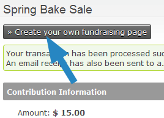

Personal Campaign Pages
=======================

CiviCRM's features include allowing your constituents to create their
own fundraising pages - and then ask others to fund their cause. These
pages are called Personal Campaign Pages or "PCPs".

A personal campaign page allows your constituents to personalize the
fundraiser, event, organization, etc., by offering their personal
reasons and/or experiences with the organization on their own personal
page. Also, your contributors may in turn send the personal campaign
pages to their circle of friends. You can enable the "tell a friend"
feature to help someone share their page even more.

Examples of this feature in action are typically called "Sponsor My 5k
Walk", "Help Fund Our Trip" or "Let's Raise Money to Build A School".

Administrator Features
----------------------

Administrators managing fundraising pages may use the following features
via the contribution page configuration:

-   Requiring approval before a newly-created fundraising page becomes
    active
-   Turning on or off 'tell a friend' so fundraisers can email others
-   Setting an email address to notify admin when a new page is created
-   Allowing PCP owners to always, sometimes or never receive
    notification when a donation is made via their page
-   Choosing a profile of fields to collect from PCP supporters
-   Customizing the text in the create button

Once PCP pages are active, administrators can:

-   Disable or deny Personal Contribution Pages
-   Edit PCP content
-   View the amount of money collected by each PCP
-   Run reports (using CiviReport) showing a summary of PCP fundraising
-   Enter 'offline' contributions (i.e. checks) and credit the money to
    a PCP

Fundraiser Features
---------------------

Those creating their PCPs enjoy the following ways to personalize their
page:

-   A title of their choice
-   Descriptive text
-   Selecting a monetary goal amount they hope to raise
-   A single image they can upload that will appear on their page
-   Choosing whether or not an 'honor roll' of supporter names will be
    shown on their page
-   Option to display a 'thermometer' showing progress towards their
    goal
-   Create a username (or login using a username they already have) so
    they can edit their PCP later

Limitations
-----------

-   CiviCRM's PCP functionality doesn't allow for team management. For
    instance, a fundraising leader recruiting members to a team,
    managing membership and then keeping track of which member brought
    in how much money is not supported by CiviCRM at this time.
-   There is a limit of a single image uploaded to a PCP by the
    fundraiser. The image is not automatically re-sized.
-   The thermometer and honor roll appearance can be modified, but
    changes are applied to all pages. These customizations cannot be
    done without the expertise of a coder.
-   The automated emails (system workflow messages) sent to the PCP
    administrator and the page owner at various stages during a campaign
    can be modified. A working knowledge of Smarty 2
    ([http://www.smarty.net/](http://www.smarty.net/)) is required. The
    default notification for the PCP owner when a donation is received
    is:

**Set-up**

All Personal Campaign Pages *must* be linked to an existing online
contribution page or event, created in CiviCRM by navigating to either:
**Contributions > New Contribution Page** or **Events > New
Event**. Once a contribution page or event has been generated, while
editing the settings go to the **Personal Campaigns** tab and click
'enable personal campaign pages'. A number of other options may then be
configured, including:

-   **Approval Required**: check this option to moderate all PCP
    creation requests. An administrator must approve the page before it
    becomes active, at which point the user will be notified via email,
    and may proceed to promote it (ensure "notify email" is also used to
    notify an administrator when PCP pages are awaiting review).
-   **Notification Email**: Each time a new PCP is created, an email
    will be sent to the named administrators (separate multiple email
    addresses with commas).
-   **Supporter Profile**: select a profile of fields to be collected
    from the user creating the PCP.
-   **Owner Email Notification:** an email can be automatically sent to
    the PCP owner whenever a donation is made through their page.
    You can select whether emails will always or never be sent
    automatically for all PCP pages created under that particular event
    or contribution page. Alternatively, you can allow the PCP owner to
    choose during the page set up process whether or not they would like
    to receive notification of donations made through their page.
-   **Allow 'tell a friend' functionality**: the PCP owner may send
    emails to their contacts, encouraging them to visit their page and
    contribute.
-   **Campaign Type**: when enabling PCPs for an event, you may give the
    event registrant the option to either create a fundraising event of
    their own, or a contribution page (e.g. to raise money in support of
    their attendance).

After PCP creation has been enabled, there are two ways to create a PCP:

-   An individual donating to a contribution page or registering for an
    event is given the option to build their own PCP via a button on the
    'thank you' page.

-   If the individual forgets to click the link upon donation, or you
    wish to give all visitors the opportunity to create a PCP without
    the prerequisite of donating or registering themselves, you can give
    your constituents a direct link. This link could be emailed to
    the constituent, embedded in a page or added as a menu item. Note
    that

**The invitation button:**

**The invitation link:**

http://*YOUR-SITE.ORG*/civicrm/contribute/campaign?action=add&reset=1&pageId=*CONTRIBUTION_OR_EVENT_ID*&component=*EVENT_OR_CONTRIBUTE*

To use this link, replace the following:

-   \*YOUR-SITE.ORG*: enter your domain's address
-   \*CONTRIBUTION_OR_EVENT_ID*: give the ID number of the event or
    contribution page. This can be obtained through navigating to
    'Manage Events' or 'Manage Contribution Pages' and looking for the
    ID against the item in question.
-   \*EVENT_OR_CONTRIBUTE\*: If the invitation is for a Personal Campaign
    Page in support of a contribution page, use *component=contribute*.
    If the invitation is in support of an event, use *component=event*.

Managing Personal Campaign Pages
---------------------------------

When an individual has clicked the 'create your own fundraising page'
button or a direct link, they will be presented with a form to fill out
their information, including: a title, message, monetary goal amount and
text for the donate button. They may also attach a photo, enable a
progress - thermometer style - bar, include an honor role of their
donors who have not elected to be anonymous, and whether the campaign is
active (they may choose to activate it at a later time).

If PCP moderation has been enabled (the 'approval required' option), an
administrator must log into the CiviCRM back-end and enable the page
at **Contributions > Personal Campaign Pages** before the
individual is able to use it. Simply seek the PCP in the list, look
toward the end of the row and click 'Approve', 'Reject' or 'Delete' (at
a later date, you may also enable/disable the PCP by clicking the 'More'
link). The individual will be sent a confirmation email, and may proceed
to use it. Ensure administrators are always alerted to this step by
entering a notification email address in the contribution page settings
(see 'Set-up' above).

Finally, following approval the PCP owner will be sent an email
outlining how they may begin promoting their page and editing it,
providing they have been given user access. The user and administrator
can edit the PCP settings at any time through the menu
item: **Contributions > Personal Campaign Pages**> click
**Edit**, **Delete** or **Disable/Enable**.
