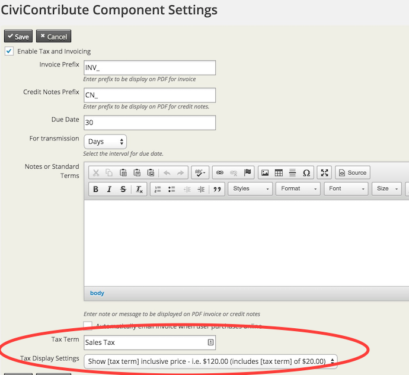
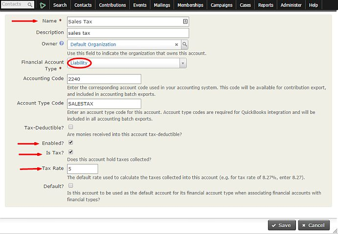
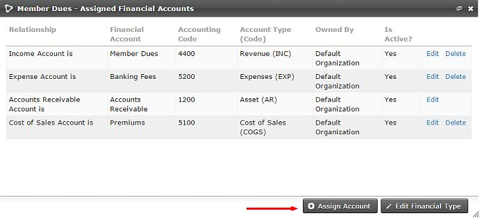
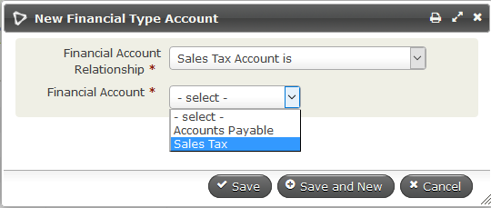
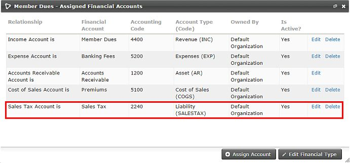

# Sales tax and VAT

If your organization charges Sales Tax or VAT you should enable
this feature.

To enable Sales Tax/VAT go to
**Administer > CiviContribute > CiviContribute Component Settings** and check
the "Enable Tax and Invoicing" box.

In this screen you can set certain settings for Sales Tax/VAT as well:

-   Tax Term- this is a text field for what your organization wants to call
the relevant Sales Tax or VAT

-   Tax Display Settings - how does your organization want to display the
tax/VAT

    -   No breakdown, total only
    -   Shows as inclusive price- $120 (includes $20 tax)
    -   Shows as exclusive price - $100 + $20 tax  

## Adding a Financial Account for Sales Tax/VAT

Once Sales Tax/VAT is enabled you need to create one or more Financial
Accounts for Tax/VAT at **Administer > CiviContribute > Financial
Account**. Scroll down to the bottom of the page, and click on **Add
Financial Account**.

To create the sales tax Account, make sure **Financial Account Type** is
set to **Liability**. Select **Enabled** and **Is Tax** and specify the
**Tax Rate**. Note if you use **Quick Books**, the **Account Type Code**
should be set to **SALESTAX**. **Accounting Code** should be based on the
organization's specific accounting codes.

After you create the Financial Account, you can assign it to the
specific Financial Type by going to **Adminster > CiviContribute >
Financial Types**.  Find the Financial Type this sales tax applies to,
and click on **Accounts**. Click on **Assign Account**.

For the **Financial Account Relationship** choose **Sales Tax Account is**
and in the **Financial Account** field select your sales tax account.
Click **Save.**

Once the sales tax Financial Account has been added, you will see it
listed with the other Financial Accounts for that specific Financial
Type.

For more advanced configuration with accounting software packages like
QuickBooks, you should involve your organization's bookkeeper or
accountant in setting up your Financial Types and Financial Accounts.
