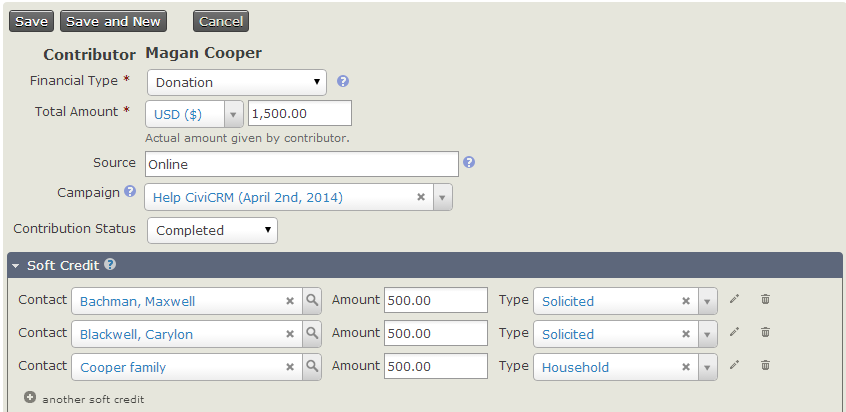
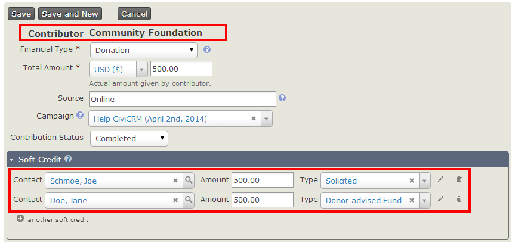
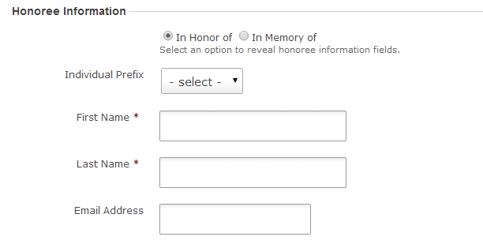

# Soft credits

Soft credits are a familiar concept to many fundraisers, and are useful
for a better understanding of the sources of contributions received by
your organisation. They allow you to assign credit for a donation to
one or more people who are not the donor.

## Soft Credit Types

CiviCRM's soft crediting allows users to assign soft credit types to
contributions. Assigning an appropriate reserved or custom soft credit
type enables administrators to properly attribute contributions received
through one or more charitable contribution types (such as Donor Advised
Funds, Scholarships, Family Bequests, etc) whether solicited (P2P) or
not.

CiviCRM uses the following reserved soft credit types:

-   In Honor of
-   In Memory of
-   Solicited
-   Personal Campaign Page
-   Gift

Lets say that a very active member of your organization was responsible
for getting 10 other people to make a contribution. Soft credits
provide a way for you to credit this person and the actual donor,
without counting the contribution twice.

You can use CiviCRM's soft crediting to credit parts of a donation to
multiple people.

In the screenshot below, you can see that we have credited Magan
Cooper's contribution of $1,500.00 to three different people.

CiviCRM can also handle more complicated scenarios. For instance, Joe is
an active member of a community foundation that regularly contributes to
your organization. Joe solicited a contribution from Jane on behalf of
the community foundation. Your organization would therefore receive a
check from the community foundation. Using soft credit types, users can
properly attribute the credit without duplicating contributions. In this
case:

-   The community foundation is the donor.
-   Joe would receive the solicited soft credit.
-   Jane would receive the donor advised soft credit

This scenario is illustrated in the screenshot below.

As well as recording soft credits, we can also report on them. The
contribution detail report has optional columns which show soft credit
details. When checked, these will show four extra columns in CiviReport, which
can be used to view soft credit information.

## Honoree information and profiles

When creating a contribution page you will have the option to allow your
end users to make a contribution on behalf of an honoree. To do so you
must select the **Honoree Section Enabled** checkbox.

This will reveal additional fields that will allow you to specify the
Honor Types and Profile to be included in this section.

Once configured your end users will be able to enter honoree info for
online contributions. CiviCRM will check to see if the honoree exists
within CiviCRM already using the default duplicate checking rules on
your site, if a duplicate is not found a new contact record will be
created. A soft credit will be added to the contact record of the
honoree.

## Soft credits and personal campaign pages

The concept of soft credits is closely related to
[personal campaign page](../contributions/personal-campaign-pages). When someone donates by a
personal campaign page, their donation is soft credited to the owner of
the personal campaign page.
