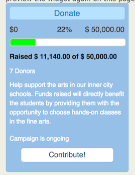
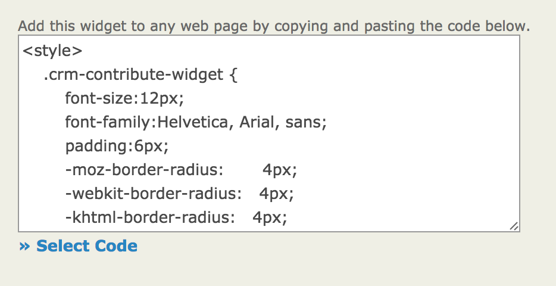

# Widgets

CiviContribute widgets help you and your supporters to easily promote this fund-raising campaign by creating an automatically updated visual representation of the campaign.

When you create a widget you are given the code to embed the widget on your website or another website. 

## Creating a widget

1. Go to the configuration for your Contribution Page.

    **Contribution > Manage Contribution Pages** to display a list of contribution pages, click on the **Configure** link for your Contribution Page to open it.

1. From the tabs at the top of the page select **Widgets**.
1. Click **Enable Widget** to get started.  
1. Enter a **Title** for your widget.  It will generally be the same name as your Contribution Page but it does not have to be.  
1. You can enter the **URL to Logo Image**. To use this feature you will need to have an uploaded an image to your web server and then obtained the URL (web address) for the image. You may need to ask your system administrator for help getting this information.  
1. Enter a **Button Title** that will be used for a potential donor to click to go to your donate page. In the above example, the button title is Contribute.  
1. You are given an editor to enter as much **About** text as you want. You will want to adjust how much text you have based on where you want to use your Widget.  
1. When you are ready to preview your Widget or when you are finished and want to update the code for the Widget click **Save and Preview**. 
1. On the right, you will be able to see the code for the Widget to be embedded on a web page.  You may need help from your system administrator or the person who administers your website to make use of this code. 

    

1. When selecting the code use the **Select Code** link to make sure you have all of the necessary code.
1. Copy and paste into the appropriate place on your website where you would like the widget to display.

## Customizing your widget

1. At the bottom of the configuration page, you can expand the **Edit Widget Colors** fieldset. 

    

1. The fields in this fieldset provide a way to modify the colors for each area of the Widget you are creating. You will need to get hexadecimal (or hex) codes for each color.  [W3schools](https://www.w3schools.com/colors/colors_picker.asp) provides a color picker that will give you the hex values for colors you select.

1. Modify the colors. 

    A designer that you have worked with on your website may have specific standards for the colors that should be used.  

1. Click **Save and Preview** when you are ready to see how your changes look.  

## Using widgets with WordPress

WordPress has a plugin, [CiviCRM Contribution Page Widget](https://wordpress.org/plugins/civicrm-contribution-page-widget/), that lets you embed a widget from CiviCRM anywhere that a WorderPress "widget" can go.
