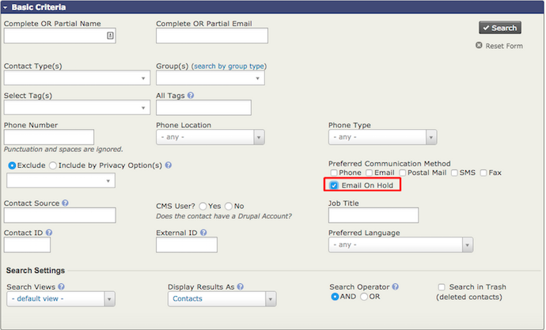

# Maintaining Healthy Email Lists

In the setup chapter we discussed setting up and configuring Email
lists. In this chapter we are going to delve a bit further into list
management and discuss compliance. It is important that you keep you
email lists healthy with low rates of bounced emails and unsubscribes.

There is always fear of the dreaded 'blacklist' if you have very high
bounce rate, or the fear of being scolded by your SMTP provider for the
same. However, the reality is high bounce rates and unsubscribes
typically represent a deeper organization issue... and that's really
scary.

## Understanding Email Bounces

Each time you send a bulk email from CiviMail it's possible that some of
the emails will bounce. Hopefully, only a few. Bounces happen for many
reasons; some may be temporary, others permanent.

### So why do emails bounce?

If the email bounces, it means it never reached that recipient. It can
happen for a number of reasons, including the following:

1.  the email address was input incorrectly
2.  the email address is out of commission
3.  the email inbox is full and temporarily cannot accept any more
    messages
4.  the recipient has an automatic away reply message because they are
    on vacation and out of the office

CiviCRM handles different bounce types differently. Whereas temporary
bounces will have no affect on a contact record and CiviCRM will attempt
to send future mailings to this address, permanent bounces may put a
contact email on **Hold.** When an email is on **Hold**, no future
emails will be sent to it unless someone fixes it and removes the hold.

A detailed table of each type of bounce and the number of bounces
allowed before an address is put on hold is available on the wiki
at: [http://wiki.civicrm.org/confluence/display/CRMDOC/Bounce+Handling](http://wiki.civicrm.org/confluence/display/CRMDOC/Bounce+Handling%20)

### What do I do if an address is put on hold?

Basically you have two options if an email address gets put on hold. You
can either unhold them or fix/delete them.

To release a hold:

1.  Go to **Advanced Search**
2.  In the **Basic Search Criteria** check the box to search for
    **Emails On Hold** 

3.  Once you have the list of contacts with held email addresses, select
    them and choose the action **Unhold Emails** from the dropdown list
    and click **Go.**

To correct/update held emails you'll first need to create a group(s) for
bad emails, then:

1.  In the top menu, go to **Reports**
2.  Select **Mail Bounce Report**
3.  The report will show contacts whose emails have bounced.
4.  You can then open **Report Criteria** at the top of the mailing to
    limit the report to a specific bounce type.
5.  From here you add the contacts in your search results to the group
    you first created.
6.  Pull up the group via **Advanced Search.** It is also recommended
    that you select **Email on Hold** to avoid querying records that
    have previously bounced but may have been already updated.
7.  Select **Batch Update via Profile** for all the results whose email
    addresses you can correct/update. This will require a profile in
    place that contains *just* **Primary Email**.
8.  Select this profile and click **Update**.

### The difference between on hold emails and unsubscribes

Emails that have been held are different from emails that have been
unsubscribed. Unsubscribers have clicked the linked text in an email
that said “unsubscribe from this mailing”. This link is created by one
of these [tokens](/common-workflows/tokens-and-mail-merge.md)
in an email: `{action.unsubscribe}` or `{action.unsubscribeUrl}`

Email recipients who unsubscribe from a single mailing list will simply
be removed from the group you used as a mailing list to send to.

### What is the difference between opting out and unsubscribing?

Email recipients also have the option of not receiving any bulk emails
from you by clicking a link you provide in every mass email. This is
called "opting out". You can still send individual or small volume
emails to someone who has opted out using the **Send Email** action
which is accessible via the contact's record or after a search.
Scheduled reminders will also still be sent to contacts who have opted
out. You should be very careful about the emails you send to someone who
has opted out if you do not want to be accused of sending spam. 

To opt out, an email recipient can click the linked text in an email
created by one of these opt-out [tokens](/common-workflows/tokens-and-mail-merge.md): `{action.optOut}` or `{action.optOutUrl}` 

You can include these tokens directly in the body of your mailing or in
a footer message.

### What does the privacy option 'Do not email' mean?

If a contact has this option selected then you will not be able to send
them individual or small volume emails using the **Send Email** action
reached via the contact's record or after a search. They will not
receive bulk emails sent through CiviMail, either. However they will
still be sent scheduled reminders unless you specifically exclude them
from those reminders. If the **Do not email** option is set manually
after someone has contacted you in person, it is probably a good idea to
exclude them from scheduled reminders. The *Schedule Reminders* chapter
outlines how to do that.

### How can I make sure a contact doesn't receive any emails?

Due to user error, there is always a chance that someone could change
CiviCRM settings incorrectly or manually misuse an email address. The
only way to fully guarantee that a contact doesn't receive any emails is
to remove all email addresses from the contact's record. However, in
this case the contact would not be able to log in to your website.
