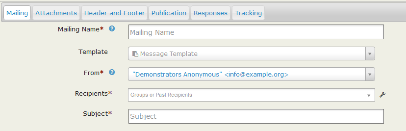
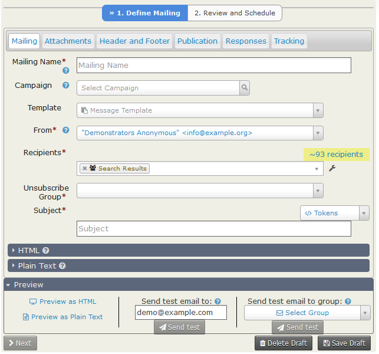
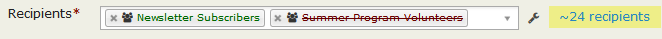
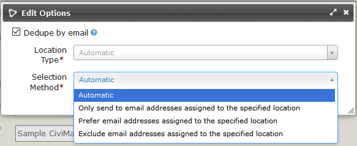
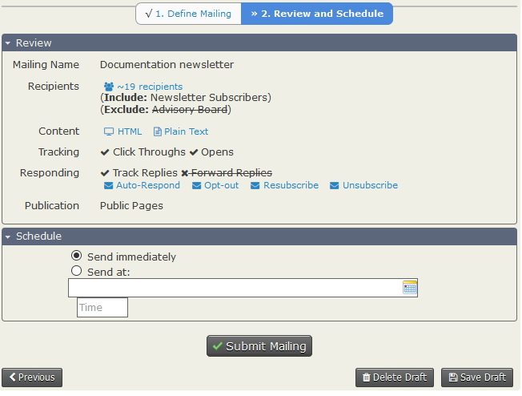
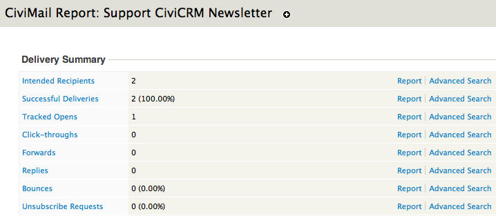
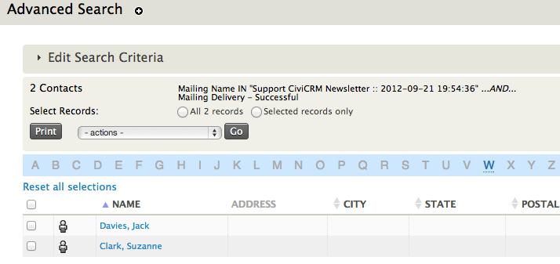

# Mass mailings using CiviMail

Using the Mailings functionality offered by CiviMail provides many
benefits over the Send Email activity, allowing you to track respondents
to your mailing, process bounces, and allow people to unsubscribe from
your mailings. These benefits will discussed later; first we will deal with
creating and sending a mass mailing.

## Choosing recipients: Groups versus search results

There are two ways to select the recipients for your mass mailing: sending to
existing Groups or sending to search results. Most steps to create a
mailing are independent of how your recipients are chosen, however there is one
important difference.

For mailings to search results, you are
required to choose a Group from the Unsubscription Group dropdown menu.
Here's why: Every mass mailing needs a way to track unsubscribe
requests. A simple "unsubscribe" process is required by law in many countries
and may help prevent your mailings from being treated as spam.
Mailings sent to Groups have this capacity built-in. The next
time a mass email is sent to that Group, anyone who has unsubscribed
will not be included. However, mailings sent to search results do not
have this built-in way to track who has unsubscribed, so you need to
provide one.

Here's how it works: If a contact who matches your search results is
already unsubscribed from the Unsubscription Group that you designate,
that contact will not be sent the mailing. If a contact unsubscribes via
the unsubscription link in this mailing, they will be unsubscribed from
this Group and therefore not receive any more emails sent to this group.
This is true whether they were originally a member of the Group or not.

The Unsubscription Group you designate collects unsubscribe information
only; it does not supply any contacts to the mailing. In other words,
contacts who are in the Unsubscription Group but do not match your
search criteria will not be included in the mailing. (If you wish to
include these contacts you should include the relevant Group.)

For example: Your organization is having a big event next week. Several
emails have already gone out about it, but you have added many new
people to your database in the last week and you want to send them an
event announcement. You do a search for new contacts via **Search >
Custom Search > Date Added to CiviCRM**. This is the search that is the
basis of the mailing. Your organisation stores its event email list in a
Group called Event Alerts, so for this mailing, you would probably want
to choose that as your Unsubscription Group.

If you do not already have a Group that would be appropriate for the
Unsubscribe Group for a mailing you're planning, you may want to create
one and call it something like Miscellaneous Mail Unsubscribes. You
could then add that Group to other future mailings to ensure that the
people who have unsubscribed are excluded from those future mailings.

## The Mailing set-up screens

If you are sending mail to an existing Group, go to **Mailings > New
Mailing**. You will see the following screen.



If you are basing your mailing on search results, perform your search
(for example, using **Search > Advanced Search**) and then choose
**Email - Schedule/Send via CiviMail** from the **Actions** drop down.
You will see the following screen.




These are two screens are very similar, however, as described in
[Choosing recipients: Groups versus search results](#Choosing recipients: Groups versus search results),
for the search-based mailing you must choose an Unsubscribe Group and
the "Search Results" group is included in (and cannot be removed from) the Recipients list. (Also, the HTML
pane is open by default. It was closed to fit the bottom buttons into these images.)

Remember you can save your mailing at any stage by clicking on the
**Save Draft** button.

**Step 1: Define Mailing**

### Mailing tab
Here you will find:

**Mailing Name**: Enter a name for this mailing. Select a name
that will allow you and others in your organization to clearly identify
the purpose of this mailing. It is recommended that you start each name
with a date (e.g., "2015/04/25 - Monthly Newsletter"). This will make it
easier to include or exclude recipients of this mailing in future
mailings. This name is for internal use only and will not be shown to
recipients. You will be asked to enter the Subject of the email later.

**Campaign**: You can associate this email with a particular campaign.

**Template**: Here you can select an existing message template to
populate the HTML Format and Plain-Text Format fields with the message
content from the template. You can edit the content to suit this particular
mailing but you cannot update the template, or create a new template via this
form. (CiviCRM ships with three sample newsletter templates which users with
  the Administer CiviCRM permssion can customise with your own organisation's
  details at **Administer > CiviMail > Message Templates**.  That is also where
  new message templates can be created.)

**From**: This will be populated with the default sender email address.
You can select an alternative for this mailing from the dropdown list.
Users with Administer CiviCRM permssion can add additional email addresses
by going to **Administer > CiviMail > From Email addresses**.

**Recipients**: This is where you can choose who will receive the
mailing (if mailing to Groups) or further refine or add to your mail
recipients (if mailing to search results). You can choose Groups to
include (shown in green) and exclude (shown in red and struck through),
by selecting them from the "Recipients" dropdown.
Only groups of the type "Mailing List" will be available in the dropdown.
 
 You can also refine your recipient list by including and excluding
recipients of previous mailings. For instance, you may want to resend an
email only to contacts that have been added to a Group since the last
time you sent them email, to avoid sending the same email twice to some
people. Choose the original mailing in the "Exclude Past Recipients From".
This will then send the message only to those members of the group who
did not receive the original mailing.

  The estimated final number of recipients to displayed to the right of the
"Recipients" field and highlighted in yellow.

**The "wrench"**: The is located to the right of the Recipients
field and to the left of the estimate of recipient numbers.  Click on it
to access **Edit Options**.



  -   **Dedupe by email:** CiviCRM will always dedupe your mailing based on
 unique contact records. For example, if a contact is in three of the
 groups you are including in your mailing, they will only be sent one copy
 of the email. However, if the same email address is used by multiple
 contacts, how many emails are sent is determined by this box. If it
 is unticked then multiple copies of the email will be sent - one for
 each contact using that address. If it is ticked then only one
 email is sent to each address. You set the default for this box at
 **Administer > CiviMail > CiviMail Component Settings** by ticking
 or unticking "CiviMail dedupes e-mail addresses by default" but you can
 override the default for any email if needed.

  -   **Location Type:** By default emails created through CiviMail are sent to
 the address location(s) set as being for "Bulk Mailings" or, if no location type
 has that setting, to the address location set as "Is Primary". You can change
 the Location Type and the Selection
 Method on the Edit Options screen.
You can filter on the Location Type and only send the mailing to email
addresses with the specified location type or exclude the email
addresses with the specified location type.

**Unsubscribe Group** (for search-based mailings only): This should be
chosen carefully. It may help to read through the example of a search-based
mailing in [Choosing recipients: Groups versus search results](#Choosing recipients: Groups versus search results).

**Subject**: is the subject in your sent emails. You can include tokens
in the subject. The **Subject** (not the Mailing Name) is used when creating an
activity or mailing record for each contact.

**HTML** (expanding section): This is where you can compose content
for your mailing. Remember that CiviCRM lets you personalize each email using
tokens. See "*Using tokens in emails*" later in this chapter. If you only
want to send a plain text email ignore the HTML section. Click on
**Plain Text** to open that accordion and enter your message in the box.

**Preview**: This panel is a footer to the **Define Mailing** screen. It
is displayed whichever tab is selected. Within this panel are the options to:
  -  Preview the HTML or Plain Text version of the email. The HTML preview will show you all the formatting and converted tokens with your data. It will not include any attachments. There is no guarantee that all email clients will
      display the email exactly as it is shown in this preview, but it is
      useful to ensure things like font consistency, basic layout and
      color.

  -  Send a test email to a single email address (Note: If the email address
    does not already exist in CiviCRM a new contact record will be created.)
  -  Send a test email to a an existing group in CiviCRM.

      The test mailing will fill in all the Tokens and include any attachments you are planning to send.

     It is a good idea to test your email by sending it to yourself and
  viewing it in your email client to make sure it looks as you expect.
  If you are sending a mail with a complex layout, send it to your
  test group and verify it from various mail clients (see *Testing
  templates* in the *Set-up* section for more tips on this). It is
  preferable to have more than one person receive your test email and
  give you feedback.

The **Mailing** tab may be the only tab you need to visit when you are creating
your mailing. It contains all the compulsory fields that need to be defined for
each new mailing. The remaining tabs are:

### Attachments tab
This is where you upload files to send as attachments with your email.

### Header and Footer tab
Each new mailing you create will include the
  default Header and default Footer as defined at
  **Mailings > Headers, Footers, and Automated Messages**. If you don't want
  to use these defaults, this tab is where you select the header and/or
  footer you do want to use for this mailing. You define additional Headers
and Footers via **Mailings > Headers, Footers, and Automated
Messages** (See *Set-Up* for details).

### Publication tab
This contains the **Mailing Visibility** field
which has two options, "User and User Admin Only" and "Public Pages."
Choosing **Public Pages** makes this
content viewable as a web page by everyone who has the permission of
"View public CiviMail content."
**"User and User Admin Only"** means that only users that received the mailing
or administrators can view the content of this email as a web page;
the recipients will have to log in to be able to view the message.

 To link to the web version of your email, you need to have inserted the
 **Mailing permalink** token in your email message. This token generates
a URL on which the message can be viewed; in order to display it
properly in HTML messages, you'll need to add the proper link tags using
the Source icon in the editor.

### Responses tab
-  **Track Replies** checkbox. Checking this option will send replies from the
mailing's recipients to a CiviMail specific address instead of the sender's
address so they can be stored within CiviCRM. Checking this box will open the
two options described next.
    -   **Forward Replies:** This option is only visible if "Track Replies"
    is checked. You will need to check this option if you want the From
    address to also receive the replies sent by recipients.
    -   **Auto-respond to Replies:** This option allows you to send a
    specific automatic reply to anybody who replies to your mailing. You
    need to set up an autoresponder ahead of time in **Mailings >>
    Headers, Footers, and Automated Messages**.

- **Opt-Out Message:** This message will be sent to a recipient who has
opted-out from all the mailing lists
- **Resubscribe Message:** This message will be sent to a recipient who
has resubscribed to one of the mailing lists
- **Unsubscribe Message:** This message will be sent to a recipient who
has unsubscribed from one of the mailing lists.

    You can edit these three messages at **Mailings >> Headers, Footers, and Automated Messages**.

### Tracking tab
-  **Track Click-Throughs**: This option will keep track of how many
    users and which users clicked on all the links in your message. This
    is accomplished by redirecting all links through your server. This
    means that all links will be overwritten with custom links
    containing your domain name.

    **Note for HTML mail:** Some phishing filters may mark links that are
    displayed differently in HTML code and in the text as unsafe. It is
    therefore best not to use something like ```
    <a href="http://google.com">http://Google.com</a>```
     but rather use    ```
     <a href="http://google.com">click here to go to Google</a>```
     instead.

    **Note for Plain Text email:** If you use short, user-friendly URLs
    in your email, they will all be overwritten with long links
    containing the name of your site and a long code looking like this
    http://yoursite.com/sites/all/modules/civicrm/extern/url.php?u=529&qid=29011.

-   **Track Opens:** This option allows you to track how many people
    opened the email you received. However, there are limitations to the
    effectiveness of this method. If the recipient does not show images
    in their email client (often referred to as "blocking remote
    content"), their email will not be marked as opened even if they do
    open it. Blocking remote content is a very common practice.

Once you have defined all aspects of your mailing click on **Next >**
(lower left) to advance to:

**Step 2: Review and Schedule**



### Review panel

Thie is a summary of all the details of your email. The blue words are
actually buttons. Clicking on **~XX recipients** will show
the contact names and email addresses the email will be sent to. Clicking
on **HTML** or **Plain Text** will show the email to be sent including
any header and/or footer. Clicking on any of the envelopes will display the
named message. Ticks and crosses with strike-throughs show what
you have and have not chosen to do in terms of tracking and dealing with
responses to the email.  In short, **Review** is a brilliant little panel
that lets you confirm that you have made all the correct choices despite the
multitude of interruptions you experienced whilst defining your mailing.

### Schedule

 You can either choose to send the email immediately or schedule a date and
 time for it to be sent. Finally click on **Submit Mailing**. By default,
 CiviMail checks every 15 minutes for any emails that are ready to be sent,
 so the start of the mailing could be delayed by up to 15 minutes.

 Mailings sent to large numbers of recipients are sent in batches of
about 400 to reduce the likelihood of the emails being caught in spam filters.
Therefore, the actual sending of your mass mailing can take several hours
depending on your server configuration.


## Tracking sent mass mailings

To review key statistics about mailings sent in the past, go to
**Mailings > Scheduled and Sent Mailings**. Once you have found your
mailing in the list, or searched for it using the filters above,
click **Report** in the "action" column. This will display basic
information on all of the tracked actions, including the number of
opens, link click-throughs or the percentage of bounces (see "Managing
bounces" below).



To expand on this information, click the name of one of the statistics
to display a list of the contacts to whom it applies, and various other
details such as the time the email was opened (tracked opens). Where a
mass mailing has been sent to a contact, you also view the "Bulk Email"
record of the mailing in the Activities tab of their profile.

Now you might want to filter this information further. For example, of
all the recipients who opened the mass email, you might only be
interested in those who are between the ages of 21 and 30, or registered
for a given event. Click "Advanced Search" next to a statistic to start
an advanced search with the email attributes pre-filled; e.g. if the
link next to "Tracked Opens" is clicked, the search fields will be set
to look for all contacts who opened the email, ready for you to add
extra criteria. For more information on advanced searches, see
"Searching".



## Managing mass mailings

Mass mailings can be found in one of three areas accessible via the
**Mailings** menu:

**Draft and Unscheduled Mailings**: As soon as you name your message
 in Step 1 and click Next, it is placed in this area. If you click
 **Save & Continue Later** or simply abandon a message after some
 steps, you can continue working on it by clicking on the
 **Continue** link next to the message listed here.
 (**Note:** Mailings started based on search results will not have the
 Continue link listed.)

 You can also **Delete** draft messages here.

**Scheduled and Sent Mailings:** When you send or schedule a mailing,
 it will be placed in this area and remain there until it is archived
 or deleted.

 You can track the success of delivery by clicking on the **Report**
 link next to the message.

 You can also start another mailing based on a previous mailing by
 clicking on the **Re-Use** link. (Note, the Re-Use link is not
 available for mailings based on search results.)

 The **Archive** and **Delete** links are available under the
 **more** link. For mailings that are scheduled but not yet sent, a
 **Cancel** link is available instead of **Archive**.

**Archived Mailings:** This area lists all messages that were
 archived from the Scheduled and Sent mailings area. Mailings listed
 here are not available to be included or excluded from the recipient
 list.

 It provides exactly the same functionality as Scheduled and Sent
 Mailings, including the possibility to view Reports and Re-Use.
