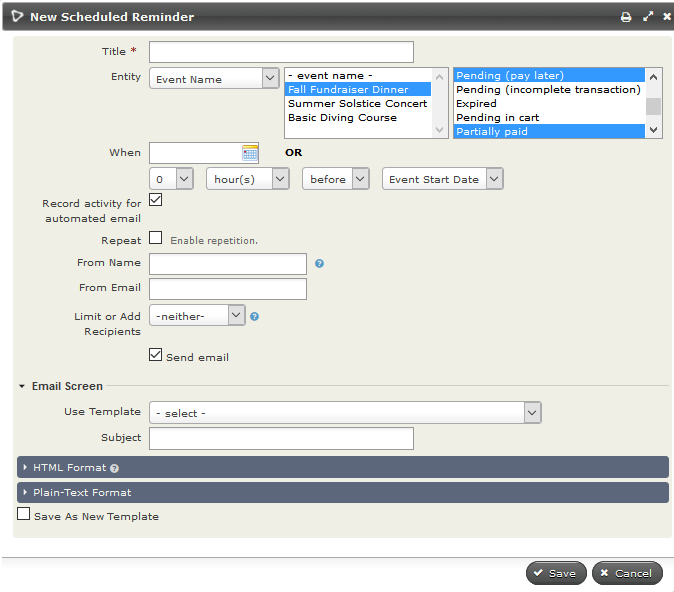
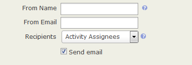
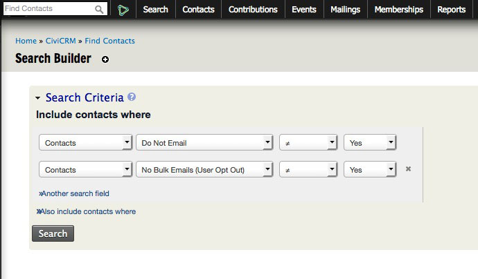

Scheduled reminders
===================

Scheduled reminders allow you to automatically send messages (through
email or SMS) to contacts when certain criteria are met. For example:
you can set up a reminder SMS to be automatically sent to participants
the day before they attend a training course; or you can send a series
of emails to contacts asking them to renew their membership as they
approach their membership end date.

There are several components (Entities) of CiviCRM that support
scheduled reminders:

-   contacts
-   activities
-   memberships
-   events
-   contributions

You can create scheduled reminders for all these components at
**Administer > Communications > Schedule Reminders**.

Scheduled reminders for events can also be set up on the event
configuration pages.

### Tokens available to scheduled reminders

In addition to the standard tokens (see *Tokens and mail merge* in
*Common workflows* for a full explanation of tokens) that are available
in CiviMail, messages sent via scheduled reminders can also contain
tokens representing information about events, activities, contributions
and memberships that the scheduled reminder pertains to. This allows you to use
one scheduled reminder template for various events, membership, contribution
or activity types.

In event messages, tokens such as event location will be replaced with
the specific location of the event. In membership messages, you have
access to each individuals expiry date, and so on. Membership and event
ID tokens are also available and can be used to create links to specific
pages (such as the membership renewal page).

Note that you also have access to the checksum token which allows you to
authenticate people to specific pages without them needing to log in,
and show forms with details already filled in.

Creating and managing scheduled reminders
-----------------------------------------

Scheduled reminders can be created from the administration page at
**Administer > Communications > Schedule Reminders** or during the
creation of an event.

When you click on **Add Reminder** under **Administer > Communications >
Schedule Reminders.** The exact options that are visible depend on the
**Entity** chosen but all scheduled reminders are fairly similar. The
general process is:

1.  Give your reminder a name that will help you or others identify it.

2.  Select the required **Entity**. The options you can base your
    scheduled reminder on will be displayed in the adjacent window. This
    a multi-select field, so you could choose to include more than one
    option in this field. Depending or your selection in this middle
    field a third set of option will appear in the right box. Again this
    is usually a multi-select field.
3.  Choose when to send the reminder. This can be a set date or an
    amount of time before or after the start or end of your chosen
    entity.
4.  Check the Repeat box if you want to send this reminder more than
    once to the same group of people. This gives you choices about the
    interval of repetition and when the repetition should end.
5.  Check **Record activity for automated email** if you want a record
    of the contacts who received this reminder.
6.  Fill in **From Name** and/or **From Email** if you don't want this
    reminder to come from the default name and email address for your
    site.
7.  Limit or add to your recipient list. For more about your choices,
    see *Limiting or adding to your recipient list* in this chapter.
8.  Choose to send your reminder as an email, an SMS or either depending
    on the preferred method(s) of communications for the contact.
    NOTE: The SMS option will only be available if you have
    [set up an SMS Gateway](.../sms-text-messaging/set-up)
9.  Compose your message. You can use Message Templates or write the
    message from scratch.
10. Click **Save** when you are are done.

Reminders can be edited, disabled, or deleted from **Administer >
Communications > Schedule Reminders**.

IMPORTANT: Your system administrator will need to ensure that the Send
Scheduled Reminders scheduled job is enabled and runs at least once a
day. Refer to the [Scheduled Jobs](../initial-set-up/scheduled-jobs)
section for configuration details.  

Using scheduled reminders for contacts
--------------------------------------

These can be based on:

-   Birth Date
-   date the contact record was created (Created Date)
-   date the contact record was modified (Modified Date)
-   custom contact date fields (such as marriage date or the date a
    qualification expires.)

Configuration options for Contact reminders:

-   Send a reminder ever year on the same date (anniversary -
    particularly suitable for celebration dates such as birthdays or
    marriages) or only once in relation to the actual date (appropriate
    for non-repeating events such as expiring qualifications).

By default, reminders created from this screen apply to all contacts
with dates set for the specified field. If you don't want everyone to
receive the reminder (eg. send birthday greetings to children but not to
adults), you will need to limit the recipients. (See *Limiting or
adding to your recipient list* in this chapter.)

Using scheduled reminders for activities
----------------------------------------

Scheduled reminders can be based on any combination of core and
custom activity types.

Options include:

-  sending to contacts with the specified activity types and any
   combination of activity statuses. (e.g., scheduled and/or completed
   and/or cancelled)
-   sending only to the Activity Assignees (those in the Assigned To
    field) or only to the Activity Targets (those in the With Contact
    field) or only to Activity Sources (the logged-in user who added the
    Activity) for the specified activity type(s) and statuses.
    (See *Limiting or adding to your recipient list* in this chapter for
    more information.)

Here are some ways you might want to use reminders for activities:

-   Log calls with major donors via the Phone Call activity and
    automatically send emails to your executive director containing the
    Activity Details.
-   Send reminders to your staff about the interviews they are assigned
    to conduct.
-   Send notifications to the person who scheduled an activity that it
    has been completed.
-   Send thank-you notes to people who met with you.

Using scheduled reminders for contributions
-----------------------------------------

You can set up emails to be sent out to your contributors based on the page
they donated through or the contribution/financial type of their donation.

Options include:

-  sending to contacts who contributed through the selected contribution
   page(s) with any combination of contribution statuses.
-  sending to contacts who made a contribution of the selected financial
   type(s) with any combination of contribution statuses.

Using scheduled reminders for memberships
-----------------------------------------

You can set up messages to be sent out to members based on various
characteristics of their membership, including the membership type and
status. For example, you can send renewal reminder emails based on
membership expiry date for current members 1 month before their
membership end date or 'sorry you are leaving' emails 1 week after their
membership end date. You could also send membership engagement letters
2 weeks after the membership start date to remind them of the benefits
of their membership. Note that as well as sending emails based on
membership, you can also send emails based on the membership related
activities like Membership Signup (which is what we use in the 'Chasing
members who have not sent membership payments' example below).

Below are a couple of examples of ways you can use scheduled reminders
for memberships.

### Renewal reminders

To send a renewal reminder email to members 5 days before their
membership expires:

1.  Select Entity Type = Membership
2.  Select one or more Membership Types
3.  If the selected membership types allow auto-renewal, you may want to
    only send this reminder to memberships that do NOT renew
    automatically.
4.  Set 'When' to be 5 days before Membership End Date
5.  Do **not** select Repeat.
6.  Check 'Send Email' and choose the Template (or create and save one).

What information you should include in a renewal email will be discussed
in *Renewals* in the *CiviMember* section.

Note: If a member renews, they will receive their next reminder 5 days before
their new Membership End Date.

### Chasing members who have not sent membership payments

To send scheduled reminders to contacts who have memberships that are
pending because payment has not been received:

1.  Create a smart group for contacts with a membership status of
    pending.
2.  In scheduled reminders set Entity Type = Activity, Membership
    Signup, Completed. Note that we are using the Activity entity, not
    the membership entity.
3.  Restrict Recipients to the membership pending smart group. This is
    important as if we don't set this, all members (even those that have
    already paid) will receive the message.

Using scheduled reminders for events
------------------------------------

Event reminders can be set up via the Scheduled Reminders administration
screen (as detailed above) or from the Schedule Reminders screen in the
event configuration workflow. (To get there, either click the Schedule
Reminders tab when setting up an Event, or Configure > Schedule
Reminders next to your event on the Manage Events screen.) The steps to
configure the reminder are the same as from the administration screen
(see above).

Any reminder set up from the event configuration screen applies only to
that specific event. If you would like to send out reminders for all
events of a certain type (for example, evaluation forms after
workshops), you should use the Scheduled Reminders administration
screen.

The configuration options specifically for Event reminders consist of:

-   Sending only to participants in specific event(s) or sending to
    participants in all events of a given type(s) (conference, meeting
    etc.)
-   Sending to all participants in the chosen events or only to
    participants with specified participant statuses (e.g. registered
    and attended, or cancelled and no-show)
-   Sending to all participant roles with the appropriate statuses or
    only to specified participant roles (e.g., volunteer and host, or
    attendee or speaker)

Since you have so many configuration options, you could set up an event
reminder for almost any purpose you can think of. Here are a few
examples:

-   Send an email to the volunteers for your annual fundraising dinner
    the day before the event reminding them what time to arrive.
-   Send fundraising emails to the attendees of all your training
    courses the day after the courses are held.
-   Ask for feedback from event attendees.
-   Send a thank-you email to your event speakers and hosts.
-   Email people who registered but didn't show up for your event to
    gather information about why.

Limiting or adding to your recipient list.
--------------------------------------------

As already outlined, you select the recipients of your scheduled
reminders based on entity specific characteristics such as event type
and participant status, membership type and auto-renew options, activity
type and status, or a entry in a contact date field.

For scheduled reminders based on activities you can further limit who
receives the reminder using the Recipient field by electing to send it
only to **Activity Assignees** or **Activity Source** or **Activity
Targets** or to send it to a predefined group **(Select a group)** or to
a list of contacts that you manually specify **(Choose recipient(s))**.
It is important to remember that groups or manual recipients selected
will only receive the scheduled reminder if they meet the all other
criteria for that reminder.

For Event, Contact and Membership scheduled reminders you can limit
recipients to members of a group, to a particular participant role
(Event reminders only) or to a list of contacts you have manually
selected. This is done by setting **Limit or Add Recipients** to
**Limit to** and choosing either **Select a group** or **Choose
recipient(s)** or **Participant Role** (Event reminders only) from the
adjacent option list. You could use this feature to, say, only send
birthday greetings to your members who are less than 12 years old.

As with activity reminders, it is important to remember that groups,
manual recipients or roles selected with the **Limit to** option will
only receive the scheduled reminder if they meet all other criteria for
that reminder.

If you want to send a scheduled reminder to contact(s) who do not meet
the general criteria for that reminder you should set **Limit or
Add Recipients** to **Also include**. You can then select a group of
contacts or an individual who will receive the reminder even if they
don't meet the other criteria.

For example if you send an event reminder to registrants 2 days before
an event, you can also send it to Bob Adams, your office manager, so
that he will remember to check that the event room is set up in the
appropriate configuration with any equipment required.

Scheduled reminders and privacy options
---------------------------------------

Scheduled reminders are still sent to contacts who have opted out of
bulk emails and those who have selected the privacy option **Do not
email**. In some cases this is appropriate as these contacts will still
want to be reminded when an event they have registered for is
approaching or when their membership is due to be renewed. In other
situations it is not appropriate.

If you want to exclude contacts who have opted out of bulk emails from a
scheduled reminder you should:

1.  Find all contacts who have not selected the privacy options Do not
    email or NO BULK EMAIL. (You can do this using the Search Builder
    found at **Search > Search Builder** and updating the settings as
    indicated in the example below)
2.  Create a smart group from the search results.
3.  Select this smart group as the **Recipients** of the scheduled reminder.

