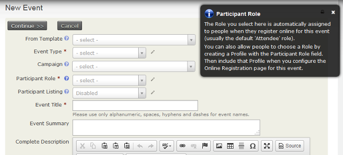
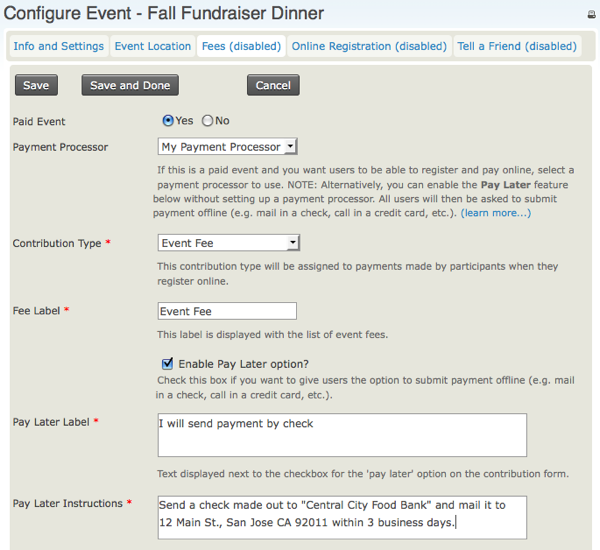
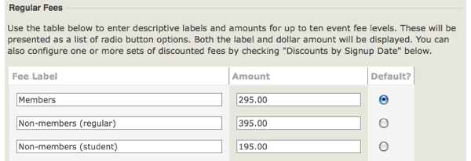
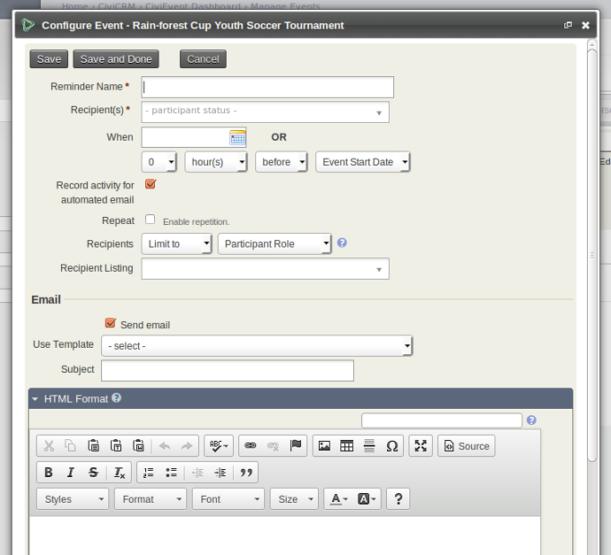
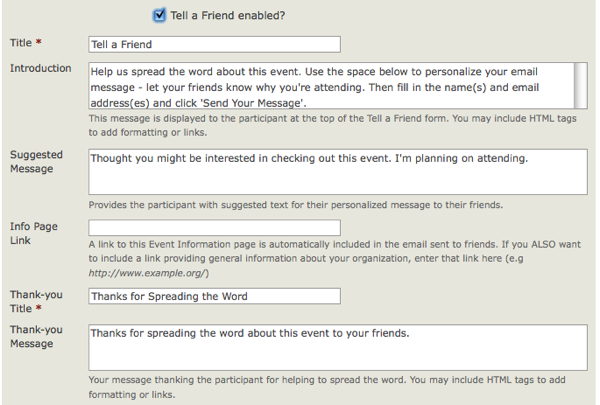
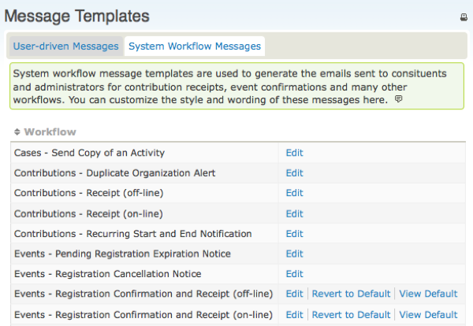

Création d'un événement
=======================

Ce chapitre décrit la façon de créér un nouvel événement et chacune des options disponibles dans les écrans de saisie.
Pour permettre l'inscription en ligne à un l'événement, vous devez lire le chapitre *online event registration*. Sinon vous pouvez également consulter ce chapitre : *manual event registration*.

Pour commencer, créez un nouvel événement en choisissant le menu : **Events > New Event**.(Si vous ne voyez pas le menu Evénement, assurez-vous que le composant Evénement est bien activé. Vous pouvez l'activer ici : **Administer > Configure > Global Settings > Enable Components**.)

Information et paramétrage
------------------------------

Le premier écran que vous voyez lors de la création demande des informations de base sur l'événement.
Vous pouvez cliquer sur l'un des points d'interrogation bleu pour afficher une aide sur chacun des champs à remplir. En cliquant sur le crayon à droite de certains champs vous ouvrez un écran où vous pouvez modifier les options disponibles.
Notez qu'en fonction de vos autorisations vous ne serez pas en mesure de voir ce crayon et vous ne pourrez modifier ces options

**From template** : vous permet de créer un événement à partir d'un modèle (voir le chapitre *Event templates* dans ce document)  plutôt que d'en créer un à partir de zéro.

**Event type** : permet de classer l'événement dans une catégorie.

Si vous avez activé **CiviCampaign**, vous pouvez sélectionner une campagne pour que cet événement y soit intégré (voir la section *Campaign* pour plus de détails).

**Rôle** : Attribue un type de rôle aux participants, tel que participant, animateur, conférencier, ou bénévole...

Quel est le rôle attribué aux participants lors de leur inscription en ligne pour cet événement?
La valeur placée dans ce champ sera attribué par défaut lorsque les utilisateurs s'enregistrent en ligne ou lorsque vous importez des enregistrements à moins que vous n'insériez le champ "rôle" avec d'autres valeurs dans votre fichier d'importation CSV. La valeur la plus commune est "Participant"

Voulez-vous que les visiteurs voient la liste des participants, et quelles informations souhaitez-vous afficher sur les participants?

 **Listing Participant** : Afficher la liste des participants permet de montrer leur intérêt et peut susciter d'autres inscriptions du public. Pour cela  cocher l'option *Activer* - liste de participants. Pour l'afficher, vous aurez besoin de  créer un élément de menu ou un lien vers la liste sur votre site. Une fois que vous avez créé l'événement, l'option *lien participant* est affichée sur la page de configuration de l'événement. Reportez-vous à la gestion de l'événement chapitre *Event management* pour obtenir des informations sur la liste des participants et d'autres façons de promouvoir vos événements.
 
Quel est le nom de votre événement ? Le **Titre de l'événement** apparaîtra sur les pages d'information, d'inscription, sur la liste des d'événements, et dans la Gestion des événements (Page administration). Assurez-vous de choisir un titre significatif qui represente votre événement.
Les deux champs suivants (**Résumé de l'événement** et **Description complète**) vous permettent de décrire votre événement. Le résumé et la description complète seront inclus sur les pages d'information de l'événement. Utilisez l'éditeur de texte enrichi prévu pour le champ de description afin d'inclure photos, images et texte formaté.

Entrez la **Date de début / heure** et la **Date de fin / heure** pour votre événement. Celles-ci seront incluses dans les pages d informations et la liste des événements.

Vous pouvez définir un **Nombre maximum de participants** pour chaque événement ainsi qu'un message à afficher lorsque ce nombre maximum est atteint.

Si vous souhaitez afficher une carte situant le lieu de l'événement, vous pouvez le faire en utilisant soit Google Maps ou Open Street (vous devrez configurer votre solution de cartographie par **Administrer> Paramètres système> cartographie et géocodage**).

Sélectionnez **Évènement public** pour inclure l'événement dans les listes promotionnelles telles que des flux RSS, des fichiers ou des flux iCal et la page de liste d'événements.

Sélectionnez **Autoriser le partage à travers les médias sociaux** pour inclure des liens sur les médias sociaux pour le partage de cet événement sur la page Information sur l'événement, page de remerciement, Tell-a-Friend  (si la page est activée), et dans les courriels de confirmation de l'événement.

Enfin, vous avez la possibilité de choisir que cet événement soit actif ou inactif
Si vous prévoyez de prendre un certain temps pour terminer la configuration de votre événement, choisisez de le rendre inactif jusqu'à ce qu'il soit terminé pour s'assurer qu'il ne figure pas par inadvertance sur la liste des flux d'événements. Vous pourrez ainsi  l'activer facilement lorsque vous serez prêt à le diffuser.

Après avoir vérifié les détails de cette page, cliquez sur **Continuer >>** pour créer votre événement et passer à l'étape suivante. Vous pouvez interrompre la configuration sur une page suivante en cliquant sur **Enregistrer et Terminé** et revenir plus tard pour examiner et modifier l'un des paramètres.

Pour revenir à un événement enregistré, accédez **Événements> Événements Manager** et cliquez sur **Configurer**  pour continuer à travailler ou modifier l'événement.

Localisation
--------------

L'étape suivante consiste à compléter la localisation et les coordonnées de l'événement.

Une fois que vous avez saisi le lieu de l'événement, vous pouvez le réutiliser pour des événements ultérieurs en cliquant sur **Utiliser un emplacement existant** en le sélectionnant dans la liste déroulante. Notez que si vous choisissez un emplacement existant et que vous le modifiez, il mettra à jour ce lieu pour tous les événements qui l'utilisent.

Vous pouvez aussi lister des numéros de téléphone et adresses e-mail sur la page d'information de l'événement si vous voulez donner aux inscrits un moyen de communiquer directement avec les organisateurs de l'événement. Si l'événement a lieu hors site de l'emplacement principal, vous pouvez également fournir des informations de contact sur le lieu de la réunion.

Tarif et Frais
--------------

Si l'événement est gratuit, cochez **Evénement payant** à **Non**, puis cliquez sur **Enregistrer** et passez à l'inscription en ligne.

Si l'événement est payant, cliquez sur **Oui**. L'écran affiche les options disponibles (voir l'ensemble des captures d'écran ci-dessous).

Quel **type de contribution** (type financier) sera affecté aux inscriptions payantes de cet événement? Bien que la valeur la plus courante pour ce champ soit simplement les frais d'inscription, CiviCRM offre la souplesse nécessaire pour définir plusieurs tarifs et les affecter à différents événements.
Voir *Set-Up* dans la section *Contributions* pour plus de détails.
Si vous prévoyez d'accepter des paiements par carte de crédit via le formulaire d'inscription en ligne, vous devez configurer un **processeur de paiement** avant de créer votre événement.
Pour plus d'informations consultez *Payment Processors* dans la section *Contributions*.

Si vous voulez permettre aux inscrits de payer plus tard, par l'envoi d'un chèque par exemple, de payer sur place en espèces ou par carte de crédit, ou autre moyen de paiement, dans ces cas activez **Payez plus tard** et définissez une étiquette et les instructions de paiement. Si cette option est décochée, les inscrits devront payer par carte de crédit.

**Regular Fees**  permettent de géréer plusieurs de niveaux de tarif à partir desquels l'inscrit doit choisir un niveau unique (par exemple, un enregistrement individuel pour 50 € ou un enregistrement familial pour 100 €). A chaque montant de tarif est attribué une étiquette, vous pouvez ainsi définir des tarifs par défaut. Cette façon donne satisfaction pour de nombreux événements et est facile à mettre en place. Voici un exemple simple:

Si votre événement nécessite une structure de tarif plus complexe, avec plus d'options ou d'add-ons supplémentaires, vous pouvez utiliser **ensembles de prix** ou **rabais**. Pour plus d'informations à ce sujet, reportez-vous au chapitre * Frais d'événement complexes * de cette section.

Enregistrement en ligne
-----------------------

Permettre au public de s'inscrire en ligne via votre site Web offre de nombreux avantages. L'inscription en ligne est aisée et permet à votre personnel de gagner du temps. Si vous n'avez pas besoin d'offrir l'inscription en ligne, ne cochez pas **Autoriser l'inscription en ligne** et passez à l'étape suivante. Si vous souhaitez autoriser l'inscription en ligne, consultez le chapitre * Enregistrement des événements en ligne * de cette section.

Rappels programmés
------------------

Des rappels programmés peuvent être utilisés pour envoyer automatiquement des courriels d'inscription à l'événement avant ou après les événements, par exemple

-   Une semaine avant: pour leur rappeler le lieu et l'horaire de la conférence
-   Un jour après: pour leur demander de remplir un formulaire de commentaires
-   Deux jours avant : dans l'attente du paiement convenu et les informer que leur inscription sera annulée si le paiement n'est pas reçu dans les 48 heures suivantes.

Pour configurer un rappel planifié sur un événement spécifique, cliquez sur l'onglet "Rappels planifiés", qui vous montrera  les rappels déjà planifiés pour cet événement (si c'est le cas) et cliquez sur **Add Reminder**.
    

Remplissez les champs de ce formulaire pour envoyer, par exemple, un courriel à tous les intervenants inscrits 3 jours avant la date de début de l'événement. Notez que vous pouvez limiter les destinataires par statut et aussi par rôle (conférencier, participant, bénévole, etc.). Vous pouvez utiliser un modèle ou composer votre propre message dans la zone de format HTML.

En plus de configurer des modèles de rappels généraux des événements, vous pouvez également les configurer pour des types d'événements spécifiques et les ajouter à des modèles d'événements spécifiques.
L'idée est essentiellement la même que ci-dessus, mais vous pouvez accéder à cette fonctionnalité à partir de **Administer> Communications> Rappels planifiés**.

Informer un ami
---------------

CiviEvent makes it easy to leverage the social networking power of your committed constituents by empowering them to quickly and easily share details about your organization and event with their friends and colleagues. The
final step in the event creation is a page where you can enable
"Tell-A-Friend" capabilities. You can define the text and links to be
included on that page and in the email sent from the tool (see the
following screenshot).

A "Tell a friend" activity record will be added to a participant's
Activities tab each time she sends mail to her friends. This allows you
to track your most active supporters and engage them further. The people
who are emailed using this feature are also automatically added to
CiviCRM as contacts.

Registration confirmation and receipting
----------------------------------------

You can send automated confirmation and receipt emails to participants
who register for an event, whether they register online are registered
by your staff or volunteers. The content and layout of these emails are
controlled by message templates*.*Both HTML and Text formats are
provided. You can modify or add text to these emails, or add branding
such as a logo to the HTML versions. To set up a from email address from
which to send the confirmation and receipts, see Set-Up in the Email
section.

Navigate to **Administer > Communications > Message Templates** (shown
in the following screenshot) and click the **System Workflow Message**
tab to see the list of messages you can modify. Click **Edit** next to
"Events - Registration Confirmation and Receipt" rows to edit the
content and layout.

The templates for these messages include both the text shown and
necessary program logic. Use caution when editing so as not to modify
the program logic. Be sure to test the workflow and review the emails
sent after making any changes. If you find that your changes have caused
problems, errors or missing information, you can always revert to the
system default for that workflow.  
