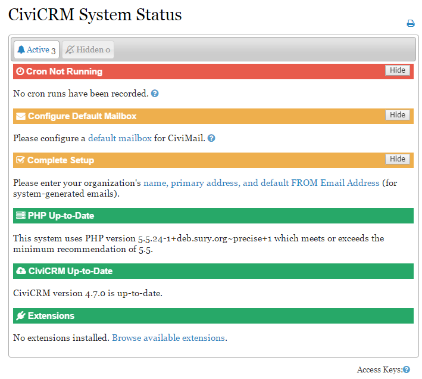

L'état du système
=================

À partir de la version 4.7, l'écran de l'état du système affiche un aperçu de l'état actuel de diverses informations techniques liées à votre installation CiviCRM. Pour accéder à cet écran, naviguer à : **Administration > Console système > État du système**.

Les items en *rouge* doivent être vérifiés aussitôt que possible. Un item en rouge signifie généralement qu'une technicalité pourrait empêcher CiviCRM de fonctionner correctement.

Les items en *orange* devraient être vérifiés également. Ces items sont moins urgents, mais pourraient néanmoins avoir des conséquences sur le bon fonctionnement de CiviCRM.

Les items en *vert* sont correctement configurés et sont affichés pour information seulement.

Résolution des problèmes
-------------
Les items devant être résolus affichent généralement un lien ou un point d'interrogation avec plus d'information pour vous guider dans vos démarches.
