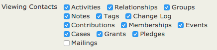
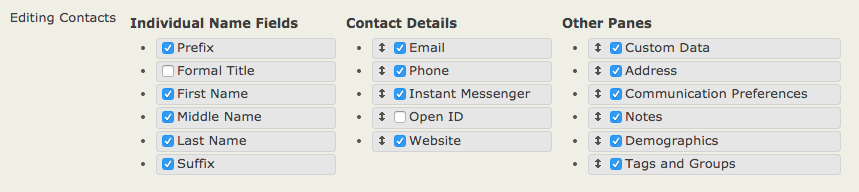
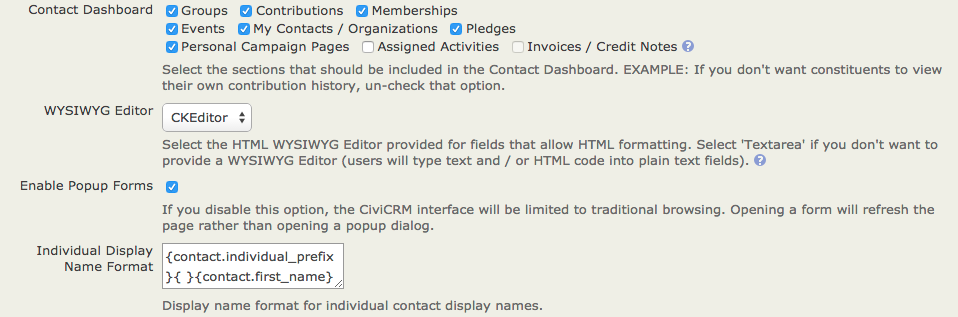
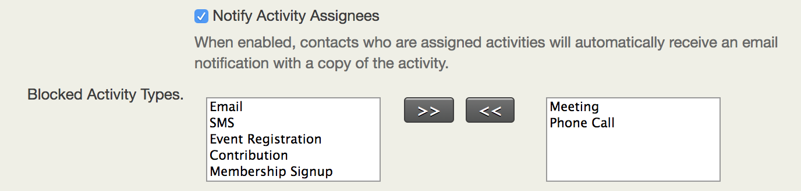

# Customizing the user interface

CiviCRM is highly flexible and customizable. This chapter gives
information on the many ways you can change the interface to suit your
needs and make it easier for your users.

How to customize your data itself &mdash; what you collect and track &mdash; is covered
in *Organising Your Data* and in the *What you need to know*and *Set-up*
chapters in the sections on the different CiviCRM components (e.g.,
learn about customizing event types in the *Events* section).

## Changing dropdown options

The options included in the dropdown fields you see on contact
entry/editing forms in CiviCRM can be modified (you can add, rename,
disable or remove options) from **Administer > Customize Data and
Screens > Dropdown Options**. These include:

-   Gender
-   Individual prefixes and suffixes (e.g., Ms., Mr. and Jr., Sr.)
-   Phone types (e.g. Phone, Mobile, Pager)
-   Mobile phone providers (e.g. Sprint, Verizon and Cingular)
-   Instant messenger services (e.g., Yahoo, MSN, AIM, GTalk, Jabber and
    Skype)
-   Website types (e.g., Work, Facebook, Twitter)
-   Location types (e.g., Home, Work, Billing, Main). Note that that
    Billing location is assigned to Billing Addresses entered when
    constituents contribute or pay for event and membership fees online.
    Location type names may not contain spaces (e.g., Summer Home is not
    permitted; use SummerHome).

The choices in Preferred Communication Methods (e.g., Phone, Email,
Postal Mail, SMS) in the contact edit/entry form can also be modified;
go to **Administer > Communications > Preferred Communications
Methods**.

Modifying dropdown options that define data &mdash; such as Activity Type,
Relationship Type, Contribution Status, etc. &mdash; is outside the scope of this chapter; see *Organising
Your Data* and the sections on the different CiviCRM components.

## Changing display preferences

If there are types of activities you do not track or categories of data
you do not collect, you can make it so these fields and tabs don't even
show up when your users log into CiviCRM. This can make training and
everyday use much easier.

To do this, go to **Administer > Customize Data and Screens > Display
Preferences**.

You can change which tabs are available when you are viewing contact
records by checking and un-checking the appropriate boxes next to
**Viewing Contacts**.

For example, if your organization is not using Cases or Grants, you
could uncheck those boxes and those tabs would no longer show up in the
user interface. If you later decide start using them, simply re-display
the tab by checking the box. Information stored in the tabs you hide
remains in your database; you can hide tabs you have already used, and
when you choose to display them again, all the information will display
as it did before.

You can change which blocks of information appear when you are editing a
contact by checking and unchecking the appropriate boxes next
to **Editing Contacts**:

For example, if your organization doesn't collect information
Demographics or Communication Preferences, you could uncheck those boxes
to streamline the editing screen. As with the Viewing Contacts
preferences, any information contained in fields you choose not to
display remains in your database, and you can choose to display it again
at any time by re-checking the boxes in this setting.

### Disabling Popup Forms

The CiviCRM user-interface makes extensive use of popup dialog boxes to
enable quick viewing and easy editing of data. You can disable this
feature and limit the interface to traditional browsing by deselecting
the checkbox **Enable Popup Forms** in **administer > customize data and
screens > display preferences**. Note that CiviCRM will be slower with
this feature disabled as every form will require a complete page load in
the browser.

### Disabling Activity Assignee Notifications

When an activity is created, CiviCRM sends notifications to all activity
assignees by default. You can disable this feature by deselecting the
checkbox **Notify Activity Assignees** in **Administer > Customize Data and
Screens > Display Preferences**. You can also selectively disable email
notifications for specific activity types by selecting them in the field below.

## Customizing search preferences

You can change CiviCRM's default search behavior at **Administer >
Customize Data and Screens > Search Preferences**. Available options
are:

-   **Automatic Wildcard** (choose Yes or No): If you choose Yes,
    wildcards are automatically added to the beginning AND end of the
    search term when users search for contacts by Name. For example,
    searching for "ada" will return any contact whose name includes
    those letters: Adams, Janet; Nadal, Jorge; etc. If disabled, a
    wildcard is still added, but only to the end of the search term. In
    this case, searching for "ada" will return any contact whose last
    name begins with those letters: Adams, Janet' but not Nadal, Jorge.
-   **Include Email** (choose Yes or No): If you choose Yes, email
    addresses will be automatically included when users search by Name.
-   **Include Nickname** (choose Yes or No): If you choose Yes, contents
    of the Nickname field will be automatically included when users
    search by Name.
-   **Include Alphabetical Pager** (choose Yes or No): If you choose
    Yes, a bar will appear at the top of your search results allowing
    you to choose a letter of the alphabet. Clicking A, for example,
    will take you to a page displaying only contacts that begin with A.

-   **Include Order By Clause** (choose Yes or No): If you choose No,
    your search results will not be ordered.
-   **Smart group cache timeout**: This determines how often the smart group cache is refreshed. For most sites this value should not be set to zero, since that means no caching at all and will slow down your site.  Even on sites where contact data changes frequently, the suggested minimum value is 5 minutes.
-   **Autocomplete Contact Search**: This is a series of checkboxes for
    basic contact fields (name, email, phone, etc). The fields that are
    checked will show up in the autocomplete results list that appears
    when you use the Quick Search bar at the top left of all screens.
-   **Contact Reference Options**: This is a series of checkboxes for basic contact fields (name, email, phone, etc). The fields that are checked will show up in the autocomplete dropdown search results for 'Contact Reference' custom fields.
-   **Autocomplete Results**: This determines the maximum number of results that will be displayed when typing in an autocomplete field.

If your database is large and your searches are slow, consider disabling
some of these options to increase your speed.

There is one more place to customize search search settings:
**Administer > Customize Data and Screens > Display Preferences** has
a block of **Contact Search** settings:

These check boxes modify the **Search > Find Contacts** and **Search >
Advanced Search** screens. Uncheck the boxes to remove the corresponding
types of fields from your search screens.

## Customizing date preferences

The default display preference for dates is set at **Administer >
Localization > Date Formats**.

You can override this default setting and define the range of allowed
dates for specific field types at **Administer > Customise Data and
Screens > Date
Preferences**.
By default, CiviCRM provides ranges for input on specific date fields.
For instance, the default range for Activity Dates are 20 years prior to
the current year all the way through to 10 years beyond the current
year. If you would like to track activities that have occurred, say, 25
years ago then you would need to update this range to enable your end
users to log these activities.

## Customizing the navigation menu

You can add, delete, rename, and move all items in the CiviCRM
navigation bar to better meet the needs of your users. Some things you
might want to do are:

-   Streamline the navigation by removing menu items you don't use
-   Add items to support specific workflows (e.g. data entry Profiles)
-   Add links to non-CiviCRM web pages or apps
-   Rename menu items to use terms for familiar to your users
-   Move menu items to better support the flow of your work

To customize menu items, go to **Administer > Customize Data and
Screens > Navigation Menu**. You will see a file structure containing
all of your menu items, with the items represented by folder icons.
Expand folders by clicking the small triangles to the left of their
names.

-  To delete an item, right-click it and select **Delete**.
-  To rename an item, right-click it and select **Rename**.
-  To move an item, drag and drop it to the desired location in the tree structure.
-  To add an item:
 1.  Click on the **Add Menu Item** button.
 2.  Enter the text you want to appear in the menu in the **Title**
    field.
 3.  Enter the link to your item in the **Url** field.
 4.  Select the location of your new item from the **Parent** dropdown
    menu. You can place the item anywhere in the navigation, at any
    level. If you want your new item to be in the top level of the
    navigation, do not select anything from this dropdown.
 5.  Check the **Separator** box if you want to add a line below your new
    item to separate it form the item below.

## Making custom data entry forms

If you have staff or volunteers who are often entering batches of
similar contacts manually, you can create a tool called a Profile with
only the fields they need. This can speed up data entry considerably.

1.  Go to **Administer > Customize Data and Screens > Profiles**and
    click**Add Profile**.
2.  Give your Profile a clear name that relates to its purpose (e.g.,
    Name and Address Data Entry Form)
3.  Check the Standalone Form or Directory box in the **Used For**
    field.
4.  Use the **Pre-form Help** and **Post-form Help** fields to add any
    text you'd like to display to hose doing data entry.
5.  Click **Save**; this takes you to the Add Fields screen so you can
    choose which fields to put in your Profile.
6.  From the **Field Name** dropdown menu, select the contact record
    type where your desired field is found. This will be Contact,
    Individual, Organization, Household, or any custom contact subtypes
    you may have created. (The other record types available on this menu
    will not work with data entry forms, so do not choose them.) It's
    important to note that any field applying to more than one kind of
    contact record type (such as Phone or Email, which applies to both
    Individuals and Organizations) will be found on the Contacts menu.
7.  Once you have chosen a contact type, another dropdown menu will
    appear listing the available fields. Choose your desired fields.
8.  If the text that appears automatically in the **Field Label** field
    is not what you would like to appear on the form, edit it.
9.  If every record entered through this form must have data in this
    field, check the **Required?** box.
10. Use the **Field Pre Help** and **Field Post Help** fields to add any
    text you'd like to display to those doing data entry.
11. You can use the **Order** field to change the order in which fields
    are displayed on the form. Lower numbers are displayed ahead of
    higher numbers.
12. Click on **Save and New** to add more fields, and **Save** when are
    finished.
13. You'll be taken to a screen listing all your fields and their settings. Click **Preview (all fields)** to make sure your form looks the way you want it to. Click **Use (create mode)** to go to the page containing your form. Copy the link and use it to create a navigation menu item (see [Customizing the navigation menu](#customizing-the-navigation-menu)).

## Customizing search views

To do this:

1.  Create or open a profile and mark it as used for Search Views (known
    as Search Results in 4.1 and previous):
2.  When adding fields to this profile, you will need to set Visibility
    for the fields to Public Pages and check the Results Column box.

When conducting your advanced search, use the **Search Views** dropdown
menu in the top right of the page to select your Profile (see image
below).

## Using Word Replacement to change terminology

CiviCRM has a Word Replacement setting that lets you replace existing
text found in the system with your desired text. For example, if your
organization does not typically refer to monetary transactions as
"contributions," but prefers to use the term "donations," you can define
a word replacement and have it automatically altered throughout your
instance of CiviCRM.

To use Word Replacement:

1.  Go to **Administer > Customize Data and Screens > Word
    Replacements**.
2.  Enter the original text in the Original column on the left, and the
    replacement text in the Replacement column on the right.
3.  Check the Exact Match box on the right to replace only instances of
    the word or phrase that match exactly. For example, if Exact Match
    is not checked checked, replacing "Contribution" with "Donation"
    would also replace "Contributions" with "Donations"; if it is
    checked, this would not happen.
4.  Check the Enabled box to the left to replacement of the word or
    phrase.
5.  You can add additional rows using the **Add row** button.
6.  Click **Save** when you are finished entering replacements.

When using this function, be sure to anticipate alternate forms of words
and different ways your chosen word or phrase may appear in CiviCRM.
