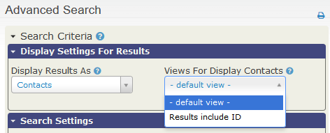

Personnalisation de l'interface utilisateur
==========================================

CiviCRM est très flexible et personnalisable. Ce chapitre donne des informations sur les nombreuses façons de modifier l'interface en fonction de vos besoins et de la rendre plus conviviable pour vos utilisateurs.

La façon de personnaliser vous-même vos données est traité dans *Organiser vos données* et dans les chapitres *Ce que vous devez savoir* et *Configurer* dans les sections des différents composants CiviCRM (exemple : La personnalisation des types d'événements dans la section *Evenements*).

Modifier les listes déroulantes
-------------------------------

Les options incluses dans les champs déroulants que vous voyez dans les formulaires de saisie/d'édition de contact dans CiviCRM peuvent être modifiées (vous pouvez ajouter, renommer, désactiver ou supprimer des options) dans **Administer> Personnaliser les données et les écrans> Listes déroulantes**. Ceci inclus:

-   Le sexe : Homme, Femme
-   Préfixe et suffixe individuel (exemple : Mme., Mr., Docteur, Me., et Jr., Sr.)
-   Type de téléphone (exemple : Téléphone, Mobile, Fax..)
-   Fournisseurs de téléphonie mobile (exemple : orange, SFR, Free,...)
-   Messagerie - Chat : (exemple: Yahoo, MSN, Skype, ... )
-   Type de site Web : (exemple : Personnel,Entreprise, Facebook, Linkedln, Twitter,...)
-   Type d'adresse : (exemple : Principale, domicile, Bureaux, Compta, Facturation,..). Notez que l'adresse de facturation est attribuée lorsque les membres contribuent ou paient les frais d'inscription et d'inscription en ligne. Le type d'adresse ne doit pas contenir d'espaces.(ex : "Résidence secondaire", n'est pas permis).

Les choix des Moyens de communication préférées (par exemple, Téléphone, Email, Courrier postal, SMS) dans le formulaire d'édition/saisie de contact peuvent également être modifiés. Allez à **Administrer> Communications> Méthodes de communication préférées**.

Les choix de Méthodes de communication préférées (par exemple, Téléphone, Email, Courrier postal, SMS) dans le formulaire d'édition / saisie de contact peut également être modifié.  Allez à **Administrer> Communications> Méthodes de communication préférées**.

La modification des options de liste déroulante qui définissent des données, telles que Type d'activité, Relations, etc., ne relève pas du champ d'application de ce chapitre. Voir *Organiser vos données* et les sections sur les différents composants CiviCRM.

Modification des préférences d'affichage
----------------------------------------

S'il existe des types d'activités ou des catégories de données que vous ne souhaitez pas utiliser, vous pouvez faire que ces champs et ces onglets ne s'affichent pas lorsque vos utilisateurs utilisent CiviCRM. Ce qui permet de faciliter la formation des utilisateurs et l'utilisation quotidienne. Pour cela allez à : **Administer > Personnaliser les données et écrans > Préférences d'affichage**.
Ensuite : **Informations à afficher** : vous pouvez modifier les onglets disponibles en cochant ou décochant les cases appropriées pour voir ce qui est nécessaire lorsque vous consulterez les enregistrements de contact.

Par exemple, si votre organisation n'utilise pas les Dossiers ou les Subventions, vous pouvez les décocher. Ces onglets ne s'afficheront plus dans l'interface utilisateur. Si vous décidez plus tard de les utiliser, il suffit de ré-afficher l'onglet en cochant la case appropriée. Les informations stockées dans les onglets que vous masquez restent dans votre base de données. Vous pouvez masquer les onglets que vous avez déjà utilisés, et lorsque vous choisirez de les afficher à nouveau, toutes les informations s'afficheront comme auparavant.

Vous pouvez choisir les informations qui apparaitront sur les fiches de contact en cochant ou décochant les cases appropriées en regard de **Information éditables**:

Par exemple, si votre organisation ne collecte pas d'informations démographiques ou de préférences de communication, vous pouvez les décocher pour rationaliser l'écran d'édition. Comme pour les préférences *informations à afficher*, toutes les informations contenues dans les champs que vous choisissez de ne pas afficher restent dans votre base de données et vous pouvez choisir de l'afficher à tout moment en cochant de nouveau les cases de ce paramètre.

### Désactiver les boites de dialogue (popup)

L'interface utilisateur CiviCRM fait un usage étendu des boîtes de dialogue contextuelles (popup) pour permettre une visualisation rapide et une édition facile des données. Vous pouvez désactiver cette fonctionnalité et limiter l'interface à la navigation traditionnelle en désélectionnant la case à cocher **Enable popup** dans **Administrer> Personnaliser les données et les écrans> Préférences d'affichage **. Notez que CiviCRM sera plus lent avec cette fonction désactivée car chaque formulaire nécessitera une charge de page complète dans le navigateur.

Personnalisation des préférences de recherche
---------------------------------------------

Vous pouvez modifier le paramétrage de recherche par défaut de CiviCRM dans **Administer> Personnaliser les données et les écrans> Préférences de recherche**. Les options disponibles sont:

-   **Recherche aproximative** : (choisissez Oui ou Non): Si vous choisissez Oui, les caractères génériques sont automatiquement ajoutés au début ET à la fin du terme de recherche lorsque les utilisateurs recherchent des contacts par Nom. Par exemple, la recherche de "ada" renverra n'importe quel contact dont le nom inclut ces lettres: Adams, Janet; Nadal, Jorge; Etc. Si elle est désactivée, un caractère générique est ajouté, mais uniquement à la fin du terme de recherche. Dans ce cas, la recherche de "ada" renverra tout contact dont le nom de famille commence par ces lettres: Adams, Janet 'mais pas Nadal, Jorge.

-   **Inclure l'adresse électronique** : (Choisissez Oui ou Non): Si vous choisissez Oui, les adresses électroniques seront automatiquement incluses lorsque les utilisateurs effectueront une recherche par nom.

-   **Inclure le surnom** : (choisir Oui ou Non): Si vous choisissez Oui, le contenu du champ Surnom sera automatiquement inclus lorsque les utilisateurs effectueront une recherche par nom.

-   **Inclure une pagination alphabétique** : (choisissez Oui ou Non): Si vous choisissez Oui, une barre apparaît en haut de vos résultats de recherche vous permettant de choisir une lettre de l'alphabet. En cliquant sur A, par exemple, vous accédez à une page affichant uniquement les contacts commençant par A.

-   **Inclure la clause « order by »** (Choisissez Oui ou Non): Si vous choisisez NON, les résultats de recherche ne seront pas ordonnés.

-   **Délai d'attente de cache de groupe intelligent**: Détermine la fréquence à laquelle le cache de groupe intelligent est actualisé. Pour la plupart des sites cette valeur ne doit pas être définie à zéro, car cela signifie pas de mise en cache du tout et ralentira votre site. Même sur les sites où les données de contact changent fréquemment, la valeur minimale proposée est de 5 minutes.

-   **Expiration de la mémoire cache des groupes dynamiques**: Détermine la fréquence à laquelle le cache de groupe intelligent est actualisé. Pour la plupart des sites cette valeur ne doit pas être définie à zéro, car cela signifie pas de mise en cache du tout et ralentira votre site. Même sur les sites où les données de contact changent fréquemment, la valeur minimale proposée est de 5 minutes.

-   **Recherche de contacts avec autocomplétion**: Il s'agit d'une série de cases à cocher pour les champs de contact de base (nom, courriel, téléphone, etc.). Les champs cochés apparaissent dans la liste des résultats de la saisie semi-automatique qui s'affiche lorsque vous utilisez la barre de recherche rapide en haut à gauche de tous les écrans.

-   **Options référence à contact**: Il s'agit d'une série de cases à cocher pour les champs de contact de base (nom, courriel, téléphone, etc.). Les champs sélectionnés seront inclus dans les listes déroulantes de résultats de recherche pour les champs personnalisés de type référence contact. Le nom de contact est toujours inclus. Note: Vous devez assigner au rôle "public" la permission d'accès aux champs de référence contact si vous voulez utiliser des champs personnalisés de référence contact dans des profils sur des pages publiques. Dans la plupart des situations, vous devrez cocher le paramètre « Restreindre la liste au groupe » lorsque vous configurez un champ de référence contact qui est inclus dans des formulaires publics pour ne pas afficher la liste complète de vos contacts.

-  **Autocomplete Results**: Détermine le nombre maximal de résultats qui s'afficheront lors de la saisie d'un champ de saisie semi-automatique.

Si votre base de données est importante et que vos recherches sont lentes, envisagez de désactiver certaines de ces options pour augmenter votre vitesse.

Personnalisation des préférences de date
----------------------------------------
L'affichage par défaut des dates est définie sur **Administer> Localisation> Formats de date**.
Vous pouvez remplacer les paramètre par défaut et définir la plage de dates autorisées pour les types de champs spécifiques à :  **Administer> Données et écrans personnalisés> Préférences de date**

By default, CiviCRM provides ranges for input on specific date fields.
For instance, the default range for Activity Dates are 20 years prior to
the current year all the way through to 10 years beyond the current
year. If you would like to track activities that have occurred, say, 25
years ago then you would need to update this range to enable your end
users to log these activities.

Customizing the navigation menu
-------------------------------

You can add, delete, rename, and move all items in the CiviCRM
navigation bar to better meet the needs of your users. Some things you
might want to do are:

-   Streamline the navigation by removing menu items you don't use
-   Add items to support specific workflows (e.g. data entry Profiles)
-   Add links to non-CiviCRM web pages or apps
-   Rename menu items to use terms for familiar to your users
-   Move menu items to better support the flow of your work

To customize menu items, go to **Administer > Customize Data and
Screens > Navigation Menu**. You will see a file structure containing
all of your menu items, with the items represented by folder icons.
Expand folders by clicking the small triangles to the left of their
names.

-  To delete an item, right-click it and select **Delete**.
-  To rename an item, right-click it and select **Rename**.
-  To move an item, drag and drop it to the desired location in the tree structure.
-  To add an item:
 1.  Click on the **Add Menu Item** button.
 2.  Enter the text you want to appear in the menu in the **Title**
    field.
 3.  Enter the link to your item in the **Url** field.
 4.  Select the location of your new item from the **Parent** dropdown
    menu. You can place the item anywhere in the navigation, at any
    level. If you want your new item to be in the top level of the
    navigation, do not select anything from this dropdown.
 5.  Check the **Separator** box if you want to add a line below your new
    item to separate it form the item below.

Making custom data entry forms
------------------------------

If you have staff or volunteers who are often entering batches of
similar contacts manually, you can create a tool called a Profile with
only the fields they need. This can speed up data entry considerably.

1.  Go to **Administer > Customize Data and Screens > Profiles**and
    click**Add Profile**.
2.  Give your Profile a clear name that relates to its purpose (e.g.,
    Name and Address Data Entry Form)
3.  Check the Standalone Form or Directory box in the **Used For**
    field.
4.  Use the **Pre-form Help** and **Post-form Help** fields to add any
    text you'd like to display to hose doing data entry.
5.  Click **Save**; this takes you to the Add Fields screen so you can
    choose which fields to put in your Profile.
6.  From the **Field Name** dropdown menu, select the contact record
    type where your desired field is found. This will be Contact,
    Individual, Organization, Household, or any custom contact subtypes
    you may have created. (The other record types available on this menu
    will not work with data entry forms, so do not choose them.) It's
    important to note that any field applying to more than one kind of
    contact record type (such as Phone or Email, which applies to both
    Individuals and Organizations) will be found on the Contacts menu.
7.  Once you have chosen a contact type, another dropdown menu will
    appear listing the available fields. Choose your desired fields.
8.  If the text that appears automatically in the **Field Label** field
    is not what you would like to appear on the form, edit it.
9.  If every record entered through this form must have data in this
    field, check the **Required?** box.
10. Use the **Field Pre Help** and **Field Post Help** fields to add any
    text you'd like to display to those doing data entry.
11. You can use the **Order** field to change the order in which fields
    are displayed on the form. Lower numbers are displayed ahead of
    higher numbers.
12. Click on **Save and New** to add more fields, and **Save** when are
    finished.
13. You'll be taken to a screen listing all your fields and their
    settings. Click **Preview (all fields)** to make sure your form
    looks the way you want it to. Click **Use (create mode)** to go to
    the page containing your form. Copy the link and use it to create a
    navigation menu item (see the previous section for instructions).

Customizing search views
------------------------

To do this:

1.  Create or open a profile and mark it as used for Search Views (known
    as Search Results in 4.1 and previous):
2.  When adding fields to this profile, you will need to set Visibility
    for the fields to Public Pages and check the Results Column box.

When conducting your advanced search, use the **Search Views** dropdown
menu in the top right of the page to select your Profile (see image
below).

Using Word Replacement to change terminology
----------------------------------------------

CiviCRM has a Word Replacement setting that lets you replace existing
text found in the system with your desired text. For example, if your
organization does not typically refer to monetary transactions as
"contributions," but prefers to use the term "donations," you can define
a word replacement and have it automatically altered throughout your
instance of CiviCRM.

To use Word Replacement:

1.  Go to **Administer > Customize Data and Screens > Word
    Replacements**.
2.  Enter the original text in the Original column on the left, and the
    replacement text in the Replacement column on the right.
3.  Check the Exact Match box on the right to replace only instances of
    the word or phrase that match exactly. For example, if Exact Match
    is not checked checked, replacing "Contribution" with "Donation"
    would also replace "Contributions" with "Donations"; if it is
    checked, this would not happen.
4.  Check the Enabled box to the left to replacement of the word or
    phrase.
5.  You can add additional rows using the **Add row** button.
6.  Click **Save** when you are finished entering replacements.

When using this function, be sure to anticipate alternate forms of words
and different ways your chosen word or phrase may appear in CiviCRM.
