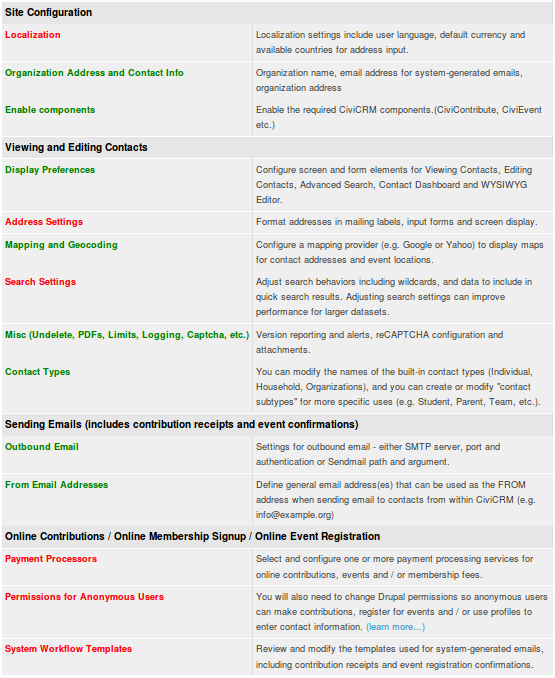
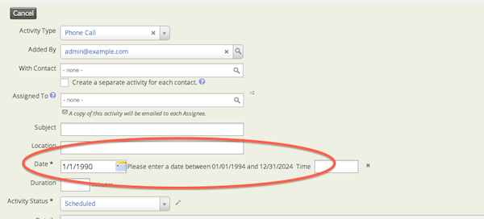
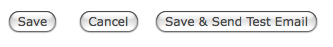

# Installation and basic set-up

Before reading further, please be aware that much of the information
contained here is intended for technicians and may be difficult to
understand if you have little or no experience in setting up web
applications. If you don't understand this topic, you may wish to either
seek help, or point your organisation's technical staff to this
material.

## Prerequisites

Before exploring the installation of CiviCRM, ensure you have read the
chapter 'hosting' to confirm whether or not your host can support it.

CiviCRM must be installed on a computer that has been configured with a
web server (such as Apache or ngnx), PHP and MySQL. Some people prefer
to try out CiviCRM on their own local computer before installing it on a
dedicated web-server. If you are doing this and don't have the
prerequisites just mentioned, you can download packages from the
Internet such as WAMP, XAMPP, MAMPP and LAMP, which will quickly install
an Apache web server, PHP and MySQL. (The first two packages are for
Windows and the second two are for the Macintosh and Linux
respectively).

Before you can begin installation, you need to decide which CMS (Content
Management System; used for building and managing websites) you wish to
integrate with, choosing between the open-source options: Drupal,
WordPress or Joomla!.

You can find full instructions on installing CiviCRM here:[
http://wiki.civicrm.org/confluence/display/CRMDOC/Installation+and+Upgrades](http://wiki.civicrm.org/confluence/display/CRMDOC/Installation+and+Upgrades%20)[](http://wiki.civicrm.org/confluence/display/CRMDOC/Installation+and+Upgrades%20)

## Internet vs. local installs

Most organisations access CiviCRM over the internet. However, some
organizations who only want internal staff to have access to CiviCRM and
are security conscious, choose to install CiviCRM on an internal network
and have it only accessible internally. The downside to an install that
is not publicly available is that your contacts cannot 'self serve' to
update their data.

## Upgrades

New versions of CiviCRM are released every month. Although 
[extensions](/introduction/extensions.md) are the way that you will typically 
add major new features to CiviCRM, you will need to apply upgrades to your 
CiviCRM core software periodically to keep your site secure, and also if you
want to take advantage of smaller new features and improvements. Some
upgrades contain security fixes and it is crucial that these are applied
in a timely manner. It's important that you plan for the resources
(people and time) required to apply upgrades to your site. Read release notes
thoroughly to understand how an upgrade may change your site. Plan on 
testing upgrades on a copy of your live site to make sure the
process runs smoothly. It's also critical to make backups of your site
and database prior to running an upgrade on your live site even if you
had tested the process on a test site.

Since upgrades are an important and technical process, many
organisations employ the services of a CiviCRM expert service provider
to carry them out.

## Configuration

Once CiviCRM has been installed, you should review the initial
configuration tasks which allow you to customize CiviCRM for your
organization.

Log in to your CiviCRM site and navigate to **Administer >
Administration Console > Configuration Checklist**. This section will
cover the general tasks, while component-specific configuration will be
covered in each component section.

Use this checklist to review and complete configuration tasks for your
site. You will be redirected back to this checklist after saving each
setting. Settings which you have not yet reviewed will be displayed in
red. After you have visited a page, the links will display in green
(although you may still need to revisit the page to complete or update
the settings).



### Localization

Localization involves adapting CiviCRM for use in a specific country or
language by translating the text displayed on the screen and setting
region specific formats for dates and money (including currency). By
default, CiviCRM is localized for the United States. If you are using
CiviCRM in a different country, need to store contact addresses that
appear in countries other than the United States, or want to use CiviCRM
in another language, you will need to review and update the values on
this screen.

CiviCRM has been translated into a number of different languages and
translations are available to download when you download CiviCRM. These
translations are contributed by community members. If CiviCRM is not
available in your language, you may wish to consider translating it.
You can find a translation guide on the wiki.

It is also possible to configure your site to support multiple
languages. In this mode, your users will be able to choose from a list
of available languages after logging in. You can also create and store
multi-language versions of text. Examples include custom field labels,
an online contribution page, campaign information, and event
descriptions.

For more info, have a look here:
[http://wiki.civicrm.org/confluence/pages/viewpage.action?pageId=88408149](http://wiki.civicrm.org/confluence/pages/viewpage.action?pageId=88408149)

Under Localization you will also find the **Advanced Date Input Settings**.
By default, CiviCRM provides ranges for input on specific date fields. For instance,
the default range for Activity Dates are 20 years prior to the current year
all the way through to 10 years beyond the current year. If you would like to track
activities that have occurred, say, 25 years ago then you would need to update this
range to enable your end users to log these activities. To update these settings to
the appropriate range go to **Administer > Localization > Date Formats > Advanced Date Input Settings**.
If you were to leave these settings as the default you will see an error such as this:
Please enter a date between 01/01/1994 and 21/31/2024. 



### Organization Address and Contact Info

Use this screen to enter identifying information for the organization or
entity which "owns" this CiviCRM installation. The organization name and
address are used to identify your organization in CiviMail mailings when
you include the `{domain.name}` and `{domain.address}` [tokens](/common-workflows/tokens-and-mail-merge.md).

You should also enter a valid email address belonging to your
organization, which will be used as the From field in system-generated
(automated) emails.

### Enable components

This is where you can turn on or turn off the components for your
CiviCRM system.

When you first install CiviCRM the most frequently used components
(CiviContribute, CiviEvent, CiviMail, CiviMember, CiviReport) are
already enabled. If you do not need those components you can disable
them. You can also enable any or all of CiviCampaign, CiviCase,
CiviGrant and CiviPledge. You can revisit this page at any time to
enable more components.

You can also disable a component you have already used. The information
in the component is retained and will still be there if you re-enable
it. It would be unusual to disable a component you have already used.
If you want to simplify the administration menu and advanced search page
then a better approach may be to use permissions (see the Permissions
and access control chapter).

### Display Preferences

This screen allows you to modify the screen and form elements for the
following tasks:

-   **Viewing Contacts** - Controls the tabs displayed when viewing a
    contact record. EXAMPLE: If your organization does not keep track of
    Relationships, deselect this option to simplify the screen display.
    Tabs for Contributions, Pledges, Memberships, Events, Grants and
    Cases are also hidden if the corresponding component is not enabled.
-   **Viewing Smart Groups** - Controls the display of the smart groups a contact belongs to.
-   **Editing Contacts** - Controls the sections included when adding or
    editing a contact record. EXAMPLE: If your organization does not
    record Gender and Birth Date for individuals, then simplify the form
    by deselecting Demographics.
-   **Contact Search** - Controls the sections included in the Advanced
    Search form. EXAMPLE: If you don't track Relationships, you will not
    search for that section. Simplify the form by deselecting this
    option.
-   **Contact Dashboard** - Allows your constituents to view the groups
    they are subscribed to, their contribution history, event
    registration information and more. You can control the sections that
    should be included in the dashboard here. EXAMPLE: If you don't want
    constituents to view their own contribution history, deselect that
    option.
-   **WYSIWYG Editor** - Select **CKEditor** to provide users with an easy way to enter text into fields that allows HTML formatting (such as the introductory section for your online contribution pages). You can configure CKEditor (http://ckeditor.com/) to add or remove functionality as desired, and alter the display order of the elements in the toolbar using the built-in configuration page. Click on the Configure CKEditor button to access this configuration page. Select **Textarea** if you don't want to provide a WYSIWYG editor.
-   **Enable Popup Forms** - this is on by default. Uncheck to  revert to opening the form by refreshing the page.
-   **Individual Display Name** - Display name format for individual
    contact display names.
-   **Individual Sort Name** - Sort Name format for individual contact
    sort names.

### Address Settings

At **Localization > Address Settings** CiviCRM allows you to modify the default fields for adding and editing
contact and event address data. You can also change the address field
layout used for screen display and mailing labels. Review the
out-of-the-box defaults by adding a new contact record and noting the
address fields provided on the form. Save the record and note the order
in which the fields are displayed on the Contact Summary screen. If you
plan on generating mailing labels for contacts, review the label layout
(select Mailing Labels from the *-actions-* drop-down after doing a
search using the Find Contacts menu option).

After reviewing the default fields and layouts, review the Address
Settings screen and make changes as needed.

!!! tip
    CiviCRM uses [tokens](/common-workflows/tokens-and-mail-merge.md) (e.g. `{contact.street_address}`) to reference specific fields in the database.

-   **Mailing Labels** - Controls formatting of mailing labels here. The
    default format is:
    
    ```
    {contact.addressee}
    {contact.street_address}
    {contact.supplemental_address_1}
    {contact.supplemental_address_2}
    {contact.city}{, }{contact.state_province}{ }{contact.postal_code}
    {contact.country}  
    ```
    
    You must include the `{contact.addressee}` token here in order to
    include the name of the addressee in your labels. Users will be able
    to select from a variety of label types corresponding to the label
    manufacturer code when they generate the labels from a list of
    contacts. It's a good idea to test your format with the type of
    label and printer you plan on using to verify spacing.
    
-   **Address Display** - Controls the layout of contact and event
    location addresses displayed on CiviCRM screens. The default format
    is:
    
    ```
    {contact.address_name}
    {contact.street_address}
    {contact.supplemental_address_1}
    {contact.supplemental_address_2}
    {contact.city}{, }{contact.state_province}{ }{contact.postal_code}
    {contact.country}
    ```
    
    This format also applies to event locations, despite the use of the
    *contact* record type in the layout. The *{contact.address_name}*
    token is particularly useful for events where you need to include a
    location name (e.g. "Smithson Hall").

-   **Address Editing Fields** - Modify the available address
    editing fields here. You can hide fields that you don't plan on
    using in order to simplify the forms. EXAMPLE: If you don't plan on
    recording latitude and longitude for contacts, you can deselect
    those field.
    -   **Street Address Parsing**- CiviCRM uses the US Postal Service's
        (USPS) Postal Addressing Standards to parse an address into
        fields to hold the address elements: Street Number, Street Name,
        and Apt/Unit/Suite. It's best to enter address information
        that conforms to the Postal Addressing Standards, not only for
        consistency in your data, but also to best take advantage of the
        the Street Address Parsing function. When address parsing is turned on you can edit and or view
        the parsed address by clicking on Edit Address Elements when you are editing a address.

      

   You can learn more about USPS' Postal Addressing Standards at          [http://pe.usps.com/text/pub28/welcome.htm](http://pe.usps.com/text/pub28/welcome.htm).
-   **Address Standardization** - CiviCRM includes an optional feature
    for interfacing to the United States Postal Services (USPS) Address
    Standardization web service. You must register to use the USPS
    service at
    [https://www.usps.com/business/web-tools-apis/welcome.htm](https://www.usps.com/business/web-tools-apis/welcome.htm).
    If you are approved, they will provide you with a User ID and the
    URL for the service. The URL provided by USPS will not be prefixed
    with "http://". When entering this URL into the CiviCRM settings
    field, you must prefix it with "http://".

### Mapping and Geocoding

CiviCRM includes support for both the Google and OpenStreetMap mapping
services. These services allow your users to display contact addresses
and event locations on a map. To enable this feature, select your
mapping provider and obtain a key for your site from that provider.

You can also select a Geocoding Provider. This can be that same or
different form you mapping provider. Once this service is enabled, your
contact and event records will be automatically geocoded (the latitude
and longitude for that address is inserted) as you add or edit address
data.

### Search Settings

These let you adjust search behaviors such as the use of wildcards and
which data to include in quick search results. Adjusting search settings
can improve performance for large datasets.

A wildcard character is a special character that can be used to
substitute for any other character or characters in searches. CiviCRM
allows you to use the percent character "%" to substitute for zero or
more characters, and the underscore character "_" to substitute for any
single character. Wildcards are useful for broadening your search
results.

For example, typing 'Volunteer%' as your Activity Subject will match any
record whose subject starts with "Volunteer" (e.g. "Volunteer for Open
House" or "Volunteering Opportunities").

-   **Automatic Wildcards** - By default, when users search for contacts
    by Name, the Search interface treats the text as if it was
    surrounded by percent signes. EXAMPLE: Searching for 'ada' will
    return any contact whose name includes those letters - 'Adams,
    Janet', 'Nadal, Jorge', etc. Disabling this feature will speed up
    searches significantly for large databases, but will make users
    explicitly use wildcard characters ("%" or "_") for partial name
    searches.
-   **Include Email** - By default, when users search contacts by Name,
    the Search interface also searches for the text in email addresses.
    Disabling this feature will speed up searches significantly for
    large databases, but users will need to use the Email search fields
    (from Advanced Search, Search Builder, or Profiles) to find contacts
    by email address.
-   **Include Nickname** - By default, nicknames are automatically *not*
    included when users search by Name. Change this value to Yes if you
    want nicknames to be included.
-   **Include Alphabetical Pager** - If disabled, the alphabetical pager
    will not be displayed on the search screens. This will improve
    response time for search results on large datasets.
-   **Include Order By Clause**- If disabled, search results will not be
    ordered. This will improve response time for search results on large
    datasets significantly.
-   **Default Contact Search Profile** - You can select a Profile to
    override the columns displayed by default in Find Contacts search
    results.
-   **Smart group cache timeout** - Smart groups are basically saved
    searches. The list of contacts for each smart group is cached in the
    database in order to avoid running the saved search every time you
    access a smart group. This field determines the number of minutes to
    maintain the cache before refreshing it. The default value of 0
    means the cache is emptied immediately when any contact is edited or
    a new one is added. If your contact data changes frequently, you may
    want to try setting this to a value of 5 minutes (or even longer) to
    reduce processing load on your server. The drawback of delaying the
    refreshing of the cache is that old data will still be served up to
    users for a few minutes after new data is added.
-   **Autocomplete Contact Search** - If enabled, selected fields will
    be displayed in auto-complete dropdown lists and the "Quick Search"
    box on the navigation menu. The contact name is always included.
-   **Contact Reference Options** - Selected fields will be displayed in
    autocomplete dropdown search results for 'Contact Reference' custom
    fields. Contact Name is always included. Note: You must assign
    'access contact reference fields' permission to the anonymous role
    if you want to use custom contact reference fields in profiles on
    public pages. For most situations, you should use the 'Limit List to
    Group' setting when configuring a contact reference field which will
    be used in public forms to prevent exposing your entire contact
    list.
-   **Autocomplete Results**- This specifies the maximum number of
    contacts to show at a time when typing in an autocomplete field. The
    default is 10.
-   **InnoDB Full Text Search -** If you are using MySQL 5.6+ you can
    enable InnoDB full-text search optimizations.

### Miscellaneous (Undelete, PDFs, Limts, Logging, reCAPTCHA, etc.)

Use the Miscellaneous Settings screen to configure and control the
following behaviors:

-   **Dashboard Cache Timeout -** The number of minutes to cache dashlet
    content on the dashboard.

-   **Checksum Lifespan -** The number of days before a personalized
    (hashed) link will expire.

-   **Contact Trash and Undelete** - If enabled, deleted contacts will
    be moved to the trash (instead of being destroyed). Users with the
    proper permission are able to search for the deleted contacts and
    restore them (or delete them permanently).
-   **Logging** - If enabled, all actions performed on non-cache tables
    will be logged (in the respective log_\* tables). By default, these
    tables will be created in the same database. However you can
    configure CiviCRM to write logging tables to a different database by
    editing your site's *civicrm.settings.php* file. Specify
    the separate logging database in the CIVICRM_LOGGING_DSN setting.
    After enabling this feature you can review changes to contact
    records using the Contact Logging Report. Go to **Reports > Reports
    Listing > Contact Logging Report (Summary)**.
-   **Attach PDF copy to receipts** - If enabled, CiviCRM sends PDF
    receipt as an attachment during event signup or online contribution.
-   **Path to wkhtmltopdf executable -** wkhtmltopdf is an alternative
    utility for generating PDF's which may provide better performance
    especially if you are generating a large number of PDF letters or
    receipts. Your system administrator will need to download and
    install this utility, and enter the executable path here.
-   **New Version Alerts** - If enabled on-screen alerts will be
    displayed to users with "Administer CiviCRM" permissions when a new
    version of CiviCRM is available. This setting will only work if the
    "Version Check & Statistics Reporting" setting is enabled.
-   **Version Checking and Statistics Reporting** -This feature
    automatically checks the availability of a newer stable version of
    CiviCRM. New version alerts are displayed on the main CiviCRM
    Administration page. Statistics about your CiviCRM installation are
    also reported anonymously to the CiviCRM team to assist in
    prioritizing ongoing development efforts. The following information
    is gathered: CiviCRM version, versions of PHP, MySQL and framework
    (Drupal/Joomla!/WordPress), and default language. Record counts (but
    no actual data) are also reported. You can set this field to No if
    you are not comfortable with having this information reported for
    your site.
-   **Display "empowered by CiviCRM** - When enabled, "empowered by
    CiviCRM" is displayed at the bottom of public forms. This will help
    increase awareness of CiviCRM.
-   **Maximum Attachments** - You can increase or decrease the maximum
    number of files (documents, images, etc.) that can be attached to
    emails, activities, and grant records. The default value is 3.
-   **Maximum File Size (in MB)** - Maximum size of a file (documents,
    images, etc.) which can attached to emails or activities. Note that
    your PHP configuration files, *php.ini*, should support at least as
    big a file size as the value specified here.
-   **Allow second-degree relationship permissions -** If enabled,
    contacts with the permission to edit a related contact will inherit
    that contact's permission to edit other related contacts. This can
    be used, for example, to let the teacher of a class edited the
    records for students in that class when they are both linked to the
    class (set up as an organisation sub-type) via relationships.
-   **reCAPTCHA** - reCAPTCHA is a free service that helps prevent
    automated abuse of your site by requiring users to read a random
    pair of words and type them into the form. To use reCAPTCHA on
    public-facing CiviCRM forms, sign up at
    [recaptcha.net](http://recaptcha.net/), enter the provided public
    and private reCAPTCHA keys here, then enable reCAPTCHA under the
    Advanced Settings section in a Profile where you want it used.

    If you want to use reCAPTCHA protection for online contribution,
    membership signup or event registration forms, you'll need to
    configure a Profile with reCAPTCHA enabled, and then include it in
    those forms.

### Contact Types

You can modify the names of the built in Contact Types (Individual,
Household, Organizations), and you can create and modify "contact
subtypes" for more specific uses (e.g. Student, Parent, Team, etc..)

### Outbound email

If you are sending emails to contacts using CiviCRM, you need to enter
settings which allow CiviCRM to connect to your mail server. Such emails
include sending receipts to contributors, sending confirmations to
people registering for events, and using CiviMail to send bulk mailings.

CiviCRM supports three different methods of connecting to a mail server:
mail (the built-in PHP mail function); SMTP (Simple Mail Transport
Protocol); and Sendmail. Each method requires that you enter specific
settings. If you're unfamiliar with these terms, or unsure of the
correct values for these settings, check with your system administrator,
ISP or hosting provider.

You should always send a test email after you enter or modify the
settings. Simply click "Save and Send Test Email"(shown in the following
screenshot). An email will be sent to the email address associated with
your user login account. The From email address will be the default From
address you've configured in the previous section.



If CiviCRM is unable to send the test email, you will see a message on
your screen with the specific error and some suggestions for
trouble-shooting the problem.

### Disabling outbound email

If you do *not* want users to send outbound emails from CiviCRM at all,
select "Disable Outbound Email". However, if you disable outbound email,
and you are using Online Contribution pages or online Event
Registration, you will need to turn off the automated receipting and
registration confirmation features (these are enabled by default).
Otherwise your constituents will see error messages after they've
completed a contribution or registration.

**Redirect to Database**- If this option is selected, all emails will be
recorded as archived mailings instead of being sent out.

See **Email System Configuration** for more details.

### From Email Addresses

CiviCRM will use the default From address defined here when sending
automated emails. If you've already entered an email address in the
Domain Information screen, that address will be listed here (as
illustrated on the leftmost field of the following screenshot).


When users send an email using CiviCRM, their primary email address is
used as the From address by default. However, they can also select one
of the general email addresses defined here as an alternative.

### Payment Processors

Payment processors are companies that handle credit card transactions
for merchants and non-profit organizations and then transfer funds to
the organization's bank account. If you plan on using CiviCRM to accept
online contributions, online membership signup and renewal or online
event registration, you will need to select and configure a payment
processor for your site.

CiviCRM includes support for several different processors, and provides
a way for third-party developers to add support for additional
processors based on their clients' needs. Each processor has their own
pricing structure and features, and you will want to investigate each
available option to determine the best fit for your organization. Refer
to the "Contributions" section for a list of factors to consider in
selecting a processor.

The actual steps involved in configuring and testing your payment
processor connection are different for each processor. For more
information, visit:
[http://wiki.civicrm.org/confluence/display/CRMDOC/Payment+Processors](http://wiki.civicrm.org/confluence/display/CRMDOC/Payment+Processors)

### Permissions for anonymous users

This link is only present on Drupal sites. On Joomla! and WordPress
(and Drupal) Sites permissions for anonymous and other users are set
after navigating to **Administer > Users and Permissions >
Permissions** > **Drupal (or Joomla! or WordPress) Access Control**.
See the *Permissions and Access Control* chapter in this section for
information on setting permissions.

### System Workflow Templates

CiviCRM comes with a set of system-generated emails, including
contribution receipts and event registration confirmations. These are
known as system workflow templates, and it's a good idea to review them.
They will be sent out with your organization's name on them. You can
customize the style and wording of these messages here.

Workflow messages include text AND necessary program logic. Use caution
when editing so as not to modify the program logic. Be sure to test the
workflow and review the emails sent after making any changes. If you
find that your changes have caused problems, errors or missing
information - you can always "Revert" to the system default for that
workflow.


You should now have reviewed all the basic configuration tasks. The
remaining tasks on the checklist involve an understanding of the ways in
which you can record and use contact data and are best left until you
have read more in this book.
