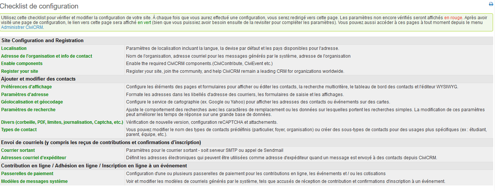

Installation et configuration de base
=====================================

Avant d'aller plus loin, n'oubliez pas que la plupart des informations contenues ici sont destinées aux techniciens et peuvent être difficiles à comprendre si vous avez peu ou pas d'expérience dans la configuration d'applications Web. Si vous ne comprenez pas ce sujet, vous pouvez demander de l'aide sur nos forums ou faire intervenir les personnes compétentes de votre organisation.

Prérequis 
---------

Avant d'explorer l'installation de CiviCRM, assurez-vous d'avoir lu le chapitre 'hébergement' pour vérifier que votre hébergeur puisse le supporter.

CiviCRM doit être installé sur un ordinateur configuré avec un serveur Web (tel que Apache ou ngnx), PHP et MySQL. Certaines personnes préfèrent tester CiviCRM sur leur propre ordinateur local avant de l'installer sur un serveur web dédié. Si vous n'avez pas les préalables ci-dessus sur votre ordianteur, vous pouvez télécharger des plateformes de développement Web telles que WAMP, XAMPP, MAMPP et LAMP, qui installeront rapidement un serveur Web Apache, PHP et MySQL. (Les deux premières sont pour Windows et les deux autres pour Macintosh et Linux respectivement).

Avant de pouvoir commencer l'installation, vous devez décider quel système de gestion de contenu (CMS) vous souhaitez intégrer pour construire et gérer votre site : Choisir entre les options open-source: Drupal, Joomla ou Wordpress!.

Vous trouverez des instructions complètes sur l'installation de CiviCRM ici : [
http://wiki.civicrm.org/confluence/display/CRMDOC/Installation+and+Upgrades](http://wiki.civicrm.org/confluence/display/CRMDOC/Installation+and+Upgrades%20)

Intallation locale ou Internet ?
--------------------------------

La plupart des organisations accèdent à CiviCRM via Internet. Toutefois certaines organisations, qui souhaitent uniquement que le personnel interne ait accès à CiviCRM et veulent préserver la sécurité des données, choisissent d'installer CiviCRM sur un réseau local et de le rendre accessible uniquement en interne. L'inconvénient d'une telle installation, qui n'est pas accessible au public, est que vos contacts ne peuvent pas s'inscrire directement à vos manifestations et n'ont pas accès à leurs données pour mise à jour.

Mises à jour
------------

Les nouvelles versions de CiviCRM sont diffusées environ deux fois par an (une au printemps et une en automne).
Vous devrez appliquer les mises à jour à votre site CiviCRM régulièrement si vous souhaitez profiter des nouvelles fonctionnalités et des améliorations, et aussi pour maintenir votre site sécurisé. Certaines mises à niveau contiennent des correctifs de sécurité et il est crucial que ces dernières soient appliquées immédiatement. Il est important que vous planifiez des ressources (personnes et temps) pour appliquer les mises à niveau à votre site. Vous pouvez executer, par prudence, les mises à niveau sur une copie de votre site en production pour s'assurer que le processus fonctionne correctement. Il est  essentiel de faire une sauvegarde de votre site et de votre base de données avant d'exécuter une mise à niveau, même si vous aviez testé le processus sur un site de test..

Les mises à jour sont un processus important. De nombreuses organisations emploient les services de professionnels agréés par CIVICRM pour les réaliser.

Configuration
-------------

Une fois CiviCRM installé, vous devez personnaliser CiviCRM et paramétrer la configuration de votre site : 

Connectez-vous à votre site CiviCRM et accédez à **Administer> Console d'administration> Checklist de configuration**. Cette section permet de paramétrer les tâches générales, tandis que la configuration spécifique aux composants sera effectuée dans chaque section de composant.

Utilisez cette liste de contrôle pour paramétrer et enregistrer les tâches de configuration de votre site. Vous serez redirigé vers cette liste après avoir enregistré chaque paramètre. Les paramètres que vous n'avez pas encore initialisés s'affichent en rouge. Après avoir visité une page, les liens s'affichent en vert (mais vous aurez peut-être besoin revenir sur une section afin de completer ou mettre à jour les paramètres, vous pourrez le faire plus tard).

### Localisation

La localisation implique l'adaptation de CiviCRM pour une utilisation dans un pays ou une langue spécifique en traduisant le texte affiché à l'écran et en définissant des formats régionaux spécifiques pour les dates et la monnaie. Par défaut, CiviCRM est initialisé pour les États-Unis. Si vous utilisez CiviCRM dans un pays différent, vous devez paramétrer et mettre à jour les valeurs sur cet écran. 

CiviCRM a été traduit dans de nombreuses langues différentes et les traductions sont incluses lorsque vous téléchargez CiviCRM. Ces traductions sont fournies par les membres de la communauté. Si CiviCRM n'est pas disponible dans votre langue, vous pouvez envisager de le traduire. Vous trouverez un guide de traduction sur le wiki.

Vous pouvez aussi configurer votre site pour prendre en charge plusieurs langues. Dans ce mode, vos utilisateurs pourront choisir parmi une liste de langues disponibles après leur connexion. Vous pouvez également créer et stocker des versions multilingues de texte. Les exemples comprennent des étiquettes de champs personnalisées, une page de contribution en ligne, des informations sur les campagnes et des descriptions d'événements.

Pour plus d'info, consulter:
[http://wiki.civicrm.org/confluence/pages/viewpage.action?pageId=88408149](http://wiki.civicrm.org/confluence/pages/viewpage.action?pageId=88408149)

Sous Localisation, vous trouverez également les **Paramètres d'entrée de date**.

CiviCRM fournit par défaut des fourchettes de date pour l'entrée sur des champs de date spécifiques. Par exemple, la fourchette par défaut pour les dates d'activité est 20 ans avant l'année en cours jusqu'à 10 ans au-delà de l'année en cours. Si vous souhaitez suivre les activités qui ont eu lieu, disons, il ya 25 ans, vous devez mettre à jour cette option pour permettre à vos utilisateurs finaux de consigner ces activités. Pour mettre à jour ces paramètres dans la plage appropriée, allez dans **Administer> Personnalisez les données> Dates Préférences**. Si vous laissez ces paramètres par défaut, vous verrez ce  message d'erreur: 
*By default, CiviCRM provides ranges for input on specific date fields. For instance, the default range for Activity Dates are 20 years prior to the current year all the way through to 10 years beyond the current year. If you would like to track activities that have occurred, say, 25 years ago then you would need to update this range to enable your end users to log these activities.*
Pour mettre à jour ces paramétrages, menu : **Administer> Personnalisez les données> Dates Préférences**.

### Adresse et coordonnées de votre organisation

Utilisez cet écran pour saisir les informations d'identification pour l'organisation ou l'entité qui «est propriétaire» de cette installation CiviCRM. Le nom et l'adresse de l'organisation sont utilisés pour identifier votre organisation dans les envois CiviMail lorsque vous incluez les champs domain.name et domain.address.

Vous devez également saisir une adresse e-mail valide de votre organisation, qui sera utilisée comme champ "De" dans les courriels simples ou automatisés générés par le système.

### Activer les composants

C'est ici que vous pouvez activer ou désactiver les composants pour votre système CiviCRM.

Lorsque vous installez CiviCRM pour la première fois, les composants les plus utilisés (CiviContribute, CiviEvent, CiviMail, CiviMember, CiviReport) sont déjà activés. Si vous n'avez pas besoin de ces composants, vous pouvez les désactiver. Vous pouvez également activer tout ou partie de CiviCampaign, CiviCase, CiviGrant et CiviPledge. Vous pouvez modifier cette page à tout moment pour activer ou désactiver les composants.

Vous pouvez désactiver un composant que vous avez déjà utilisé. Les données et informations contenues dans le composant sont conservées et seront toujours là si vous le réactivez. Il serait anormal de désactiver un composant que vous avez déjà utilisé. Si vous souhaitez simplifier le menu d'administration et la page de recherche avancée, une meilleure façon de faire  peut consister à utiliser les autorisations (voir le chapitre Autorisations et contrôle d'accès).

### Préférences d'affichage
Cet écran vous permet de modifier l'affichage des éléments à l'écran et les formulaires pour les tâches suivantes:

-   **Affichage des contacts**  - Contrôle les onglets affichés lors d'un enregistrement de contact. EXEMPLE:   Si votre organisation ne suit pas les relations entre les contacts, désélectionnez cette option pour simplifier l'affichage à l'écran. Les onglets des contributions, annonces de contributions, adhésions, événements, subventions et dossiers sont également masqués si le composant correspondant n'est pas activé.
-   **Affichage des Groupes intelligents** - Contrôle l'affichage des groupes intelligents auxquels un contact appartient.
-   **Modification des contacts** - Contrôle les sections incluses lors de l'ajout ou de l'édition d'un enregistrement de contact. EXEMPLE: Si votre organisation ne gére pas le sexe ni la date de naissance des individus, simplifiez le formulaire en désélectionnant les données démographiques.
-   **Recherche de contacts** - Contrôle les sections comprises dans le formulaire "Recherche avancée". EXEMPLE: Si vous ne suivez pas les relations, vous ne rechercherez pas dans cette section. Simplifiez le formulaire en désélectionnant cette option.
-   **Tableau de bord de contact** - Permet à vos contacts de voir les groupes auxquels ils sont abonnés, leur historique de contribution, les informations d'inscription à un événement... et plus encore. Vous pouvez contrôler les sections qui doivent être incluses dans le tableau de bord ici. EXEMPLE: Si vous ne voulez pas que les électeurs voient leur propre historique de contribution, désélectionnez cette option.
-   **Editeur WYSIWYG** - Sélectionnez **CKEditor** pour que les utilisateurs disposent d'un moyen simple d'entrer du texte dans les champs qui permettent le formatage HTML (comme par exemple la section d'introduction de vos pages de contribution en ligne). Vous pouvez configurer CKEditor (voir http://ckeditor.com/) comme vous le souhaitez pour ajouter ou supprimer des fonctionnalités. Sélectionnez **Zone de texte** si vous ne souhaitez pas fournir d'éditeur WYSIWYG.
-   **Activer les formulaires Popup** - Cette option est activée par défaut. Décochez pour revenir à l'ouverture du formulaire en rafraîchissant la page.
-   **Affichage du nom individuel** - Format d'affichage du nom des des contacts individuels.
-   **Nom de classement individuel** - Format de nom de tri pour le tri des contacts individuels.

### Paramètre d'adresse

Menu : **Localisation> Paramètres d'adresse** : Permet de modifier les champs par défaut pour ajouter et modifier des données de contact et d'adresse d'événement. Vous pouvez également modifier la disposition du champ d'adresse utilisée pour l'affichage à l'écran et les étiquettes d'envoi. Examinez les paramètres par défaut en ajoutant un nouvel enregistrement de contact et en notant les champs d'adresse fournis sur le formulaire. Vérifier l'enregistrement et notez l'ordre dans lequel les champs sont affichés dans l'écran "Résumé des contacts". Si vous envisagez de générer des étiquettes pour les contacts, consultez la disposition des étiquettes (sélectionnez "Étiquettes de publipostage" dans le menu déroulant *-actions-* après avoir effectué une recherche à l'aide de l'option de menu "Rechercher un contact").

Après avoir vérifié les champs et les mises en page par défaut, contrôlez l'écran "Paramètres d'adresse" et, si nécessaire, effectuez les modifications.

-  **Étiquettes de Publipostage** - Contrôler le formatage des étiquettes d'expédition ici. Le format par défaut est:

    *{contact.addressee}
    {contact.street_address}
    {contact.supplemental_address_1}
    {contact.supplemental_address_2}
    {contact.city}{, }{contact.state_province}{ }{contact.postal_code}
    {contact.country}*  

    Vous devez inclure ici le champ (token) *{contact.addressee}* afin d'inclure le nom du destinataire dans vos étiquettes. Les utilisateurs peuvent choisir parmi une variété de types d'étiquettes, correspondant au code du fabricant d'étiquettes, lorsqu'ils génèrent des étiquettes à partir d'une liste de contacts. Vous devez tester votre format avec le type d'étiquette et l'imprimante que vous prévoyez d'utiliser pour vérifier le cadrage.
    
-  **Affichage de l'adresse** - Contrôle la disposition des adresses de contact et lieux d'événement affichées sur les écrans de CiviCRM. Le format par défaut est:

    *{contact.address_name}
    {contact.street_address}
    {contact.supplemental_address_1}
    {contact.supplemental_address_2}
    {contact.city}{, }{contact.state_province}{ }{contact.postal_code}
    {contact.country}*

    Ce format s'applique également aux lieux d'événements, malgré l'utilisation du type d'enregistrement *contact* dans la mise en page. Le token *{contact.address_name}* est particulièrement utile pour les événements où vous devez inclure un nom de lieu  (par exemple, "Parc des expositions").
  
-  **Edition de l'adresse** - Modifiez les champs d'édition d'adresse disponibles ici. Vous pouvez masquer les champs que vous n'avez pas l'intention d'utiliser afin de simplifier les formulaires. EXEMPLE: Si vous ne prévoyez pas d'enregistrer la latitude et la longitude des contacts, vous pouvez les désélectionner. 

-  **Normalisation de l'adresse**- CiviCRM utilise les normes d'adressage postal du service postal des États-Unis (USPS) pour analyser une adresse dans les champs qui contiennent les éléments d'adresse: numéro de rue, nom de rue et appt / unité /etc... Il est préférable de saisir des informations d'adresse qui sont conformes aux normes d'adressage postal de votre pays, non seulement pour la cohérence de vos données, mais aussi pour tirer le meilleur parti de la fonction d'analyse des adresses. Lorsque l'analyse d'adresse est activée, vous pouvez modifier et/ou afficher l'adresse analysée en cliquant sur "Modifier les éléments d'adresse".
      
      

  Pour en savoir plus sur les normes d'adressage postal d'USPS ici:  [http://pe.usps.com/text/pub28/welcome.htm](http://pe.usps.com/text/pub28/welcome.htm).
   
-  **Standardisation de l'adresse** - CiviCRM inclut une fonctionnalité facultative pour l'interface avec le service Web de standardisation des adresses des Services postaux des États-Unis (USPS). Vous devez vous inscrire pour utiliser le service USPS ici : [https://www.usps.com/business/web-tools-apis/welcome.htm](https://www.usps.com/business/web-tools-apis/welcome.htm).   Après validation vous recevrez un ID utilisateur et l'URL du service. L'URL fournie par USPS ne sera pas précédée du préfixe "http: //". Lorsque vous entrez cette URL dans le champ des paramètres CiviCRM, vous devez le préfixer avec "http: //".

### Géolocalisation et géocodage

CiviCRM inclut des modules d'interface avec plusieurs services de géolocalisation et cartographie. Quand vos utilisateurs enregistrent l'adresse d'un contact ou d'un événement, le service de cartographie va convertir l'adresse en coordonnées géographiques qui sont ensuite utilisées pour la géolocalisation. Le service de Yahoo va aussi renseigner automatiquement le champ "code postal". Ces services permettent de montrer des adresses sur une carte.

CivCiviCRM prend en charge les services de cartographie Google et OpenStreetMap. Ces services permettent à vos utilisateurs d'afficher les adresses de contact et les lieux d'événements sur une carte. Pour activer cette fonctionnalité, sélectionnez votre fournisseur et demandez une clé pour votre site auprès de ce fournisseur.

Vous pouvez également sélectionner un autre fournisseur de cartographie ou de géolocalisation. Une fois ce service activé, vos enregistrements de contacts et d'événements seront automatiquement géocodés (la latitude et la longitude de cette adresse sont insérés) lorsque vous ajoutez ou modifiez des données d'adresse.

### Paramètre de recherche

Ces paramètres vous permettent de modifier les comportements de recherche tels que l'utilisation de caractères génériques et les données à inclure dans les résultats de recherche rapide. Le réglage des paramètres de recherche peut améliorer les performances des grandes bases de données.

Un caractère générique est un caractère spécial qui peut être utilisé pour remplacer un ou plusieurs autres caractères dans les critères de recherche. CiviCRM vous permet d'utiliser le caractère de pourcentage « % » pour remplacer plusieurs caractères ou aucun, et le caractère de soulignement « _ » pour remplacer un caractère unique. Les caractères génériques sont utiles pour élargir vos résultats de recherche.

Par exemple, en tapant «Bénévole%» comme sujet d'activité correspondra à tout enregistrement dont le sujet est «Bénévole» (par exemple, «Bénévole pour la journée portes ouvertes»).

-  **Caractères génériques automatiques** - Par défaut, lorsque les utilisateurs recherchent des contacts par Nom, l'interface de recherche traite le texte comme s'il était entouré de signes de pourcentage. EXEMPLE: La recherche de «ada» renverra tout contacts dont le nom inclut ces lettres : «Adam, Jean», «Nadal, Georges», etc. La désactivation de cette fonctionnalité accélérera considérablement les recherches pour les grandes bases de données, mais pour les recherches partielles de nom les utilisateurs devront utiliser les caractères "%" ou "_".

-  **Inclure Email** - Par défaut, lorsque les utilisateurs recherchent des contacts par Nom, l'interface de recherche recherche automatiquement le texte dans les adresses e-mail. La désactivation de cette fonctionnalité accélérera considérablement les recherches pour les bases de données volumineuses, mais les utilisateurs devront utiliser les champs de recherche par e-mail (dans les Recherches avancées, du Générateur de recherche ou des Profils) pour trouver des contacts par adresse électronique.

-  **Inclure le Pseudonyme** - Par défaut désactivé. Changez cette valeur en Oui si vous voulez que les pseudonymes soient inclus dans les recherches.

-  **Inclure la pagination alphabétique** - Si désactivé, la pagination alphabétique ne sera pas affichée sur les écrans de recherche. Cela améliorera le temps de réponse pour les résultats de recherche sur de grands ensembles de données.

-  **Inclure la clause « order by »** - Si désactivé, les résultats de recherche ne seront pas ordonnés. Ceci améliore significativement les temps de réponse lors de recherches sur de grands ensembles de données.

-  **Profil de recherche de contact par défaut** - Vous pouvez sélectionner un profil pour remplacer les colonnes affichées par défaut dans les résultats de recherche des contacts.

-  **Expiration de la mémoire cache des groupes dynamiques** - Les groupes intelligents sont essentiellement des recherches enregistrées. La liste des contacts de chaque groupe intelligent est mise en cache dans la base de données afin d'éviter d'exécuter la recherche enregistrée chaque fois que vous accédez à un groupe intelligent. Ce champ détermine le nombre de minutes pour maintenir le cache avant de le rafraîchir. La valeur par défaut de 0 signifie que le cache est vidé immédiatement lorsqu'un contact est modifié ou qu'un nouveau est ajouté. Si vos données de contact changent fréquemment, vous pouvez essayer de définir cette valeur sur une valeur de 5 minutes (voire plus) pour réduire la charge de traitement sur votre serveur. L'inconvénient de retarder le rafraîchissement du cache est que les données anciennes seront toujours affichées aux utilisateurs pendant quelques minutes après l'ajout de nouvelles données.

-  **Recherche de contacts avec autocomplétion** - Si cette option est activée, les champs sélectionnés seront affichés dans les listes déroulantes d'auto-complétion et dans la zone "Recherche rapide" du menu de navigation. Le nom du contact est toujours inclus.
    
-  **Options de référence de contact** - Les champs sélectionnés seront inclus dans les résultats de recherche déroulants de saisie semi-automatique  pour les champs personnalisés de type référence contact. Le nom du contact est toujours inclus. Remarque: Vous devez assigner au rôle anonyme la permission d'accès aux champs de référence contact si vous voulez utiliser des champs personnalisés de référence contact dans les profils sur des pages publiques. Dans la plupart des cas, vous devrez cocher le paramètre « Restreindre la liste au groupe » lorsque vous configurez un champ de référence contact qui est inclus dans des formulaires publics pour ne pas afficher la liste complète de vos contacts.

-  **Autocomplete Results** -  Spécifie le nombre maximum de contacts à afficher en même temps dans un champ de saisie semi-automatique. La valeur par défaut est 10.

-  **InnoDB Full Text Search**  - Si vous utilisez MySQL 5.6+, vous pouvez activer les optimisations de recherche en texte intégral InnoDB.

### Divers (Corbeille, PDFs, Limites, Journalisation, reCAPTCHA, etc...)

Utilisez la page "Parametres système > Divers" pour configurer et contrôler les paramètres suivants:

-   **Délai d'expiration du cache du tableau de bord** - Durée en minutes pendant laquelle les indicateurs du tableau de bord sont maintenus dans le cache.

-   **Checksum Lifespan** - Le nombre de jours à partir duquel les liens personnalisés (hash) vont expirer.

-   **Contact Trash and Undelete** - Si cette option est activée, les contacts supprimés seront déplacés vers la corbeille (au lieu d'être détruits). Les utilisateurs disposant de la permission appropriée peuvent rechercher les contacts supprimés et les restaurer (ou les supprimer définitivement).

-   **Logging** - Si cette option est activée, toutes les actions effectuées sur des tables non-cache seront enregistrées (dans les tables log_\* respectives). Par défaut, ces tables seront créées dans la même base de données. Toutefois, vous pouvez configurer CiviCRM pour écrire des tables de journalisation dans une base de données différente en modifiant le fichier *civicrm.settings.php* de votre site. Spécifiez la base de données de consignation distincte dans le paramètre CIVICRM_LOGGING_DSN. Après avoir activé cette fonctionnalité, vous pouvez consulter les modifications apportées aux enregistrements de contact à l'aide du rapport d'enregistrement des contacts. Voir : **Rapports> Liste des rapports> Rapport d'enregistrement des contacts (Résumé)**.

-   **Joindre une copie PDF aux reçus** - Si cette option est activée, CiviCRM envoie un reçu PDF, en pièce jointe, lors de l'inscription d'un événement ou d'une contribution en ligne.
    
-   **Chemin de l'executable wkhtmltopdf** - wkhtmltopdf est un utilitaire alternatif pour générer des PDF et qui peut  produire de meilleurs résultats surtout si vous générez un grand nombre de lettres PDF ou de reçus. Votre administrateur système devra télécharger et installer cet utilitaire, puis saisir le chemin d'accès de l'exécutable.

-  **Alertes de nouvelle version** - Si activé, une alerte s'affichera sur l'écran des utilisateurs disposant des autorisations "Administer CiviCRM" lorsqu'une nouvelle version de CiviCRM est disponible. Ce paramètre ne fonctionnera que si le paramètre "Version Check & Statistics Reporting" est activé.

-  **Vérification des versions et rapports statistiques** - Cette fonction vérifie automatiquement la disponibilité d'une nouvelle version stable de CiviCRM. Les alertes de nouvelle version sont affichées sur la page d'administration principale de CiviCRM. Les statistiques concernant votre installation de CiviCRM sont également signalées anonymement à l'équipe de CiviCRM pour aider à prioriser les efforts de développement en cours. Les informations suivantes sont rassemblées: version CiviCRM, versions de PHP, MySQL et framework (Drupal / Joomla / Wordpress) et langage par défaut. Le nombre d'enregistrements (mais pas les données enregistrées) est également indiqué. Vous pouvez définir ce champ à Non si vous ne souhaitez pas que ce genre d'informations soient transmises à l'équipe de CIVICRM. 

-  **Afficher "Propulsé par CiviCRM** - Si activé," Propulsé par CiviCRM " est affiché au bas des formulaires publics. Cela aide à augmenter la popularité de CiviCRM.

-  **Nombre maximum de pièces jointes** - Vous pouvez augmenter ou diminuer le nombre maximum de fichiers (documents, images, etc.) qui peuvent être attachés à des courriels, des activités et des enregistrements de subventions. La valeur par défaut est de 3.
-  **Taille maximale de fichier (en Mo)** - Taille maximale d'un fichier (document, image, etc.) qui peut être attaché à des courriels ou à des activités. Notez que votre fichier de configuration PHP, *php.ini*, doivent supporter une taille au moins égale à la valeur spécifiée ici

-  **Permettre les autorisations de relation de second degré** -  Si activé, les contacts avec autorisation de modifier un contact associé hériteront de la permission de ce contact pour modifier d'autres contacts. Cela peut être utilisé, par exemple, pour permettre au professeur d'une classe d'éditer les enregistrements des élèves de cette classe lorsqu'ils sont tous les deux liés à la classe (mise en place sous forme de sous-type d'organisation) via des relations.
    
-  **reCAPTCHA** - reCAPTCHA est un service gratuit qui aide à prévenir l'utilisation abusive de votre site en demandant aux utilisateurs de lire une paire aléatoire de mots et de les saisir dans le formulaire. Pour utiliser reCAPTCHA sur des formulaires CiviCRM ouverts au public, inscrivez-vous à [recaptcha.net] (http://recaptcha.net/), entrez les clés publiques et privées fournies par reCAPTCHA, puis activez reCAPTCHA sous la section "Paramètres avancés" dans un profil où vous voulez qu'il soit utilisé. Si vous souhaitez utiliser la protection reCAPTCHA pour les formulaires d'inscription en ligne, d'adhésion ou d'événement, vous devez configurer un profil avec reCAPTCHA activé, puis l'inclure dans ces formulaires.

### Types de Contacts
Vous pouvez modifier les noms des types de contacts (individuel, ménage, organisations) et créer et modifier des "sous-types de contact" pour des utilisations plus spécifiques (par exemple, Étudiant, Parent, Bénévole, etc.)

### Email sortant

Si vous envoyez des courriels à des contacts à l'aide de CiviCRM, vous devez entrer les paramètres qui permettent à CiviCRM de se connecter à votre serveur de messagerie. Ces courriels incluent l'envoi de reçus aux contributeurs, l'envoi de confirmations aux personnes s'inscrivant à des événements et l'utilisation de CiviMail pour envoyer tout type d'envois.

CiviCRM prend en charge trois méthodes différentes de connexion à un serveur de messagerie: mail (la fonction de courrier PHP intégrée), SMTP (Simple Mail Transport Protocol), et Sendmail. Chaque méthode requiert des paramètrages spécifiques. Si vous ne connaissez pas les valeurs correctes de ces paramètres, contactez votre administrateur système, votre FAI ou votre fournisseur d'hébergement.

Vous devez toujours envoyer un email de test après avoir saisi ou modifié les paramètres. Cliquez simplement sur "Enregistrer et envoyer un e-mail de test" (illustré dans la capture d'écran suivante). Un e-mail sera envoyé à l'adresse e-mail associée à votre compte de connexion utilisateur. L'adresse de courriel " De " sera l'adresse par défaut que vous avez configurée dans la section précédente.

Si CiviCRM ne parvient pas à envoyer le courrier électronique de test, un message s'affichera à l'écran avec l'erreur spécifique et quelques suggestions pour résoudre le problème.

### Désactivation du courrier sortant

Si vous ne voulez pas que les utilisateurs envoient des emails sortants depuis CiviCRM, sélectionnez "Désactiver le courrier électronique sortant". Attention, si vous désactivez le courrier électronique sortant et que vous utilisez des pages de contribution en ligne ou l'enregistrement d'événements en ligne, vous devez désactiver les fonctionnalités automatiques de réception et de confirmation d'enregistrement (activées par défaut). Sinon, vos utilisateurs verront des messages d'erreur après avoir effectué en ligne une contribution ou un enregistrement.

**Redirection vers la base de données** - Si cette option est sélectionnée, tous les courriels seront enregistrés comme des envois archivés au lieu d'être envoyés. Voir **Email System Configuration** pour plus de détails.

### Addresse d'envoi des emails

CiviCRM utilisera l'adresse par défaut " De " définie ici lors de l'envoi de courriels automatisés. Si vous avez déjà entré une adresse e-mail dans l'écran Informations du domaine, cette adresse sera répertoriée ici (comme illustré sur le champ le plus à gauche de la capture d'écran suivante).

Lorsque les utilisateurs envoient un courrier électronique à l'aide de CiviCRM, leur adresse de courriel principale est utilisée comme adresse " De " par défaut. Toutefois, ils peuvent également sélectionner l'une des adresses courriel générales définies ici comme alternative.

### Paiment par carte de crédit

Les réseaux de paiement, tel que VISA, MasterCard, American Express, JCB, le Groupe Carte Bleue sont des entreprises qui gèrent les transactions par carte de crédit pour les commerçants et les organisations à but non lucratif, puis transférent les fonds sur le compte bancaire de l'organisation. Si vous envisagez d'utiliser CiviCRM pour accepter des contributions en ligne, l'adhésion et le renouvellement des cotisations en ligne ou l'inscription d'événement en ligne, vous devrez sélectionner et configurer une passerelle de paiement pour votre site.

CiviCRM prend en charge différents réseaux et permet aux développeurs d'ajouter des réseaux supplémentaires en fonction des besoins de leurs utilisateurs. Chaque réseau a sa propre structure tarifaire et ses fonctionnalités, et il vous appartiendra de déterminer le meilleur choix pour votre organisation. Reportez-vous à la section «Contributions» pour obtenir une liste des facteurs à prendre en considération lors du choix d'un réseau.

Les étapes permettant la configuration et le test de votre connexion au réseau de paiement choisi sont différentes pour chaque réseau. Pour plus d'informations, consultez : [http://wiki.civicrm.org/confluence/display/CRMDOC/Payment+Processors](http://wiki.civicrm.org/confluence/display/CRMDOC/Payment+Processors)

### Autorisations pour le public

Ce lien est seulement présent sur les sites Drupal. Sur Joomla!, WordPress et Drupal les utilisateurs public ou anonymes et autres sont définies après avoir navigué vers **Administer> Utilisateurs et autorisations> Autorisations** > **Contrôle d'accès Drupal (ou Joomla! Ou WordPress)**. Reportez-vous au chapitre *Autorisations et contrôle d'accès* de cette section pour plus d'informations sur la définition des autorisations.

### System Workflow Templates

CiviCRM est livré avec un ensemble de courriels générés par le système, incluant notamment les reçus de contribution et les confirmations d'inscription d'événement. Ceux-ci sont connus sous le nom de modèles de workflow système, vous pouvez les examiner. Ils sont envoyés avec le nom de votre organisation. Vous pouvez personnaliser le style et le libellé de ces messages.

Les messages de workflow incluent le texte **ET** la logique de programme nécessaire. Soyez prudent lors de l'édition afin de ne pas modifier la logique du programme. Assurez-vous de tester ces messages et d'examiner les courriels envoyés après avoir apporté des modifications. Si vous constatez que vos modifications causent des problèmes, des erreurs ou des informations manquantes, vous pouvez toujours "Revenir" au système par défaut pour ce workflow.

Vous avez maintenant survolé toutes les tâches de configuration de base. Les tâches restantes de la liste de contrôle impliquent la compréhension de la façon dont vous allez enregistrer et utiliser les données de contact et actuellement il vaut mieux attendre, avant de commencer, d'avoir lu d'autres chapitres de ce livre.
