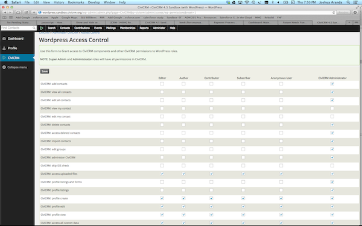
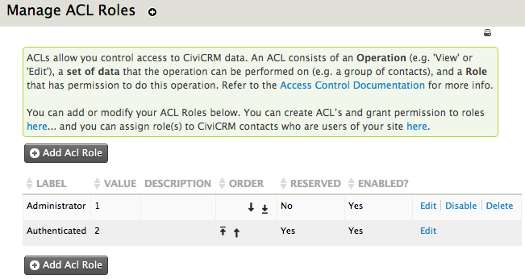
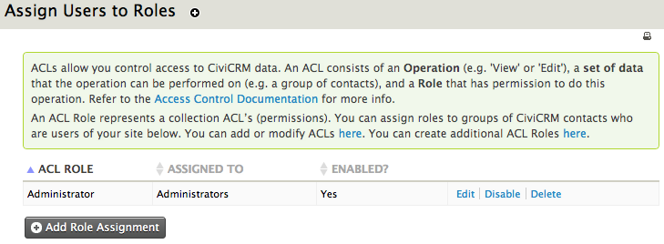
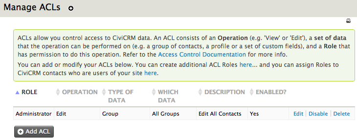

# Permissions and access control

Permissions (and the related concept of access control lists, or ACLs)
are collections of rules which define access to various areas of the
system. In essence, you create roles for your site, give these roles
permissions to do certain things, and assign the roles to certain
people.

Permissions and ACLs allow you to grant access to: 

-   Different areas of CiviCRM (e.g. CiviContribute, CiviCase and
    CiviMail) to reflect the tasks the user is responsible for
-   Entities within the system (like contacts, contributions, etc.), and
    how the user can interact or operate with them (e.g. view, edit,
    delete)

Since permissions define who can see and do what on your site, it is
important, from a security perspective, that you understand them well.
It is very easy to check a permissions box without fully understanding
what it does. A site with badly configured permissions may inadvertently
expose your contacts' data. 

## The difference between CMS permissions and CiviCRM ACLs

Permissions and ACLs are defined in two separate places: in the content
management system (CMS) and in CiviCRM itself. Many organisations are
able to do what they need to do with just CMS permissioning. Others need
to use CiviCRM ACLs to provide more fine grained access control. 

CMS permissions allow you to grant (or not grant) access to entire
sections of CiviCRM to user roles, such as CiviMail, CiviEvent, etc.
They also allow you to restrict the user's ability to view, edit, add
and delete records such as contacts, events and contributions. However,
this is an 'all or nothing' approach: you cannot differentiate between
contacts who fall into different groups, for instance.

Native CiviCRM ACLs give more fine grained control, so, for example, you
can limit access to view, edit, create, delete and search to :

-   groups of contacts
-   a profile (this is a collection of existing and/or custom fields,
    see "*Profiles*")
-   a set of custom fields
-   events (e.g. a user may access one event, but not others)

As a general rule, you should probably start with CMS permissions and if
you can't do what you need to with these, look at using CiviCRM to
enforce more granular access rights.

To clarify, here are two of examples of times when CiviCRM ACLs should
be used instead of those in Drupal, Joomla! or WordPress:

1.  An organisation has a head office, and three regional offices spread
    across the country. The event director working from the central
    office must be able to view all events across every office, but the
    event coordinators reporting to the director and local to each
    regional office are only to have access to view and edit their own
    events. Since a CMS access control list would only be able to
    restrict access to view/edit/add/delete *all* or *no* events, a
    CiviCRM ACL must be used.
2.  Two sets of custom fields have been built, one for a team of
    employees working in Paris managing a group of volunteers, and the
    other collecting donor information in London. Each team should only
    be able to access data held in their own set of custom fields,
    however, a CMS access control list could only give them access to
    all of the custom information, or none of it. In this case any CMS
    rule controlling access to custom fields should be disabled, and a
    CiviCRM ACL used instead.

## CMS permissions

All CMS have the same set of CiviCRM permissions, but each are found in
different places, and differ slightly in appearance.

### Permissions in Drupal

To access Drupal's permissions, go to the Drupal menu, choose the option
**People** and click the **Permissions** tab in the top right corner of
the pop-up window. Here you will find a long list of all possible
operations/actions a user could perform in CiviCRM and Drupal, with
columns for each existing role type. Checking an option in one of the
columns will grant that role the ability to perform the action.

You may create new roles and edit all existing ones. To edit roles,
while in the **Permissions** tab click the button **Roles** toward the
top right of the page.

 

Roles can be assigned to users in the following ways:

-   Open a user's contact record (a contact in CiviCRM with a user
    account), hit the **Actions** button at the top and select **User
    Record** from the menu. When the next screen appears, click the
    **Edit** tab (top right) and then scroll down to the section titled
    **Roles**; here you may change their level of access.
-   As an administrator, go to the Drupal menu and select the option
    **People**. When the list of active users appears, click on the
    desired name to open their Drupal user profile, go to the **Edit**
    tab at the top-right of the page, and then scroll down to the
    **Roles** section.

### Permissions in Joomla!

Permissions in Joomla! can be found as follows:

1.  Log into the Joomla! administrative portal
2.  Go to the **Components** menu and select **CiviCRM** from the list
3.  In CiviCRM's menu, navigate to **Administer > User and
    Permissions > Permissions (Access Control)**
4.  Click the option **Joomla Access Control** at the top of the list

Joomla! has a different method of assigning permissions, in that each
user group (role) is either a parent or child to another user group,
where child user groups (those lower in the table) inherit the
permissions set for those above them. Therefore, when editing the
permissions assigned to a user group in the table, you may choose
between:

-   **Inherited**: if the user group above was given this permission, it
    will also be able to perform the given action
-   **Allowed**: users in this user group are allowed to perform the
    operation
-   **Denied**: users in this user group cannot perform the action

Note that Joomla! has two additional permissions not used by Drupal or
WordPress: **Configure Joomla! ACL** (user can configure Joomla! ACLs and
is assigned all CiviCRM permissions) and **Show CiviCRM
Component** (user can see CiviCRM in the Components list).

Finally, to assign one of these user groups to a user, or change their
existing user group, ensure you are logged in as an administrator then
do one of the following:

-   Go to the user's contact record in CiviCRM, click the **Action**
    button and select the option **User Record**. A section called
    **Assigned User Groups** will be available to change roles.
-   Within the Joomla! administrative portal, under the **User** menu
    click **User Manager**. All available users will be listed, and
    clicking on a name will open a screen with the option to change
    their account settings, including user group.

### Access Control (Permissions) in WordPress 

In CiviCRM go to **Administer** > **User and Permissions** >
**Permissions (Access Control)**. Select the **WordPress Access
Control**link. Here you can adjust the CiviCRM settings for each of the
predefined User Roles from WordPress.

Roles can be assigned to users in the following ways:

-   Open a user's contact record (a contact in CiviCRM with a user
    account), hit the **Actions** button at the top and select **User
    Record** from the menu. This will open the **Edit User** screen
    where you can change their **Role** to change their level of access.
-   Within the WordPress Site Admin area, select the **Users** menu item
    to see a list of all users. Clicking on a name will open the **Edit
    User** screen where you can change their **Role** to change their
    level of access.

### 

### Anonymous and Authenticated roles

You will encounter both these role types as you work with the access
controls. Although they may be named differently on different CMSes, the
basic principle is the same.

The **anonymous** role (**public** in Joomla!) applies to all visitors
to the website who have *not* logged in. This role will have the lowest
level of permissions. The default CiviCRM permissions for this role
are:

-   make online contributions/donations
-   view event information
-   register for events through online forms
-   vew event participants
-   subscribe and unsubscribe from mailing lists
-   access all custom data (ie see/enter information in custom data
    fields in forms)
-   access uploaded files ( ie view/print content of uploaded files)
-   view, create and edit profiles ( or profile listings and forms) 

The **authenticated** role (**registered** in Joomla, **subscriber** in
WordPress) is applied to all visitors to the site that have logged in .
This is the default role for all new user accounts, and cannot be
deleted. By default CiviCRM permissions for this role are the same as
those for the **anonymous** role.

You can alter the permissions for anonymous and authenticated users if
you need to as the following common scenarios show.

#### Taking online contributions

If you only want contributions from logged in users you would remove
the**make online contributions** permission from the "anonymous" or
"public" role.

#### Viewing event info and registering for events

If "view event info" and "register for events" are enabled for the
anonymous and authenticated roles then all visitors to your site will
be able to register for any event. If you wish to give only
specific users the ability to view or register for *some* events, you
must use a CiviCRM ACL, allowing a role "view" access to events if they
should only be able to view event information, and the "edit" permission
if they can register. However for this to function, the CMS "register
for events" ACL must be disabled, as it will override these settings.

e.g. A charity holds occasional fundraising events for the public and
separate evening dinners for some of its corporate donors. Any visitor
to the website can register and participate in a fundraising event,
however the dinners are private and must only be available to some of
their donors. In this instance, CiviCRM ACLs should be used instead of
the CMS rule "register for events" as they can specify the specific
events each group of users can access.

#### Editing profile data in online forms

Profiles are collections of default and custom fields, and can be used
in online forms to collect additional information from visitors, or
build searchable directories (see "Profiles").

If you have a standalone profile in an online form used to search for
and edit data in CiviCRM (e.g. not part of an event registration page),
only authenticated users may edit. The permission "profile edit" can be
given to the anonymous role, but visitors who are not logged in will
still be unable to edit the data unless they have a [checksum](/common-workflows/tokens-and-mail-merge.md#checksum) (a unique
URL to one page where they may edit their own data; read "Everyday
tasks" in the email section for more information). For checksum tokens
to work, anonymous users must have the "profile edit" permission.

#### Collecting data from anonymous visitors using profiles 

If you have built profiles to collect data from anonymous visitors
through online forms (e.g. event registration pages, contribution pages
and standalone profile forms), the permission "profile create" will need
to be given to the "anonymous" role. Furthermore, should the profile
contain any custom fields, an additional permission will need to be
given, depending on the circumstances. Read "Accessing custom data"
below. 

#### Creating searchable directories for the public 

Profiles can be used to build searchable directories; a form of search
criteria able to gather a list of results from the database (e.g.
finding organisations held in the database by location). If you would
like to give a group of users access to search pages published on the
website, check the "profile listings" option for that role/user group.

#### Profile view

Where profiles have been embedded within online pages (e.g. to display
an organisation's name, description and contact details from the
database), the visitor must have the permission"profile view" to see it.

#### Using the "Profile listings and forms" permission

This access right should be assigned with care, and only to trusted
roles. The permission grants access to:

-   Add data through profiles in online forms
-   Edit data displayed in standalone profiles on public pages, if the
    option is given (e.g. contact information)
-   Use public searchable directories

Where possible, each of these access rights should be assigned to a role
separately, not through this 'allow all actions' permission. "Profile
listings and forms" is not enabled for the "anonymous" and
"authenticated" roles by default.

Note that if this role were given to anonymous users, in order to edit
data, the visitor must either be logged in or using a [checksum token](/common-workflows/tokens-and-mail-merge.md#checksum)
(see "Everyday tasks" in the section on email). 

#### Accessing custom data

If custom data fields have been used on an online form or within
profiles, the user will not be able to interact with it unless they have
been given permission to view and/or edit custom data. There are two
ways of assigning this ability:

1.  Enable the "access all custom data" permission against the roles you
    wish to give both view and edit access. If this were given to the
    "anonymous" role, for example, they would be able to view and edit
    all custom fields in online forms (e.g. custom data fields within a
    profile that has been incorporated into an event registration page).
    However, this is an 'all or nothing' approach.
2.  Alternatively, CiviCRM ACLs can be created to give roles access to
    only *specific*sets of custom data fields. Use this option when you
    want to give groups of users access to different sets of data, e.g.
    a team in Amsterdam may only have access to custom volunteer fields,
    while the head office in Scotland has access access to both custom
    volunteer fields and custom donor fields. Note that these ACLs will
    not function if the "access all custom data" permission is used in
    the CMS; that permission in Drupal or Joomla! will override these
    settings in CiviCRM.

#### Accessing uploaded files

Enable the "access uploaded files" permission for any role that needs to
view images, photos and files attached to CiviCRM records and pages. Be
sure to assign this permission to the "anonymous" role if you want
visitors to see photos attached to contact records, personal campaign
pages, documents intended for public consumption, etc.

#### Giving users the ability to view their contact dashboard

You can provide authenticated (logged in) users with access to a screen
where they can review the mailing groups they have subscribed to, their
contributions, memberships and event registrations (where applicable).
Assign the "access contact dashboard" permission to roles whose users
are to be given access to this feature. **Do not** enable this for the
"anonymous" role.

### Other CMS Roles 

Each CMS also has other predefined roles giving varying amounts of
access to CiviCRM. Again you can change the permissions granted to
these roles but you must make sure that there is always one role
(Administrator/Super Users/Admin) that has the ability to administer
CiviCRM including managing access control.

You may also want to add additional roles to allow for very graduated
access to CiviCRM functionality.

More information on CiviCRM permissions (access control options)
including permissions required to perform certain back office functions
can be found
at [http://wiki.civicrm.org/confluence/display/CRMDOC/Default+Permissions+and+Roles](http://wiki.civicrm.org/confluence/display/CRMDOC/Default+Permissions+and+Roles).

## Native CiviCRM ACLs

As discussed earlier, CiviCRM ACLs are a more advanced and granular way
of managing user access to records through contact groups, assigned to
ACL roles. While an access control in the CMS can 'turn
off' visibility of entire sections of CiviCRM, and determine whether a
user can view/edit/delete/create data in the different areas of the
system, they cannot sub-divide these rules into access to different
record types. For example:

> A charity based in Chicago has three regional offices, and needs to
> give its fundraising staff the ability to create and edit contact
> records for prospective donors. They have decided that the fundraising
> department in each office can only have access to its local contacts.
> While the permission "add contacts" can be granted to authenticated
> users in the CMS (Drupal, Joomla! or WordPress), if "view all
> contacts" and "edit all contacts" were also assigned in this way,
> there would be no way to differentiate between the three groups of
> donors (locations). This could only be achieved with a CiviCRM ACL.

To begin, go to **Administer** > **User and Permissions** >
**Permissions (Access Control)**. This screen will link you to the CMS
access control list, and the three steps to managing those native to
CiviCRM.

### Manage Roles

This is where you can create ACL roles. By default you will have
"administrator" and "authenticated" (logged in), but only the
administrator role may be edited; "authenticated" is a reserved role and
core to the system.

Clicking "Add Acl Role" will present a screen for creating a new role
with the following options:

-   **Label**: this is the name of the role, and will be visible to users
-   **Description**: create and format a description of the role
-   **Weight**: give the role a number to determine its place in the list
    (e.g. "1" places the role at the top, while "20" might send it to
    the bottom; lower numbers appear before higher ones)
-   **Enabled?**: is the role active or not? If you disable this option,
    functionality may cease to work for some users

### Assign Users to CiviCRM ACL Roles

Once the roles are configured, you can begin to assign them to users. In
CiviCRM this is done in two steps:

First create an access control group for a selection of users that are
to have the same level of access. There are multiple ways to do this,
outlined in the chapter "Groups and tags".

The ACL contact group can now be assigned to a role. Click the second
step on the access control menu screen ("Assign Users to CiviCRM ACL
Roles") and hit "Add Role Assignment". Complete the following:

-   **ACL Role**: select an available ACL role
-   **Assigned To**: choose a contact group to assign to the role
-   **Enabled?**: is this assignment active or not?

 

### Manage ACLs 

The third step is where the ACLs are finally created. They can be broken
down into the following questions:

1.  Which role will have permission to perform this action?
2.  What is the action/operation? Is it the ability to
    view/edit/delete/create, etc?
3.  Which set of data can the action be carried out on?

To begin creating these ACLs, return to the Access Control screen
(**Administer > User and Permissions > Permissions...**) and
click "manage ACLs". A list of existing controls will be displayed,
likely including one for administrators giving them permission to edit
all contacts in the database. To add a new one, click "Add ACL" and fill
in the following:
-   **Description**: write a clear description of what the ACL does

-   **Role**: choose a role to assign the ACL to from the drop-down list

-   **Operation**: select the action this role is allowed to perform (e.g. view,
edit, create, delete...)

-   **Type of Data**: choose the data type the operation relates to:

    -   A group of contacts
    -   A profile
    -   A set of custom data fields
    -   Events

-   **Group/Profile/Custom Data/Event**: The label on this field is set by your selection in **Type of Data**. This is where you select the specific
group of contacts, profile, custom data or event for this ACL

- **Enabled?**: is the ACL active?

