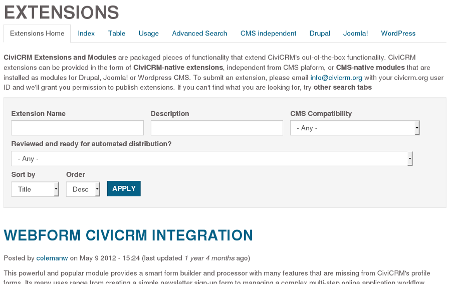
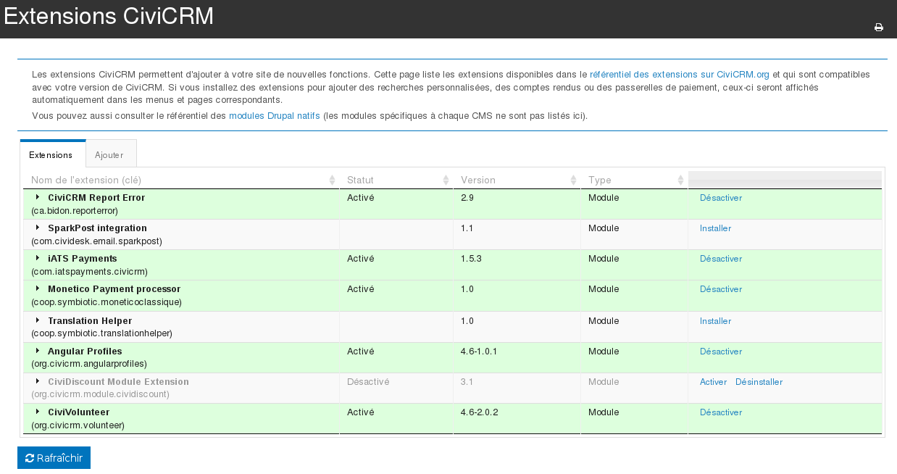

Extensions
==========

Les extensions fournissent des fonctions supplémentaires au « coeur » de CiviCRM. C'est la méthode recommandée pour créer de nouvelles fonctionnalités et pour modifier la façon que CiviCRM fonctionne, surtout lorsque ces changements ne sont pas nécessaires ou souhaités par l'ensemble de la communauté CiviCRM.

Plusieurs personnes développement des extensions pour leurs besoins spécifiques. D'autres écrivent des extensions génériques qui peuvent être utiles pour d'autres organisations également. Ces dernières sont publiées dans le répertoire des extensions CiviCRM.

Le répertoire des extensions CiviCRM
------------------------

Le répertoire des extensions est disponible à l'adresse 
[https://civicrm.org/extensions](https://civicrm.org/extensions). On y retrouve une liste d'extensions développées par la communauté et qui ont été rendues librement et gratuitement disponible à l'ensemble de la communauté. Par défaut, les extensions sont affichées dans l'ordre croissant de popularité (calculé selon le nombre d'instances de CiviCRM qui utilisent l'extension et qui rapportent leurs statistiques).

 

Les extensions sont organisées en deux grandes catégories. Les extensions « natives » fonctionnent avec n'importe quel système de gestion de contenu (SGC). L'autre type sont des extension spécifiques à un type de SGC, généralement pour ajouter des fonctionnalités pour mieux intégrer CiviCRM avec le SGC. Selon votre SGC, ces extensions porteront peut-être le nom de « module » dans le monde de Drupal ou encore « plugin » dans le monde WordPress.

Les extensions qui ont été validées par la communauté peuvent être installées directement par l'interface de gestion des extensions dans CiviCRM.

Installer des extensions
---------------------

Lorsque CiviCRM est correctement configuré, des extensions peuvent être installées directement à partir de l'interface administrative. Dirigez-vous à **Administrer > Paramètres système > Extensions**. Vous devriez y voir une liste d'extensions qui sont compatibles avec votre version de CiviCRM. À noter que vous pourriez ne pas voir toutes les extensions du répertoire sur CiviCRM.org si elles ne sont pas compatibles.

Si la liste est vide, il se pourrait que votre système n'est pas correctement configuré pour gérer les extensions. Consultez votre administrateur système si c'est le cas.

Développer des extensions
--------------------

N'importe qui est libre de développer une extension pour améliorer leur installation de CiviCRM (ou d'embaucher une personne pour le faire). Développer une extension est une tâche pour un programmeur, ce qui sort du cadre de ce guide. Si vous décidez de développer une nouvelle extension pour vos besoins, prenez le temps de considérer si d'autres organisations pourraient également bénéficier de votre travail et donc si cela vaudrait la peine de publier votre extension dans le répertoire en ligne. Publier votre extension attirera plus d'utilisateurs et vous permettra d'avoir des commentaires qui pourraient vous aider à améliorer l'extension, son code ou ses fonctionnalités.

