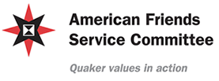
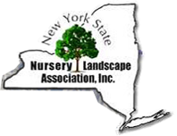
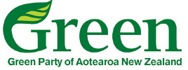
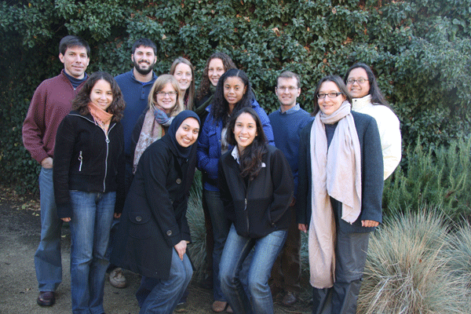

Des exemples concrets
=====================

CiviCRM est utilisé par des organisations de toutes les tailles et de toutes les formes. Certaines organisations n'ont pas d'employés, alors que d'autres peuvent en avoir des centaines. Leurs besoins peuvent varier du très simple au très complexe. Dans ce chapitre, nous regarderons quelques exemples réels d'organisations qui utilisent CiviCRM.

Dans ce chapitre, vous remarquerez des références à des fonctions de CiviCRM telles que l'envoi massif de courriels, la gestion des membres, la gestion de promesses de dons, les profils et autres. Ce sont différentes composantes de CiviCRM et nous avons inclus des références pour que vous deveniez plus familiers avec la terminologie de CiviCRM. Certaines organisations utilisent une seule composante, d'autres en combinent plusieurs.

* * * * *

## Suffering Relieved!

The American Friends Service Committee (AFSC) is a large, Quaker-based,
peace and social justice organization with over 400 employees.
Worldwide, they run programmes that work to relieve and prevent
suffering through both immediate aid and long-term development, and they
seek to serve the needs of people on all sides of violent strife.

Their main headquarters are located in Philadelphia, Pennsylvania. They
have nine regional headquarters located throughout the United States,
some 50 area offices also located in the USA, and numerous international
field offices located in Africa, Asia, Europe, Latin America, the
Caribbean and the Middle East.

Lists of constituents are maintained by each office. The specific CRM
system needs of each office vary but the general needs are: searching
for constituents that meet certain criteria; sending emails,
newsletters, postal mail and announcements; and collecting the contact
information of people who sign online petitions and register for events
online.

Through a survey conducted by the AFSC Information Technology
Department, it was revealed that AFSC staff were using a variety of
systems to keep track of their constituents. It also became obvious that
these systems were not working effectively: repositories of data were
everywhere, contact information was duplicated, staff were having a hard
time managing their contacts and the IT Department was unable to provide
adequate support.

The survey also found that staff members were frustrated with the
systems they were using because they lacked the necessary functionality
for them to effectively communicate and do outreach. Specifically:
search capability was limited; there was no ability to send high-volume
emails which meant that it was not possible to send newsletters or
announcements; and there was no ability to collect information online.

After investigating several database systems, the IT Department finally
decided that, all things considered, CiviCRM might be the best fit for
the AFSC.

### What They Did

Initially, CiviCRM sites with CiviMail, managed by an external vendor,
were established for offices in Los Angeles, Rhode Island, San Francisco
and Seattle. Los Angeles also chose to use the CiviEvent component to
track event registrations and the CiviMember component to track contact
information of committee members.

After implementation, an LA staff person discovered that certain
functionality was missing from the CiviMember export component and this
was preventing them from being able to compile a membership directory.
AFSC talked to the CiviCRM Core development team and contracted them to
add the missing functionality. This was a win-win situation: AFSC got
the functionality they needed and because it was integrated back into
the CiviCRM product, the entire CiviCRM community was able to benefit
from the addition. An extra advantage for AFSC is that because the
functionality became a standard part of CiviCRM they don't have to worry
about compatibility with future upgrades.

### The Results

The decision to have their sites hosted and managed by an external
vendor turned out not to be a good one when the vendor ran into
difficulties and was not responsive to issues or in providing the
services that had been promised, such as timely updates for CiviCRM.
Once the hosting issue was resolved, staff were able to take full
advantage of the capabilities of CiviCRM and do all of the things that
they had previously been unable to do.

The Los Angeles office is in full swing, using CiviCRM as the main
repository to track their constituents, board, committee members and
volunteers. Their constituents are able to sign up for events and
petitions online, and staff can send volume emails for newsletters and
announcements.

Getting rid of their old system and being able to send out a monthly
newsletter was the main goal for the Colorado office, who came on board
with CiviCRM a little later in the process. They are now able to
identify newsletter subscribers and send the newsletter to them via
CiviCRM. They couldn't be happier!

The AFSC currently has nine CiviCRM sites and the IT Department is now
recommending CiviCRM as the "database of choice" for all of its offices.
Support from the CiviCRM community is excellent and CiviCRM itself is
improving every day, as more and more functionality is being added. AFSC
staff are now able to access their data from any place that has internet
access, run complex searches, manage online event registrations and send
online newsletters and postal mailings. CiviCRM has enabled them to
better manage their constituents. This makes their life easier and in
turn, is of great benefit to AFSC.

A CRM Education
---------------

]

Schoolhouse Supplies (SHS) is a Portland, Oregon, USA-based non-profit
organisation which gathers and distributes school supplies to students
and teachers.

Prior to implementing CiviCRM, SHS used a combination of software
programmes including Exceed, EROI, Constant Contact, Salesforce, Auction
Pay (for online contributions) and, of course, hundreds of spreadsheets.
In addition, SHS had a custom web application for managing its online
store inventory and processing in-kind donations.

### What They Did

By moving to CiviCRM, SHS has centralised their operations and the
management of all their constituent data, and been able to unify and
coordinate several of their core business processes.

All data from each source has been migrated to CiviCRM Standalone (an
installation that is not integrated with either Drupal or Joomla! CMS).
CiviContact and CiviContribute have replaced Exceed and Auction Pay.
CiviMail has replaced EROI and Constant Contact. Salesforce data was
moved into CiviCRM and the custom e-commerce application it supported
was integrated with CiviCRM. Lastly, the inventory and in-kind
management system was integrated with CiviCRM. Spreadsheets have been
imported.

### The Results

Each business process at SHS can now take advantage of their full
constituent database and business activities are easily coordinated.
More importantly, SHS is now in the process of taking manual business
processes (such as volunteer coordination) and moving them to CiviCRM.
New campaigns are now being planned and executed which would previously
have been impossible or prohibitively expensive.

Growing Satisfaction
--------------------

The New York State Nursery Landscape Association (NYSNLA) is a
member-based association providing resources and advocacy support for
nursery and landscape professionals throughout New York State. The
organisation seeks to advance the interests of New York State's nursery
and landscape businesses and professionals by promoting sound business
practices, expanding state and local markets, and exercising leadership
in the development of sustainable communities.

Prior to migrating to CiviCRM the Association went through several
iterations of member-management solutions, beginning with a series of
spreadsheet documents and later moving to a Microsoft Access database.
The move to CiviCRM was prompted by the desire to consolidate data,
provide members real-time access to contact details, and to create a
searchable member directory to website visitors who may be looking for a
nursery or landscape professional.

### What They Did

Working with a CiviCRM consultant, NYSNLA began the process of analysing
the structure and content of their existing database and mapping the
various functions to CiviCRM structures. They determined that they would
use CiviMember, CiviEvent, CiviContribute, and CiviMail to address their
core database needs, and would consider using CiviPledge at some point
in the future for soliciting contributions to their associated
non-profit, the Nurserymen's Foundation.

One data area that required particular attention was their Certified
Nursery Landscape Professional program (CNLP). CNLP is an intensive,
on-going educational programme designed to increase the skills of garden
and landscape employees. The programme was designed by members of the
nursery and landscape industry with assistance from Cornell University.
Interested individuals must apply to the programme and successfully pass
a test. Certification lasts two years, after which time the individual
must recertify.

NYSNLA used CiviCRM's membership functionality to track the status of
CNLPs. The ability to define a rolling-period membership and to gauge
when they are nearing expiration perfectly met their management needs.
The initial application process, which also must be carefully tracked,
was handled through CiviEvent, as an application to the programme is
essentially a registration to attend one of the bi-annual test events.

The Association also took advantage of CiviCRM's open source platform to
make some interface customisations that improved the way they view
contact records. Because of the importance of the CNLP programme, they
wanted to be able to look at all employees for a certain
nursery/landscape company and quickly know if any of them are CNLPs or
Lifetime CNLPs. They also needed to easily find out which employees are
authorised to manage the company's records.

### The Results

The Association has worked hard to communicate to the public the
importance of using a qualified landscape professional. Essential to
this effort was the inclusion of a searchable member directory on their
website. Using CiviCRM, they were able to create a search page that
included geographic segmentation (the Association divides members into 8
regions state-wide) and a list of services provided by members (using
CiviCRM's tags feature). The resulting search tool, because it is
directly connected with their contact data, ensures website visitors are
always looking at current information. The Association is also able to
provide members direct access to their own contact details so they can
update and maintain their list of services provided and other
information.

Campaigning for Efficiency
--------------------------

The Green Party has been the third largest party in New Zealand politics
for most of the last decade, with strong roots in the Values Party (the
world's first national Green party) of the early 1970s. They achieved
parliamentary representation in 1996 and after the 2008 election had 9
Members of Parliament, 5,000 financial members and some 50,000 contacts.
The Party has more than 50 branches around the country and contest
elections across all 67 electorates in the last election.

Prior to adopting CiviCRM, the Party and its parliamentary units
employed a range of systems for managing members, donations, contacts,
campaigning, media and advocacy.

The Green Party policy states:

-   Development of IT must be socially responsible and sustainable.
-   The use of free and open source software should be encouraged.

### What They Did

CiviCRM was adopted by the Party in 2007 (version 1.7), with a switch to
Drupal as a parallel project. This was inspired in part by work done by
the Canadian Greens on developing a voter canvassing module for Drupal.
A Party database was set up using CiviCRM and online donations,
memberships and event registrations were instigated.

The Greens have over 100 different issues that they generate media
releases about. These were reconstructed as a check-box custom data
field, and Smart Groups were built for each of these, for use when
sending out media releases via CiviMail.

The highly complex access control requirements of the party necessitated
the development of an alternative approach to the use of ACLs (Access
Control Lists) in order to provide a more easily managed, highly
granular system. This approach has now been incorporated as a hook
(something that can be utilised by developers to extend CiviCRM) into
the core code.

For the 2008 election campaign, a look-up function was developed so that
when new contacts were added to the database, addresses were checked
against a table containing the Electoral Roll, and links were created
where matches were made. "Soft" matches were also recorded.

### The Results

In the 2008 election campaign, the Party made extensive use of online
fundraising and greatly exceeded previous online income. Membership
renewal has been streamlined with more online renewals occurring.

As of May 2009, the Party was still using CiviCRM v2.0 on Drupal 5 and
therefore had not yet benefited from the many features that became
available through the 2.1 and 2.2 releases. An upgrade was in progress
at the time.

In a complex organisation such as the Green Party, training can be a
limiting factor, as well as the need to nurture more in-house
super-users. New features in CiviCRM have led to some rethinking about
the Party's usage of custom data fields, particularly with regard to the
use of CiviMail for media releases. New options for both nested groups
and Drupal Organic Groups suggest that a more time effective approach
may soon be possible.

Quest for Success
-----------------

QuestBridge is dedicated to helping bright, motivated low-income high
school students get accepted to and able to pay for college. QuestBridge
recruits high school juniors throughout the USA and invites them to fill
out the QuestBridge application online. QuestBridge also partners with
the USA's most selective colleges and universities with the aim to
increase the socio-economic diversity of their student bodies.
QuestBridge's college partners accept the QuestBridge application in
lieu of their own admissions application.

### What They Did

QuestBridge has built most of its business processes around CiviCRM.
They wrote their online admission application using CiviCRM and extended
it using the PHP scripting language. CiviCRM is used to store
biographical and application information and communication histories
about the students.

### The Results

In the 2008-9 school year, QuestBridge helped more than 1200 students
get accepted and pay for college at its 25 partner schools. They
accomplished their goals in a very efficient manner, in part thanks to
their effective implementation of CiviCRM. QuestBridge is currently
planning to upgrade to the latest version of CiviCRM in order to take
full advantage of the new email features.

If Questbridge were to start over they would have invested more in
training on CiviCRM up-front.

Changing with the Times
-----------------------

------------------------------------------------

The San Francisco School (SFS), is a Preschool through 8th grade
coeducational school with a diverse student body of about 270 students.
Like all schools, communication between the school and families is very
important. Whether it's updating a home phone number, email address or
allergy, it is essential in meeting the needs of the students. The head
of school was a strong supporter of the project from the beginning which
led the staff and parents to be able to make a strong commitment to help
the project move forward.

### What They Did

They used CiviCRM to create a Parent Portal to:

-   required parents to log in to view their contact information and
    their child's school information
-   had an automated system to schedule parent teacher conferences
-   used a computer to record after school class sign in and sign out
-   managed after school class registration (example: music, cooking,
    sports) and view their child's after school fees

To ease the transition of the school community, each of the above
features were shown gradually rather than all at the same time.

### The Results

Enabling parents/guardians to view their contact information meant that
they could confirm what the school sees and hence notify the school of
any changes. Also, they could view their child's after school fees and
view a record of what classes their child is signed up for. Online sign
ups allow parents the flexibility to schedule parent/teacher conferences
and after school classes on their own time. Changing the existing school
systems to an online system allowed both parents and staff to work
together, view the Parent Portal so that contact information is current,
parent teacher conferences are scheduled in a timely manner, and that
access to the information is widely accessible.
