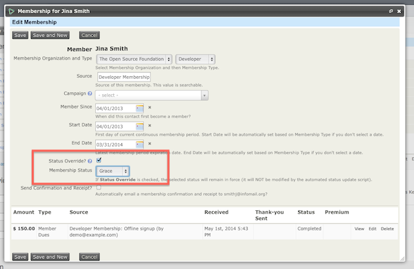

# Cancelling and expiring memberships

If a contact wants to resign or cancel their membership, rather than
deleting their membership, you should change the status to cancelled or
another status that is not considered current. This ensures that you
keep a historical record on the contact's interaction with your
organization and all contribution records attached to that membership.
Similarly, if a contact's membership was in grace period and you knew
that they were not going to be continuing their membership for another
period, you could manually change their membership status to expired as
opposed to cancelled since they went through the entire period of their
membership.

You can cancel or manually expire a membership record by:

-   Search for a particular contact whose membership status you would
    like to change, click on the **Membership** tab then click
    **Edit** next to the membership record.
-   One you are in the edit screen of the membership record you will
    need to check the **Status Override box** and then select the
    appropriate **Membership Status** you wish to change to. i.e.
    Cancelled or Expired

Keep in mind that manually expiring memberships may not be needed.
Dependent upon how you have your membership status rules setup within
**Administer > CiviMember > Membership Status Rules** memberships will
automatically expire based on timeline criteria.

## Deleting memberships

The only time you would want to **delete** a membership is if you
entered it error, for example if you made Jo Smith a member instead of
Joe Smith, you would want to remove the incorrect membership and any
linked contribution record for Jo Smith. When a membership is deleted
it is completely removed from the database and so are any linked
contributions.  **This action cannot be undone** so you should only give
permission to delete memberships to trusted staff.

You can delete membership records by:

-   Searching for a particular contact, then click on the "Membership"
    tab > click **More** next to the membership record > click
    **Delete**

or

-   Click on **Memberships > Find Members >** enter your criteria and
    from the "Find Members" results screen, select the membership
    records and click **Delete**.

