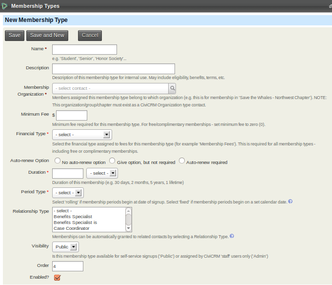
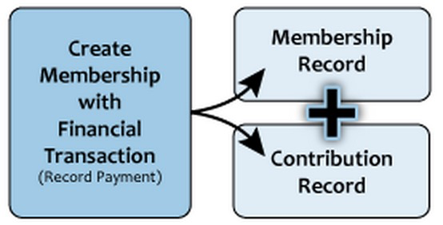
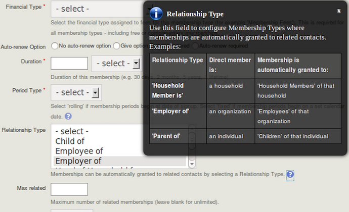
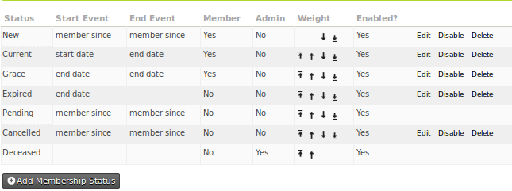
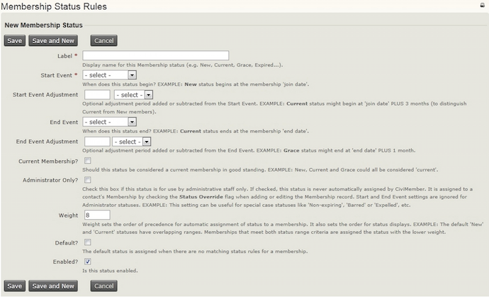

# Defining memberships

This chapter describes how to set up one or more **membership
types** that you can use to manage your organisation's members. It also
explains the concept of **membership statuses** and how your
organisation can use them to define a membership life-cycle.

## Membership types

Membership types are a basic building block for membership management in
CiviCRM. Typically an organisation will set up a membership type for
each of the different memberships that they offer. For the simplest
membership structures, one membership type may be enough. For more
complex membership structures, more membership types may be required.
For example, an organisation may define three membership types for
'regular', 'student', and 'honorary' members.
Or an organisation may choose to use membership types as subcriptions to
their different publications, either free or paying ones.

There are a number of options that can be configured for a membership
type, and these are best discussed by working through the membership
type form. A solid understanding of the options will help you decide on
how many membership types your organisation needs and how they should be
configured.

In this chapter we will cover the most common set-up for membership
types. Some organisations, with more complex membership structures, have
requirements that go beyond what is available with membership types
alone. These organisations may find that **membership price sets** give
them the extra flexibility they need. Since membership price sets are
an advanced topic, they are covered in their own chapter
[Membership price sets](membership-price-sets.md).

If you are having trouble modelling your membership structure in
CiviCRM, ask on Mattermost or Stack Exchange (see [Finding the Community Online](../the-civicrm-community/the-civicrm-community.md#finding-the-community-online)) about the problems you are having. There may
be other ways to model your data, or simple changes you can make to
CiviCRM's behaviour to better fit your needs.

To start learning about membership types:

1.  Go to **Administer > CiviMember > Membership Types**
2.  Select **Add Membership Type**

-   **Name**:
The name is displayed throughout the system, on both public and
backend pages so spend some time thinking about a name that is
appropriate to both audiences. It can be changed at a later date (though
this may result in extra work in updating membership receipts if they
have been customised based on membership names)

- **Description**:
This is not required but you may wish to fill it in with a description
of the membership, what type of contacts it is aimed at, etc.

-   **Membership organisation**: CiviCRM is able to manage the memberships of more than one organisation,
i.e. a local sports centre could use a single CiviCRM instance to manage
the memberships of a tennis club, a football club, and a hockey club.
For this reason, when defining a membership type, you specify the
organisation that the contact will become a member of. Each
organisation must already exist as a CiviCRM organisation contact. Many
organisations are only interested in modelling the memberships of one
organisation (their own organisation). In this instance you can just
choose the default organisation.

    Some organisations may
    want people to have two or more memberships of the same organisation
    that run concurrently. For example, an organisation focused on child
    health might want to offer a membership for parents that includes a
    parenting magazine and a membership for health professionals that
    includes a peer-reviewed journal and discounts at training events.
    Parents who are health professionals may want both memberships. A
    challenge to supporting this use case is that CiviCRM's
    [Membership Up-Sell feature](renewals.md#membership-up-sell)
    expects a contact to have only one active membership with a single
    organization at any given time. A
    'workaround' for this is to create 'dummy' organisations for each of the
    possible concurrent memberships. For the situation just described, we
    would need to create an extra organisation for health professionals.
    Note that you don't have to expose the dummy organisation to your
    members on the website; it is for administrative purposes only.

-   **Minimum fee**: If your memberships are free you should enter 0 (zero) in this field.
Otherwise you should enter the minimum amount that must be paid for this
membership type. The reason we call this field the *minimum* amount is
that we have an option to encourage people pay more than the minimum for
a membership if they want to.

-   **Financial type**: The default [financial type](../contributions/key-concepts-and-configurations.md#financial-types) for a membership type is **Member Dues**.
This is appropriate for many organisations. However, if you have more
complex accounting needs, you can specify different financial types that
will allow you to account for different membership payments in different
ways. If you need more fine grained control over
financial types you can use [Membership Price Sets](membership-price-sets.md).

    Note that the financial type can be overridden for specific public
    membership sign up pages, and also when recording a membership in the
    back end.

    CiviCRM handles paid memberships by linking membership records to
    contribution records. A membership record documents a contact's
    *relationship* with the organisation, while the corresponding financial
    transaction indicates the monetary value associated with that
    membership.

    

    CiviCRM respects this distinction by storing the membership record under
    the membership tab, storing the financial record under the Contributions
    tab, and then creating a link between the two records.

-   **Auto-renew**: CiviCRM offers an auto-renew functionality that will automatically
submit a repeat transaction to the payment processor when the current
membership expires. This can be a good way to increase membership
retention. This functionality is not available for all payment processor
so you will need to check if yours is configured for recurring payments
before selecting one of the auto-renew options here. For information on
payment processors see
[http://wiki.civicrm.org/confluence/display/CRMDOC/Payment+Processors.](http://wiki.civicrm.org/confluence/display/CRMDOC/Payment+Processors)

    You can offer or require auto-renewal for a membership type. However
    auto-renew memberships can only be offered for memberships that have a
    duration (discussed below) of one year or less.

-   **Duration**: In the **Duration** field you should enter the number of days, months or years that your membership lasts for each time someone signs up or
renews.

-   **Period type**: The options for Period type are rolling and fixed.
 **Rolling** memberships start on the day the member signs up.
**Fixed** memberships start on the particular calendar date you specify.

    When you set the Period type to fixed, extra fields will appear
    depending on the duration you have specified.

    If the Duration is specified in **years** two extra fields will be
    displayed:

    -   The **Fixed Period Start Date** is the calendar date that all
    memberships start on (eg January 1st or April 15th).

    -   The **Fixed Period Rollover Date** determines the end date for the
    membership when a person signs up part way through your membership
    year. Its use is best illustrated through an example. Consider a
    membership type with a **Duration** of one year, a **Fixed Period
    Start Date** of January 1 and a **Fixed Period Rollover Date** of
    September 1

         -   Anyone signing up between 1 January 2018 and 31 August 2018 will
        have a membership end date of 31 December 2018.
         -   Anyone signing up on or after 1 September 2018 will have a
        membership end date of 31 December 2019. (i.e. they will receive
        up to 15 months membership for the 1 year price.)

    If the Duration is specified in **months** one extra field will be
    displayed:

    -   The **Fixed Period Rollover Date** determines if the membership
        duration starts at the beginning of the current calendar month or
        the beginning of the next calendar month. Consider a 6 month
        membership type with **Fixed Period Rollover Date** set to 15:

        -   Someone signing up on days 1-14 January will have a membership
            end date of 30 June.
        -   Someone signing up on days 15-31 January would have a membership
            end date of 31 July.

    Example: If **Duration =** 12 months, **Period type** = Fixed, and **Fixed
    Period Rollover Date** = 1, then anyone joining during August 2018 will
    have an expiry date of 31 August 2019.

-   **Relationship Type**: Memberships can be **inherited** from one contact to another. An example of this would be a professional trade organisation that signs up
a company as the (primary) member and wants employees of the company
receive the benefits of membership.

    In order to support this feature we define a **relationship type** along
    which the membership inherits.

    The pop-up help screen gives examples of the relationship types to
    select for this feature. Once you have selected a relationship type, you
    enter a number in **Max related** to set a maximum for the number of
    inherited memberships linked to each primary member. This would be
    useful, in the example above, to limit the number of employees that can
    become a member by virtue of their employment to 10 maximum.

    

    With inherited memberships, we distinguish between the primary member
    and the members that inherit their membership due to their relationship with the primary member.

-   **Visibility**: Choosing **Public** means that this membership type will be able to be selected for inclusion on online membership sign up forms. If certain
membership types are only to be handled by an administrator manually
(e.g., honorary and lifetime memberships) you should choose **Admin**
here.

-   **Order**: This determines where this membership type appears in a drop down
options list of membership types, and on membership sign up pages.

-   **Enabled**: If you have membership types that are no longer offered or not yet
available you may wish to untick this box. This will remove these
memberships from the user interface. It will not delete the membership
data and the membership can be re-enabled at a later date.

## Membership status rules

Membership status rules allow you to define a journey that contacts take
through their membership. These rules are defined in terms of the join,
start or end date of the membership. So let's first have a look at what
these dates mean.

Memberships have three primary dates, the join date, start date and end
date. The **join date** is the date the contact first signed up for a
membership with your organisation. Unless it is altered manually it
will never change from that first value. The **start date** is the date
the current *continuous period* of membership began. The **end date**
is the last day of the current membership.

By default the journey through membership statuses is as follows:

-   **Pending:** someone who has requested membership but has not paid.
    This status cannot be amended manually meaning that you can not
    change the status from pending to new unless you update the
    associated contribution record. For example, if you have the pay
    later option enabled for membership and Joe Smith signs up for your
    membership and chooses the pay later option, the status of his
    membership will not be changed to new until you change the
    contribution status of his related payment to Completed.
-   **New**: member has just signed up for a membership or a pending
    payment has arrived. By default this lasts until 3 months after the
    membership start date.
-   **Current**: new members move to this status after the new period
    has finished. As might be expected, the current status lasts until
    the membership end date.
-   **Grace**: when the end of the membership period is reached, someone
    who has not renewed membership enters this status for a period of
    time. They are still counted as a member.
-   **Expired**: when the grace period expires, the member moves to this
    status and is no longer counted as a member.
-   **Cancelled**: when an administrator manually cancels a membership, 
    perhaps due to misbehaviour.
-   **Deceased**: this status keeps a deceased contact's record in the
    system but removes the contact from all further communications. This
    status is set automatically based on a contact's deceased flag.

You can force a membership to have its status overridden by selecting
**membership override** on a membership record and choosing a status. As
might be expected, a membership with status override will remain at that
status, and not be updated according to the membership status rules
described above.

At **Administer > CiviMember > Membership Status Rules** you will find a
summary of the existing status rules.

To decide on which status should be applied, CiviCRM looks to see if the
membership has a status override. If it does, it applies that status. If
not, it looks at each status in turn starting at the top of the Status
Rules page until it finds one that is valid. That is to say, it looks to
see if today's date is between the start and end date for the membership
status at the top of the list. If it is, it applies that status, if not
it moves to the next status and repeats this process until it finds a
status that matches.

When you edit or add a new membership status the following form appears.

You can add new statuses and edit existing statuses (except for Pending
and Deceased) using this form. To create a new status, you need to
specify when the status should start and stop. This is done in relation
to a membership event (i.e. the join date, start date, or end date).
e.g. 'one month after the membership start date would be configured with
'start date' and '1 month' or 'five days before the membership end date'
would be configured with 'end date' and '-5 days'.

You also specify whether contacts with this membership status should be
considered members or non-members by checking or unchecking the 'Current
membership' tick box. (This results in a Yes or No in the Member column
on the status rules summary page.) Renewing contacts with a status that
defines them as members will have their existing membership end date
extended by the duration of the renewal. Renewing contacts with a
status that defines them as non-members get a new start date for their
membership and an end date based on that new start date.

## Keeping membership statuses updated

When a membership is added or renewed the membership status is
automatically set based on your status rules. For example, a newly
created membership will be assigned the status "New" by default. If your
membership statuses are not updating automatically, make sure that
the **Update Membership Statuses** scheduled job is enabled and runs at
least once a day. Refer to the
[Scheduled Jobs](https://docs.civicrm.org/sysadmin/en/latest/setup/jobs/)
chapter for configuration details and consult your system administrator
if appropriate.

## Collecting additional information about your members

Sometimes you want to collect additional information about your
members. You can create one or more custom field sets for this
purpose. Custom field sets can be created for either all memberships or
specific membership types. If the information you want to collect
varies according to the membership type then you should set up more than
one custom field set linking it to the specific membership type(s).
(Refer to [Creating Custom Fields](../organising-your-data/creating-custom-fields.md)
for more details.)
