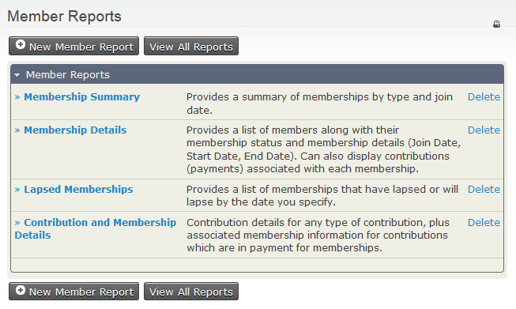
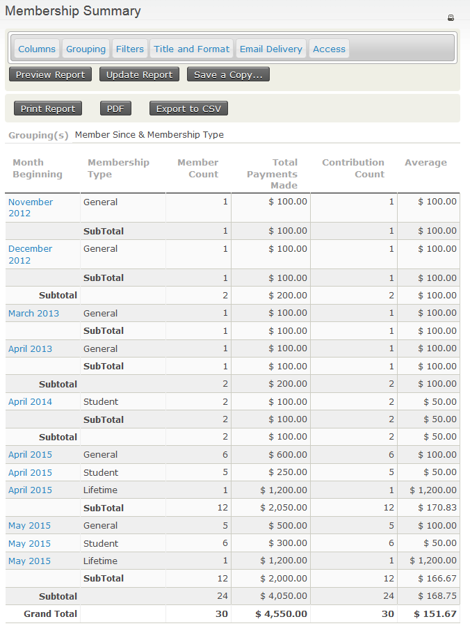
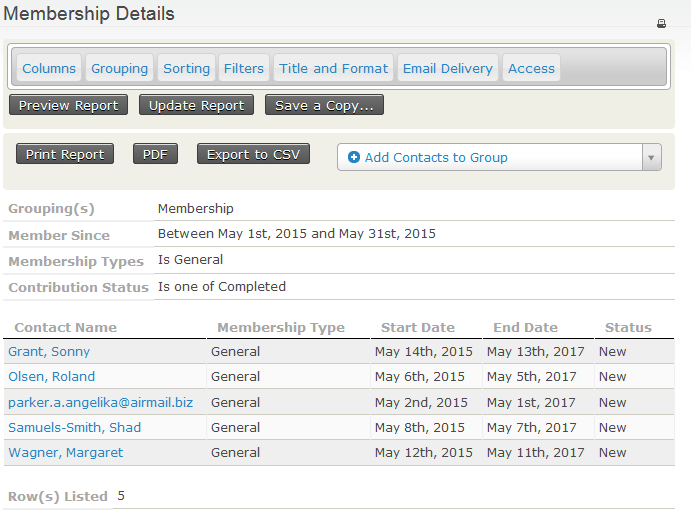
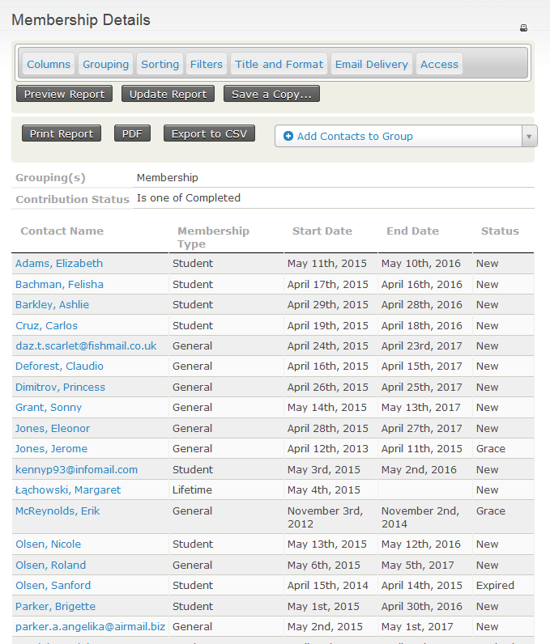
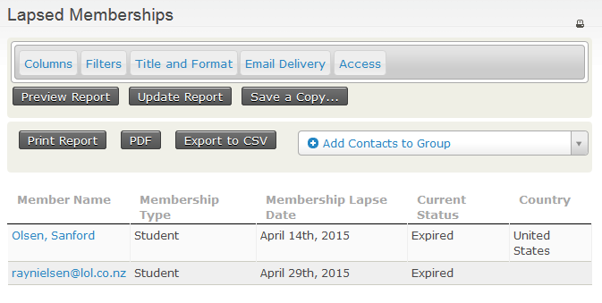
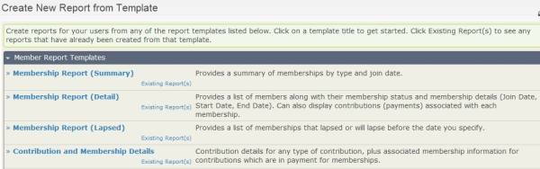
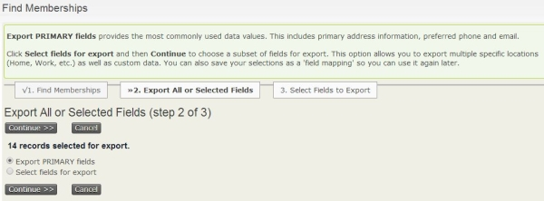
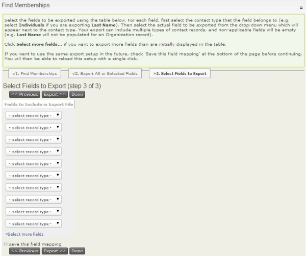

# Membership Reports

There are a number of techniques for reporting on and analysing your
memberships.

The membership dashboard gives a quick summary of your current
memberships, displaying information for each membership type such as
current totals of members, and then a break down for last month, this
month and current year to date totals. You can also [search for specific membership details](finding-and-viewing-memberships.md#searching) using **Advanced Search** or **Find Memberships**.

This chapter will show you how to view and create membership reports as
well as export membership information so you can do further analysis.

## Viewing Membership Reports

Out-of-the-box, CiviCRM comes with several membership reports designed
to tell you something specific about your membership:

The **Membership Summary** report shows information about members
grouped by a date frequency you specify, such as month, week, quarter,
year. For example, you can look at the number of members that have
joined each month over a date range, membership types, or any other
custom data that you collect about them.

If you click on a highlighted field you will then see the corresponding
**Membership Detail** report for that row. So clicking on **May 2015**
for membership type **General** shows:

The **Membership Detail** report shows information for each
membership record based on your selected criteria.

The **Lapsed Memberships** report provides a list of memberships that
lapsed or will lapse before the date you specify.

The **Contribution and Membership Details** report will display
information details of a contributions and those contributions connected
to a membership records based on your report criteria.

## Creating New Membership Reports

If you find that you want to create and save new membership reports with
different criteria other than the out-of-the-box membership reports
offer , you can do so by using the membership templates.

-   Click on **Reports > Membership Reports >** click the **New Member
    Report** button
-   On the Create New Report Template screen, click on one of the
    membership report templates, and begin entering your criteria

-   Once you've entered your criteria, click the **Preview Report**
    button to check your results
-   If you like what you see, you can then save this report as a new
    membership report by clicking **Create Report**, then enter the
    information you want to save this as a new membership report.

See [Reporting](../reporting/what-you-need-to-know.md) to learn more about working with reports, in general.

## Exporting membership records

You may decide to export membership records so that you can do more
analysis, perform document mail merges, or create a specific type of
reports outside of CiviCRM. Exporting membership records allows you to
select a default set of primary fields or choose fields that are
specific to the membership record for export.

You will need to first [search for the specific membership records](finding-and-viewing-memberships.md#searching) you
would like to export.

To export membership records:

-   Click on **Memberships > Find Members**, enter your search
    criteria
-   Then on the "Find Members" search results screen, select the records
    you want to import and in **-actions-** drop down, select **Export
    Members**.
-   You can select **Export PRIMARY fields** or **Select fields for
    export** and click the **Continue** button

-   If you selected **Export PRIMARY fields**, a file called
    `CiviCRM_Member_Search.csv` will be created containing the
    membership records based on your search criteria
-   If you selected **Select fields for export**, then include the
    fields you would like to export, check the box for **Save this field
    mapping** if you want to re-use this field mapping for a future
    export, then click the **Export** button. A file called
    `CiviCRM_Member_Search.csv` will be created containing the
    membership records based on your search criteria and the fields you
    selected to export.

