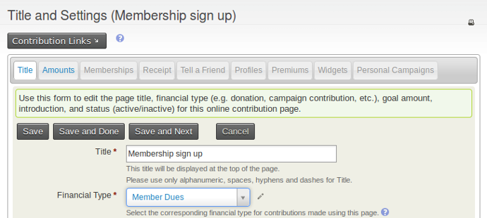
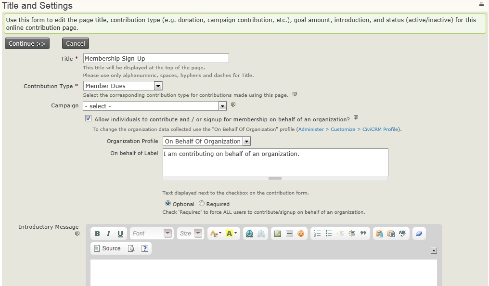
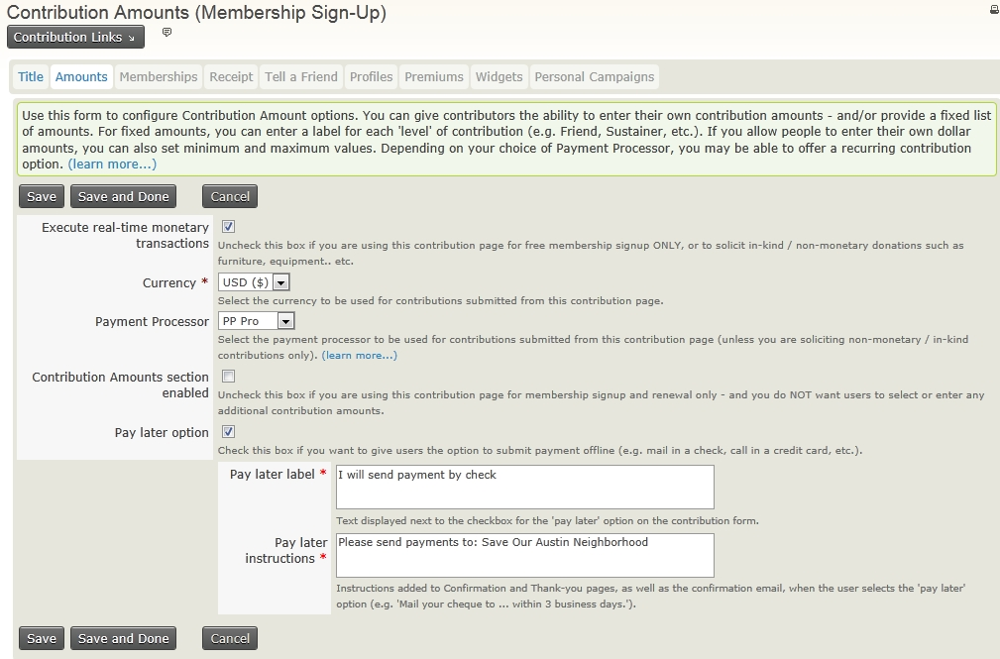
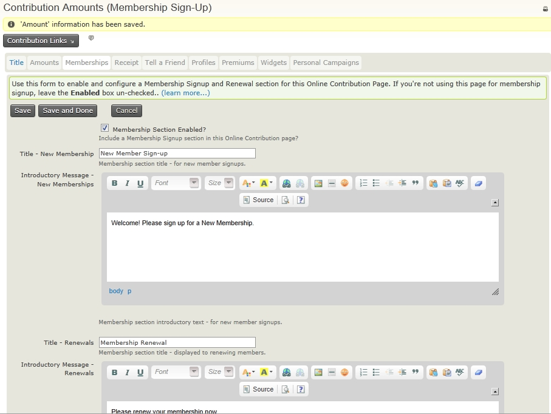
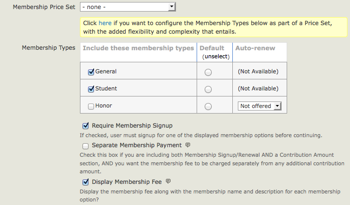
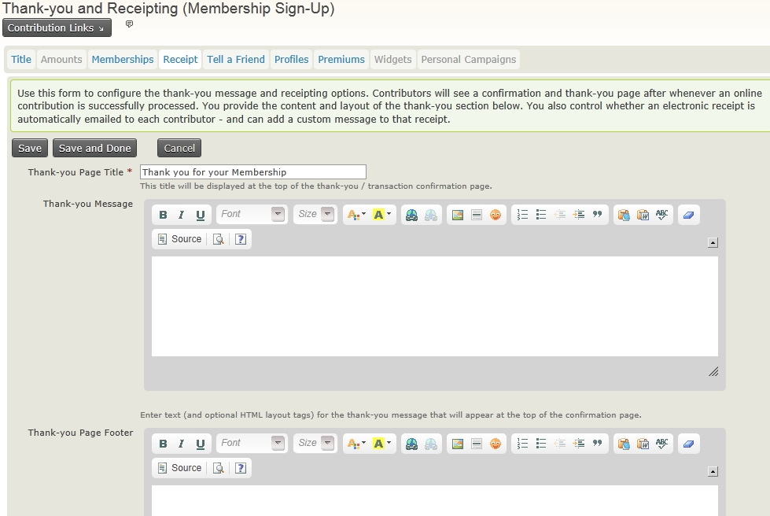
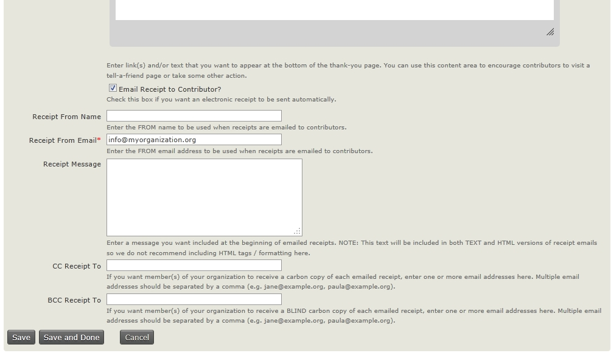
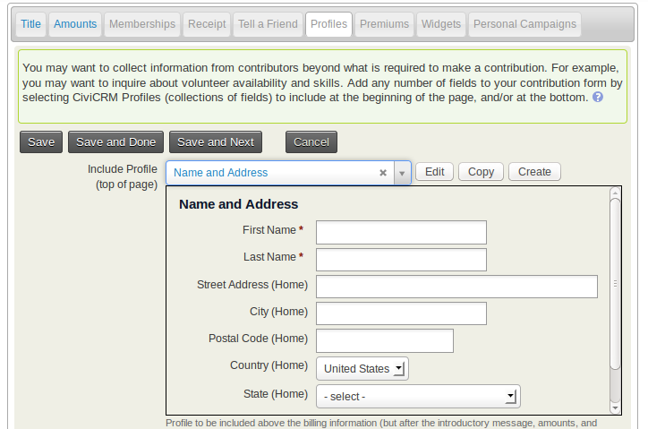
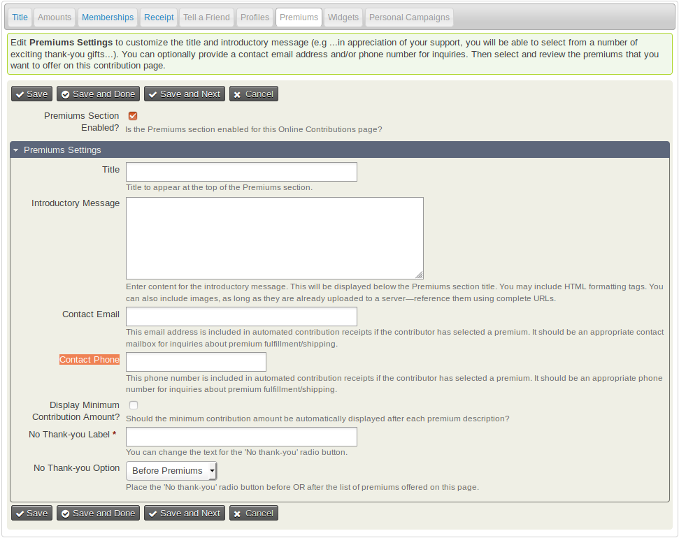
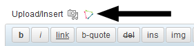

# Online membership sign up

This chapter explains how to allow visitors to your website to sign up
as members of your organisation. It looks at the steps necessary to
create membership sign up pages, some things to consider when doing so
(including testing your membership pages), and the ways in which you can
integrate membership sign up pages into your website.

Before reading this chapter, you may wish to read [Defining
Memberships](defining-memberships.md), which gives useful background to many concepts like
membership types and membership statuses.

## About membership sign up pages

Membership sign up pages are created in the same way as online
contribution pages. In essence, you create an online contribution page
and then add to this page the ability to sign up for a membership. The
reason we do this is because the actual work flow for becoming a member
of an organisation is normally quite similar to the work flow for
contributing money to an organisation, and tying them together allows
membership pages to take advantage of a lot of the functionality that
contribution pages have, for example, we can offer premiums as part of
the membership sign up.

Note that even if your membership is free, you should still use a
contribution page for online sign up (see free memberships below for
instructions on how to do this).

Contribution pages are very powerful and have a lot of options that are
grouped together into tabs.

 Instructions for creating contribution pages are in the [online contributions](https://docs.civicrm.org/user/en/latest/contributions/online-contributions/) section of the contributions chapter. 
Once you have given your contribution page a
name, these tabs are displayed at the top of the page as you work
through the rest of the set up process.

In this chapter, we concentrate on the tabs and options of contribution
pages that are most useful for memberships. A couple of tabs that are
worth highlighting include the Memberships tab, which contains the bulk
of the membership configuration, and the Profiles tab, which allows you
to collect information about the people or organisations that are
filling out your membership form.

We recommend you also review the chapters on creating [online
contribution pages](../contributions/online-contributions.md) which will give you
a better understanding of all the
tools you have at your disposal when creating membership pages.

### The Title tab

The title tab (which is also the first page that you see when you create
a new membership page) allows you to set the title for the membership
page and set some basic information like the Financial Type etc. that
will be recorded for memberships that are made through this page.

This tab also has space for you to include an introductory message to be
displayed on your membership page. You can include images and other
simple HTML in this introductory text.

### Organisational memberships

The title tab contains a check box to allow people to become members *on
behalf of* an organisation, which is the recommended way to offer
organisational memberships. When enabled, you are prompted to select a
[profile](../organising-your-data/profiles.md) that will be
used to collect organisational information. Organisational sign up can
either be optional or required.

### The Amounts tab

The amounts tab allows you to set various financial options, including
the payment processor that is used on the page. Note that you can select
more than one [payment processor](../contributions/payment-processors.md) which will give people who are signing
up a choice.

Note that the amounts tab *is not* the place where membership fees are
configured - they are configured on the Memberships tab. If you want to
use this page for collecting membership amounts and *do not* want to
solicit extra contributions, leave the **Contribution Amounts section
enabled** checkbox unticked. If you *do* want to solicit contributions
on top of membership fees, then tick the box and either add some
suggested contribution options or configure a contribution price set.

### Free memberships

If you are offering **free memberships**, you should leave the 'Execute
real-time monetary transactions' box unticked and choose a membership
type with a zero value minimum fee.

### The Memberships tab

Since we are using this contribution page for membership sign up and
renewal, we need to check the **Membership Section Enabled** to use this
contribution page for memberships.

The first few boxes allow you add text that will be displayed when this
page is used for initial membership sign up and for renewals. When a
logged in user with a current or expired membership views the membership
sign up page, CiviCRM automatically replaces the membership sign up page
with a membership renewal page which contains the text from the renewals
box.

After the text boxes, are a few options that you can use to configure
the membership types available on the membership form.

Looking at the simple use cases first, you select which membership types
should be available on the page, which should be the default, and which
can be auto-renewed (you'll need to have set up your membership types as
auto-renew and have a payment processor that supports automatic
recurring payments).

If you enable auto-renew for a membership then on the web page users
will see "Please renew my membership automatically. (Your initial
membership fee will be processed once you complete the confirmation
step. You will be able to cancel automatic renewals at any time by
logging in to your account or contacting us.)" Membership payment
receipt emails will include a link for the member to cancel the
auto-renewal.

If you want, you can make membership signup optional. This is often
useful if you have a contribution page on which you want to offer the
ability to become a member, but not require it (you will need to check
the box for "Contribution Amounts section enabled" on the Amounts tab).
You can decide whether such payments are recorded separately from
membership fee payments.

If you cannot accomplish what you need using the Membership Types table
(for example if you want to offer sign up to two memberships at the same
time, or offer sign ups with multiple membership terms), then you should
use a [Membership price set](membership-price-sets.md).

Some of the things you can do with price sets include:

-   allow users to sign up for multiple classes of membership (e.g.
    "national" and "local" memberships) at the same time
-   let people sign up for multiple membership terms at the same time
-   offer other options such as a paid subscription in addition to
    membership signup.

### The Receipt tab

After the site visitor completes the membership signup or renewal form,
they will be redirected to a thank-you page and can have an email
receipt generated and sent to them. This fourth step in the wizard
allows you to configure those options. You can customise the message
that gets added to the membership receipt on this page, and the email
address that the receipt will come from. If you want to further
customise the receipt email template you can do so using the **Mailings > Message templates** screen.

You may also want to CC or BCC every membership receipt to a staff
member so they are alerted immediately every time someone becomes a
member.

### The Tell-A-Friend tab

CiviCRM allows you to add a tell-a-friend feature to the thank-you page.
The page lets your members share details about your organization with
their friends by emailing them a link and information. Those friends
that are told about the membership sign up will also be added to CiviCRM
if they do not already exist and their source field will show that they
were added via tell-a-friend.

### Collecting information as part of membership sign up (the Profiles tab)

You can use profiles to collect information about your members as they
fill in the sign up form. By default, contribution pages will include
only an email field. Adding a profile to the contribution form will add
a collection of fields that CiviCRM will display as part of the
membership sign up form. You can use profiles to collect extra
information about the contact, for example their address, their
interests, etc. If the person signing up to become a member is logged
in, their profile fields will be populated with data from CiviCRM where
available. Don't add a membership profile. Collection of that
information occurs automatically during the online membership sign up
process.

The profiles tab allows you to select an already existing profile to
include on your membership page, and if you have permission, to edit an
existing profile or create a new profile to be included on this page.

!!! warning
    If you edit an existing profile here, it will be changed in all places
    where that profile is used.

### Premiums tab

Premiums are thank you gifts and incentives offered to people that
donate to your organisation. They are most commonly associated with
tiered donation levels (e.g. donate $50 to receive a T-shirt) but can
also be used in conjunction with your membership pages. Before
including premiums on a contribution page, you must configure them
through **Contributions > Premiums (Thank-you Gifts)**.

The Premiums tab of the contribution page wizard controls the
introductory text, contact information, and other premium-related
details.

## Testing membership sign up pages

Once you finish configuring and setting up your membership page, you are
advised to test drive the process to make sure everything is working
according to your expectations. Test functionality is available on
**Contributions > Manage Contribution Pages**, click **Links** next
to your membership sign-up/renewal page and click **Test-drive**. Any
membership data you send through the form in test mode will be added to
CiviCRM as test data and not be included in any membership stats or when
searching for members, etc. If you want to find and delete test
memberships, you can do so by clicking the 'is test' check box in **Find
Memberships**.

Try and put yourself in the eyes of someone who wants to become a member
of your organisation and go through the process a number of times, with
different combinations of fields each time. Make sure that the data all
appears as you would expect in CiviCRM. Once you've tested the process
and have made any necessary changes, get other members of staff or
friends from outside your organisation to test the process.

When using the Test-drive Registration option, you see the same
registration pages as a regular user, but the online payment isn't
really debited from your card (see *Payment processors* for more
information on dummy processors and card details you can use for test
transactions).

It is worthwhile periodically testing and reviewing your membership
process to make sure that it is as smooth as possible. You will receive
indirect feedback from your members as they use the form. If they are
not entering data in the way you intended then you will need to make
some changes. From time to time, you may want to solicit direct
feedback from people who have recently become members to see how easy it
was for them to become a member and ask their opinions on ways in which
you could improve your form.

## Adding membership sign up pages to your website

Once you've made your contribution page, you need to make it visible on
your website. The method for this depends on the CMS. Instructions for
each CMS are below.

Membership sign up pages are built to inherit your website theme and
should look reasonably nice out of the box. You can include images on
the HTML text areas in the page to make them look more attractive. Many
organisations want to spend time improving the look and feel of their
membership pages in order to increase membership sign up rates. The
methods for changing the design of these pages are outside the scope of
this book but a website designer who is familiar with your CMS and
CiviCRM will be able to help.

### In Drupal

Go to **Contributions > Manage Contribution Pages**, click
**Links** next to your membership sign-up/renewal page, click **Live
Page** to view the finished page. You can then copy the URL and include
it in a content page or assign it to a menu item.

### In WordPress

Go to **Contributions > Manage Contribution Pages**, click
**Links** next to your membership sign-up/renewal page, click **Live
Page** Copy the URL and insert it into an HTML link or menu.

*Or* use a plugin such as Page Links To create a URL 'slug'.

*Or* click the WordPress shortcode icon to insert a form into any page
or post.

### In Joomla!

The most direct way to expose your membership signup/renewal page to the
front of your website in Joomla is by creating a menu item.

-   Navigate to a menu and create a new CiviCRM item.
-   From the list of menu options, choose Contributions.
-   In the basic parameters section, select the contribution page you
    would like exposed from the dropdown menu.
-   Save the menu item and view the website to confirm the page's
    functionality.

## Permissions needed for online membership sign up/renewal.

Anonymous and Authenticated roles need the following CMS permissions to
be able to join or renew online:

-   Profile listings and forms: This will let you collect core contact
    information ( name, address etc.) when people sign up.
-   Access all custom data: You must enable this permission to collect
    custom data.
-   Make online contributions: This permission must be granted unless
    your memberships are free and you have no interest in accepting
    donations when people sign up or renew.
