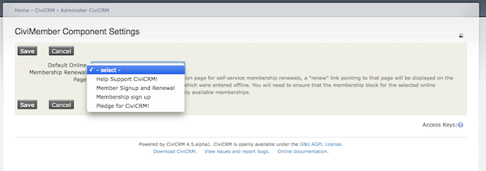
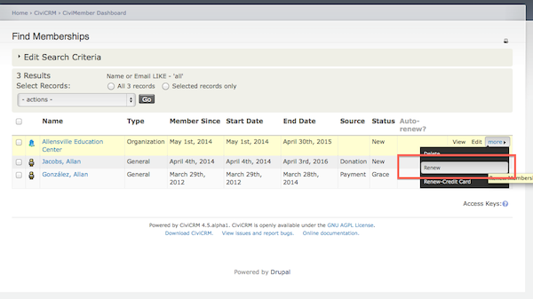
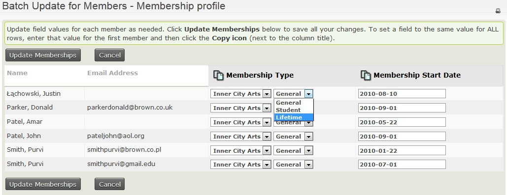

# Renewals

This chapter will discuss the various ways your contacts can renew their
memberships. These include automatic renewals, online renewals and
manual renewals entered by office staff either on an individual basis or
in bulk via Batch Update of Memberships Via Profile. First though we
will discuss the ways of letting your members know that their membership
is due to be renewed.

## Renewal Concepts

There is an important distinction between adding a new membership and
renewing an existing membership. If someone is approaching their
membership end date and wants to continue being a member, in most cases
you will want to renew the existing membership using CiviMember's
renewal workflow rather than creating a new membership.

Memberships have three primary dates. **Member Since** is not altered
when a membership is renewed. **Start date** and **End date** may change
depending what membership status is in effect when the renewal is
processed.

-   If the renewal is processed when the membership status is one that
    has a **Yes** in the **member** column on **Administer > CiviMember > Membership Status Rules** then the **Start date** does not change
    and the end date is extended by the duration of the renewal.
-   If the renewal is processed when the membership status is one that
    has a **No** in the **member** column on **Administer > CiviMember > Membership Status Rules** then the **Start date** is changed to
    the current date and the **End date** is calculated from the new
    start date.

If applicable for the membership type, a contribution (financial) is
recorded as part of the renewal process. This will create a contribution
record that is linked to the membership record. Over time, and after a
few renewals, the membership record will be a single membership record
whose end date is extended, with multiple related financial transactions
representing each renewal purchase.

### Membership Up-Sell

Membership up-sell allows contacts to change membership type as part of
the renewal process. If a contact with a membership linked to an
organisation renews under a different membership type belonging to the
same organisation, the existing membership will be changed to that type
and the associated membership history, including join date and
contributions, will be preserved. The existing end date will be extended
by the duration of the new membership type. If this is not what you want
then you will need to link your membership types to different
organisations. (One can be a dummy organisation created purely for this
purpose and invisible to the user. See the
[Membership types](defining-memberships.md#membership-types)
section of the **Defining Memberships** chapter
for a more detailed explanation.)

If you are using CiviCRM to manage memberships for more than one
organisation, note that a contact's membership type cannot be changed or
up-sold to a type from another membership organization.

## Renewal reminders

Letting a member know that their membership is about to end is the first
step in the process of getting them to renew. CiviCRM facilitates
communications with your members via email or via postal mail.

### Email reminders

One or more renewal reminder emails can be sent automatically using the
Schedule Reminders feature (**Administer > Communications > Schedule
Reminders**). This is particularly helpful for rolling membership types,
where memberships could be ending at any time during the year. Refer to
the [Schedule Reminders](../email/scheduled-reminders.md) page for the steps involved in sending
out a scheduled reminder once you have composed your message.

Exactly what you want to say in your reminder email(s) will depend on
what type of membership it is and when it is being sent in relation to
the membership end date. For example, renewal reminders sent three
months in advance to individuals who signed up on behalf of
organisations (to give them enough time to arrange for a purchase order
and payment through their accounts department) would be different from
those sent one week after an individual's membership has ended.

!!! tip "Tip: Pre-filling the renewal form"
    If members are able to renew online, all renewal email reminders should contain a [checksum token](../common-workflows/tokens-and-mail-merge.md#checksum) link to prefill the renewal form with any data that exists in their record.

As with all emails you send out you need to allow time to test renewal
reminder templates, especially if you have complex membership structures
and want to customise messages based on member types or other factors.

Remember that by default scheduled reminders will be sent to people who
have opted out of bulk or all emails unless you specifically exclude
those people. If people can elect to auto-renew their memberships then
you should exclude members who have chosen that option from the
scheduled reminders.

### Postal reminders

You may also want to post out letters to all your members who are due to
renew or just post letters to those without an email address and those
who have opted out of bulk or all emails. Refer to [Postal mail
communications](../common-workflows/postal-mail-communications.md) for ways to generate
those letters.

## Automatically renewed memberships

For members who have chosen this option when they first joined, on their
renewal date the payment will be taken automatically from their
pre-authorised credit card, their membership end date will be updated
and they will receive appropriate thank-you and receipts from CiviCRM.
(See [Defining memberships](defining-memberships.md), [Online memberships sign up](online-membership-sign-up.md) and
[Manual entry of memberships](manual-entry-of-memberships.md) for details of how to set up auto-renewing
memberships.)

## Online renewals

CiviCRM uses the same page for new memberships as it does for renewals.
The only difference is that the page title and introductory message with
the text you entered into the renewal fields on the memberships tab
when you were configuring your online membership page. The renewal page
is automatically displayed at the same URL as the membership join page
when viewed by a logged in website visitor that has a valid current or
expired membership.

When you are setting up membership sign up pages, it is worth
remembering that current members will only see the renewal page if they
are logged in. If they are not logged in, they will see the sign up
page. If they fill that page in and, based on their contact information,
CiviCRM can find their existing contact record then their membership
will be renewed. If CiviCRM can't find their existing contact record
(perhaps they have changed their email address) then a new contact
record and membership will be created. This is one source of duplicates
in your database and you need to minimise the chances that this will
happen. Two ways to do this are to always include a [checksum token](../common-workflows/tokens-and-mail-merge.md#checksum) in
renewal reminder emails and add text to the new member introductory
message to remind people that they should log in before they renew.

### Default Online Membership Renewal Page

When a membership is purchased using the online membership signup page
(self-service), that user's Contact Dashboard will contain a "renew"
link pointing to that page. However this link will not appear for
members whose initial membership was entered manually unless you
configure a **Default Online Membership Renewal Page** as follows:

1.  If it does not already exist, create a membership page that includes
    all currently available memberships. You may need to use a [Membership price set](membership-price-sets.md) for this if the membership fees need to be allocated to more
    than one financial type.

2.  Navigate to **Administer > CiviMember > CiviMember Component
    Settings.**
3.  For Default Online Membership Renewal Page choose the membership
    page containing all your membership types

A "renew" link pointing to that page will then be displayed on the
Contact Dashboard for any memberships which were manually entered.

## Manually renewing a membership for a single contact

1.  Go to the contact's summary page.
2.  Click on the **Memberships** tab
3.  Click **MORE** next to the membership record
4.  Select **Renew** to enter cash, cheque or EFT payment
    or **Renew-Credit Card** to process the renewal through your online
    payment processor.

## Update multiple memberships

You can use the **Update multiple memberships** feature (previously called *Batch Update Members Via Profile*) to update
multiple *existing* membership records (don't confuse this with the
**Batch Data Entry** feature that is used for adding *new* memberships
and member payments).

To update multiple memberships, create and
configure a [Profile](../organising-your-data/profiles.md) that contains fields
pertaining to membership information that you want to display and update.

To use the **Update multiple memberships** feature:

1.  Find the memberships you would like to update by selecting
    **Memberships > Find Members**. Enter your search criteria and
    click **Search**.
2.  From the *Find Members* results screen, select the membership records
    and select **Update multiple memberships** from the
    **-actions-** dropdown box and click **Go**.
3.  From the *Update multiple memberships screen*, in **Select
    Profile**, select the profile you want to use from the dropdown box
    and click **Continue >>**.
4.  From the *Update multiple memberships* screen, you can update the
    information that is displayed based on the profile you selected.
    You can use the "auto-copy" icon at the top of a column to copy and
    paste the value from the field of the first record of that column to
    the rest of the fields below in the column. Once you are done
    updating, click **Update Memberships**.

    Below is an example of an *Update multiple memberships* screen that is using
    a membership profile configured to display the **Membership Type** and
    the **Membership Start Date** fields for use with **Update multiple memberships**.

