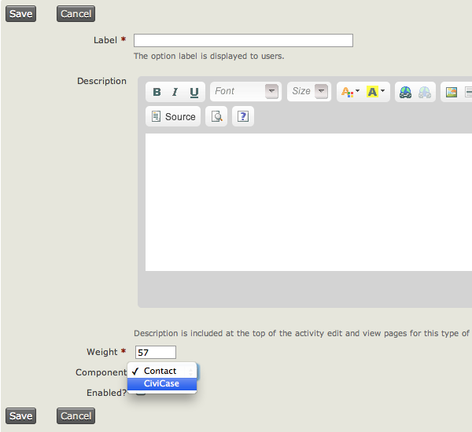
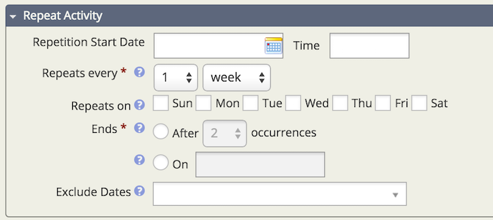
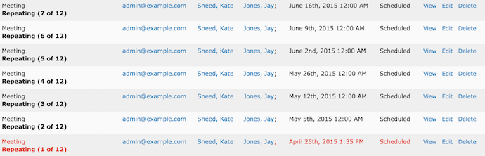
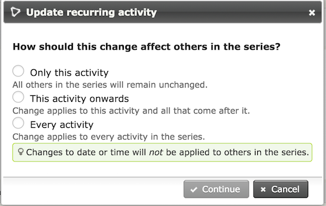

Activities
==========

Activities are a key concept in CiviCRM, providing a unified place to
record and view the history of interactions between your organization
and you constituents, clients and partners. You can use Activities
to track meetings, phone calls and other activities that you set up.
Activities are also used by all of CiviCRM's components to record
things like when contributions are made, when people come to events,
sign petitions, etc. 

All activities happen at a specific point in time. All activities
involve at least one contact, and many involve more than one. Activities
can be assigned to staff or volunteers, and an email is automatically
sent to the assignee. 

If it is important for you to know who at your organisation carried out
a task, then record it as an activity

You can record an activity between a given contact and multiple other
contacts by adding as many contacts as you like in the With Contact
field on the Add Activity form.

Several types of activities are included by default, but you can create
additional types to define specific things that your organisation does.
You can define these at **Administer > Customize Data and Screens >
Activity Types**. You can also add custom fields to activity types to
allow specific data to be collected. For example you might create 2 new
activity types called: **Training** and **Interview.** You can then set
up a custom field set which is associated with activities which includes
information such as **funder** and **project**. This would enable you to
produce reports of all the activities undertaken for a particular
funder, or as part of a particular project. You could also create a
custom field which is used for a specific activity type. For example,
you could classify **meetings** as a **staff meeting**, **client
meeting**, **other organisation's meeting etc**. For more on creating
custom fields refer to the Custom Fields chapter. For details on
producing reports, see the Reporting section.

Activities have the following attributes by default:

-   **date and time**: activities always happen at a certain point in
    time
-   **duration**: so you can collect all the time spent on a series of
    activities
-   **status**: is the activity scheduled, completed, cancelled, etc.
-   **added by**: the person who added this activity, or the contact if
    they carried out the activity themselves via the website
-   **assigned to**: the person (usually within your organisation) that
    will carry out (or has carried out) the activity
-   **with contact(s)**: the contacts in your database that are the
    subject of the activity.

**Activities and groups** There can be some overlap between the use of
these two. For example you could choose to record a membership packet
being sent to a contact as an activity or simply add the contact to a
group "received membership packet". However, it would probably be better
to record this as an activity. Then you can record when the membership
pack was sent, who sent it, any notes about what the person requested,
and so on. You could also use the activity to schedule sending
membership packs by setting the date to a future day and time and
setting the status to "scheduled".

**Activities and events** This is an important distinction to
understand. An event is something that a contact attends, such as a
meet-up, a training, a dinner or fundraising event. As discussed, an
activity can be any type of interaction a contact has with your
organisation, from a meeting or a phone call to a donation. 

Creating new Activity Types
---------------------------

Go to the Activity Type Options page **Administer > Customize Data and
Screens > Activity Types** and click Add Activity Type. 

Assign your new activity type to the "Contact" component if you want it
to be available from the Actions button when viewing a contact record.
Assign it to "CiviCase" if these activities are only for use inside a
case. 

Setting up Custom Field Sets for Activities
-------------------------------------------

When setting up custom data sets, you will need to specify what the
custom data will be used for. One of the options here is Activity and if
you wish, you can further specify which type of activity. This means
that these custom data fields will be available when recording
activities. 

Activity Status Options
-----------------------

The default set of status options is

-   Scheduled
-   Completed
-   Cancelled
-   Left Message
-   Unreachable
-   Not Required

If you need to add more options, you can do so from **Administer >
System Settings > Option Groups**.

However, before you add too many status options, remember that all
status options show up on all activity types. So think carefully about
what you need to add.

Repeating Activities 
----------------------

You can set an activity to repeat on a certain day and time with a
specific end date and include dates to exclude from the repetition.

Once you are in the **Activity Screen** reoccurring options can be set
under **Repeat Activity.** The options you can set are:

-   **Repetition Start Date and Time**
-   **Repeats Every**: Hour, Day, Week, Month, Year
-   **Repeats On**: Sun, Mon, Tue, Wed, Thr, Fri, Sat
-   **Ends**: After a specific number of occurrences or on a specific date
-   **Exclude Dates**: Multiple dates can be selected

After saving the Activity, a confirmation screen will appear displaying
all the dates for which an Activity will be created. A new Activity will
be created for each repetition, and these can be individually edited and
deleted. 

When you edit one repetition of an Activity, you will be given the
option to apply the change to that Activity only, that Activity and all
future Activities in the series, or every Activity in the series.
Changes to the date or time are NOT applied to other repeating
Activities.

