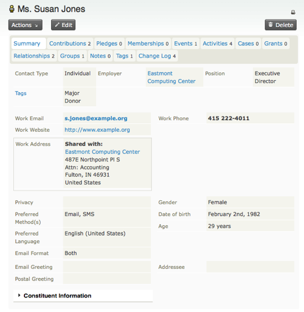
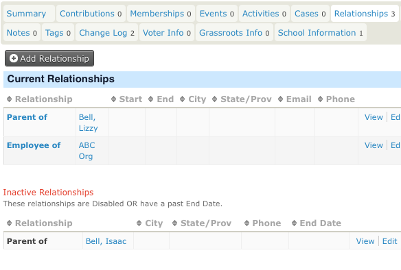
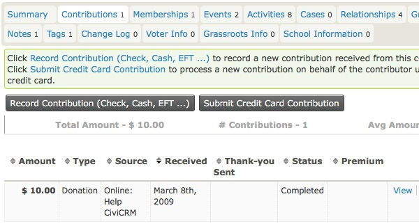
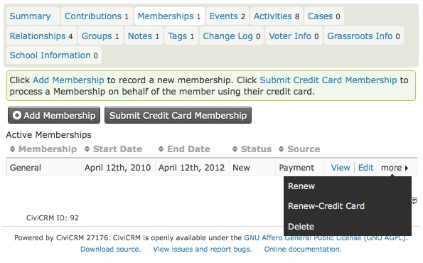
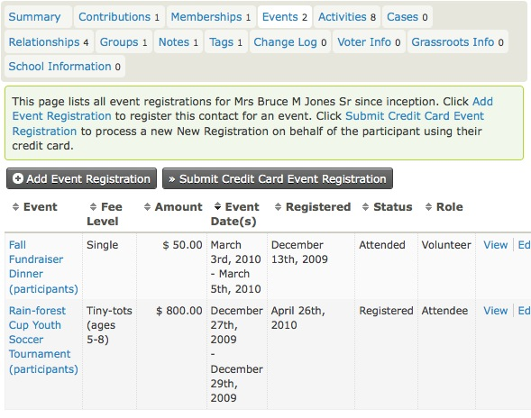
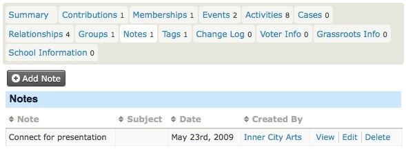
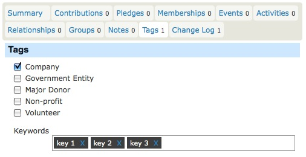
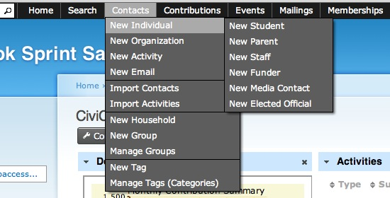

Contacts
========

Les contacts sont au coeur de CiviCRM. Toutes les autres interactions gravitent autour d'eux. Ce chapitre explique comment rechercher, consulter, ajouter, modifier et supprimer des contacts. Nous regarderons aussi comment créer de nouveaux types de contacts et comment les personnaliser.

Il y a trois types de contact dans la configuration par défaut :

-   **Individus** - toute personne sur qui vous voulez faire un suivi.
-   **Organisations** - ceci pourrait être un organisme communautaire, une entreprise, un chapitre de votre organisation ou un comité.
-   **Ménages** - une famille ou un groupe de personnes résidant à la même adresse physique.

Chaque fiche de contact contient des informations de base à leur sujet, telles que :

- nom, surnom, salutation, titre (formalité)
- site web, adresses courriel, numéros de téléphone
- adresses postales
- mode de communication préféré (incluant ceux qui ne veulent pas être contactés).

Vous pouvez également définir des sous-types de contact, tels que « étudiants », « fermes » ou « cuisines collectives ». Chaque type de contact que vous créez est basé sur un des trois aux types de base. Par exemple, les fiches d'étudiants seraient basés sur le modèle des individus, les fermes seraient basées sur les organisations ou peut-être même sur les ménages, selon vos besoins. 

A quick look at contacts
------------------------

Contacts are organised into tabs. The first tab that you see when
looking at a contact is the **summary tab** with some basic information
about your contact. Following the summary tab are a series of other
tabs each showing information about different aspects of the contact.
Organising the contact into tabs helps manage the large amount of data
it is possible to collect about contacts over time.

Tabs get turned on and off depending on what components are enabled and
what permissions you have. For example, you will only see the
memberships tab if the CiviMember component is turned on and you have
permission to see memberships, etc. You can also define extra tabs that
display any extra custom data that you want to collect about your
contacts.

Below we look at the most important parts of the contact screen
(including most of the contact with pointers to other parts of the book
where appropriate. 

### Contact actions 

Above the tabs line, you will see a few buttons. The first button is
the **Actions** button which is a handy shortcut to carrying out actions
with this contact. For example, you could add a note to this contact, or
record a new contribution, meeting or other activity.

### Summary tab

The summary tab shows overview information about your contact. Here you
will find names, addresses and contact details as well as details of
contact methods. 

Some fields on this tab are just for individuals, for example, first
name, last name, nick name, etc. Other fields are just for
organisations, for example organisation name.

#### Individual fields

Individuals names are split into the following parts: prefix, first
name, middle name, last name, suffix and nickname (you don't have to use
all of them). Prefixes and suffixes are selected from a drop down
list. If you can't find the value you want, you can add more options to
the list from the following screen: **Administer CiviCRM** >
**Customize Data and Screens** > **Dropdown Options** > **Individual
Prefixes (Ms., Mr...)**. 

#### Addresses

You can record one or more addresses for a contact. Each address needs
to be at a different **location type** (e.g. work, home, etc). One of
the addresses can be marked as primary and will be used for any postal
mailings that you do. You can explicitly choose which location will be
primary for a particular person, or let it default to the first one
entered.

You can share addresses between contacts. For example, you may need to
keep information about individual contacts and the organisations where
they work. When creating or editing the "work" address for an
individual, check the "Share Address With" box. If their employer
already exists in your database, you can select them from the quick
search box that appears. Otherwise, you can create the employer's
organisation record on the fly by selecting "New Organisation" from the
"create new contact" drop-down.

If a person pays you by credit card, the details used for Billing
Address in credit card payments will be stored in the Billing location
for the contact.

If you have a mapping provider enabled you can click on the map icon
next to an address to see the location of a contact on a map. 

#### Phone numbers 

You can store multiple phone numbers for each contact. Phone numbers
have locations (e.g. work, home, etc.) and types, e.g. landline, fax,
mobile. Note that any phone numbers that you add as of type mobile will
be available for sending SMS. 

#### Email addresses

You can store multiple email addresses for each contact. One of these
email addresses can be explicitly marked as the address which receives
all bulk mailings such as e-newsletters and announcements (e.g. these
are emails your organisation would send using the CiviMail component).
Any bouncing emails are automatically marked as being on hold when
sending emails via CiviMail. See the Mail section for more information.

#### Communication preferences and privacy options 

Communications preferences (i.e. methods of communication that are
preferred by contacts) and privacy options (e.g. do not contact me via
email) can be defined. Privacy options are respected when carrying out
certain functions, e.g. mailing labels are not printed for contacts with
the 'do not mail' privacy option, and emails are not sent to contacts
with the 'do not email' privacy option.

Here is a brief explanation of each of the privacy options in the
CiviCRM contact record:

-   **Do not phone**- The end user has elected to not be contacted via
    telephone.
-   **Do not email**- The end user has elected to not be contacted via
    email.
-   **Do not mail**- The end user has elected to not be contacted via
    postal delivery (snail mail)
-   **Do not SMS**- The end user has elected to not be contacted via
    text messaging service to their mobile device.
-   **Do no trade**- The user has elected not to share their info with
    other organizations. (ie. you may not share or sell user's
    information to other parties) 
-   **NO BULK EMAILS (User Opt Out)**- This is set when a user selects
    the Opt Out action in a CiviMail Email. 

#### Greetings and addressee fields

By default greetings and addressee fields are calculated based on the
contacts name fields. For example the postal greeting for an individual
called 'Jenny Soper' is 'Dear Jenny'.

The default greetings can be configured at a global level here:
**Administer CiviCRM** > **Communications** > **Email Greeting Formats
*or*Email Greeting Formats*or*Addressee formats**.

Different formats can also be selected for each contact and can also be
customised on a contact per contact basis. 

### Relationships tab

Relationships are connections between contact records in your database.
Each connection can be named to describe the nature of the connection,
and a contact may have many relationships to other contacts in the
database. In the example below you can see a list of Current
Relationships as well as a list of Inactive relationships.

You can read more about when it makes sense to use relationships in the
*relationships* chapter of the*organising your data* section. 

### Activities tab

The Activities tab displays a list of all of your interactions with a
contact, including all CiviCRM's built-in activities like event
attendance, contributions, phone calls etc as well as any custom
activities you may have added. It also allows you to record activities
with contacts. Clicking on the icons at the top of the screen (Send an
Email, Meeting, Phone call) will bring up a screen where you can enter
those details. This tab will also show any custom activities that you've
defined.

To find out more about activities please refer to the Activities section
in this chapter.

### Mailings tab

This is only visible if at **Administer > CiviMail > CiviMail Component Settings** you have unselected **Enable CiviMail to create activites on delivery**.  In that case each bulk email is recorded on the mailings tab instead of the activities tab. This improves the speed at which the activies tab loads if your organisation sends bulk emails to large mailing lists. 

### Contributions tab

The Contributions tab shows any financial contributions made by a
contact, as well as a summary of the contribution activity of the
contact (total amount of contributions over time, total number of
contributions, and average amount of contributions).

The Contributions tab also allows you to record offline contributions
using the Record Contribution button, or record a credit card
transaction on behalf of the contact (useful if the contribution has
been made by phone) using the Submit Credit Card Contribution button.
Both of these buttons lead to forms that allow you to select the
Financial Type in addition to the normal contribution information
collected from public contribution pages.

Read more about Contributions, in the Contributions chapter of this
book.

### Memberships tab

This tab displays any memberships a contact has. From this tab you are
able to add memberships and submit credit card payments for memberships
that require a fee. You can also renew or delete memberships from the
"more" link on each membership in the contact's existing memberships.

Read more about Memberships, in the Membership chapter of this book.

### Events tab

The Events tab displays events related to this contact, for example
events the contact has registered for, attended or volunteered at.

From this page you can register the contact for an event, and use the
Submit Credit Card Event Registration button if the event requires
payment. The related payment will then appear on the contact's
Contributions tab in the first row.

You can also modify the event information as it relates to the contact
by clicking the Edit link. For example, you can change the contact's
event status from "registered" to "attended."

Read more about Events, in the Events chapter of this book.

### Groups tab

The Groups tab shows the groups that the contact belongs to. Groups can
be used in a variety of ways including mailing lists and permissions
(**ACL**s).

You can add and remove the contact from groups, and see a history of
groups the contact has unsubscribed or been removed from.

The Status column displays who has added the contact to the group.
Whether users can add themselves to a group is one of the settings you
can configure when creating a group. When you set a group's visibility
to "Public Listings" users can join via **Profile** forms. You may want
to familiarise yourself with the discussion on using Profiles for
mailing list sign-ups covered in a later section.

For more on this topic, please refer to the Tags and Groups section of
the book. 

### Notes tab

The Notes tab is a place where you can record random bits of information
about a contact. Generally you would use custom fields for information
you plan to collect about your contacts, but in some cases it may be
useful to record additional, ad-hoc notes. Since this information is
unstructured, you should be careful about using the Notes tab, unless
you know that you or other people using your CiviCRM implementation will
remember to look at that tab. When creating a Note, both the subject and
the content are free-text fields (i.e. the subject field does not have
to be chosen from predefined options).

You can specify "Author Only" privacy for a note. This means that only
the person who wrote the note, or someone with "view all notes"
permission (via your CMS) can view or edit it.

### Tags tab

Tags are one way of categorising contacts in your database (other
methods are Custom Data and Groups). You can configure which tags you
wish to use for your organisation. You can search on tags and create
Smart Groups based on them.

The tags next to Keywords are part of the Keywords Tagset. A Tagset is a
specific grouping of tags that you can create. Tagsets are
non-hierarchical, and you can create a new tag in a tagset simply by
typing a new tag into the field. Existing tags that match what you type
will also show up as a list from which you can select.

For more on this topic, please refer to the Tags and Groups section of
the book.

### Change Log tab

This tab gives limited information about changes made to a contact
record. It shows the change date and who made the change, but not what
was changed.

Note: Administrators can use the Contact Logging Report to get detailed
information on changes to contact records (who, what and when).

Adding contacts
---------------

The simplest way to add a single contact to CiviCRM is to use the
navigation menu at the top of any non-public page. To create a new
Individual, go to: Contacts > New Individual:

Note that the Contacts menu item allows you to create every kind of
contact and contact sub-type.

All of the contact creation forms are similarly arranged, with basic
information (name, email etc) at the top of the form and more specific
fields below grouped by type or subject in accordions (such as address
fields, communications preferences and any custom fields that you have
added for the contact type).

For all contact types you can use the **Check for Matching Contacts**
option to help avoid duplicate entries. After entering all of the
information you have in this section, you can click on **Check for
Matching Contacts.**

*For adding an Individual record to the database, first name and last
name OR email address are required. For adding an Organization or
Household record to the database, just Organization/Household name is
required. You can fill out as many of these fields as you like, and
don’t forget, you can always go back and make changes as needed by
using the edit screen.*

Useful things to know when adding contacts:

Address: You can add multiple addresses to a contact record. This allows
you to store someone's home and work addresses, as well as a billing
address if that's different.

You will see a checkbox here to allow you to share the address of either
an existing contact, or create a new contact. If you select new contact,
you will need to select which contact type you wish to create, and a pop
up box will appear to add the new contact record. When a person uses
another contact's address, that address can only be edited from the
"master contact's" record. 

The options available in the countries dropdown will depend on which
ones you have made available at **Administer > Localization >
Languages, Currency, Locations** under Available Countries.

There may be fields here that you do not need. Available address fields
can be edited at **Administer > Localization > Address settings.**The
"Address Name" field which can be used to label a particular address
(for example "Summer Home") is hidden by default, but can be enabled
from that screen.**
**

Tags and Groups: Here you can specify which tags and groups to add your
contact to. Please note that you may only add to existing groups and
tags with existing tags. You can read more about creating tags and
groups in the Groups and Tags chapter of this book.

Once you have filled out the form, you have the choice of three buttons
to click:

-   Save will save the contact record and take you to the contact
    screen.
-   Save and New will save the contact and clear the form so that you
    can add another.
-   Cancel will discard the entered information and return you to your
    CiviCRM dashboard.

Editing contacts
----------------

Editing information on the summary screen is simple. Hovering in the
upper right corner of the block that you wish to edit will bring up the
**Edit Info** link. You can then edit the information directly in the
summary screen.

If you need to edit a lot information for one particular contact, an
alternative is to open the entire contact for editing by clicking on the
edit button above the tabs.

 

Note that on the rare occasions that two separate admin users edit a
contact at the same time (specifically that they both open the edit
screen, then both save the contact), the second admin user will be
notified of the first admin user's edit and be given the chance to
manually 'merge' the edits.

Deleting contacts
-----------------

At the top right there is a button to Delete the contact. When a
contact is deleted, it does not disappear completely - instead it moves
to the trash, where it can be recovered at a later date (using the
search in trash feature of **advanced search**). See "searching" under
the "working with your data" chapter for more information). 

Deleted contacts are moved to the "trash" by default (and can be
restored later if needed). There are a variety of ways to delete a
contact:

-   **Single contact**: open the contact's record and click the 'delete
    contact' button at the top of the page. Alternatively, run a search
    for the contact and, from the results list, look toward the end of
    the contact's row, click 'More' and select 'Delete Contact'.
-   **Multiple contacts**: run an advanced search, check the boxes of
    each record you wish to delete (or *select all* with the checkbox in
    the header at the top) and in the 'actions' drop-down menu, choose
    'Delete Contacts' to send the contacts to the trash (if enabled) or
    'Delete Permanently'. A warning page will be displayed to verify
    your intention; simply click 'Delete' to continue or 'Cancel' to
    return to the previous screen.

Contact subtypes 
------------------

In addition to the three default contact types (individuals, households
and contacts), you can define additional contact types (sometimes
referred to as contact subtypes) to suit your needs.

Each contact subtype that you define is based on one of the three core
contact types. For example, 'Student' would based on the 'Individual'
contact type, and 'Farm' could be based on the 'Organization' contact
type, or perhaps 'Household' contact type, depending on your use case.

Contact types are very useful when you need to collect and display
different sets of custom data for different types of contacts (e.g. you
may wish to collect information on the subject area and qualifications
of all teachers in your database but not be interested in collecting
these for other individuals.  To do this, you would create a contact
type called Teacher, based on Individual and then create a custom data
set that only extends Individuals of the type Teacher (see custom data
for more information).

Note that the core contact types are mutually exclusive, i.e. a contact
cannot be an organisation and an individual. However, contacts can be
of more than one user-defined contact subtype, i.e. they could be a
Teacher and a Parent, for example.

To edit existing contact types and and create new contact types go to
**Administer > Customize Data and Screens > Contact Types**. Note that
you cannot delete the inbuilt contact types but you can change their
names and the images associated with them. 

To add custom fields to specific contact subtypes, see the chapter on
custom fields.

Customizing the view of contacts
--------------------------------

After working with the contact editing and summary screens for a while,
you may realise that there are sections and/or fields that aren't useful
for your organisation. The good news is that you can easily hide some
fields and sections. For example, if your organisation doesn't need to
store demographics information, you can remove it by configuring the
Site Preferences. Using an account with Administer CiviCRM privileges.

-   Go to: **Administer > Customize Data and Screens > Display
    Preferences**.
-   Clear the Demographics box under Editing Contacts.
-   Click Save.

You can also use this screen to rearrange the order that the information
is displayed in. 

Similarly, if you want to remove (or add) fields in the postal address
section:

-   Go to: **Administer > Localization > Address Settings**.
-   Check or uncheck fields under Address Editing.
-   Click Save.

If you think that some of the tabs are not useful and will not be used
in your deployment, you can disable or enable specific tabs from
**Administer > Customize Data and Screens > Display Preferences**. If
you don't see some of the tabs described below, you may need to enable
them. The visibility of some tabs is dependent on which components are
enabled in your installation. For example, the Contributions tab will be
hidden if the CiviContribute component is disable.
