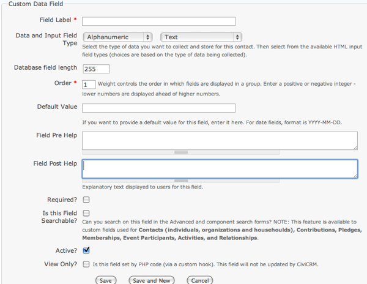
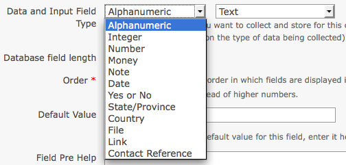
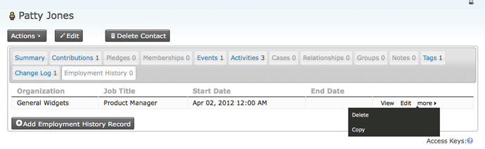
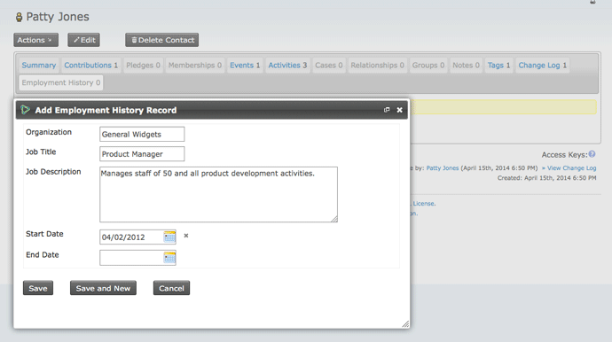
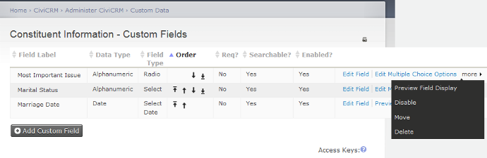

Créer des champs personnalisés
======================

Ce chapitre explique comment bonifier les données de base de CiviCRM par des champs personnalisés, qui représentent les données que vous voulez accumuler.

Par exemple, vous pouvez bonifier les organisations avec une série de boîtes que vous pouvez cocher pour chacun des clients de ces organisations. Vous pouvez aussi limiter les champs personnalisés à certains types de contacts. Vous pourriez ainsi avoir un champ personnalisé pour un type de contact, disons « étudiant », avec une liste de tous ses cours.

CiviCRM emmagasine les champs pour vos données personnalisées dans des ensembles de champs personnalisés. Ajouter des données personnalisées implique donc deux étapes :

1.  Créer un ensemble de champs personnalisés pour un type de contact donné. Il servira ensuite de contenant pour les champs personnalisés.
2.  Ajouter les champs personnalisés pour cet ensemble. (Il peut être utile de lire d'abord les informations sur les types de champs personnalisés, mais avant de créer ces champs vous devez d'abord créer l'ensemble de champs.)

Autrement dit, un champ est une unité d'information inscrite dans la base de données : langue maternelle d'un individu, date de fins d'études, etc. Un ensemble est un regroupement de champs qui renferment des données sur un même objet ou un même domaine.

Ensembles de champs personnalisés
-----------------

Les champs personnalisés font toujours partie d'un ensemble de champs personnalisés; ce que recouvre chacun de ces ensembles peut être aussi large ou pointu que vous le désirez. Vous pourriez par exemple créer l'ensemble de champs personnalisés « Nationalité » et l'associer à tous vos types de contact; en créer un deuxième baptisé « Statut d'immigration », et l'associer à un type de contact précis (« Individus »); et ajouter un troisième ensemble associé à une composante particulière (comme CiviMember ou CiviEvent) ou à un autre élément tel que Groupes ou Relations. L'étendue d'un ensemble de champs personnalisés est une des rares décisions irréversibles dans CiviCRM. Vous ne pourrez pas y apporter de modifications après avoir créé votre ensemble: il est donc important de bien réfléchir à l'avance aux champs personnalisés que vous voulez y associer.

Quand vous créez des ensembles de champs personnalisés, demandez-vous :

-   Comment les champs de cet ensemble seront-ils utilisés?
-   Pour quel type de contact ou de dossier [record] ces champs seront-ils pertinents?
-   Ces champs sont-ils susceptibles de servir dans un grand nombre de situations, ou au contraire sont-ils pertinents pour un type de contact précis, un événement particulier, un type de contribution, etc. ?

Prendre le temps de bien répondre à ces questions vous évitera de vous encombrer d'une pléthore de champs inutiles. Si votre ensemble de champs personnalisés contient un champ « couleur des yeux », il ne vous sert à rien de l'associer à des types de contact comme Organisation ou Foyer : plutôt que d'associer votre ensemble à la grande catégorie Contacts, mieux vaut simplement l'associer à Individus. Ou supposons qu'une de vos données personnalisées soit spécifique à la page d'inscription d'un événement en particulier : associez ces données personnalisées à ce type d'événement seulement.

Si vous avez beaucoup de champs personnalisés, il se peut que vous désiriez les classer par sujet. Par exemple, disons que vous avez associé 20 champs personnalisés aux individus, dont 12 correspondent à un bottin en ligne de vos membres. Plutôt que de regrouper ces 20 champs dans un seul ensemble, vous pourriez les séparer en deux groupes : un pour les champs liés au bottin, et l'autre pour le reste des détails sur les individus.

Pour créer un ensemble de champs personnalisés - et les champs personnalisés eux-mêmes – rendez-vous à : Administrer CiviCRM > Données personnalisées > Nouvel ensemble de données personnalisées. Ce formulaire vous permet d'assigner un titre à votre ensemble de champs, de spécifier le type de dossier auquel vous le destinez, de choisir comment il va s'afficher, et entrer le texte d'information approprié. Le formulaire apparaît sur l'image qui suit; nous allons maintenant décrire chacun des champs.

### Nom de l'ensemble

Ce nom va servir de légende à votre ensemble de champs si vous choisissez de faire apparaître celui-ci dans le corps du texte. Si vous optez plutôt pour un affichage par onglet, le nom de l'ensemble servira d'étiquette pour l'onglet de navigation.

### Utilisé pour

Cette option permet de vous assurer que vos champs personnalisés n'apparaissent qu'aux endroits pertinents. Voici la liste de vos choix :

- Activité : assigne vos champs à toutes les activités ou à un type d'activité, précis tel que rendez-vous ou appel téléphonique.
- Adresses : crée un bloc d'adresses, qui permet à l'administrateur de créer des champs additionnels qui s'appliquent à une adresse.
- Contacts : assigne vos champs à tous vos contacts.
- Contributions : assigne vos champs à toutes vos contributions, ou à un type de contribution précis comme dons ou frais de participation à un événement.
- Événements : assigne vos champs à tous vos événements, ou à un type d'événement précis comme conférence ou levée de fonds. Ces champs s'appliquent à un événement concret, et non pas au dossier d'inscription d'un participant.
- Subventions : pour les champs qui servent spécifiquement aux subventions.
- Groupes : va apparaître dans la configuration des Groupes. Prenez note que ces champs ne peuvent pas faire l'objet d'une recherche.
- Foyer : champs servant spécifiquement au type de contact foyer.
- Individu : champs servant spécifiquement au type de contact individu.
- Adhésion : champs qui serviront à tous les entrées relatives à une adhésion, ou à un type d'adhésion en particulier.
- Organisation : champs servant spécifiquement au type de contact organisation.
- Participants : champs qui apparaissent dans le dossier d'inscription d'un participant. Vous pouvez choisir entre trois options : les champs généraux, applicables à toutes les inscriptions; les champs applicables à un rôle de participant précis; et les champs qui s'appliquent aux inscriptions à un type d'événement particulier.
- Promesses de dons : champs servant spécifiquement aux promesses de dons (pledge).
- Relations : assigne vos champs à toutes les relations ou à un type de relation précis, tel que _conjoint_ ou _employé par_.

### Ordre

Si vous avez créé plus d'un ensemble, le champ Ordre vous permet de déterminer l'ordre dans lequel ceux-ci vont apparaître. Les champs s'affichent par ordre croissant : 1 ou 2 va s'afficher avant 8 ou 9.

### Entrées multiples

Un champ ne contient en général qu'une seule entrée. Par exemple, une personne a les cheveux blonds ou noirs, mais pas les deux à la fois. Mais certains champs sont plus complexes, et peuvent demander plusieurs entrées différentes. Pour un champ comme « Formation académique », par exemple, il faut probablement prévoir la saisie de plusieurs diplômes, dont chacun représente une entrée distincte.

CiviCRM offre cette fonction pour les ensembles de champs assignés aux contacts (la catégorie générale, ou un type de contact en particulier). Pour utiliser cette fonction, sélectionnez l'option « Cet Ensemble de champs personnalisés accepte-t-il les entrées multiples? » 

Cette option compte plusieurs restrictions : 

- Elle s'applique à l'ensemble au complet; vous ne pouvez pas l'appliquer à un seul champ.
- Elle doit utiliser l'affichage par onglet; l'affichage dans le corps du texte n'est pas permis.
- Vous pouvez l'utiliser uniquement pour les Contacts. Les entrées multiples ne sont pas disponibles pour les Activités, les Contributions, etc.
- Vous ne pouvez pas vous en servir pour un profil, comme ceux utilisés pour les Événements
- En date de juillet 2010, les entrées multiples ne peuvent pas être exportées.

### Options d'affichage

Il y a deux manières d'afficher les ensembles de champs personnalisés d'un dossier : dans le corps du texte sur la page Résumé (sous l'onglet Résumé), ou sous un nouvel onglet qui s'ajoute aux autres (Résumé, Contribution, Groupe, et ainsi de suite). Nous suggérons d'utiliser l'affichage par onglet pour les champs que vous consulterez plus rarement, ou pour les ensembles qui contiennent de nombreux champs. Vous pourrez changer cette configuration par après.

You can also specify that you want the custom field set to be
"collapsed" on initial display. If you check this box, only the title
for this field set is displayed when the page is initially loaded,
because the fields are hidden. This is helpful for field sets that are
infrequently used because it reduces the amount of space taken up by the
data when the page opens. A similar "collapsed" property is available
for the display of custom data in Advanced Search.

Il y a deux façons d'afficher les champs dans un onglet. **Onglet** et **onglet avec table**.

**Onglet avec table** provides a concise overview of the data in the set.
New records can be added and existing records can be edited in pop-up
windows. Under **more** there is the option to "copy a record". For
consecutive records that have the same value in many fields this lets
you edit just one or two fields and save the copy as a new record. 

**Onglet** affiche les champs d'une façon semblable au style par défaut.

 

### Cet ensemble de champs personnalisés est-il toujours actif ?

Dire qu'un ensemble de champs personnalisé est actif signifie que vous pouvez en consulter et modifier les champs. Si l'ensemble n'est pas actif, ses champs demeurent dans le système de CiviCRM mais ils ne s'affichent pas dans l'interface d'utilisateur. Cette option peut s'avérer utile pour la gestion de vos données, en particulier si vous effectuez une migration à partir d'une base de données pré-existante.

Il se peut par exemple que votre base de données existante contienne des champs que vous souhaitez transférer dans CiviCRM pour vos archives, mais que vous comptiez utiliser une nouvelle structure de données. Supposons par exemple que vous importiez vos listes de membres à partir d'une base de données MS Access. Chaque entrée dans Access contient un champ d'identification unique (sa clé), qui n'est d'aucune utilité dans CiviCRM. Plutôt que d'ignorer complètement ce champ, vous pourriez archiver son contenu dans un champ personnalisé, importer vos données, puis désactiver le nouveau champ, ce qui le rendrait invisible et allégerait votre interface. Il vous suffirait de ne pas cocher l'option Activer ce champ.

Bien qu'invisible pour les utilisateurs, la valeur d'un champ inactif demeure dans le système pour référence future; vous pouvez la consulter si jamais il vous faut comparer la valeur d'un champ avec un document imprimé, ou vous assurer qu'il n'y a pas d'écarts entre vos archives.

Un champ que vous avez activé peut toujours être désactivé dans le formulaire qui définit ce champ.

### Aide pré-formulaire, aide post-formulaire

Si vous entrez du texte dans l'aide pré-formulaire, votre texte d'aide apparaîtra au-dessus de l'ensemble de champs personnalisés; si vous entrez du texte dans l'aide post-formulaire, il apparaîtra en-dessous. Utilisez l'aide à ce niveau pour les instructions qui s'appliquent à tout votre ensemble de champs personnalisés.

Champs personnalisés
-------------

Once you have created a custom field set, you can create custom data
fields within the set. Click "View and Edit Custom Fields" followed by
"New Custom Field" and you will see the screen in the image below. We'll
explain each of the options in this section.

After completing the field configuration options, click 'Save' to record
the field and return to the field listing for your current custom field
set, or click 'Save and New' to save the field and begin defining a new
field.

With the exception of the data and input field type selection, all of
the configuration options may be modified after your initial creation of
the field. You may also find it useful to preview your custom fields, as
well as the whole set of custom fields, as you are defining them. This
is particularly useful for checking the layout of radio button and
check-box fields with a large number of choices.

### Étiquette du champ

The text next to the field when displayed to the user. Text entered here
is also the label shown when you export data. When using fields in a
profile, you can overwrite the Field Label. So on this screen you can
choose names that are suitable for administrators, and give more
user-friendly names when exposing them in profiles.

### Type

Custom fields can be of many different types, many of which you've
probably encountered when filling out forms on websites. When you create
a custom field, CiviCRM presents a dropdown list of data types from
which you can select that which best represents the data you plan to
store. The menu on the left (shown open in the following figure)
indicates the format of data you wish to store, whereas the menu on the
right indicates the way you want to interact with the user.

The types of fields are:

-   **Alphanumeric** (i.e. text and number fields), which can be of the
    following types:
    -   Text: a simple area in which users can enter text.
    -   Select: a dropdown box which limits choice to one selection.
    -   Radio: a list of options where you can make one selection.
        Unlike a Select box, all the options are visible on the screen
        at the same time.
    -   Yes and No: a special kind of radio list with two contrasting
        options.
    -   Check-box: a list of options that allows multiple selections.
    -   Multi-select: a list of options in a single box. You can select
        multiple selections using control+click.
    -   Advanced Multi-select: two lists side by side in which items can
        be moved from one to the other.
    -   Autocomplete select: an autocomplete widget. The user can start
        typing, and when the text entered uniquely identifies a
        selection, the field automatically fills in the complete
        selection.
-   **Note**: a longer text box which allows multiple lines. Notes come
    in two flavours:
    -   plain, and
    -   rich text, which displays a WYSIWYG editor that allows HTML.
-   **Integer**, i.e. a whole number. This can be displayed as a: 
    -   text box
    -   select box
    -   radio list.
-   **Number**: i.e. any number that includes decimals, such as 3.175.
    This can be displayed as a:
    -   text box
    -   select box
    -   radio list.
-   **Money**: similar to a number, but treated according to the local
    currency as configured in CiviCRM's administrative pages. This can
    be displayed as a:
    -   text box
    -   select box
    -   radio list
-   **Date**: a way of entering a date (and optionally time) value using
    a calendar widget. You can set a range of years which can be
    selected prior to and after the current date.
-   **State/Province**: a list of available geographical locations as
    configured in CiviCRM's Localization settings (Administer >
    Configure > Global Settings >> Localization). Can be offered as
    either a select box or a multi-select box.
-   **Country**: a list of geographical locations. Can be offered as
    either a select box or a multi-select box.
-   **File**: offered as a browser where the user can select and upload
    a file.
-   **Link**: an active internet hyperlink.
-   **Contact Reference**: an autocomplete widget for an existing
    CiviCRM contact.

We suggest you experiment with creating different field types to get an
idea of how they behave. Different options have implications for use.
For example, check-boxes enable you to use OR as well as AND searches in
Advanced Search, whereas multi-select will not. 
 
**Afficher en table ?**

This check box only appears when you are creating a field in a
multi-record field set that you have elected to display as **tab with
table**. It is checked by default. If you unselect this then the field
will not be displayed in the table. You might want to do this for less
important fields if you have a large dataset that is too wide for your
screen. 

 
Fields hidden in the table view will still be available when adding a
new record or viewing, editing or copying a particular row.

 

### Taille du champ dans la base de donnée

The database field length allows you to specify the number of characters
that this field will contain. You should normally leave this at the
maximum. In certain cases (for example if you are dealing with
extremely large field sets) it might make sense to shorten this field to
improve performance and decrease storage space, but setting a shorter
length will not make a difference to the vast majority of users.

### Ordre

Controls the order in which the fields appear. You may assign the order
in the field edit form, or use the up/down icons on the main field
listing table to adjust the field presentation. By default, new fields
appear at the bottom of the field list within a set.

### Valeur par défaut

Where applicable, you may designate a default value for a field. This
value is automatically displayed or selected when users go to a form
containing this field.

### Aide pré-formulaire et post-formulaire

Ideally, your field name is self-explanatory and users will immediately
know what to enter. But in those cases where there is some ambiguity, or
where you wish to help regulate how a certain field is used, you may
enter help text here. If you enter it in Pre-form Help, your help text
appears above the form field, and if you enter text in Post-form Help it
appears below the form field.

The help text appears in all uses of the field in administration pages
and is inserted as the default help text when fields are assigned to a
profile (see 'profiles'). The person creating the profile can remove or
change the help text there without impact on the original custom field
definition.

### Requis (obligatoire)

When selected, a value must be provided for this field before the form
can be submitted. Failure to do so will result in an error message
directing the person to complete the required fields.

If you want a field to be required only when a user fills out a
particular profile, you can leave this box unchecked and check the
Required field later within the profile.

### Is this Field Searchable?

Makes the field appear in a panel of custom fields in CiviCRM's Advanced
Search page. While you may be tempted to mark every field as searchable,
doing so may unnecessarily clutter the Advanced Search custom field
panel, when in fact certain fields will probably never be used in that
way. You may toggle this option on or off at any time, so do not be
overly concerned about arriving at a final decision when you first
define a custom field.

### Actif

As with the active check-box in the form defining the custom field set,
this box determines whether the field is disabled or enabled when
CiviCRM displays it to the user.

### Consulter seulement

This allows you to designate a field as visible but uneditable. There
are two general uses for this field:

-   To store data imported from another system that you want available
    for reference to the user, but do not want them to be able to
    modify.
-   To store data that is not entered directly through the user
    interface but rather through a method set up by your developer.

### Options à choix multiples

For field types that involve selecting from a set of multiple options
(such as Select, Radio, Check-box, Multi-select and Advanced
Multi-select) you are given the choice of either using an existing set
of options that you've already created for another custom field or
create a new set. You can enter these values while creating the field,
or enter the values later. The option's label is displayed on the form,
while the option's value is stored in the contact record.

If you choose to use the same set of options for several fields, you
will be notified when making any changes that this will affect an option
set used by several fields.

When you create a new set, you have the option of initially entering up
to ten multiple choice options in a table. If you need more than ten
options, you can create an unlimited number of additional choices after
saving this new field by using the 'Edit Multiple Choice Options' link.
Go to: **Administer** > **Customize** > **Custom Data** > **View and
Edit Custom Fields** > **Edit Multiple Choice Options**. You may go to
this screen at a later date to modify the label, order and active status
of any multiple choice option, or add more choices.

If desired, you can also mark one of the choices as the default option.

Inactive options are hidden when the field is presented.

### Managing custom field sets. 

You can view a listing of all the custom fields in a custom field set at
any time by navigating to **Administer > Customize Data and Screens > Custom Data** and clicking 'View and Edit Custom
Fields' for the relevant field set.

 
As well as the expected options of edit field settings, edit multiple
choice options (if applicable), preview, disable or delete, you also
have the option to **Move** a custom field to another data set. You can
move custom fields between sets used for all contacts or for contact
sub-types but otherwise you can only move fields between data sets of
the same type.

Choosing between fields, groups and tags
----------------------------------------

Data fields, groups and tags are three major ways to associate
information with contacts. Although it can be tempting to create a
custom data field for every attribute of your data, take time to learn
about the alternatives. They offer powerful functionality that you may
miss out on if you rely only on custom data. Furthermore, using data
fields for information where they could be stored more appropriately as
groups or tags can slow your system. Finally, proper use of groups and
tags makes it much easier for administrative staff to maintain the
records.

Some tips that may help you choose are:

-   Data that can take a wide range of values, such as a person's
    address or biography, should be stored in an alphanumeric custom
    data field.
-   Custom data fields can be grouped and displayed on their own tab on
    the contact's record.
-   As the name implies, Groups are used to group contacts. For
    instance, you'll probably assign board members to one group, staff
    to another, volunteers to a third, and so on. If you use Drupal, you
    can assign permissions based on group membership. You can also
    define a group that CiviCRM automatically adds contacts to and
    deletes contacts from, based on some characteristic. This feature is
    called a Smart Group.
-   If you plan to use CiviMail for mass mailings and you want certain
    contacts to get a particular mailing, those contacts must be
    assigned to a Group. For instance, you may want a press release to
    go only to certain contacts; those contacts should be assigned to a
    particular group. This group could be a Smart Group.
-   Both Tags and Groups can be structured hierarchically. For instance,
    a group or tag labeled 'Regions' can have a subgroup or subtag for
    each geographic region your organisation covers (see "Case study in
    hierarchical tags" later in this section).
-   Tags support more powerful search options than data fields or
    groups. For instance, visitors can search through multiple tags with
    both AND and OR operators. Data fields support only lists of words
    (which is effectively the same as an AND operator), except for
    fields represented as check-boxes, which support OR operators.
-   Tags have a more sophisticated user interface than data fields or
    groups. The interface allows the visitor to add and remove tags
    without reloading the page in edit mode.
-   Custom data fields can be assigned to a specific record type (e.g.,
    only households), whereas tags will be assigned to all types once
    the tags are defined.

Custom field set storage limitations
------------------------------------

A large number of custom field sets or custom field sets with a larger
number of fields may cause problems when searching, exporting data or
running reports. It is hard to give specific limits on the number of
data sets you should create or the number of fields that you should add
to field sets because a lot depends on the type of data you are
collecting, and the server that your installation is hosted on, but if
in doubt, you should discuss with your system administrator or CiviCRM
service provider 

