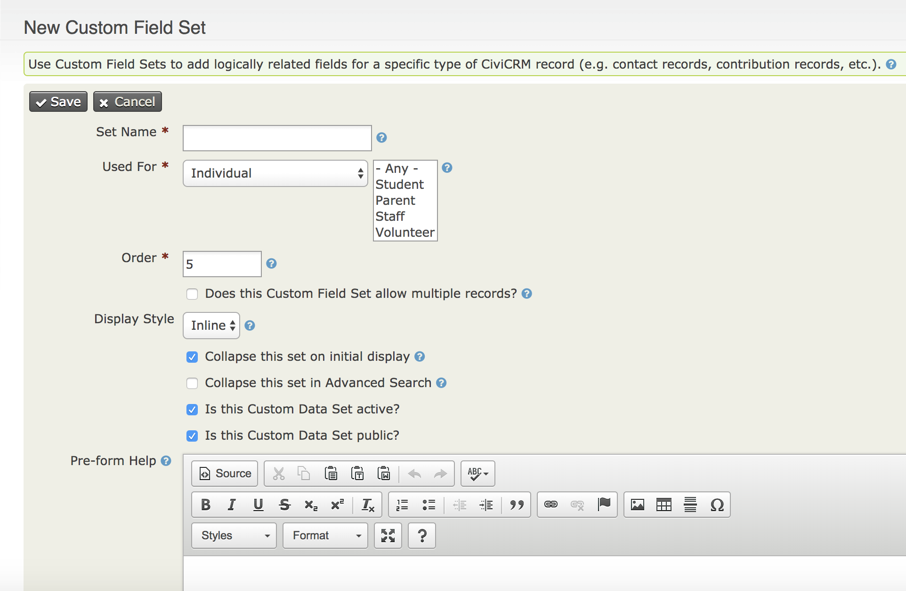
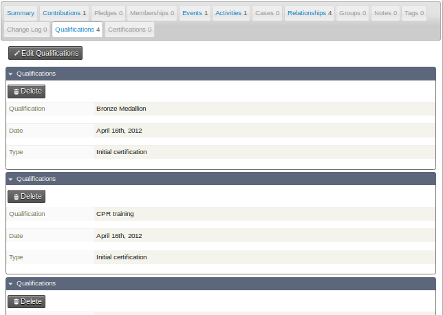
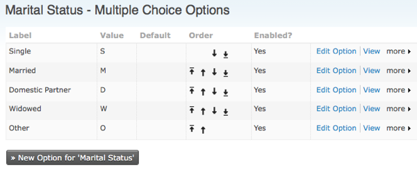
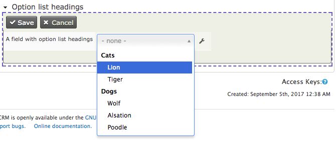
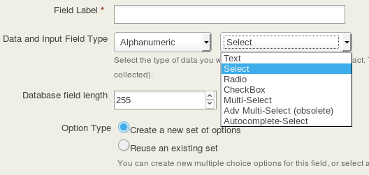
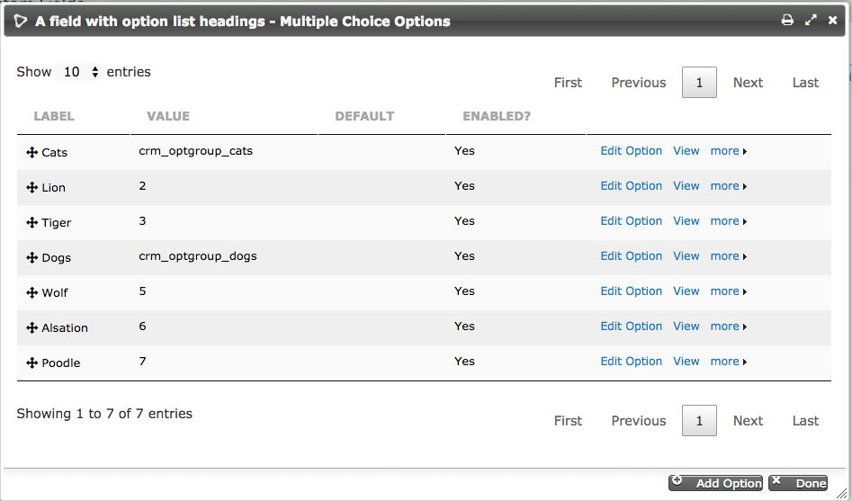

# Creating Custom Fields

This chapter explains how you can collect information beyond that which CiviCRM allows by default through adding custom fields to hold the data you want to collect.

For example, you could add a set of checkboxes to organisations so that you could track the clients that they serve. You can also restrict custom fields to certain types of that object. For example, if you have a contact type Student, you might have a custom field listing the subjects they study.

Custom data fields are always stored as sets of custom fields in CiviCRM. Therefore, adding custom data is a two-stage process:

1.  Create a custom field set, which is simply like a container to hold these custom fields together.
2.  Add custom fields to this set. (You may find it helpful to read the information about custom fields first, but you will need to create the field set before you create the fields in it).

To clarify, a field is a unit of information entered into the database, such as someone's primary spoken language, or high school graduation date. A custom field set is a group of fields containing related data - that is, a set of fields related to a certain activity type, to participation in events, or to contributions.

## Custom field sets

Custom fields are always part of custom field sets, and each set has a scope as wide or as narrow as you choose. For instance, you might associate a custom field set called "nationality" with all contact types, another set such as "immigration status" with a specific contact type (e.g. Individuals), and yet another set with a specific component (CiviMember, CiviEvent), or with other elements such as Relationships and Groups. The scope of a custom field set is one of the few decisions that is irreversible (you will not be able to change it after creating it) so it is important to consider carefully what you want to associate your custom field set with when you start. 

When creating custom field sets, you should ask:

-   How will the fields in this set be used?
-   What types of contacts or records will these fields be appropriate for?
-   Will the fields have broad applicability, or are they relevant to a specific Contact Type, Event, Financial Type, etc.? For example, a field which stores a person's entree choice at a dinner event should be assigned to the *Participant* record, and not to the *Individual Contact* record; this data describes the person as a participant in an event (they might not have or make the same choices for another dinner).

Taking the time to think through these questions helps keep your application screens as relevant and clear of superfluous fields as possible. For example, if your custom field set contains contact characteristics such as a field for the "color of eyes", you should associate them with the Individual contact type rather than the generic Contacts option, as this field would be irrelevant to Organization and Household contact types. Another example would be if custom data is specific to a particular event registration page. You should create this custom data for an Event type Participant for the specific Event.

Depending on how many custom fields you are creating, you should also consider grouping the fields topically. For example, you may associate 20 custom fields with Individual contacts, 12 of which relate to an online membership directory. Rather than group all 20 fields in a single custom field set, you may want to split them into two sets - one for the directory-related fields, and a second for more general Individual details.

To create a custom field set and custom fields, go to: **Administer** > **Customize Data** **and Screens** > **Custom Data**. This screen lets you assign a title to the field set, specify what type of records it will be used for, select the display characteristics, and enter help text. The form appears in the following image, and we'll describe each field.

### Set Name

For custom field sets which are displayed inline, this name appears as the legend of the field set. If this set uses the tab display style, the name appears as the navigation tab label.

### Used For

You can use this option to ensure that the fields appear only where they are relevant. The choices are:

-   **Activity:** fields that may be assigned to all activities or to a specific activity type, such as Meeting or Phone Call.
-   **Addresses:** creates an address block, which allows the administrator to create additional fields related to an address.
-   **Contacts:** fields that may be assigned to all contacts.
-   **Contributions:** fields that may be assigned to all contributions or to a specific Financial Type, such as Donations or Event Fees.
-   **Events:** fields that may be assigned to all events or a specific event type (e.g., Conference or Fundraiser). These fields are     applied to an actual event, not the participant registration record.
-   **Grants:**fields specific to grants.
-   **Groups:** displayed in the Group settings (note that these fields are not searchable).
-   **Household:** fields specific to the Household contact type.
-   **Individual:** fields specific to the Individual contact type.
-   **Memberships:** fields that may be assigned to all membership records or to a specific membership type.
-   **Organization:** fields specific to the Organization contact type.
-   **Participants:** fields that appear on the participant registration record. There are three options for these: general fields applied to all registration records, role-type fields assigned to a specific participant role, and event participant fields assigned to a specific event.
-   **Pledges:**fields specific to pledges.
-   **Relationships:** fields that may be assigned to all relationship records or to a specific relationship type, such as "Spouse of" or "Employee of".

### Order

This controls the order in which your custom field sets are presented when you have created more than one set. Lower numbers (e.g. 1, 2) are displayed above higher numbers (e.g. 8, 9).

### Multiple record fieldsets

By default custom data sets have a 'one-to-one' relationship to the entity they are attached to. For example, *one* field set for a person's physical attributes which contains one field for their height and one for their eye colour will be attached to *one* individual record. This makes sense because we only ever need to record one eye colour and one height for each person. However, in certain circumstances, we want to record multiple custom field sets for a single contact, for example, when recording a person's educational history. In this case, a single person may have multiple educational degrees, so a custom field set about educational history, which contains fields for subject, institution, and grade, should allow multiple records, and this is what multiple record fieldsets allow.

You can only add multiple record field sets to contacts - you can't add them to other entities. To use this option, select the "Does this Custom Field Set allow multiple records?" option. A few things to bear in mind when creating mutiple record custom field sets:

-   Multiple data applies to the whole field set, not to individual fields.
-   Multiple data can only be added to Contacts. It **cannot** be added to Activities, or Contributions, etc. 
-   Mutiple data cannot currently be exported. 
-   Before deciding to model something as a multiple value custom field set, you may wish to consider whether it could or should be modelled as an activity. For example, an educational degree could be an activity with custom data added.

### Display options 

The display style tab is only visible for custom data fields attached to contacts. We can choose to display contact field sets either **inline**, i.e. on the summary screen, or in their own **tab**. Whether you use a tab or inline depends on a number of factors. For example, how frequently do you need to access the data, how large is the data set, etc. You can switch between display styles at a later date if you so wish. 

You can also specify that you want the custom field set to be "collapsed" on initial display. If you check this box, only the title for this field set is displayed when the page is initially loaded, because the fields are hidden. This is helpful for field sets that are infrequently used because it reduces the amount of space taken up by the data when the page opens. A similar "collapsed" property is available for the display of custom data in Advanced Search.

There are two options for displaying in a tab. **Tab with table** and **Tab**.

**Tab with table** provides a concise overview of the data in the set.  New records can be added and existing records can be edited in pop-up windows. Under **more** there is the option to "copy a record". For consecutive records that have the same value in many fields this lets you edit just one or two fields and save the copy as a new record. 

**Tab** displays data in a similar format to the inline style.

### Is this Custom Field Set active?

If a custom field set is active, its fields can be viewed and changed.  Otherwise, the fields are in the CiviCVRM system but hidden from the user interface. This option can be valuable for managing your data, especially if you are migrating from an existing database system. 

For example, your existing database may have fields you would like to transfer to CiviCRM for historical data keeping purposes, but plan to then deprecate or migrate to a new data structure. Suppose you are importing membership records from an MS Access database. Each record in Access has a unique ID (key) field, which has no direct benefit in CiviCRM. Rather than ignoring it altogether, you could create a custom field to hold the value, import the records, and then disable the field (keep the Activate option unchecked), thereby hiding it from view and minimising the interface clutter.

Though not visible to users, the field value is stored in the system and can be referenced at a later date. For instance, if you ever need to investigate archived data for a possible discrepancy or compare the field value with a printed record.

Individual fields can be made inactive in the form defining those fields, once the custom field set is active.

### Is this Custom Field Set public?

If a custom field set is marked as public, its fields will be shown on public-facing pages.

For example, custom fields that should be shown on an event information page should belong to a field set marked as public.  Custom fields that relate to administrative information about an event should be part of a field set that is not be marked as public.

Note that the setting is at the Custom Field Set level and applies to all Custom Fields in the Set.  Individual fields cannot be marked as public or not.

### Pre-form Help and Post-form Help

If you enter text in Pre-form Help, your help text appears above the form field, and if you enter text in Post-form Help it appears below the form field. Use help at this level to provide instructions related to the entire set of custom fields.

## Custom fields

Once you have created a custom field set, you can create custom data fields within the set. Click "View and Edit Custom Fields" followed by "New Custom Field" and you will see the screen in the image below. We'll explain each of the options in this section.

After completing the field configuration options, click 'Save' to record the field and return to the field listing for your current custom field set, or click 'Save and New' to save the field and begin defining a new field.

With the exception of the data and input field type selection, all of the configuration options may be modified after your initial creation of the field. You may also find it useful to preview your custom fields, as well as the whole set of custom fields, as you are defining them. This is particularly useful for checking the layout of radio button and check-box fields with a large number of choices.

### Field label

The text next to the field when displayed to the user. Text entered here is also the label shown when you export data. When using fields in a profile, you can overwrite the Field Label. So on this screen you can choose names that are suitable for administrators, and give more user-friendly names when exposing them in profiles.

### Type

Custom fields can be of many different types, many of which you've probably encountered when filling out forms on websites. When you create a custom field, CiviCRM presents a dropdown list of data types from which you can select that which best represents the data you plan to store. The menu on the left (shown open in the following figure) indicates the format of data you wish to store, whereas the menu on the right indicates the way you want to interact with the user.

The types of fields are:

-   **Alphanumeric** (i.e. text and number fields), which can be of the following types:
    -   Text: a simple area in which users can enter text.
    -   Select: a dropdown box which limits choice to one selection.
    -   Radio: a list of options where you can make one selection.  Unlike a Select box, all the options are visible on the screen
        at the same time.
    -   Yes and No: a special kind of radio list with two contrasting options.
    -   Check-box: a list of options that allows multiple selections.
    -   Multi-select: a list of options in a single box. You can select multiple selections using control+click.
    -   Advanced Multi-select: two lists side by side in which items can be moved from one to the other.
    -   Autocomplete select: an autocomplete widget. The user can start typing, and when the text entered uniquely identifies a
        selection, the field automatically fills in the complete selection.
-   **Note**: a longer text box which allows multiple lines. Notes come in two flavours:
    -   plain, and
    -   rich text, which displays a WYSIWYG editor that allows HTML.
-   **Integer**, i.e. a whole number. This can be displayed as a: 
    -   text box
    -   select box
    -   radio list.
-   **Number**: i.e. any number that includes decimals, such as 3.175. This can be displayed as a:
    -   text box
    -   select box
    -   radio list.
-   **Money**: similar to a number, but treated according to the local currency as configured in CiviCRM's administrative pages. This can be displayed as a:
    -   text box
    -   select box
    -   radio list
-   **Date**: a way of entering a date (and optionally time) value using a calendar widget. You can set a range of years which can be
    selected prior to and after the current date.
-   **State/Province**: a list of available geographical locations as configured in CiviCRM's Localization settings (Administer >
    Configure > Global Settings >> Localization). Can be offered as either a select box or a multi-select box.
-   **Country**: a list of geographical locations. Can be offered as either a select box or a multi-select box.
-   **File**: offered as a browser where the user can select and upload a file.
-   **Link**: an active internet hyperlink.
-   **Contact Reference**: an autocomplete widget for an existing CiviCRM contact.

We suggest you experiment with creating different field types to get an idea of how they behave. Different options have implications for use. For example, check-boxes enable you to use OR as well as AND searches in Advanced Search, whereas multi-select will not. 
 
**Display in Table?**

This check box only appears when you are creating a field in a multi-record field set that you have elected to display as **tab with table**. It is checked by default. If you unselect this then the field will not be displayed in the table. You might want to do this for less important fields if you have a large dataset that is too wide for your screen. 

 

Fields hidden in the table view will still be available when adding a new record or viewing, editing or copying a particular row.

 

### Database Field Length

The database field length allows you to specify the number of characters that this field will contain. You should normally leave this at the maximum. In certain cases (for example if you are dealing with extremely large field sets) it might make sense to shorten this field to improve performance and decrease storage space, but setting a shorter length will not make a difference to the vast majority of users. 

### Order

Controls the order in which the fields appear. You may assign the order in the field edit form, or use the up/down icons on the main field listing table to adjust the field presentation. By default, new fields appear at the bottom of the field list within a set.

### Default Value

Where applicable, you may designate a default value for a field. This value is automatically displayed or selected when users go to a form containing this field.

### Pre-form Help and Post-form Help

Ideally, your field name is self-explanatory and users will immediately know what to enter. But in those cases where there is some ambiguity, or where you wish to help regulate how a certain field is used, you may enter help text here. If you enter it in Pre-form Help, your help text appears above the form field, and if you enter text in Post-form Help it appears below the form field.

The help text appears in all uses of the field in administration pages and is inserted as the default help text when fields are assigned to a profile (see 'profiles'). The person creating the profile can remove or change the help text there without impact on the original custom field definition.

### Required

When selected, a value must be provided for this field before the form can be submitted. Failure to do so will result in an error message directing the person to complete the required fields.

If you want a field to be required only when a user fills out a particular profile, you can leave this box unchecked and check the Required field later within the profile.

### Is this Field Searchable?

Makes the field appear in a panel of custom fields in CiviCRM's Advanced Search page. While you may be tempted to mark every field as searchable, doing so may unnecessarily clutter the Advanced Search custom field panel, when in fact certain fields will probably never be used in that way. You may toggle this option on or off at any time, so do not be overly concerned about arriving at a final decision when you first define a custom field.

### Active

As with the active check-box in the form defining the custom field set, this box determines whether the field is disabled or enabled when CiviCRM displays it to the user. 

### View Only

This allows you to designate a field as visible but uneditable. There are two general uses for this field: 

-   To store data imported from another system that you want available for reference to the user, but do not want them to be able to modify.
-   To store data that is not entered directly through the user interface but rather through a method set up by your developer.

### Multiple choice options

For field types that involve selecting from a set of multiple options (such as Select, Radio, Check-box, Multi-select and Advanced Multi-select) you are given the choice of either using an existing set of options that you've already created for another custom field or create a new set. You can enter these values while creating the field, or enter the values later. The option's label is displayed on the form, while the option's value is stored in the contact record.

If you choose to use the same set of options for several fields, you will be notified when making any changes that this will affect an option set used by several fields.

When you create a new set, you have the option of initially entering up to ten multiple choice options in a table. If you need more than ten options, you can create an unlimited number of additional choices after saving this new field by using the 'Edit Multiple Choice Options' link. Go to: **Administer** > **Customize** > **Custom Data** > **View and Edit Custom Fields** > **Edit Multiple Choice Options**. You may go to this screen at a later date to modify the label, order and active status of any multiple choice option, or add more choices. 

If desired, you can also mark one of the choices as the default option. 

Inactive options are hidden when the field is presented.

### Managing custom field sets. 

You can view a listing of all the custom fields in a custom field set at any time by navigating to **Administer > Customize Data and Screens > Custom Data** and clicking 'View and Edit Custom Fields' for the relevant field set.

 

As well as the expected options of edit field settings, edit multiple choice options (if applicable), preview, disable or delete, you also have the option to **Move** a custom field to another data set. You can move custom fields between sets used for all contacts or for contact sub-types but otherwise you can only move fields between data sets of the same type.

### Multiple choice options headings

You can also create headings in your multiple choice option lists. For example you may wish to make a list as follows:

To put headings in your options, follow these steps:

1. When configuring the field, choose "Select" or "Multi-Select" as the input type.

    
    
1. When configuring the options for the field, add your headings as follows:

    * Set the "Label" for your heading to be the text displayed to the user
    * Set the "Value" for your heading to be some piece of text prefixed by "crm_optgroup_".

    

## Choosing between fields, groups and tags

Data fields, groups and tags are three major ways to associate information with contacts. Although it can be tempting to create a custom data field for every attribute of your data, take time to learn about the alternatives. They offer powerful functionality that you may miss out on if you rely only on custom data. Furthermore, using data fields for information where they could be stored more appropriately as groups or tags can slow your system. Finally, proper use of groups and tags makes it much easier for administrative staff to maintain the records.

Some tips that may help you choose are:

-   Data that can take a wide range of values, such as a person's address or biography, should be stored in an alphanumeric custom data field.
-   Custom data fields can be grouped and displayed on their own tab on the contact's record.
-   As the name implies, Groups are used to group contacts. For instance, you'll probably assign board members to one group, staff     to another, volunteers to a third, and so on. If you use Drupal, you can assign permissions based on group membership. You can also define a group that CiviCRM automatically adds contacts to and deletes contacts from, based on some characteristic. This feature is called a Smart Group.
-   If you plan to use CiviMail for mass mailings and you want certain contacts to get a particular mailing, those contacts must be assigned to a Group. For instance, you may want a press release to go only to certain contacts; those contacts should be assigned to a particular group. This group could be a Smart Group.
-   Both Tags and Groups can be structured hierarchically. For instance, a group or tag labeled 'Regions' can have a subgroup or subtag for each geographic region your organisation covers (see "Case study in hierarchical tags" later in this section).
-   Tags support more powerful search options than data fields or groups. For instance, visitors can search through multiple tags with both AND and OR operators. Data fields support only lists of words (which is effectively the same as an AND operator), except for fields represented as check-boxes, which support OR operators.
-   Tags have a more sophisticated user interface than data fields or groups. The interface allows the visitor to add and remove tags without reloading the page in edit mode.
-   Custom data fields can be assigned to a specific record type (e.g., only households), whereas tags will be assigned to all types once the tags are defined.

## Custom field set storage limitations

A large number of custom field sets or custom field sets with a larger number of fields may cause problems when searching, exporting data or running reports. It is hard to give specific limits on the number of data sets you should create or the number of fields that you should add to field sets because a lot depends on the type of data you are collecting, and the server that your installation is hosted on, but if in doubt, you should discuss with your system administrator or CiviCRM service provider. 
