# Profiles

A Profile is a collection of fields from your database. Profiles are a
powerful tool that have many different uses across all components of
CiviCRM. Profiles are used to collect data (e.g., on a sign-up form),
and to display data to the user (e.g., as a member directory). They can
be used both internally (e.g., to create simplified data entry screens
for staff) and externally (to display up-to-date information in from
database).

You can add any core and custom fields to a profile, including
multi-value custom fields. There are also a couple of other special
fields you can add to profiles, namely, Groups, which will include all
set of checkboxes - one for each of your public groups, and tags, which
includes all public tags.

By creating a Profile, you are able to pick and choose only those fields
that are relevant for a specific purpose. The diagram below provides a
visual explanation of how existing fields become part of a Profile.

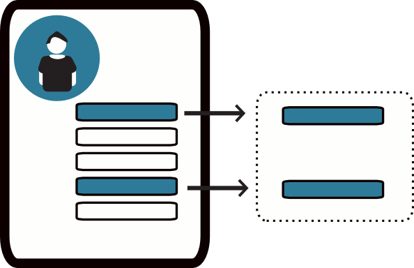

This section will outline how to use Profiles for both collecting and
sharing data, and share several ways of using profiles that can save
time for anyone managing data in your organization.

## Different uses for Profiles

This section briefly discusses many different ways that Profiles can be
used. You can find step-by-step instructions for creating and using
Profiles later in this chapter.

### Collecting information on public pages

A Profile can be used to collect information from your constituents.
Profiles can be displayed on standalone pages, or embedded into
contribution, membership sign-up, and/or event registration pages. You
can add more than one Profile to a page. You can also choose required
fields and add text in the Profile that will help users fill out the
form.

Some examples:

-   A volunteer sign-up form containing the predefined fields for first
    name, last name, mailing address, and a custom field for volunteer
    interests
-   A Profile containing custom fields about food preferences that can
    be added to the registration pages for any event where food will be
    served

For example, this profile is being used to collect address information
on a donation page.

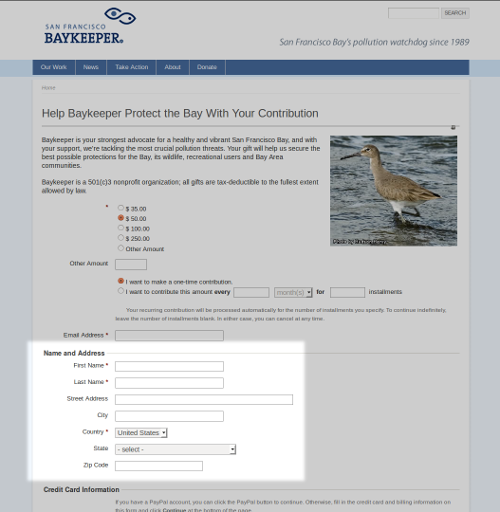

### Displaying information on public pages

A Profile can display information, from the database, on public pages.
This saves time, because you only have to enter information in your
database, rather than in your database *and* on your website.

For example, a membership-based organisation can provide a searchable
membership directory on their website that is updated as soon as a new
member joins. Also, an organization that wants to thank its donors
publicly can list their names on a web page as soon as contributions are
made.

A mini case study: Native Americans in Philanthropy (NAP) wanted to
create a membership directory that their members could use to search and
connect with each other. Before CiviCRM, they would create a very
expensive annual print directory and mail it to every member. This
process was time-consuming and expensive, and some data would be
out-of-date before the members received their directory. Using a
searchable Profile on their website instead meant significant resource
savings and, because their website became a portal for their members to
connect, it helped to advance their mission.

Details on using Profiles this way are included later in this chapter.

### Customising your user interface

Profile forms may also be used as simplified data entry forms. If you
have volunteers or interns who perform manual data entry for your
organisation, you can make their task easier by creating a profile form
that shows only the fields they need to input. This greatly simplifies
data entry and reduces the chance of data being entered incorrectly.

You can also use a Profile to display selected fields in the results of
an advanced search. For instance, you could create a Profile that
includes the phone number field and a custom field for volunteer
interests; when used to display search results, it would provide an
on-screen call list for your volunteer coordinator.

Details on using Profiles this way are available in the *Customizing the
User Interface* chapter in *Initial Set-up*.

### Updating multiple records at the same time

There is often a need to update a large number of records all at once.
For example, after an event, you may have an attendance list, and you
want to mark everyone who registered as Attended or No-show accordingly.
Or, you may want to update the Thank-You Sent field for a week's worth
of donations all at once.

Actions that allow you to update multiple records at the same time is available from the  **Actions** dropdown menu for most kinds of search results. (Search, Advanced Search, Find Contributions, Find Memberships,
Find Participants, and Find Activities) and from the event participant
lists generated from the Manage Events screen.

The **Update multiple ...** function pulls up a view of your search
results containing the fields in your profile and allows you to change
the contents of the fields on a single screen and save them all at once.
Details on using profiles this way are included later in this chapter.

### Managing email lists

Another use of Profiles is to present a form where people can sign up to
receive emails from your organisation. Groups that you use to track
different email lists can be added as check boxes, and when visitors to
your website submit the form, they are automatically added to the email
lists they have checked.

Details about using Profiles to manage email lists are found in the
*Set-up* chapter of the *Email* section of this book.

## Planning your Profiles

Because Profiles can be used for so many different purposes, there are a
lot of choices to make and settings to configure when setting them up.
There are settings for the Profile as a whole and settings for each
field you add—and the choice of what those fields are. Choices you make
about one aspect will affect choices you can make about others. For
example, some types of Profiles limit the kinds of fields you can
include, and some combinations of fields are not allowed in any type of
profile. Because of this complexity, it's important to understand the
consequences of certain settings and carefully plan what you will use
your profile for, and what you need in it, before you create it. You may
also need to use some trial and error before you hit on the right
solution for your purpose.

Here are some guidelines on which fields can be added to a Profile:

-   Profiles that are used for Search Views can contain only fields from Contact records (and
    the different Contact types, e.g. Individual).
-   Contact fields are available in all Profiles; however, you cannot
    mix fields from different Contact types (e.g. Individual and
    Organization).
-   To add fields (like Street Address or Email) that apply to more than
    one Contact type, choose fields from Contacts rather than the
    specific type. The Organization field menu, for example, contains
    only those fields that do not also apply to other Contact types.
-   Except in Search Results Profiles, you can combine Contact fields
    with fields from one—and only one—of the other record types:
    Activity, Participants, Contributions, and Membership.
-   If you try to combine fields with an unsupported combination of
    record types, you'll get an error when you try to save the field.

## Creating and managing profiles

Creating a Profile is a multi-step process. First, you create the
Profile and choose its settings. There are basic settings and Advanced
Settings. Next, you add the fields and choose settings for those as
well.

### Creating a Profile and understanding Profile settings

This section walks you through all the Profile settings and explains how
they affect how your Profiles work. As you look over it, you may notice
that the list of settings is quite long. It's important to understand
that most settings apply only to one type of Profile use. Each time you
create a Profile you will be able to ignore many settings, as they will
not apply to your intended use.

1.  Go to: **Administer > Customize Data and Screens > Profiles** and
    click on **Add Profile**.
2.  **Profile Name**: Give the profile a meaningful name.
3.  **Used For**: Your choices are Standalone Form or Directory; Search
    Views; Drupal User
    Registration; and View/Edit Drupal User Account. You can check more
    than one box in the Used For field, to make your Profile available
    for more than one use; just remember that checking Search Views will
    limit your field choices to Contact and Contact type records only.
4.  **Order**: This field determines controls the order in which
    Profiles are presented when more than one Profile is included in a
    page. Lower numbers are displayed ahead of higher numbers. The field
    is filled in automatically when a Profile in created; change the
    number if you wish.
5.  **Pre-form Help** and **Post-form Help**: These fields allow you to
    write text that appears either before or after your Profile to guide
    people in filling out forms.
6.  **Is this CiviCRM Profile Active?**: This box is checked
    automatically; it is what allows the Profile to appear as options
    for insertion into forms and use by the Batch Update function. When
    creating Profiles, you obviously want to leave it checked; later on,
    if you want to take a Profile out of use in your organization, you
    can edit the Profile and un-check the box.

### Advanced settings

Profiles have a number of advanced settings which are applicable in
various different contexts. Not everything listed under Advanced
Settings applies to every Profile; some apply only to specific Profile
uses. You can skip over any settings that do not apply to the way you
will use your Profile. To access advanced settings click on the gray
advanced settings bar and a set of fields will appear

#### **Limit listings to a specific group**

This is important only for Profiles that will be used to display
information on your website (e.g., if you will be allowing web visitors
to search your data, as in a membership directory).

1.  Select the Group whose information you want to make publicly
    viewable/searchable from this field's dropdown menu. For example, if
    you want to display a directory of active members, create a Smart
    Group of all members that have a status of New, Current, and Grace.
2.  Choose the Smart Group in this field. (Remember, smart groups are
    dynamic lists of records; when new memberships are added, the
    corresponding contact will automatically be included in the
    directory.)
3.  If you do not choose a Group from the dropdown menu in this field,
    by default CiviCRM will allow a search to expose every record in
    your database. In most cases this is a bad idea, as you probably
    don't want anyone who comes to your website to know who is in your
    whole database.

#### **Add new contacts to a group**

Any *new* contacts that fill out this Profile will be added to the
Group. You can use this, for example, to add anyone who fills out your
volunteer sign-up form to a Volunteers Group.
Note that by default contacts will not receive any confirmation that they have been added to this group or
be asked to validate their email address.
To have contacts who complete the profile form receive an email, go to **Administer >> CiviMail >> CiviMail Component Settings** and check the checkbox **"Enable Double Opt-in for Profiles which use the "Add to Group" setting"**. They must respond (opt-in) before they are added to the group.

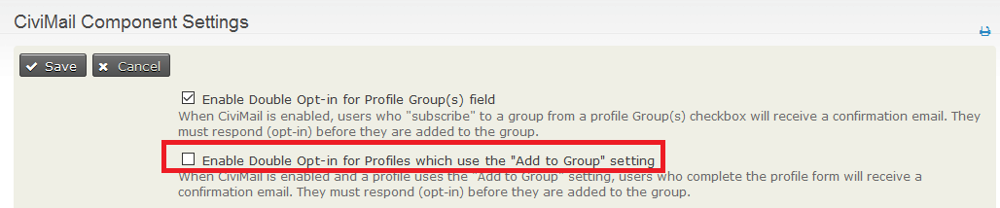

Also note that if you want to offer more than one group, you might be better off using the groups profile field.

#### **Notify when profile form is submitted**

This setting, which is is also applicable only when using a Profile
as a sign-up form, allows you to send an email automatically whenever
the form is submitted. For example, maybe your volunteer coordinator
wants to get an email whenever anyone fills out the volunteer sign-up
form. Simply enter the email address in the field; if you want to send
email to multiple addresses, separate them with a comma.

#### **Redirect URL**

This applies only to Profiles that are being used as standalone
forms; it will not apply when the Profile is embedded in an event
sign-up or contribution form. The Redirect URL field allows you to send
people to a specific web page after they submit their form. For example,
you may want to create a web page that thanks people for submitting
their information. If this field is left blank, people will be directed
to a page which displays the information they've just entered.

#### **Cancel redirect URL**

Performs exactly the same way as Redirect URL, except that it
applies when people cancel their form submission.

#### **Include reCAPTCHA?**

This applies when profiles are being filled in by anonymous
users. CAPTCHA is a type of spam-blocking software that requires the
visitor to fill in text displayed in a graphic file. This prevents
automated web-crawling spiders (robots) from completing the form. It is
highly recommended that you include it.

You must set up a free reCAPTCHA account and enter some configuration
information in CiviCRM to use this feature. Go to **Administer > System
Settings > Undelete, Logging and ReCAPTCHA** to configure your account;
instructions for signing up are included on that page.

#### **Drupal user account registration option**

This setting applies to Profiles that are used in public pages and
determines whether people can or must use your form to sign up for an
account with your website in addition to submitting the information on
the form. This can be useful for ensuring people have to sign up for a
user account as part of becoming a member or registering for an event.

#### **WordPress user account registration option**

Like Drupal, Wordpress allows CiviCRM Profiles to create accounts as
described above. Within WordPress **Settings > General** "Membership [
] Anyone can register" must be clicked.

#### **What to do upon duplicate match**

This setting applies to Profiles that are used in public pages.
It controls what happens when the contact data submitted from the
Profile matches an existing contact record. You must choose one of these
options. "Issue warning and do not save" is chosen by default. Matching
in Profiles uses on the **Unsupervised** deduplication rule (see the
*Deduping and Merging* chapter in the *Working with Your Data* section
for more information about deduplication rules). Note that if there are
multiple matching contacts, the first matching record is used.

Here are the options and their effects how your form works:

-   "Issue warning and do not save" This option is ignored if the
    Profile is embedded in an online contribution, membership sign-up or
    event registration form. In these cases, a contact match results in
    the transaction being linked to the matching contact. In other
    cases, the user will receive a message that a record already exists
    in the database, and they will be unable to submit the form.
-   "Update the matching contact" adds new information from the form to
    the contact record and, if there are any form fields that are
    already filled-out in the record, overwrites the existing record
    fields. For example, if the form includes address fields, the text
    that the user enters in the form will replace what was already in
    the database address fields.
-   "Allow duplicate contact to be created" ignores any potential
    matches and creates a new contact record for all submitted forms.
    This means that all form submissions will be saved and no data will
    be overwritten; however, it may produce a lot of duplicate records
    that will need to be deduped later (see the *Deduping and Merging*
    chapter in the *Working with Your Data* section).

#### **Proximity search**

This applies if you are using the Profile for a searchable
directory; it adds a proximity search block to the search criteria. This
block contains a field for start address, and another that allows the
user to set a search radius (how far from the start address they want to
search). Choose None if proximity search is not relevant to your
directory, Optional if you want to offer proximity search to your users,
and Required if you want to force the user to enter a start address and
a search radius.

#### **Enable mapping for this profile?**

This applies only if you are using the Profile for a searchable
directory; it adds a map to the search results.

#### **Include profile edit links in search results?**

This applies only if you are using the Profile for a searchable
directory; it adds a link in the results listings to edit the Profile
fields in the returned contact records. Only users with permission to
edit the result contacts will see this link.

#### **Include Drupal user account information links in search results?**

This applies only if you are using the Profile for a searchable
directory; it includes a link in the results to the resulting contacts'
Drupal user account information (i.e., their My Account page). This link
will be included for only result contacts who have a user account on
your website.

Once you've saved the profile settings, it's time to add fields to the
profile. If you plan to reference custom fields in a profile form, make
sure that those fields have already been created.

## Adding fields and choosing field settings in Profiles

This section walks you through all the field settings and explains how
they affect how your Profiles work. As with the overall Profile
settings, not all of them are necessary to consider for each use.

1.  Click **Add Field**.
2.  **Field Name**: Choose the record type where your desired field
    appears from the **- select -** dropdown menu. This will bring up a
    secondary dropdown menu listing all available fields for that record
    type. Choose the field you want to add to your Profile.
3.  **Field Label**: This is the field label that will display on all
    uses of your Profile. It is prefilled with the default field label.
    However, the default field labels are often confusing for users of
    your forms, so you can rewrite them here. For example, the Postal
    Code field can be renamed Zip Code if your audience is more familiar
    with that term.
4.  **Required?**: Check this box to make this required anytime the
    Profile is used. This is most useful when you want to make sure that
    certain information (e.g., First Name, Last Name, Email) is always
    included in a form submission. (This is not relevant to Search Views
    usages [known as Search Results in 4.1 and previous].)
5.  **View Only?**: Check this box to allow users to view but not edit
    this field. If your Profile is used to expose search results, fields
    marked View Only will not be included. This setting is not relevant
    when a Profile is being used only to collect information.
6.  **Visibility**: If the Profile is being used for a searchable
    directory, set the Visibility of any fields you want to include on
    the search form to Public Pages or Public Pages and Listings. For
    fields that will be used on sign-up forms, set Visibility to User
    and User Admin only. This ensures that other visitors to the form
    can't view any data from the database. To use fields for Search
    Views, you must set Visibility to Public Pages or Public Pages and
    Listings. Choosing either of the Public Page options pops up two
    additional settings:
    -   **Searchable?**: This applies only to searchable directory uses.
        Check the box if you want to include the field in the search
        form.
    -   **Results Column?**: This applies only to Search Views (known as
        Search Results in 4.1 and previous). Check it or the field will
        not appear in your Search View.

7.  **Field Pre Help** and **Field Post Help**: These fields allow you
    to write text that appears in the user interface to guide people in
    filling out forms. Field pre help appears inline. Field post help
    will create a small speech bubble which when clicked appear in a
    yello
8.  **Order**: You can use this field to control the order in which
    fields display in the Profile. Lower numbers are displayed ahead of
    higher numbers.
9.  **Active?**: Leave this box checks to ensure that the field appears
    when the Profile is used.
10. Click **Save and New** to add more fields to the Profile, or
    **Save** if you have no more fields to add.

## Managing Profiles

All your profiles are available for viewing and editing at **Administer > Customize Data and Screens > Profiles**. You can add fields and edit
field settings (at the **Fields** link) and change Profile settings (at
**Settings**). You can also look at how your Profiles will appear, get
links and embed code for your Profiles, and copy Profiles to use as a
basis for building other Profiles (at **more**).

## Using Profiles

This section contains specific instructions for the different profile
uses discussed above.

### Standalone forms with Profiles

There are two ways in Drupal and Joomla! to use standalone forms once
you have created your Profile according to the instructions above:

-   Use the page created automatically by CiviCRM to hold the Profile.
    Get the link to this page at **Administer > Customize Data and
    Screens > Profiles**. Click the **more** link next to your Profile
    and choose **Use Profile-Create Mode** from the pop-up menu. You can
    then publish this link wherever you want: in an email, on a blog,
    etc.
-   Paste the HTML code for the form in a page you've built on your
    website. Get the code at **Administer > Customize Data and Screens > Profiles**. Click the **more** link next to your Profile and
    choose **HTML Form Snippet** from the pop-up menu. Copy the code
    that appears on the next screen and paste it wherever you want.

In WordPress, there is an additional third way. When creating or editing
a post, click on the CiviCRM button to insert a CiviCRM shortcode into
the post.

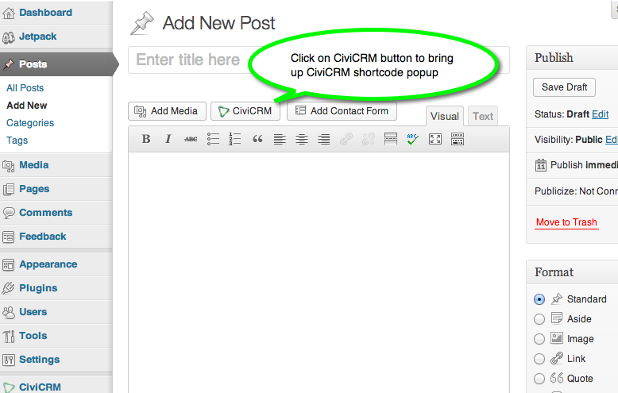

On the popup form, select Profile as the desired frontend element.

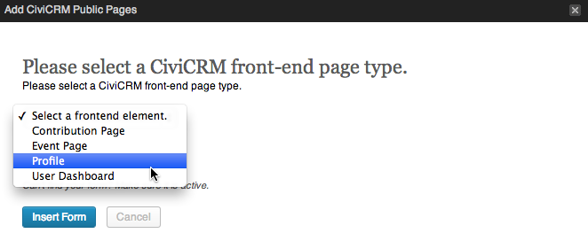

Use the second select widget to specify the profile you would like to
use. Finally, select the purpose of the form — create, edit or view —
and click Insert Form.

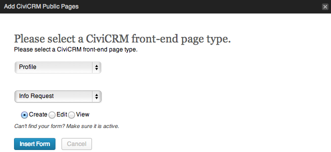

### Multi-value fields in profiles

Multi-value custom field sets allow you to have more than one set of
custom data per contact. They are handy for modelling data that repeats,
for example, work experience data. You can expose these multiple value
custom fields via profiles. In the screen shot below, we have created a
profile that is used to collect name and work experience data. Notice
that the multi-value custom data appears slightly differently in the
profile to facilitate adding, editing and deleting multiple instances of
these records.

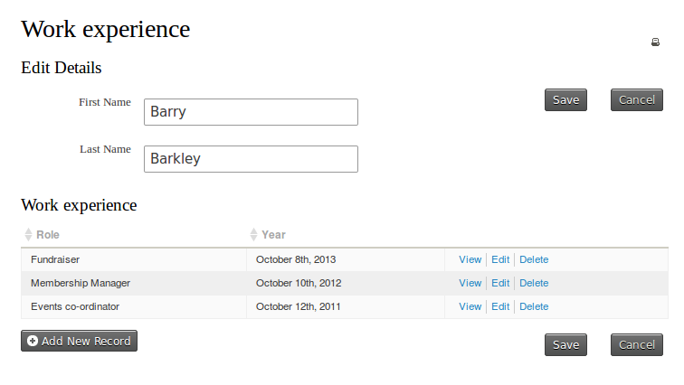

### Making directories with Profiles

To put a directory onto your website:

1.  Create your Profile as described above. Be sure to consider these
    Advanced Settings, as they are especially helpful when using
    profiles for directories.

 -   **Enable mapping**: a really cool feature available in CiviCRM is
     giving visitors the ability to map contacts in your directory
     using Google or Yahoo! maps. They can then obtain directions to a
     record's address dynamically. To use this feature, you must have
    already enabled mapping under **Administer > System Settings >
     Mapping and Geocoding**.
 -   **Include profile edit links:** check this box if you want to
     include a link in the directory listings to allow people to edit
     data in the profile's fields. Only users with permission to edit
     the contact will see this link. More often than not you will not
     need to enable this setting, as it is not commonly used in the
     membership directory scenario.
 -   **Include Drupal user information** (Drupal only): check this box
     if you want to include a link in the directory listings to view a
     contacts' Drupal user account information (e.g. their My Account
     page). This link will only be included for contacts who have a
     user account on your website.

    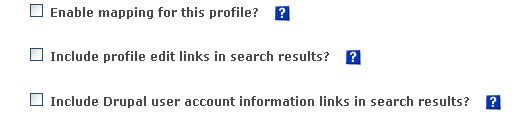

Now it's time to include the fields that will make up the directory. For
profiles used as directories you have total control over which fields:

-   are searchable in the directory
-   appear in the results columns of your search
-   appear in the record detail View page.

The important options you must configure in the fields for directory
purposes are shown below:

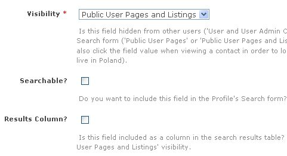

-   Visibility for all fields in your directory must be set to **Public
    Pages** or **Public Pages and Listings**. The difference between these
    two options is that those configured as Public Pages and Listings
    will have the field in detail view hot-linked, enabling the user to
    generate a follow-up search for other records which also have that
    same field value. For example, you might set City to Public Pages
    and Listings. After the user conducts a search and views the details
    for a record they can click on the city value and run an immediate
    search. The search will run as if they had selected that city in the
    profile search screen.
-   The **Searchable** option determines if visitors to your directory
    can search the directory by this field. In common directory uses,
    almost every field is set to searchable. The more fields you set to
    searchable, the more power you provide to your visitors to find the
    information they need.
-   The **Results Column** check-box determines if the field is
    displayed as a column in the list of results. For example, your
    directory may have a field for website, and if you set the website
    field to appear in the results column, it will appear in the results
    table. If you do not check the results column the field will still
    appear in the view mode for a record. In other words, checking
    Results Column? will allow the field to appear in the results column
    AND in detail view mode.

The image below shows the search mode for our membership directory.

Once you hit search you get this result set. Profile fields that have
Results Column checked are shown in the listing.

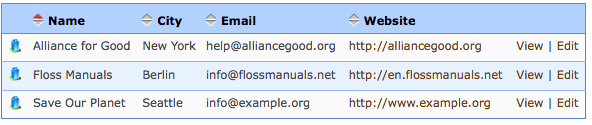

Clicking the view link gives you more details about the constituent,
showing all profile fields.

As we've seen, building a directory for your website can provide a
valuable tool for your constituents.

### **Linking to your directory**

You have several options to link to your directory:

-   **Drupal:** link to the directory search page using this path:
    http://www.myorganization.org/civicrm/profile?reset=1&gid=N where N
    is the ID of the profile directory.
    -   If you add **&force=1** to the above URL it will directly show a
        result set.
    -   If you add **&force=1&search=0**it will hide the search criteria
        and directly show the result set.
-   **Joomla!:** use the Menu Manager to create a front-end menu item.
    After creating a new menu item, select CiviCRM and choose the
    profile search option. In the parameters pane, choose the specific
    profile to use.
-   **Wordpress:** this feature is not yet implemented.
-   You can also prepopulate any search criteria in the URL. These
    options are described here:
    [http://wiki.civicrm.org/confluence/display/CRMDOC/Linking+Profiles](http://wiki.civicrm.org/confluence/display/CRMDOC/Linking+Profiles)

### Updating multiple records at the same time

You can **Update multiple memberships** from the results of a **Find memberships** search or from the advanced search results when **Display results as** is set to **Memberships**. You will need a profile that contains only membership fields.

Similarly you need contact, contribution, activity or participant search results and profiles containing only contact, only contribution, only activity or only participant fields to update multiple contacts, multiple contributions, muliple activities or multiple participants respectively.

You can update up to 100 records at one time using the **Update multiple ...**
functions.

____
**Example:**

You have a custom contact field called "Diving Skill Level" and you have just run a Intermediate Diving course.  You want to set the "Diving Skill level" to "Intermediate" for all people who attended the course.

Go to the Advanced Search screen and set the appropriate filters in the Event accordion. Leave **Display Results As** set to **Contacts** as you want to update a contact custom field. CLick on **Search**.

You will go to the "Update multiple contacts" screen.

  

From the drop-down list, choose the Profile you want to use and click **Continue**.

The next screen will contain a grid. Each row shows the contact's name and the fields in your profile. You should update the field values for each contact as needed.

To set a field to the same value for all rows, enter that value for the first contact and then click the Copy icon (the image of two documents that is next to each column title). The value will automatically be copied into all the records displayed.

Click **Update Contacts** to save all your changes or **Cancel** to cancel the changes.
 ____
 
**Batch update limitations**

-   You cannot perform batch updates for different types of contacts
    (say, individuals and organisations) at the same time.
-   If you wish to update participant fields, you must do the update
    from a Find Participants search (and only include participant fields
    in your profile).
-   You can perform a batch update for up to 100 records at a time. If you find that updating a batch of 100 records is taking a long time, it may be quicker to update 4 batches of 25 records rather than one batch of 100 records.

### View/edit user account /new user registration with Profiles

For websites that have logged-in users, you may want to allow people to
provide additional information as they register for an account on your
website. Similarly, when people fill out a profile form you may want to
encourage (or force) them to sign up for a user account.

To include a profile form during the user registration process:

1.  Create a profile that is used for User Registration:

    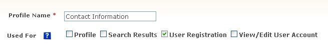
2.  Add the fields you want people to fill out as they register, using
    the same process described above. Make sure the field visibility is
    set to Public User Pages.

**Including profiles in Drupal's My Account screen**

You can embed one or more CiviCRM profiles directly into Drupal's My
Account screen. This makes it easy for logged-in users to review and
update their information whenever they visit their My Account page.

To create a profile for this purpose:

1.  Create a new profile, or navigate to an existing profile and click
    Settings.
2.  Select View/Edit User Account in Used For.
3.  Click Save.
4.  Add the fields you want people to be able to edit from their Drupal
    My Account page.

Note: the profile must include only fields related to the Individual
contact type.

**New account creation during profile sign-up**

If you want your constituents to create a Drupal or Joomla! account when
filling out a profile, you can enable this with the "User account
registration option" under **Customize Data and Screens > Profiles**  click **Settings** against a profile. Anonymous (not-logged-in) users will then be invited (or required) to create an account when they visit the profile. Logged-in users will just see the
profile fields.

You must include a Primary Email Address field in the profile for this
feature to function properly. This feature also works when the profile
is embedded in an online contribution page or event registration page.
Hence you can invite or force anonymous visitors to sign-up for an
account when they register for an event.

### Including Profiles in forms in CiviCRM components

Often you will want to define certain fields for inclusion in event
registration and contribution pages. The only significant difference is
that you can include fields in your profile that are specific to
participant records (for event registration forms) and contributions
(for contribution pages). Read about including Profiles in contribution
pages, event registration pages, and membership sign-up pages in the
*Set-up* chapter of *Contributions*, *Events*, and *Memberships.*

Other sources of information about Profiles
-------------------------------------------

Read more about Profiles in the following chapters:

-   In the *Customizing the user interface* chapter of *Intitial Set-up*
-   In the *Set-up* chapter of *Email*
-   In the *Set-up* chapter of *Contributions*
-   In the *Set-up* chapter of *Events*
-   In the *Set-up* chapter of *Memberships*

Alternatives to Profiles
------------------------

As you have seen, profiles can be put to a lot of different uses. It is
worth bearing in mind that there are alternative approaches for many of
these use cases. The alternatives available to you depend on the CMS
that you are using and your skill set, and have advantages and
disadvantages We've listed a few of the common ones below for you to
investigate.

### Drupal specific alternatives

-   The Drupal Views module can be used to make sophisticated displays
    of CiviCRM data. For example you might want to display a list of
    members on your public website using Views.
-   Drupal Webform-Integration is the most powerful form-builder for
    CiviCRM and includes many features missing from profiles, such as
    the ability to work with multiple contacts, events, memberships, and
    relationships, and offers greater flexibility in how forms are
    displayed, offering pagination, draft-saving, advanced spam-control,
    and conditional fields. For more information see the Drupal
    Integration chapter
    or [the Webform CiviCRM Integration page](https://drupal.org/project/webform_civicrm).
-   You can add fields
    directly to Drupal user accounts without using an embedded profile.
    These fields won't be available in CiviCRM but they will be more
    available in Drupal, so depending on why you are collecting this
    information, that may be appropriate for you.

### The API

With some basic coding skills (which if you are keen and reasonably
technically minded you might be able to pick up in a day or so) you
could use the API to flexibly display data on your website. See the
[*Developer Documentation wiki*](http://wiki.civicrm.org/confluence/display/CRMDOC/Develop)
for an introduction to using the API.
