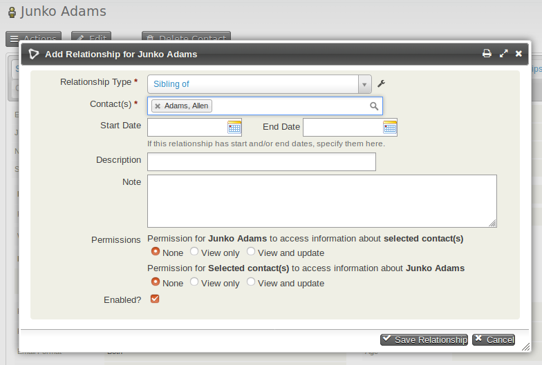

# Relationships

CiviCRM allows you to represent connections between contacts by creating
relationships. For example, if a mother and son are both in your
database, it can be useful to be able to look at either record and see
that they are related to each other.

You can also track relationships between organisations, or between
individuals and organisations. For example, entering an organisation in
the Current Employer field of an individual contact's record
automatically creates an "Employee of" relationship from the individual
to the organisation, and an "Employer of" relationship from the
organisation to the individual.

## Creating relationships between contacts

1.  Navigate to one of the records that you want to relate.
2.  Click on **Add Relationship** from the **Actions** button on the
    contact summary, or from the Relationships tab
3.  Select the Relationship Type. In this case it would be "Sibling
    of".
4.  Begin to type the last name of the related person(s). If you
    discover that a contact you want to connect is not yet in the
    database, you can create a new contact from this screen.
5.  Optionally enter further information:
    1. **Start Date** and **End Date** if the relationship is time limited.
    2. **Description** - short text that shows on the relationship summary screen.
    3. **Notes** - longer text shown when viewing the relationship.
    4. **Permissions** - allows other users of the database to view or
    update the related contact.
    5. **Enabled** - shows the relationship is active.
6.  When you have made the changes you want, click **Save
    Relationship**.

### Relationship permissions

If a relationship is created between two contacts User 1 and User 2 and
the **Permissions** box is set to allow User 1 'View' access to User 2,
then when User 1 is logged in they can view details about User 2 using
a [profile](profiles.md) in View mode. If the
permission is set to 'View and Update' then User 1 can also update
details about User 2 with a profile in Edit mode.

This functionality can be extended using the [Related Permissions
extension.](https://github.com/eileenmcnaughton/nz.co.fuzion.relatedpermissions)

## Connecting employees and employers

A quick way to connect employees (which are stored in CiviCRM as
individuals) to employers (stored as organisations) is to use the
Current Employer field within an individual's record. This will set the
current employer field in the contact record and create a relationship
between the contacts.

1.  Navigate to the record of the individual who you want to connect to
    an organisation.
2.  Click the Edit button to edit the individual's record.
3.  Begin typing the organisation name into the Current Employer field.
    As you type, matching names of organisations that already exist as
    contacts in CiviCRM will appear in a dropdown autocomplete list
    below the Current Employer field. If the organisation is already a
    contact in CiviCRM you can select it from the dropdown list by
    pressing the down arrow key or by clicking on it. If the
    organisation does not already exist as a CiviCRM contact, simply
    enter the full organisation name.
4.  After the organisation's full name is entered in the Current
    Employer field either press the Enter key or click the Save button.
    If the organisation is a pre-existing contact, an Employee/Employer
    relationship will be created between the individual and the
    organisation. If the organisation does not already exist, a new
    organisation contact will be created and the relationship will be
    created between the individual and the organisation. You can click
    on the Relationships tab to view your newly created relationship
    Employee of and see any existing relationships.

## Adding contacts to organisations

1.  Select the desired contacts from your search results as described
    above.
2.  Select **Add relationship - to organization from the dropdown** from the Actions menu.
3.  On the **Add Contacts to Organization** screen, select the **Relationship
    Type** from the dropdown menu.
4.  Enter part of the desired organisation name in the **Find Target
    Organization field**, then click **Search**.
5.  Organisations that match your search will appear in the **Mark Target
    Contact(s) for this Relationship** section below the Search and
    Cancel buttons. If the organisation you're looking for appears in
    this list, click the radio button next to that organisation and then
    click the **Add to Organization button** below. If the organisation
    you're looking for does not appear in this list, try entering
    something different into the **Find Target Organization** field and
    clicking **Search** again. If you are still unable to find your desired
    organisation it may not exist; click **Cancel**, add a new organisation,
    and try again.
6.  After you've successfully chosen an organisation and clicked the **Add
    to Organization** button, you should see a message stating that the
    number of participants that you selected have been added to the
    organisation.
7.  Click **Done** to return to your search results.

## Adding contacts to households

1.  Select the desired contacts from your search results as described
    above.
2.  Select **Add relationship - to household** from the dropdown **Actions** menu.
3.  Select the **Relationship Type** from the dropdown menu. Note that while
    CiviCRM will not stop you from adding multiple contacts as **Head of
    Household** for a single household, this may cause problems later on
    in any situation where you are expecting **Head of Household** to refer
    to only one individual per household. Therefore, the **Household
    Member of** option may be the better choice in most situations.
4.  Enter part of the name of the household to which you are adding
    contacts (such as a last name shared by household members) in the
    **Find Target Household** field, then click **Search**.
5.  Households that match your search will appear in the **Mark Target
    Contact(s) for this Relationship** section below the Search and
    Cancel buttons. If the household you're looking for appears in this
    list, click the radio button next to that household and then click
    the **Add to Household** button below. If the household you're looking
    for does not appear in this list, try entering something different
    into the **Find Target Household** field and clicking **Search** again. If
    you are still unable to find your desired household it may not
    exist; click the **Cancel** button, add a new household, and try again.
6.  After you've successfully chosen a household and clicked the **Add to
    Household** button, you should see a message stating that the number
    of participants that you selected have been added to the household.
7.  Click **Done** to return to your search results.

## Creating new relationship types

CiviCRM comes with a set of common relationship types that can be
    used to indicate relationships between contacts. If you need to
    track different types of relationships between your contacts, you
    can create your own custom relationship types.

1.  In the navigation menu, go to: **Administer > Customize Data and
    Screens > Relationship Types**.
2.  Review the list of existing relationship types to ensure that you
    are not creating a duplicate.
3.  If the relationship type you need does not already exist, click the
    **New Relationship Type** button.
4.  Enter descriptive labels for the relationship type you are creating
    in the **Relationship Label-A to B** and **Relationship Label-B to A**
    fields. The **Relationship Label-A to B** field describes the
    relationship between Contact A and Contact B; the **Relationship
    Label-B to A** field describes the relationship between Contact B and
    Contact A.  
      -  Some relationships can be described by the same label in both
    directions; in these cases you can enter the Relationship Label once
    in the **Relationship Label-A to B** field. For example, when
    describing the relationship between two domestic partners named
    Sylvia and Audre, you can say that Sylvia is the "Partner of" Audre
    and Audre is the "Partner of" Sylvia. Therefore you would enter the
    "Partner of" label only in **Relationship Label-A to B** field,
    leaving the **Relationship Label-B to A** field blank.
      -  In other situations one Relationship Label cannot be applied in both
    directions; in these cases you need to enter different Relationship
    Labels in each of the Relationship Label fields. For example, you
    can say that Kiyoshi is the "Grandparent of" Yuki but you cannot say
    that Yuki is the "Grandparent of" Kiyoshi. Therefore you would enter
    the "Grandparent of" label in the **Relationship Label-A to B** field
    and either "Grandchild of" or "Grandparent is" in the **Relationship
    Label-B to A** field.
7.  Use the **Contact Type A** and **Contact Type B** fields to designate which
    contact types are being linked by your relationship. Remember to
    check that the contact types you select for Contact A and Contact B
    make sense when corresponded to your Relationship Labels.
8.  Optionally enter **Description** for this relationship type. This is
    especially useful if the intended purpose of this relationship type
    may not be obvious to other users.
9.  Leave the **Enabled** box checked unless you intend to create this
    relationship type but not allow users to utilise it until a future
    date.
10. Click **Save**. You will see a message telling you that the relationship
    type has been saved and you will see your new Relationship Type in
    the list below.

## Creating custom fields on relationships

CiviCRM provides a number of standard relationship fields, described above. You may decide there is other information you want to store, either on all relationships, or just on given relationship types. Additionally, custom fields can be used as a tool to further distinguish relationships without creating inordinate numbers of types (e.g. you could track which department an employee works in using a custom field, rather than creating a new relationship type for each). You can add custom fields that display on the relationship types of your choosing. See [creating custom fields](creating-custom-fields.md) for detailed instructions.

## Disabling or deleting unneeded relationship types

If an existing relationship type is no longer useful or relevant for
your organisation you can either disable or delete it so it is no longer
presented as an option for new relationships. Disabling rather than
deleting the relationship type has two significant advantages: you will
still be able to see existing data on relationships of this type, and
you can easily enable the relationship type again should you find you
need it later.

1.  In the navigation menu, go to: **Administer > Option Lists >
    Relationship Types**.
2.  Click the **More** link in the row of the relationship type that you'd
    like to disable or delete.
3.  Select either **Disable** or **Delete** from the pop-up menu.
4.  If you select Disable, a pop-up confirmation bubble will appear. If
    you select Delete, you will be directed to an additional screen that
    provides a more serious warning and requests confirmation. Review
    the information provided in either confirmation message and if you
    are sure you'd like to complete this action, click the **Delete**
    button otherwise **Cancel**.
5.  If you have chosen to disable the relationship type it will appear
    in red in the Relationship Types list and relationships of this type
    will still be visible when viewing contacts. If you have chosen to
    delete the relationship type it will no longer appear in the
    Relationship Types list or in contact relationships data. In either
    case users will no longer be able to create new relationships of
    this type.
6.  To enable a previously disabled relationship type, follow steps 1
    and 2 above and select **Enable** from the **more** pop-up menu.
