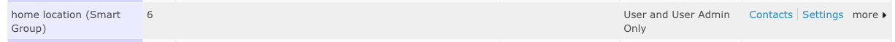

# Smart groups

Smart groups are 'saved searches'. They are useful for keeping track of
groups of contacts meeting certain criteria, for example 'all members
based in Europe'. Creating a smart group is easy: you search based on
your desired criteria and then choose 'Create smart group'. Once the
smart group is created, each time you ask to see the contacts in a
group, CiviCRM will carry out a search and show you contacts that meet
the criteria you specified.

Smart groups are a really powerful and useful part of CiviCRM. They
come in handy in many different situations. Spend some time making sure
you understand smart groups and how you might be able to use them.

## When might I use a smart group?

Smart groups come in handy in many different situations. Here are a
couple of examples.

### Smart groups and profiles: a membership directory

A smart group could be used in conjunction with a profile to display a
directory of members on your website. To do this, you would create a
smart group that includes members of your organization and create a
profile that includes the fields that you would want to display in your
directory. You would then configure the profile to only show contacts
that were in that smart group. When a contact becomes a member - for
example, when they fill in your membership form and pay online - they
will automatically be added to the smart group and therefore be
published in your members directory.

### Smart groups as mailing lists: an events newsletter

Lets assume that anyone who has registered for or attended an event will
want to receive our events newsletter. We can create a smart group with
that includes all people who have registered or attended an event, and
specify that this smart group is a mailing list. It will then be
available for use in CiviMail and we can use it to send the events
newsletter. As people register to attend an event - or are marked as
having attended an event - they will be added automatically to the smart
group and hence subscribed to the newsletter. Smart groups respect
people's subscription preferences. If people unsubscribe from the
newsletter, they will be removed from the smart group.

## Creating smart groups

Smart groups can be created from the search results generated by many of
CiviCRM's search forms. Lets say we wanted to create a smart group of
all donors who have not yet been sent a thank-you letter to help us
manage our work-flow for thanking donors. As we send letters, the donors
receiving them will automatically leave the smart group, allowing us to
have an always accurate list of people to send letters to.

We can use the advanced search to create this smart group (you could try
this on the demo site [-
http://demo.civicrm.org](http://demo.civicrm.org) if you don't have
contributions in your CiviCRM installation).

1.  Go to **Search > Find Contacts > Advanced Search**.
2.  Scroll down to the **Contributions** section.
3.  Check **Thank-you date not set**? and choose **Donation** from the
    **financial type** drop-down menu.
4.  Click **Search** at the bottom of the page.
5.  Select all records
6.  From the **Actions** drop-down menu select **Group - create smart group**.
7.  Give the smart group a name and description and optionally designate it as a mailing list and give if a parent group. Click **Save Smart Group**.

Your smart group will now appear in all the usual places where you see
groups.

Try editing the a contact in the smart group so that they no longer
match the criteria. You'll see that they are removed from the smart
group.

If the contact is not removed immediately, it may be that you have smart
group caching turned on (see *Smart group caching* below).

## Changing criteria for smart groups

You may want to refine the criteria that your smart group uses to select
contacts. For example, you may want to edit a smart group consisting of
all *current* members to include *new* members as well. You can do this
from the Manage groups screen.

Click **Manage Groups**. To edit the search criteria of a particular
smart group, click **Settings** next to that group.

On the group settings screen, click **Edit Smart Group Criteria** at
bottom left.

 

This will bring up the a screen similar to the one that you originally
used to create the smart group with the search results displayed.
Clicking on the bar at the top of the screen will bring up the criteria
that you used to define the smart group. You can then update the
criteria and once you're happy with the results, select all records and
choose **Update Smart Group** from the Actions list.

Your smart group is now based on the new criteria.

## Adding and removing smart group members manually

By default, smart group membership is determined by the criteria outlined in the smart group settings. However, you can override the criteria by manually adding or removing contacts from the group. You can manually add contacts to a smart group using the same workflows you would use to add contacts to a standard group. If you navigate to the **Groups** tab on an individual's contact record, you won't have the option to **Remove** via a button the same way you would for a standard group. However, you can manually remove someone from a smart group by going to **Contacts > Manage Groups**. Select **Contacts** on the right-hand column of the chosen group to view all of the contacts currently within the group. Find and check the box next to the contact you want to remove. Use the **Actions** dropdown and select **Group - remove contacts**. Confirm the removal and the group record will now show up under **Past Groups** for that contact. CiviCRM will override the smart group criteria based on manual adds or removals, even if there is a change in a contact's eligibility for inclusion based on that criteria.

Once a contact has been removed from a smart group, there will be an option to **Delete** their smart group record under the **Groups** tab on their contact record. If you **Delete** the record, they will again be subject to smart group inclusion based on the set criteria.

## Smart group caching

For performance reasons, smart groups are often cached, i.e. the
contacts that meet the smart group criteria are saved in memory for a
certain amount of time.

This speed things up because CiviCRM doesn't need to run the search each
time you want to use the smart group. If you query is simple and
involves a small number of contacts, the speed up may not be
significant. If it is complex and involves a lot of contacts, it may be
very significant and even necessary.

The down side of caching is that you need to wait up to 5 minutes for
the query to be updated. Depending on how you use smart groups this may
not be an issue.

The default expiry time for a smart group in newer versions of CiviCRM
is 5 minutes. You can adjust the smart group query cache 'timeout', i.e.
the amount of time the cache is considered a valid reflection of the
smart group in **Administer > Customize Data and Screens > Search
Preferences**.
