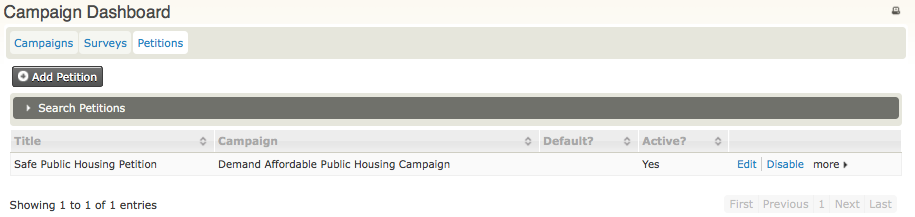
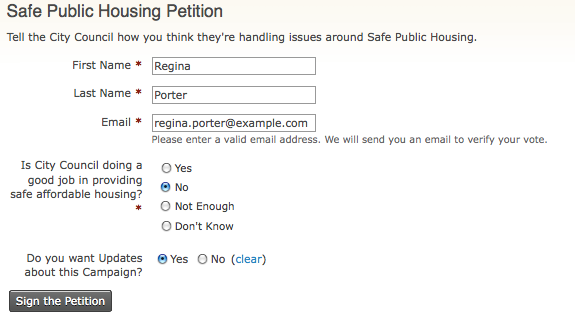
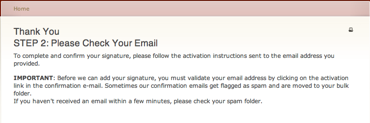
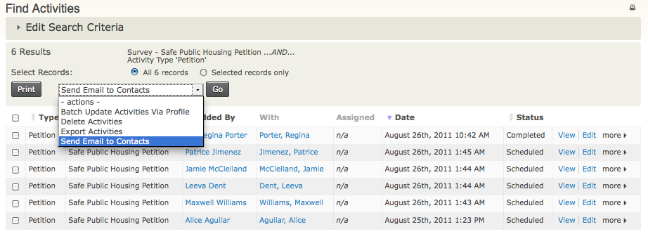

Tâches quotidiennes
===================

Ce chapitre décrit les tâches quotidiennes pour déposer et gérer les pétitions.

Gérer vos Pétitions
-------------------

Pour voir, gérer et éditer vos pétitions, cliquer sur **Campagnes > Tableau de bord > Pétitions**.

Faire circuler une pétition pour signature
------------------------------------------

Quand votre pétition est prête, vous pouvez rendre publique l'URL.

1.  Aller à **Campagnes > Tableau de bord > Pétitions**.
2.  Cliquer sur **Plus > Signer** localisé à la droite du nom de votre pétition.
3.  Vous verrez le formulaire de votre pétition; copiez l'URL et envoyez-le par courriel à vos contacts, ou ajoutez-le à votre site Web.

Recueillir les réponses en ligne
--------------------------------

Une fois que l'URL de votre pétition est rendue publique, les gens peuvent remplir le formulaire, répondre aux questions et les envoyer.

Après que le formulaire soit complété et signé **Signer la pétition**, ils verront apparaître le message suivant.

 

Recueillir les signatures
-------------------------

Pour voir qui a signé la pétition:

1. Cliquer sur **Campagnes > Tableau de bord > Pétitions**.
2. Cliquer sur **Plus > Signatures** localisé à la droite du nom de votre pétition.
3. Vous pouvez choisir de voir l'activité de la pétition pour une personne, ou sélectionnez des contacts et réaliser des activités. 

Analyser les résultats avec Activity Report
-------------------------------------------

Pour analyser les résultats d'une pétition, utilisez le Activity Report.

1. Aller à **Administrer > Rapports > Créer un rapport à partir d'un modèle > Activity Report**.
2. Dans la zone **Colonnes**, sélectionnez les champs que vous voulez voir dans le rapport.
3. Élargir la zone **Petition Questions** et sélectionner les critères de sélection.
4. Cliquer sur **Prévisualiser le rapport** pour voir les résultats. Vous pouvez aussi exporter les informations du rapport de sondage dans un fichier CSV.

 

 
